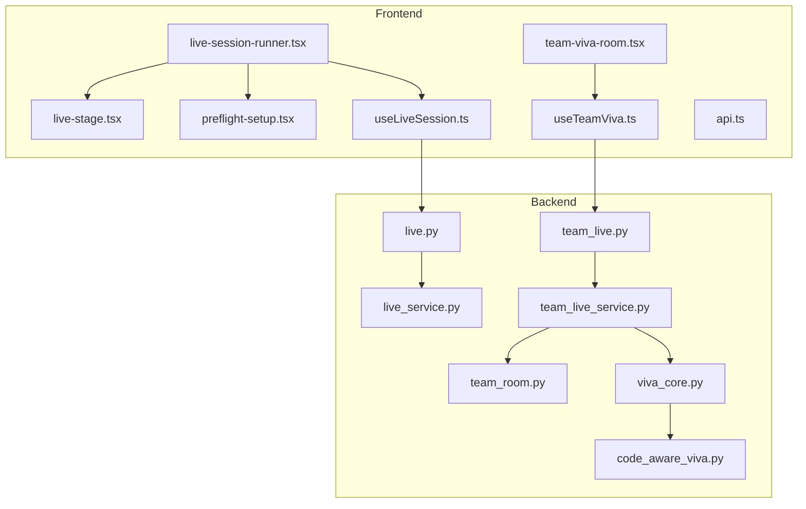
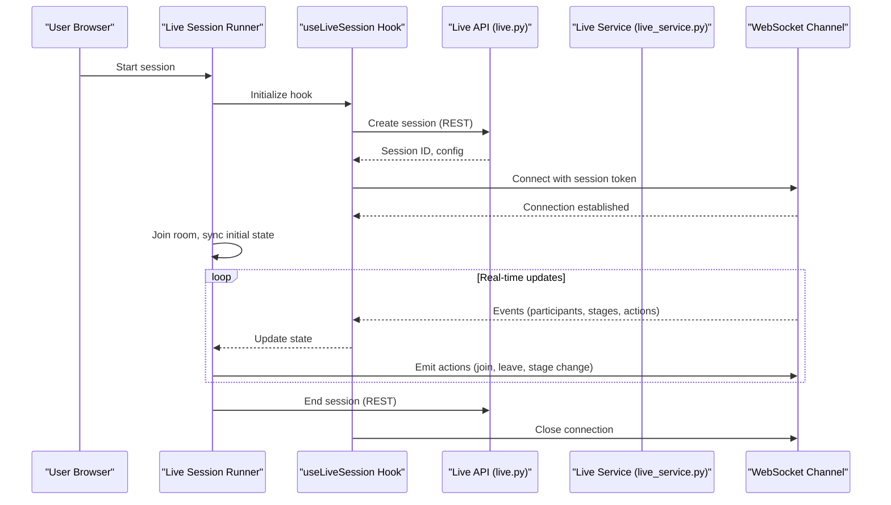
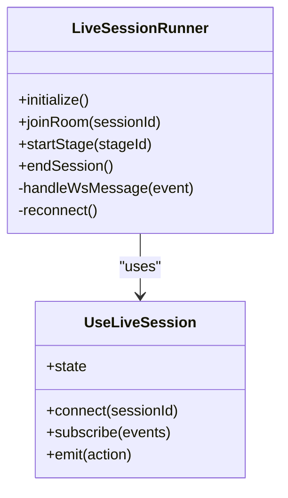
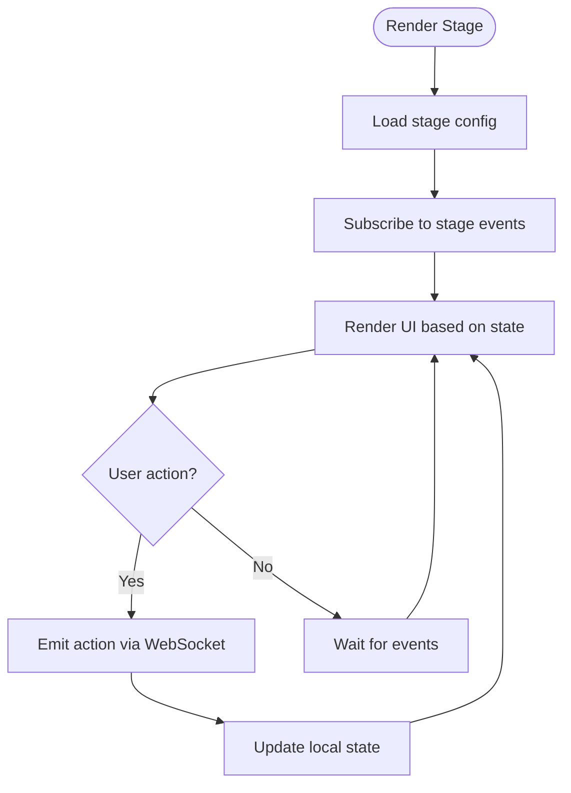
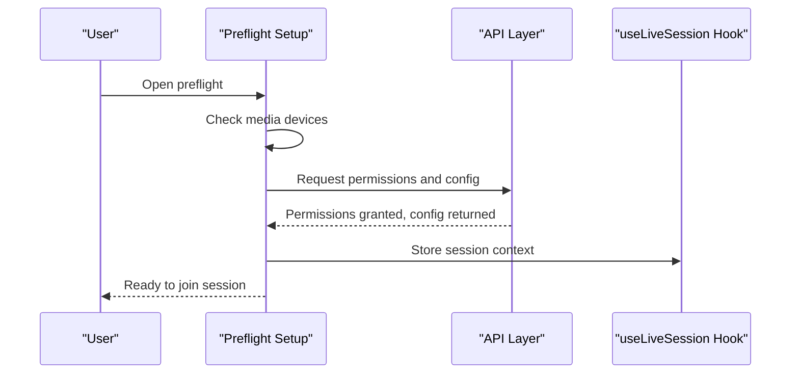
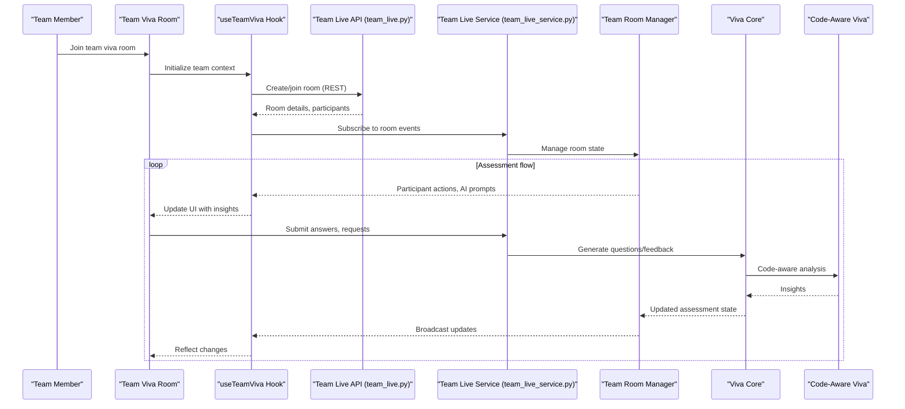
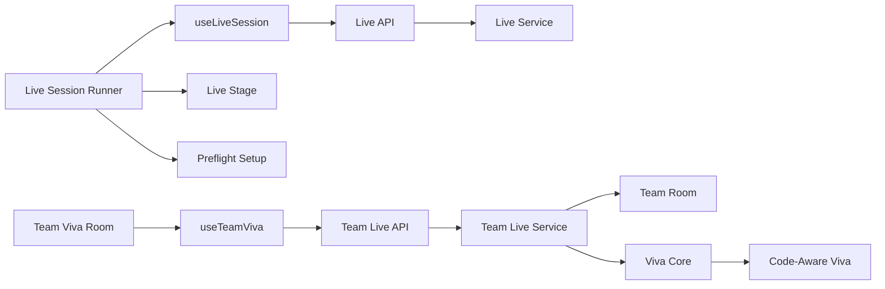

# Live Session Components

<cite>
**Referenced Files in This Document**
- [live-session-runner.tsx](file://src/components/live/live-session-runner.tsx)
- [live-stage.tsx](file://src/components/live/live-stage.tsx)
- [preflight-setup.tsx](file://src/components/live/preflight-setup.tsx)
- [team-viva-room.tsx](file://src/components/live/team-viva-room.tsx)
- [useLiveSession.ts](file://src/lib/useLiveSession.ts)
- [useTeamViva.ts](file://src/lib/useTeamViva.ts)
- [api.ts](file://src/lib/api.ts)
- [live.py](file://backend/api/live.py)
- [team_live.py](file://backend/api/team_live.py)
- [live_service.py](file://backend/ai/live_service.py)
- [team_live_service.py](file://backend/ai/team_live_service.py)
- [team_room.py](file://backend/ai/team_room.py)
- [viva_core.py](file://backend/ai/viva_core.py)
- [code_aware_viva.py](file://backend/ai/code_aware_viva.py)
</cite>

## Table of Contents
1. [Introduction](#introduction)
2. [Project Structure](#project-structure)
3. [Core Components](#core-components)
4. [Architecture Overview](#architecture-overview)
5. [Detailed Component Analysis](#detailed-component-analysis)
6. [Dependency Analysis](#dependency-analysis)
7. [Performance Considerations](#performance-considerations)
8. [Troubleshooting Guide](#troubleshooting-guide)
9. [Conclusion](#conclusion)
10. [Appendices](#appendices)

## Introduction
This document explains the Horux live session components that power real-time collaborative learning experiences. It covers the live session runner architecture, stage management, and preflight setup procedures on the frontend, as well as the team viva room implementation for collaborative AI-powered assessments. It also documents WebSocket communication patterns, real-time state synchronization, participant coordination, lifecycle management, error recovery, performance optimization, browser compatibility, network resilience, debugging strategies, and guidelines for extending functionality with new real-time features.

## Project Structure
The live session feature spans both frontend and backend:
- Frontend components orchestrate user interactions, manage local state, and communicate with backend services via REST and WebSocket channels.
- Backend services coordinate sessions, manage rooms, integrate AI capabilities, and expose APIs for real-time collaboration.

**Diagram sources**
- [live-session-runner.tsx](file://src/components/live/live-session-runner.tsx)
- [live-stage.tsx](file://src/components/live/live-stage.tsx)
- [preflight-setup.tsx](file://src/components/live/preflight-setup.tsx)
- [team-viva-room.tsx](file://src/components/live/team-viva-room.tsx)
- [useLiveSession.ts](file://src/lib/useLiveSession.ts)
- [useTeamViva.ts](file://src/lib/useTeamViva.ts)
- [api.ts](file://src/lib/api.ts)
- [live.py](file://backend/api/live.py)
- [team_live.py](file://backend/api/team_live.py)
- [live_service.py](file://backend/ai/live_service.py)
- [team_live_service.py](file://backend/ai/team_live_service.py)
- [team_room.py](file://backend/ai/team_room.py)
- [viva_core.py](file://backend/ai/viva_core.py)
- [code_aware_viva.py](file://backend/ai/code_aware_viva.py)

**Section sources**
- [live-session-runner.tsx](file://src/components/live/live-session-runner.tsx)
- [live-stage.tsx](file://src/components/live/live-stage.tsx)
- [preflight-setup.tsx](file://src/components/live/preflight-setup.tsx)
- [team-viva-room.tsx](file://src/components/live/team-viva-room.tsx)
- [useLiveSession.ts](file://src/lib/useLiveSession.ts)
- [useTeamViva.ts](file://src/lib/useTeamViva.ts)
- [api.ts](file://src/lib/api.ts)
- [live.py](file://backend/api/live.py)
- [team_live.py](file://backend/api/team_live.py)
- [live_service.py](file://backend/ai/live_service.py)
- [team_live_service.py](file://backend/ai/team_live_service.py)
- [team_room.py](file://backend/ai/team_room.py)
- [viva_core.py](file://backend/ai/viva_core.py)
- [code_aware_viva.py](file://backend/ai/code_aware_viva.py)

## Core Components
- Live Session Runner: Orchestrates the overall session lifecycle, coordinates stages, manages participants, and integrates WebSocket connectivity.
- Live Stage: Renders the current stage UI, handles stage-specific events, and updates shared state.
- Preflight Setup: Validates device capabilities (audio/video), collects permissions, and prepares the environment before joining a session.
- Team Viva Room: Implements collaborative AI-powered assessment workflows for teams, including participant coordination and real-time feedback.
- useLiveSession Hook: Encapsulates WebSocket connection, event handling, and state synchronization for live sessions.
- useTeamViva Hook: Manages team viva-specific state, room membership, and AI-driven assessment flows.
- API Layer: Provides REST endpoints for session creation, configuration, and persistence; used by hooks to bootstrap real-time features.

Key responsibilities:
- Lifecycle: Create, join, run, pause, resume, and end sessions.
- State Sync: Maintain consistent state across participants using WebSocket messages.
- Error Recovery: Handle reconnection, message loss, and partial failures gracefully.
- Performance: Throttle events, batch updates, and minimize re-renders.

**Section sources**
- [live-session-runner.tsx](file://src/components/live/live-session-runner.tsx)
- [live-stage.tsx](file://src/components/live/live-stage.tsx)
- [preflight-setup.tsx](file://src/components/live/preflight-setup.tsx)
- [team-viva-room.tsx](file://src/components/live/team-viva-room.tsx)
- [useLiveSession.ts](file://src/lib/useLiveSession.ts)
- [useTeamViva.ts](file://src/lib/useTeamViva.ts)
- [api.ts](file://src/lib/api.ts)

## Architecture Overview
The system follows a client-server model with WebSocket-based real-time communication:
- The frontend uses React components and hooks to manage UI and state.
- The backend exposes REST APIs for initialization and WebSocket channels for live data.
- AI services are integrated into the backend to provide intelligent assessment and feedback.

**Diagram sources**
- [live-session-runner.tsx](file://src/components/live/live-session-runner.tsx)
- [useLiveSession.ts](file://src/lib/useLiveSession.ts)
- [live.py](file://backend/api/live.py)
- [live_service.py](file://backend/ai/live_service.py)

## Detailed Component Analysis

### Live Session Runner
Responsibilities:
- Initializes the session, sets up the WebSocket connection, and manages lifecycle events.
- Coordinates stage transitions and participant presence.
- Handles errors and triggers reconnection logic.

**Diagram sources**
- [live-session-runner.tsx](file://src/components/live/live-session-runner.tsx)
- [useLiveSession.ts](file://src/lib/useLiveSession.ts)

**Section sources**
- [live-session-runner.tsx](file://src/components/live/live-session-runner.tsx)
- [useLiveSession.ts](file://src/lib/useLiveSession.ts)

### Live Stage
Responsibilities:
- Renders stage-specific content and controls.
- Subscribes to real-time events to update UI consistently.
- Emits stage actions back to the server.

**Diagram sources**
- [live-stage.tsx](file://src/components/live/live-stage.tsx)
- [useLiveSession.ts](file://src/lib/useLiveSession.ts)

**Section sources**
- [live-stage.tsx](file://src/components/live/live-stage.tsx)
- [useLiveSession.ts](file://src/lib/useLiveSession.ts)

### Preflight Setup
Responsibilities:
- Checks browser capabilities (media devices, permissions).
- Collects user preferences and validates environment readiness.
- Prepares audio/video streams and stores necessary tokens.

**Diagram sources**
- [preflight-setup.tsx](file://src/components/live/preflight-setup.tsx)
- [api.ts](file://src/lib/api.ts)
- [useLiveSession.ts](file://src/lib/useLiveSession.ts)

**Section sources**
- [preflight-setup.tsx](file://src/components/live/preflight-setup.tsx)
- [api.ts](file://src/lib/api.ts)
- [useLiveSession.ts](file://src/lib/useLiveSession.ts)

### Team Viva Room
Responsibilities:
- Manages team participation and collaborative assessment workflows.
- Integrates AI services for code-aware viva and dynamic questioning.
- Synchronizes participant states and AI-generated insights in real time.

**Diagram sources**
- [team-viva-room.tsx](file://src/components/live/team-viva-room.tsx)
- [useTeamViva.ts](file://src/lib/useTeamViva.ts)
- [team_live.py](file://backend/api/team_live.py)
- [team_live_service.py](file://backend/ai/team_live_service.py)
- [team_room.py](file://backend/ai/team_room.py)
- [viva_core.py](file://backend/ai/viva_core.py)
- [code_aware_viva.py](file://backend/ai/code_aware_viva.py)

**Section sources**
- [team-viva-room.tsx](file://src/components/live/team-viva-room.tsx)
- [useTeamViva.ts](file://src/lib/useTeamViva.ts)
- [team_live.py](file://backend/api/team_live.py)
- [team_live_service.py](file://backend/ai/team_live_service.py)
- [team_room.py](file://backend/ai/team_room.py)
- [viva_core.py](file://backend/ai/viva_core.py)
- [code_aware_viva.py](file://backend/ai/code_aware_viva.py)

## Dependency Analysis
The live session components depend on hooks for WebSocket management and API calls, while the backend orchestrates services and AI modules.

**Diagram sources**
- [live-session-runner.tsx](file://src/components/live/live-session-runner.tsx)
- [live-stage.tsx](file://src/components/live/live-stage.tsx)
- [preflight-setup.tsx](file://src/components/live/preflight-setup.tsx)
- [team-viva-room.tsx](file://src/components/live/team-viva-room.tsx)
- [useLiveSession.ts](file://src/lib/useLiveSession.ts)
- [useTeamViva.ts](file://src/lib/useTeamViva.ts)
- [live.py](file://backend/api/live.py)
- [team_live.py](file://backend/api/team_live.py)
- [live_service.py](file://backend/ai/live_service.py)
- [team_live_service.py](file://backend/ai/team_live_service.py)
- [team_room.py](file://backend/ai/team_room.py)
- [viva_core.py](file://backend/ai/viva_core.py)
- [code_aware_viva.py](file://backend/ai/code_aware_viva.py)

**Section sources**
- [live-session-runner.tsx](file://src/components/live/live-session-runner.tsx)
- [live-stage.tsx](file://src/components/live/live-stage.tsx)
- [preflight-setup.tsx](file://src/components/live/preflight-setup.tsx)
- [team-viva-room.tsx](file://src/components/live/team-viva-room.tsx)
- [useLiveSession.ts](file://src/lib/useLiveSession.ts)
- [useTeamViva.ts](file://src/lib/useTeamViva.ts)
- [live.py](file://backend/api/live.py)
- [team_live.py](file://backend/api/team_live.py)
- [live_service.py](file://backend/ai/live_service.py)
- [team_live_service.py](file://backend/ai/team_live_service.py)
- [team_room.py](file://backend/ai/team_room.py)
- [viva_core.py](file://backend/ai/viva_core.py)
- [code_aware_viva.py](file://backend/ai/code_aware_viva.py)

## Performance Considerations
- Event batching: Group multiple state updates to reduce re-renders.
- Debouncing user inputs: Prevent excessive WebSocket messages during rapid interactions.
- Selective subscriptions: Only subscribe to relevant events per component to minimize overhead.
- Efficient state management: Use lightweight state structures and avoid deep cloning.
- Network resilience: Implement exponential backoff for reconnections and queue critical messages.
- Memory management: Clean up listeners and close connections when components unmount.

[No sources needed since this section provides general guidance]

## Troubleshooting Guide
Common issues and strategies:
- WebSocket connection failures: Verify authentication tokens, check CORS settings, and implement retry logic.
- Message ordering: Use sequence numbers or timestamps to reorder events if needed.
- Partial state sync: Compare server state with local state and reconcile differences.
- Device permission errors: Prompt users to grant permissions and fallback gracefully.
- Debugging: Log events at key points, inspect payloads, and monitor network traffic.

**Section sources**
- [useLiveSession.ts](file://src/lib/useLiveSession.ts)
- [useTeamViva.ts](file://src/lib/useTeamViva.ts)
- [api.ts](file://src/lib/api.ts)

## Conclusion
The Horux live session components provide a robust foundation for real-time collaborative learning. By combining structured frontend components, resilient WebSocket communication, and powerful backend AI services, the system supports dynamic, interactive sessions. Following the outlined best practices ensures scalability, reliability, and an engaging user experience.

[No sources needed since this section summarizes without analyzing specific files]

## Appendices
- Extending live session functionality:
  - Add new WebSocket events by defining handlers in hooks and corresponding backend processors.
  - Introduce new stages by creating dedicated components and integrating them into the runner.
  - Expand AI capabilities by adding new modules to the viva core and exposing them through team live service.
- Browser compatibility:
  - Ensure WebRTC and WebSocket support; provide polyfills where necessary.
  - Test on major browsers and mobile platforms for consistent behavior.
- Network resilience:
  - Implement offline detection and queued message delivery upon reconnection.
  - Use compression for large payloads and prioritize critical updates.

[No sources needed since this section provides general guidance]