# Routing & Navigation

<cite>
**Referenced Files in This Document**
- [router.tsx](file://src/router.tsx)
- [__root.tsx](file://src/routes/__root.tsx)
- [index.tsx](file://src/routes/index.tsx)
- [login.tsx](file://src/routes/login.tsx)
- [signup.tsx](file://src/routes/signup.tsx)
- [forgot-password.tsx](file://src/routes/forgot-password.tsx)
- [reset-password.tsx](file://src/routes/reset-password.tsx)
- [ai.tsx](file://src/routes/ai.tsx)
- [ai-presentation/index.tsx](file://src/routes/ai-presentation/index.tsx)
- [ai-presentation/session.$id.tsx](file://src/routes/ai-presentation/session.$id.tsx)
- [ai-viva/index.tsx](file://src/routes/ai-viva/index.tsx)
- [ai-viva/new.tsx](file://src/routes/ai-viva/new.tsx)
- [ai-viva/session.$id.tsx](file://src/routes/ai-viva/session.$id.tsx)
- [projects/index.tsx](file://src/routes/projects/index.tsx)
- [projects/$id.tsx](file://src/routes/projects/$id.tsx)
- [projects/new.tsx](file://src/routes/projects/new.tsx)
- [teams/index.tsx](file://src/routes/teams/index.tsx)
- [teams/$id.tsx](file://src/routes/teams/$id.tsx)
- [templates/index.tsx](file://src/routes/templates/index.tsx)
- [templates/$slug.tsx](file://src/routes/templates/$slug.tsx)
- [advanced/index.tsx](file://src/routes/advanced/index.tsx)
- [advanced/viva-team.tsx](file://src/routes/advanced/viva-team.tsx)
- [advanced/viva-team_.join.$joinCode.tsx](file://src/routes/advanced/viva-team_.join.$joinCode.tsx)
- [advanced/viva-code-aware.tsx](file://src/routes/advanced/viva-code-aware.tsx)
- [advanced/viva-code-aware_.session.$id.tsx](file://src/routes/advanced/viva-code-aware_.session.$id.tsx)
- [advanced/sentiment-analysis.tsx](file://src/routes/advanced/sentiment-analysis.tsx)
- [advanced/weakness-heatmap.tsx](file://src/routes/advanced/weakness-heatmap.tsx)
- [auth-context.tsx](file://src/lib/auth-context.tsx)
- [error-page.ts](file://src/lib/error-page.ts)
- [query.ts](file://src/lib/query.ts)
- [api.ts](file://src/lib/api.ts)
</cite>

## Table of Contents
1. [Introduction](#introduction)
2. [Project Structure](#project-structure)
3. [Core Components](#core-components)
4. [Architecture Overview](#architecture-overview)
5. [Detailed Component Analysis](#detailed-component-analysis)
6. [Dependency Analysis](#dependency-analysis)
7. [Performance Considerations](#performance-considerations)
8. [Troubleshooting Guide](#troubleshooting-guide)
9. [Conclusion](#conclusion)
10. [Appendices](#appendices)

## Introduction
This document explains the Horux routing and navigation system built with TanStack Router. It covers route configuration structure, nested layouts, dynamic parameters, protected routes with authentication guards and role-based access control, navigation patterns (programmatic navigation, transitions, data loading), route guards, error boundaries, lazy loading, SEO considerations, browser history management, deep linking support, and guidelines for adding new routes following project conventions.

## Project Structure
The application uses file-based routing conventions under src/routes. The root layout is defined at the root route file, and feature areas are organized into folders that mirror URL paths. Nested routes use folder nesting and underscore prefixes to indicate optional segments or sibling routes. Dynamic segments are represented by dollar-prefixed filenames.

```mermaid
graph TB
A["src/router.tsx"] --> B["src/routes/__root.tsx"]
B --> C["src/routes/index.tsx"]
B --> D["src/routes/login.tsx"]
B --> E["src/routes/signup.tsx"]
B --> F["src/routes/forgot-password.tsx"]
B --> G["src/routes/reset-password.tsx"]
B --> H["src/routes/ai.tsx"]
H --> I["src/routes/ai-presentation/index.tsx"]
H --> J["src/routes/ai-presentation/session.$id.tsx"]
H --> K["src/routes/ai-viva/index.tsx"]
H --> L["src/routes/ai-viva/new.tsx"]
H --> M["src/routes/ai-viva/session.$id.tsx"]
B --> N["src/routes/projects/index.tsx"]
B --> O["src/routes/projects/$id.tsx"]
B --> P["src/routes/projects/new.tsx"]
B --> Q["src/routes/teams/index.tsx"]
B --> R["src/routes/teams/$id.tsx"]
B --> S["src/routes/templates/index.tsx"]
B --> T["src/routes/templates/$slug.tsx"]
B --> U["src/routes/advanced/index.tsx"]
U --> V["src/routes/advanced/viva-team.tsx"]
U --> W["src/routes/advanced/viva-team_.join.$joinCode.tsx"]
U --> X["src/routes/advanced/viva-code-aware.tsx"]
U --> Y["src/routes/advanced/viva-code-aware_.session.$id.tsx"]
U --> Z["src/routes/advanced/sentiment-analysis.tsx"]
U --> AA["src/routes/advanced/weakness-heatmap.tsx"]
```

**Diagram sources**
- [router.tsx:1-200](file://src/router.tsx#L1-L200)
- [__root.tsx:1-200](file://src/routes/__root.tsx#L1-L200)
- [index.tsx:1-200](file://src/routes/index.tsx#L1-L200)
- [login.tsx:1-200](file://src/routes/login.tsx#L1-L200)
- [signup.tsx:1-200](file://src/routes/signup.tsx#L1-L200)
- [forgot-password.tsx:1-200](file://src/routes/forgot-password.tsx#L1-L200)
- [reset-password.tsx:1-200](file://src/routes/reset-password.tsx#L1-L200)
- [ai.tsx:1-200](file://src/routes/ai.tsx#L1-L200)
- [ai-presentation/index.tsx:1-200](file://src/routes/ai-presentation/index.tsx#L1-L200)
- [ai-presentation/session.$id.tsx:1-200](file://src/routes/ai-presentation/session.$id.tsx#L1-L200)
- [ai-viva/index.tsx:1-200](file://src/routes/ai-viva/index.tsx#L1-L200)
- [ai-viva/new.tsx:1-200](file://src/routes/ai-viva/new.tsx#L1-L200)
- [ai-viva/session.$id.tsx:1-200](file://src/routes/ai-viva/session.$id.tsx#L1-L200)
- [projects/index.tsx:1-200](file://src/routes/projects/index.tsx#L1-L200)
- [projects/$id.tsx:1-200](file://src/routes/projects/$id.tsx#L1-L200)
- [projects/new.tsx:1-200](file://src/routes/projects/new.tsx#L1-L200)
- [teams/index.tsx:1-200](file://src/routes/teams/index.tsx#L1-L200)
- [teams/$id.tsx:1-200](file://src/routes/teams/$id.tsx#L1-L200)
- [templates/index.tsx:1-200](file://src/routes/templates/index.tsx#L1-L200)
- [templates/$slug.tsx:1-200](file://src/routes/templates/$slug.tsx#L1-L200)
- [advanced/index.tsx:1-200](file://src/routes/advanced/index.tsx#L1-L200)
- [advanced/viva-team.tsx:1-200](file://src/routes/advanced/viva-team.tsx#L1-L200)
- [advanced/viva-team_.join.$joinCode.tsx:1-200](file://src/routes/advanced/viva-team_.join.$joinCode.tsx#L1-L200)
- [advanced/viva-code-aware.tsx:1-200](file://src/routes/advanced/viva-code-aware.tsx#L1-L200)
- [advanced/viva-code-aware_.session.$id.tsx:1-200](file://src/routes/advanced/viva-code-aware_.session.$id.tsx#L1-L200)
- [advanced/sentiment-analysis.tsx:1-200](file://src/routes/advanced/sentiment-analysis.tsx#L1-L200)
- [advanced/weakness-heatmap.tsx:1-200](file://src/routes/advanced/weakness-heatmap.tsx#L1-L200)

**Section sources**
- [router.tsx:1-200](file://src/router.tsx#L1-L200)
- [__root.tsx:1-200](file://src/routes/__root.tsx#L1-L200)

## Core Components
- Root router setup: Initializes TanStack Router, defines top-level routes, and configures global behavior such as scroll restoration and default loaders.
- Root layout: Provides shared UI shell, navigation chrome, and global error boundary integration.
- Feature route groups: Organized by domain (AI, Projects, Teams, Templates, Advanced). Each group contains index pages, dynamic pages, and nested subroutes.
- Authentication context: Centralizes user session state and exposes hooks for guards and conditional rendering.
- Data fetching utilities: Query client configuration and API helpers used by route loaders.

Key responsibilities:
- Route tree composition and path-to-file mapping
- Layout nesting via folder hierarchy
- Parameter extraction from dynamic segments
- Guarding logic for protected routes
- Error boundary wiring at appropriate levels
- Data preloading strategies using loaders

**Section sources**
- [router.tsx:1-200](file://src/router.tsx#L1-L200)
- [__root.tsx:1-200](file://src/routes/__root.tsx#L1-L200)
- [auth-context.tsx:1-200](file://src/lib/auth-context.tsx#L1-L200)
- [query.ts:1-200](file://src/lib/query.ts#L1-L200)
- [api.ts:1-200](file://src/lib/api.ts#L1-L200)

## Architecture Overview
The routing architecture follows a layered approach:
- Router layer: Configures TanStack Router instance and registers routes.
- Layout layer: Root layout composes persistent UI and integrates error boundaries.
- Feature layers: Domain-specific route modules encapsulate page components and their loaders.
- Security layer: Guards enforce authentication and roles before rendering protected content.
- Data layer: Loaders fetch data using React Query and API helpers.

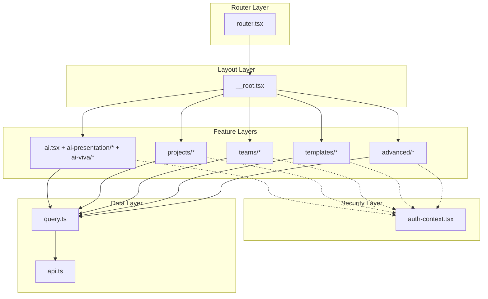

**Diagram sources**
- [router.tsx:1-200](file://src/router.tsx#L1-L200)
- [__root.tsx:1-200](file://src/routes/__root.tsx#L1-L200)
- [ai.tsx:1-200](file://src/routes/ai.tsx#L1-L200)
- [ai-presentation/index.tsx:1-200](file://src/routes/ai-presentation/index.tsx#L1-L200)
- [ai-presentation/session.$id.tsx:1-200](file://src/routes/ai-presentation/session.$id.tsx#L1-L200)
- [ai-viva/index.tsx:1-200](file://src/routes/ai-viva/index.tsx#L1-L200)
- [ai-viva/new.tsx:1-200](file://src/routes/ai-viva/new.tsx#L1-L200)
- [ai-viva/session.$id.tsx:1-200](file://src/routes/ai-viva/session.$id.tsx#L1-L200)
- [projects/index.tsx:1-200](file://src/routes/projects/index.tsx#L1-L200)
- [projects/$id.tsx:1-200](file://src/routes/projects/$id.tsx#L1-L200)
- [projects/new.tsx:1-200](file://src/routes/projects/new.tsx#L1-L200)
- [teams/index.tsx:1-200](file://src/routes/teams/index.tsx#L1-L200)
- [teams/$id.tsx:1-200](file://src/routes/teams/$id.tsx#L1-L200)
- [templates/index.tsx:1-200](file://src/routes/templates/index.tsx#L1-L200)
- [templates/$slug.tsx:1-200](file://src/routes/templates/$slug.tsx#L1-L200)
- [advanced/index.tsx:1-200](file://src/routes/advanced/index.tsx#L1-L200)
- [advanced/viva-team.tsx:1-200](file://src/routes/advanced/viva-team.tsx#L1-L200)
- [advanced/viva-team_.join.$joinCode.tsx:1-200](file://src/routes/advanced/viva-team_.join.$joinCode.tsx#L1-L200)
- [advanced/viva-code-aware.tsx:1-200](file://src/routes/advanced/viva-code-aware.tsx#L1-L200)
- [advanced/viva-code-aware_.session.$id.tsx:1-200](file://src/routes/advanced/viva-code-aware_.session.$id.tsx#L1-L200)
- [advanced/sentiment-analysis.tsx:1-200](file://src/routes/advanced/sentiment-analysis.tsx#L1-L200)
- [advanced/weakness-heatmap.tsx:1-200](file://src/routes/advanced/weakness-heatmap.tsx#L1-L200)
- [auth-context.tsx:1-200](file://src/lib/auth-context.tsx#L1-L200)
- [query.ts:1-200](file://src/lib/query.ts#L1-L200)
- [api.ts:1-200](file://src/lib/api.ts#L1-L200)

## Detailed Component Analysis

### Root Router Configuration
- Purpose: Create the router instance, register top-level routes, and set defaults like scroll restoration and pending UI.
- Key behaviors:
  - Registers all route files under src/routes.
  - Applies global settings for navigation transitions and error handling.
  - Integrates with the root layout component for consistent chrome.

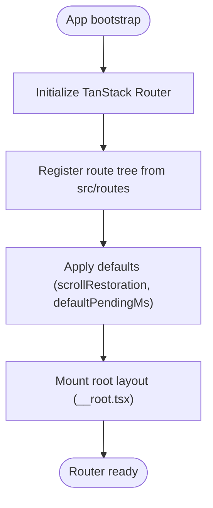

**Diagram sources**
- [router.tsx:1-200](file://src/router.tsx#L1-L200)

**Section sources**
- [router.tsx:1-200](file://src/router.tsx#L1-L200)

### Root Layout and Global Error Boundary
- Purpose: Provide shared UI shell, navigation menu, and integrate global error boundary.
- Responsibilities:
  - Render outlet for child routes.
  - Wrap application with error boundary provider.
  - Optionally include analytics or theme providers.

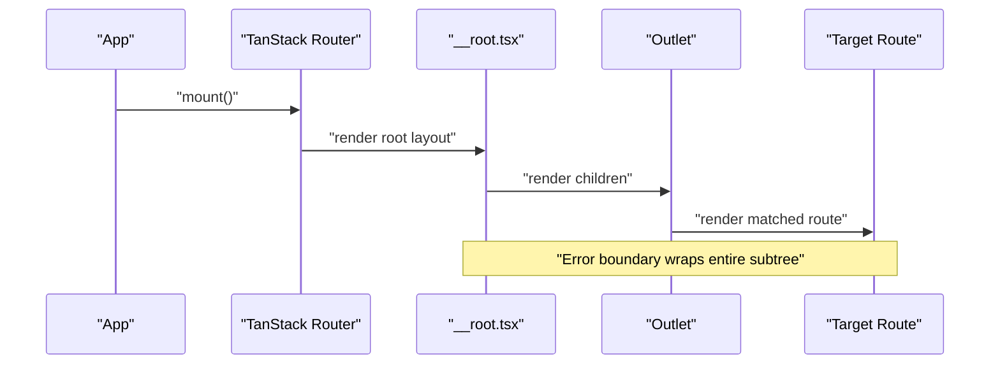

**Diagram sources**
- [__root.tsx:1-200](file://src/routes/__root.tsx#L1-L200)

**Section sources**
- [__root.tsx:1-200](file://src/routes/__root.tsx#L1-L200)

### Protected Routes and Authentication Guards
- Pattern: Use route-level guards to check authentication and roles before rendering.
- Implementation points:
  - Access current user state from auth context.
  - Redirect unauthenticated users to login.
  - Enforce role checks for admin-only features.
  - Integrate with loader to abort navigation when guard fails.

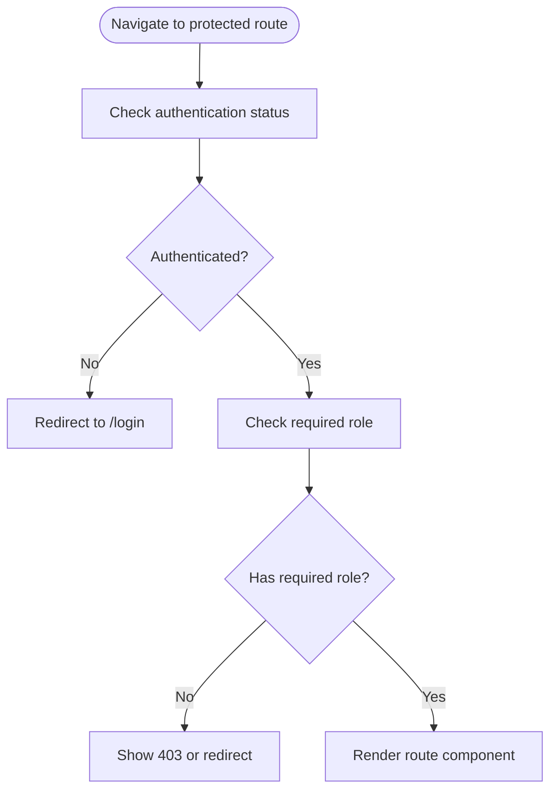

**Diagram sources**
- [auth-context.tsx:1-200](file://src/lib/auth-context.tsx#L1-L200)

**Section sources**
- [auth-context.tsx:1-200](file://src/lib/auth-context.tsx#L1-L200)

### Dynamic Route Parameters
- Convention: Dollar-prefixed filenames represent parameters (e.g., $id, $slug, $joinCode).
- Examples:
  - projects/$id.tsx: Loads project by id.
  - templates/$slug.tsx: Loads template by slug.
  - advanced/viva-team_.join.$joinCode.tsx: Optional join segment followed by join code parameter.
  - advanced/viva-code-aware_.session.$id.tsx: Optional session segment followed by session id parameter.

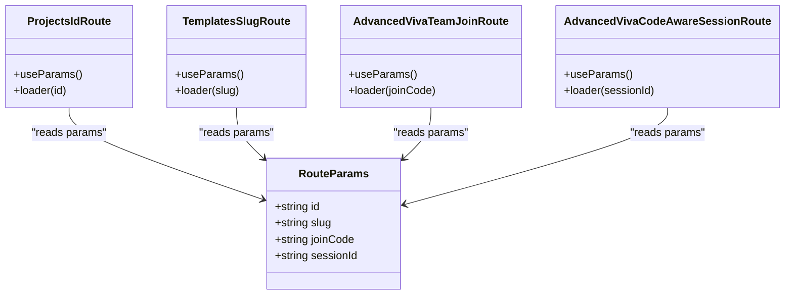

**Diagram sources**
- [projects/$id.tsx:1-200](file://src/routes/projects/$id.tsx#L1-L200)
- [templates/$slug.tsx:1-200](file://src/routes/templates/$slug.tsx#L1-L200)
- [advanced/viva-team_.join.$joinCode.tsx:1-200](file://src/routes/advanced/viva-team_.join.$joinCode.tsx#L1-L200)
- [advanced/viva-code-aware_.session.$id.tsx:1-200](file://src/routes/advanced/viva-code-aware_.session.$id.tsx#L1-L200)

**Section sources**
- [projects/$id.tsx:1-200](file://src/routes/projects/$id.tsx#L1-L200)
- [templates/$slug.tsx:1-200](file://src/routes/templates/$slug.tsx#L1-L200)
- [advanced/viva-team_.join.$joinCode.tsx:1-200](file://src/routes/advanced/viva-team_.join.$joinCode.tsx#L1-L200)
- [advanced/viva-code-aware_.session.$id.tsx:1-200](file://src/routes/advanced/viva-code-aware_.session.$id.tsx#L1-L200)

### Nested Layouts and Grouping
- Folder-based nesting mirrors URL structure.
- Example grouping:
  - ai.tsx acts as a parent layout for ai-presentation and ai-viva.
  - advanced/index.tsx provides a base for advanced features.
- Benefits: Shared UI, common loaders, and grouped navigation.

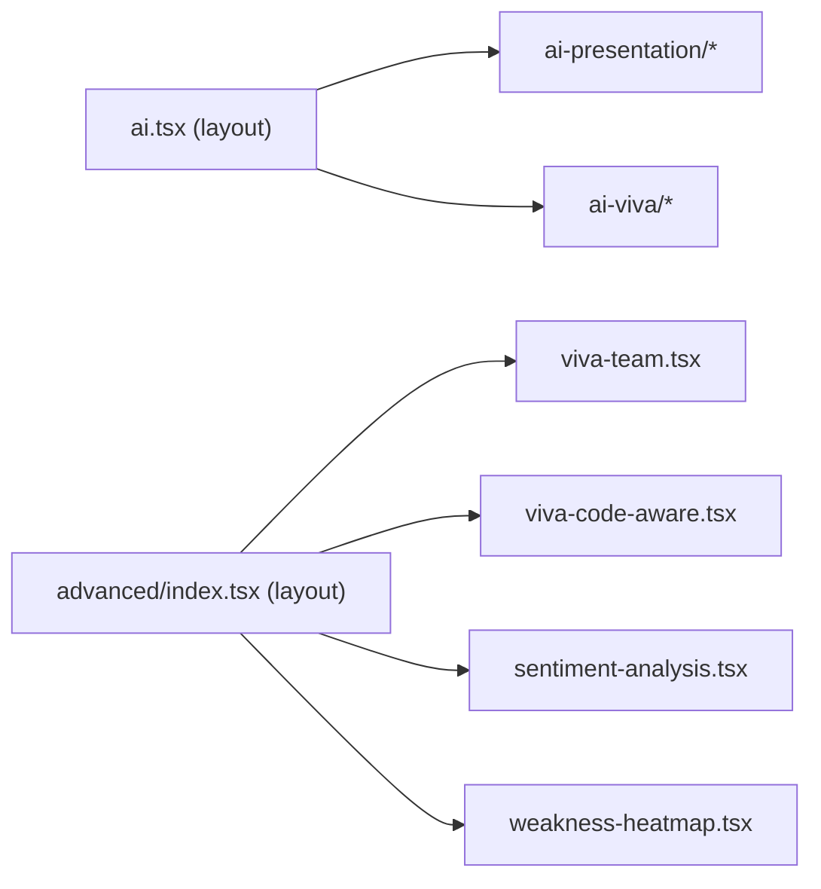

**Diagram sources**
- [ai.tsx:1-200](file://src/routes/ai.tsx#L1-L200)
- [ai-presentation/index.tsx:1-200](file://src/routes/ai-presentation/index.tsx#L1-L200)
- [ai-presentation/session.$id.tsx:1-200](file://src/routes/ai-presentation/session.$id.tsx#L1-L200)
- [ai-viva/index.tsx:1-200](file://src/routes/ai-viva/index.tsx#L1-L200)
- [ai-viva/new.tsx:1-200](file://src/routes/ai-viva/new.tsx#L1-L200)
- [ai-viva/session.$id.tsx:1-200](file://src/routes/ai-viva/session.$id.tsx#L1-L200)
- [advanced/index.tsx:1-200](file://src/routes/advanced/index.tsx#L1-L200)
- [advanced/viva-team.tsx:1-200](file://src/routes/advanced/viva-team.tsx#L1-L200)
- [advanced/viva-code-aware.tsx:1-200](file://src/routes/advanced/viva-code-aware.tsx#L1-L200)
- [advanced/sentiment-analysis.tsx:1-200](file://src/routes/advanced/sentiment-analysis.tsx#L1-L200)
- [advanced/weakness-heatmap.tsx:1-200](file://src/routes/advanced/weakness-heatmap.tsx#L1-L200)

**Section sources**
- [ai.tsx:1-200](file://src/routes/ai.tsx#L1-L200)
- [advanced/index.tsx:1-200](file://src/routes/advanced/index.tsx#L1-L200)

### Programmatic Navigation and Transitions
- Patterns:
  - Navigate programmatically using router APIs within components.
  - Use transition options to customize pending UI and scroll behavior.
  - Leverage search params for filtering and pagination.

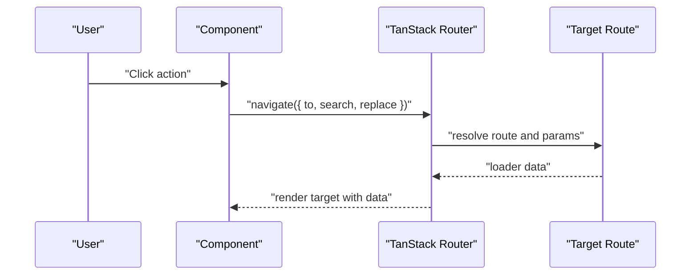

[No diagram sources needed since this sequence illustrates general navigation flow]

**Section sources**
- [router.tsx:1-200](file://src/router.tsx#L1-L200)

### Data Loading Strategies
- Strategy: Use route loaders to prefetch data before rendering.
- Integration: Loaders call query client configured in query.ts and api.ts helpers.
- Benefits: Predictable data availability, improved UX with pending states, and caching.

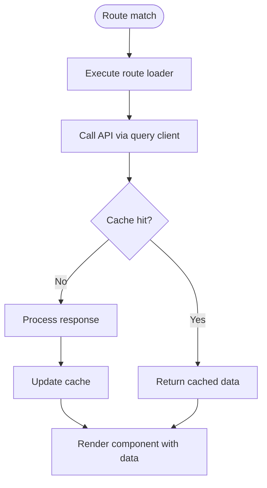

**Diagram sources**
- [query.ts:1-200](file://src/lib/query.ts#L1-L200)
- [api.ts:1-200](file://src/lib/api.ts#L1-L200)

**Section sources**
- [query.ts:1-200](file://src/lib/query.ts#L1-L200)
- [api.ts:1-200](file://src/lib/api.ts#L1-L200)

### Route Guards and Error Boundaries
- Guards: Enforce authentication and roles at route level.
- Error boundaries: Wrap layouts or specific route groups to catch render errors and display friendly messages.
- Utilities: Centralized error page helper for consistent error UI.

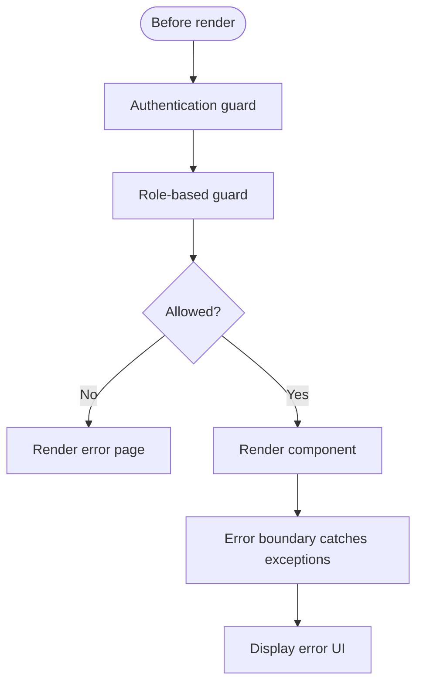

**Diagram sources**
- [auth-context.tsx:1-200](file://src/lib/auth-context.tsx#L1-L200)
- [error-page.ts:1-200](file://src/lib/error-page.ts#L1-L200)

**Section sources**
- [auth-context.tsx:1-200](file://src/lib/auth-context.tsx#L1-L200)
- [error-page.ts:1-200](file://src/lib/error-page.ts#L1-L200)

### Lazy Loading Implementation
- Approach: Split route components per file to enable code splitting.
- Effect: Reduce initial bundle size and improve load times.
- Best practice: Keep heavy dependencies inside route components or loaders.

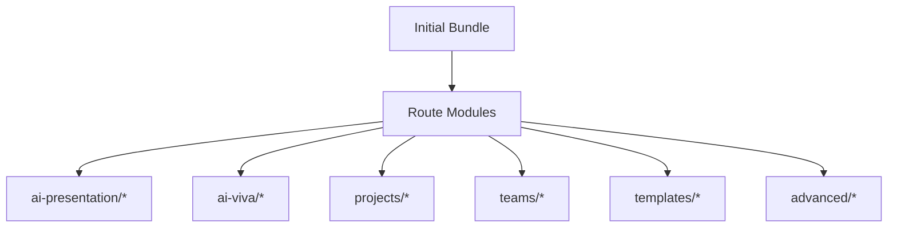

[No diagram sources needed since this diagram shows conceptual code-splitting strategy]

**Section sources**
- [ai-presentation/index.tsx:1-200](file://src/routes/ai-presentation/index.tsx#L1-L200)
- [ai-viva/index.tsx:1-200](file://src/routes/ai-viva/index.tsx#L1-L200)
- [projects/index.tsx:1-200](file://src/routes/projects/index.tsx#L1-L200)
- [teams/index.tsx:1-200](file://src/routes/teams/index.tsx#L1-L200)
- [templates/index.tsx:1-200](file://src/routes/templates/index.tsx#L1-L200)
- [advanced/index.tsx:1-200](file://src/routes/advanced/index.tsx#L1-L200)

### SEO Considerations
- Recommendations:
  - Set meta tags and titles in route components where applicable.
  - Ensure canonical URLs and structured data for public pages.
  - Avoid sensitive information in URLs; prefer server-side rendering if SEO-critical.
- Deep linking:
  - Use stable identifiers (ids, slugs) in URLs.
  - Maintain backward compatibility for legacy links.

[No sources needed since this section provides general guidance]

### Browser History Management and Deep Linking
- Behavior: TanStack Router manages browser history automatically.
- Tips:
  - Use replace navigation for non-essential state changes.
  - Preserve search params across navigations for filters.
  - Validate and sanitize dynamic parameters to prevent invalid routes.

[No sources needed since this section provides general guidance]

## Dependency Analysis
Routing depends on:
- Router configuration and root layout.
- Authentication context for guards.
- Query client and API helpers for data loading.
- Feature route modules for domain logic.

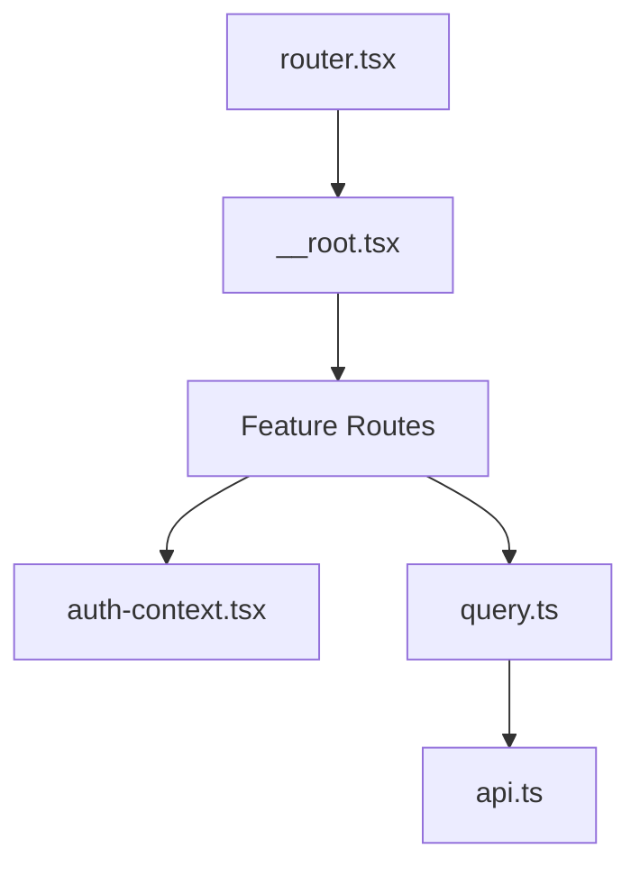

**Diagram sources**
- [router.tsx:1-200](file://src/router.tsx#L1-L200)
- [__root.tsx:1-200](file://src/routes/__root.tsx#L1-L200)
- [auth-context.tsx:1-200](file://src/lib/auth-context.tsx#L1-L200)
- [query.ts:1-200](file://src/lib/query.ts#L1-L200)
- [api.ts:1-200](file://src/lib/api.ts#L1-L200)

**Section sources**
- [router.tsx:1-200](file://src/router.tsx#L1-L200)
- [__root.tsx:1-200](file://src/routes/__root.tsx#L1-L200)
- [auth-context.tsx:1-200](file://src/lib/auth-context.tsx#L1-L200)
- [query.ts:1-200](file://src/lib/query.ts#L1-L200)
- [api.ts:1-200](file://src/lib/api.ts#L1-L200)

## Performance Considerations
- Code splitting: Benefit from file-based route modules to reduce initial payload.
- Prefetching: Use loaders to preload critical data for anticipated navigations.
- Caching: Leverage query client caching to avoid redundant network requests.
- Pending UI: Configure pending timeouts to keep navigation responsive.
- Memory: Unsubscribe from subscriptions in route cleanup to prevent leaks.

[No sources needed since this section provides general guidance]

## Troubleshooting Guide
Common issues and resolutions:
- 404 Not Found: Verify route file naming and path conventions; ensure dynamic segments match expected patterns.
- Redirect loops: Check guard conditions and ensure redirects do not re-trigger the same guard.
- Missing data: Inspect loader execution order and query client configuration; verify API endpoints.
- Error boundary not catching: Confirm error boundary placement around the intended subtree.

**Section sources**
- [error-page.ts:1-200](file://src/lib/error-page.ts#L1-L200)

## Conclusion
Horux’s routing and navigation system leverages TanStack Router’s file-based conventions to deliver a scalable, maintainable architecture. By organizing routes into feature groups, implementing robust guards, and adopting effective data loading strategies, the application achieves strong performance and developer ergonomics. Following the provided guidelines ensures consistent additions of new routes and preserves SEO and deep linking quality.

## Appendices

### Guidelines for Adding New Routes
- Create a new file under the appropriate feature folder mirroring the desired URL path.
- For dynamic segments, use dollar-prefixed filenames (e.g., $id).
- If the route requires authentication or roles, implement guards in the route component or loader.
- Add a loader to fetch necessary data using the query client and API helpers.
- Include meta tags and titles for SEO where applicable.
- Test navigation, deep linking, and error scenarios.

**Section sources**
- [router.tsx:1-200](file://src/router.tsx#L1-L200)
- [__root.tsx:1-200](file://src/routes/__root.tsx#L1-L200)
- [auth-context.tsx:1-200](file://src/lib/auth-context.tsx#L1-L200)
- [query.ts:1-200](file://src/lib/query.ts#L1-L200)
- [api.ts:1-200](file://src/lib/api.ts#L1-L200)