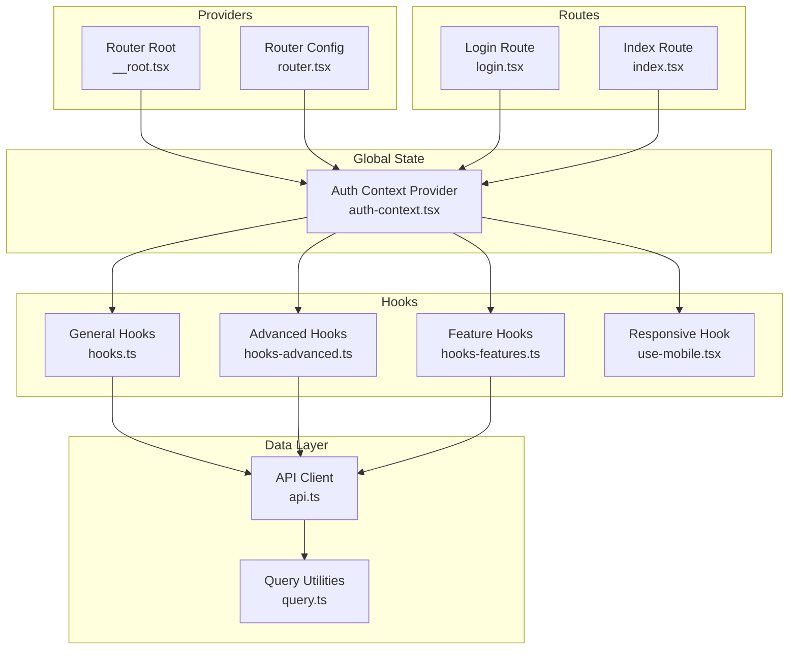
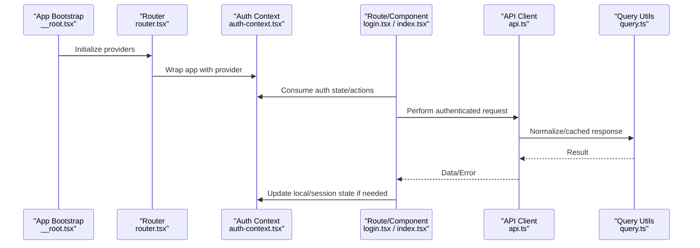
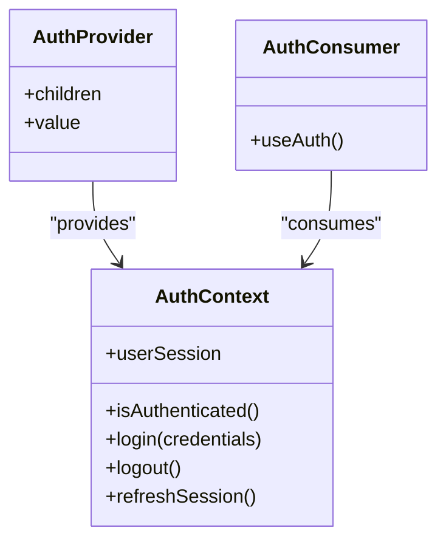
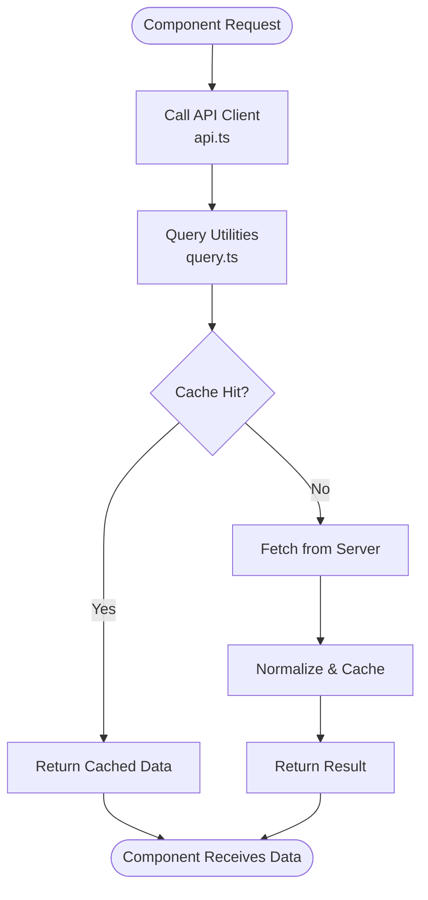
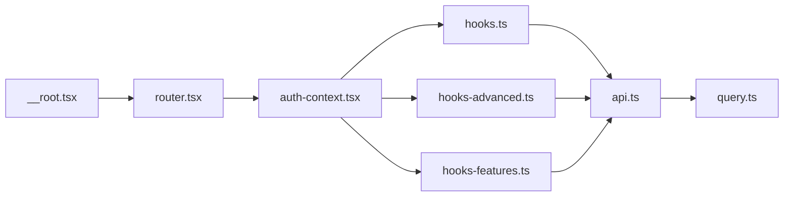

# State Management

<cite>
**Referenced Files in This Document**
- [auth-context.tsx](file://src/lib/auth-context.tsx)
- [hooks.ts](file://src/lib/hooks.ts)
- [hooks-advanced.ts](file://src/lib/hooks-advanced.ts)
- [hooks-features.ts](file://src/lib/hooks-features.ts)
- [use-mobile.tsx](file://src/hooks/use-mobile.tsx)
- [api.ts](file://src/lib/api.ts)
- [query.ts](file://src/lib/query.ts)
- [router.tsx](file://src/router.tsx)
- [__root.tsx](file://src/routes/__root.tsx)
- [login.tsx](file://src/routes/login.tsx)
- [index.tsx](file://src/routes/index.tsx)
</cite>

## Table of Contents
1. [Introduction](#introduction)
2. [Project Structure](#project-structure)
3. [Core Components](#core-components)
4. [Architecture Overview](#architecture-overview)
5. [Detailed Component Analysis](#detailed-component-analysis)
6. [Dependency Analysis](#dependency-analysis)
7. [Performance Considerations](#performance-considerations)
8. [Troubleshooting Guide](#troubleshooting-guide)
9. [Conclusion](#conclusion)
10. [Appendices](#appendices)

## Introduction
This document explains the Horux state management architecture built on React Context API and custom hooks. It covers:
- Authentication context for user session management and global state synchronization
- Custom hook patterns including use-mobile, advanced hooks, and feature-specific hooks
- Local component state strategies, form state handling, and data fetching patterns
- Guidelines for creating new contexts, implementing safe state updates, and avoiding unnecessary re-renders
- State persistence, error handling in state operations, and testing strategies for stateful components

The goal is to provide a clear, practical guide for developers working with Horux’s frontend state layer.

## Project Structure
Horux organizes state-related logic under src/lib and src/hooks:
- Global state and contexts live in src/lib (e.g., authentication context)
- Shared utilities and custom hooks are split into focused files:
  - General hooks: src/lib/hooks.ts
  - Advanced hooks: src/lib/hooks-advanced.ts
  - Feature-specific hooks: src/lib/hooks-features.ts
  - Responsive behavior: src/hooks/use-mobile.tsx
- Data access and caching are centralized via src/lib/api.ts and src/lib/query.ts
- Application bootstrap wires providers at the router root and route entry points

**Diagram sources**
- [router.tsx](file://src/router.tsx)
- [__root.tsx](file://src/routes/__root.tsx)
- [auth-context.tsx](file://src/lib/auth-context.tsx)
- [hooks.ts](file://src/lib/hooks.ts)
- [hooks-advanced.ts](file://src/lib/hooks-advanced.ts)
- [hooks-features.ts](file://src/lib/hooks-features.ts)
- [use-mobile.tsx](file://src/hooks/use-mobile.tsx)
- [api.ts](file://src/lib/api.ts)
- [query.ts](file://src/lib/query.ts)
- [login.tsx](file://src/routes/login.tsx)
- [index.tsx](file://src/routes/index.tsx)

**Section sources**
- [router.tsx](file://src/router.tsx)
- [__root.tsx](file://src/routes/__root.tsx)
- [auth-context.tsx](file://src/lib/auth-context.tsx)
- [hooks.ts](file://src/lib/hooks.ts)
- [hooks-advanced.ts](file://src/lib/hooks-advanced.ts)
- [hooks-features.ts](file://src/lib/hooks-features.ts)
- [use-mobile.tsx](file://src/hooks/use-mobile.tsx)
- [api.ts](file://src/lib/api.ts)
- [query.ts](file://src/lib/query.ts)
- [login.tsx](file://src/routes/login.tsx)
- [index.tsx](file://src/routes/index.tsx)

## Core Components
- Authentication Context: Provides user session state and actions across the app. Consumers subscribe only to relevant slices to minimize re-renders.
- General Hooks: Encapsulate common stateful behaviors (e.g., toggles, counters, simple forms).
- Advanced Hooks: Implement complex logic such as debounced inputs, memoized computations, or orchestration of multiple side effects.
- Feature Hooks: Encapsulate domain-specific state and interactions (e.g., live sessions, team viva flows).
- Responsive Hook: Exposes device breakpoint state for responsive UI decisions.
- Data Access: Centralized API client and query utilities coordinate server state and caching.

Key responsibilities:
- Provide stable interfaces for consumers
- Minimize re-renders by splitting contexts and using selectors
- Centralize error handling and persistence where appropriate
- Keep server state separate from client state

**Section sources**
- [auth-context.tsx](file://src/lib/auth-context.tsx)
- [hooks.ts](file://src/lib/hooks.ts)
- [hooks-advanced.ts](file://src/lib/hooks-advanced.ts)
- [hooks-features.ts](file://src/lib/hooks-features.ts)
- [use-mobile.tsx](file://src/hooks/use-mobile.tsx)
- [api.ts](file://src/lib/api.ts)
- [query.ts](file://src/lib/query.ts)

## Architecture Overview
At runtime, the application bootstraps providers at the router root. The authentication context wraps the app tree, exposing user session state and actions. Routes and components consume this context through dedicated hooks. Data fetching is coordinated via an API client and query utilities, which may integrate with a caching layer.

**Diagram sources**
- [__root.tsx](file://src/routes/__root.tsx)
- [router.tsx](file://src/router.tsx)
- [auth-context.tsx](file://src/lib/auth-context.tsx)
- [login.tsx](file://src/routes/login.tsx)
- [index.tsx](file://src/routes/index.tsx)
- [api.ts](file://src/lib/api.ts)
- [query.ts](file://src/lib/query.ts)

## Detailed Component Analysis

### Authentication Context
Responsibilities:
- Maintain user session state (e.g., presence, identity, tokens)
- Provide login/logout and session refresh actions
- Persist session across reloads when applicable
- Expose minimal consumer interface to avoid unnecessary re-renders

Recommended patterns:
- Split large contexts into smaller ones (e.g., user profile vs. session lifecycle)
- Use memoized selectors or derived values for consumers
- Centralize error handling and loading states within the context

**Diagram sources**
- [auth-context.tsx](file://src/lib/auth-context.tsx)

Guidelines:
- Always check authentication before accessing protected routes
- Handle token expiration gracefully with automatic refresh or redirect
- Avoid storing sensitive data in long-lived storage without encryption

**Section sources**
- [auth-context.tsx](file://src/lib/auth-context.tsx)
- [login.tsx](file://src/routes/login.tsx)
- [index.tsx](file://src/routes/index.tsx)

### Custom Hook Patterns

#### use-mobile (Responsive Behavior)
Purpose:
- Expose a boolean or breakpoint value indicating mobile viewport
- Enable conditional rendering and layout adjustments

Usage:
- Toggle mobile-only UI elements
- Adjust navigation and drawer visibility based on screen size

Best practices:
- Debounce resize listeners if necessary
- Memoize computed values derived from breakpoints

**Section sources**
- [use-mobile.tsx](file://src/hooks/use-mobile.tsx)

#### General Hooks (src/lib/hooks.ts)
Purpose:
- Common reusable stateful behaviors (toggles, counters, simple forms)
- Encapsulate event handlers and derived state

Patterns:
- Return stable function references to prevent child re-renders
- Combine useState and useEffect for side effects

**Section sources**
- [hooks.ts](file://src/lib/hooks.ts)

#### Advanced Hooks (src/lib/hooks-advanced.ts)
Purpose:
- Complex logic like debouncing, throttling, memoization, or orchestrating multiple async operations
- Provide higher-order abstractions over basic hooks

Patterns:
- Separate concerns: pure computation vs. side effects
- Expose explicit control flags (e.g., enabled/disabled)

**Section sources**
- [hooks-advanced.ts](file://src/lib/hooks-advanced.ts)

#### Feature-Specific Hooks (src/lib/hooks-features.ts)
Purpose:
- Domain-driven state encapsulation (e.g., live sessions, team viva workflows)
- Coordinate multiple APIs and local state transitions

Patterns:
- Model state machines for complex flows
- Centralize error and loading states per feature

**Section sources**
- [hooks-features.ts](file://src/lib/hooks-features.ts)

### Local Component State and Forms
Strategies:
- Prefer useState for small, isolated state
- For forms, consider controlled inputs with validation and normalization
- Extract complex form logic into custom hooks for reuse and testability

Recommendations:
- Normalize input values early
- Debounce expensive validations
- Surface errors close to inputs

[No sources needed since this section provides general guidance]

### Data Fetching Patterns
Centralized access:
- API client: src/lib/api.ts
- Query utilities: src/lib/query.ts

Typical flow:
- Component calls a hook that uses the API client
- Query utilities normalize responses and manage caching
- Errors and loading states are surfaced consistently

**Diagram sources**
- [api.ts](file://src/lib/api.ts)
- [query.ts](file://src/lib/query.ts)

**Section sources**
- [api.ts](file://src/lib/api.ts)
- [query.ts](file://src/lib/query.ts)

## Dependency Analysis
High-level dependencies among state modules:
- Providers depend on contexts and wrap the router tree
- Hooks depend on contexts and data layers
- Routes and components depend on hooks and contexts

**Diagram sources**
- [__root.tsx](file://src/routes/__root.tsx)
- [router.tsx](file://src/router.tsx)
- [auth-context.tsx](file://src/lib/auth-context.tsx)
- [hooks.ts](file://src/lib/hooks.ts)
- [hooks-advanced.ts](file://src/lib/hooks-advanced.ts)
- [hooks-features.ts](file://src/lib/hooks-features.ts)
- [api.ts](file://src/lib/api.ts)
- [query.ts](file://src/lib/query.ts)

**Section sources**
- [__root.tsx](file://src/routes/__root.tsx)
- [router.tsx](file://src/router.tsx)
- [auth-context.tsx](file://src/lib/auth-context.tsx)
- [hooks.ts](file://src/lib/hooks.ts)
- [hooks-advanced.ts](file://src/lib/hooks-advanced.ts)
- [hooks-features.ts](file://src/lib/hooks-features.ts)
- [api.ts](file://src/lib/api.ts)
- [query.ts](file://src/lib/query.ts)

## Performance Considerations
- Split contexts to limit subscriber scope; prefer fine-grained contexts for unrelated state
- Memoize expensive computations and callbacks
- Avoid passing large objects down the tree; pass identifiers and fetch details in hooks
- Use stable function references to prevent child re-renders
- Debounce/throttle frequent updates (e.g., search inputs, window resize)
- Leverage query utilities for caching and deduplication

[No sources needed since this section provides general guidance]

## Troubleshooting Guide
Common issues and resolutions:
- Unnecessary re-renders: Ensure consumers select only required state slices; memoize derived values
- Stale closures: Verify hook dependencies and ensure functions are stable
- Race conditions in async flows: Cancel previous requests or coalesce updates
- Persistence mismatches: Validate serialization/deserialization and handle schema changes
- Error propagation: Centralize error handling in contexts/hooks and surface consistent messages

Testing strategies:
- Mock contexts and hooks to isolate components
- Assert state transitions and side effects
- Simulate network failures and verify error handling paths
- Test responsive behavior by mocking media queries

[No sources needed since this section provides general guidance]

## Conclusion
Horux’s state management leverages React Context for global concerns (especially authentication) and custom hooks for reusable logic. By separating server and client state, centralizing data access, and following performance best practices, the application remains maintainable and efficient. Adopt the provided patterns when adding new features to keep state predictable and testable.

[No sources needed since this section summarizes without analyzing specific files]

## Appendices

### Creating New Contexts
- Define a minimal shape for the context value
- Provide a provider that manages state and actions
- Expose a typed hook for consumption
- Consider splitting large contexts into smaller ones

### Implementing Proper State Updates
- Prefer functional updates for dependent state
- Batch related updates
- Normalize data structures to simplify updates

### Avoiding Unnecessary Re-renders
- Memoize selectors and derived values
- Stabilize callback references
- Use context selectors or split contexts

### State Persistence
- Choose appropriate storage (session vs. local)
- Serialize safely and handle versioning
- Sync persisted state with server state on load

### Error Handling in State Operations
- Centralize error types and messages
- Surface actionable feedback to users
- Retry transient failures where appropriate

### Testing Strategies for Stateful Components
- Render with mocked providers
- Assert state transitions and UI outcomes
- Cover edge cases and error paths

[No sources needed since this section provides general guidance]