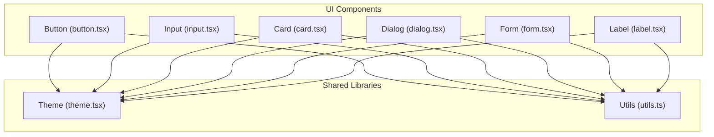
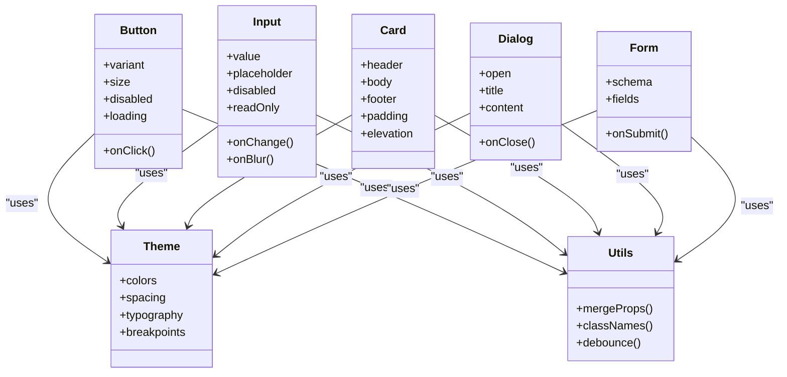
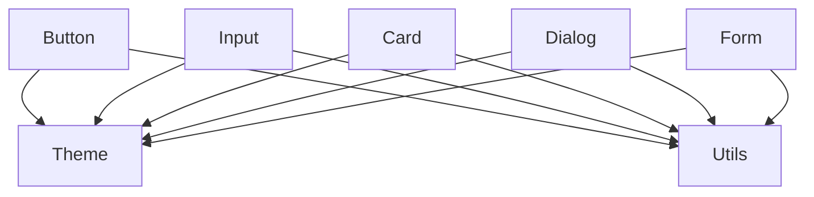

# Core Components

<cite>
**Referenced Files in This Document**
- [button.tsx](file://src/components/ui/button.tsx)
- [input.tsx](file://src/components/ui/input.tsx)
- [card.tsx](file://src/components/ui/card.tsx)
- [dialog.tsx](file://src/components/ui/dialog.tsx)
- [form.tsx](file://src/components/ui/form.tsx)
- [label.tsx](file://src/components/ui/label.tsx)
- [theme.tsx](file://src/lib/theme.tsx)
- [utils.ts](file://src/lib/utils.ts)
</cite>

## Table of Contents
1. [Introduction](#introduction)
2. [Project Structure](#project-structure)
3. [Core Components](#core-components)
4. [Architecture Overview](#architecture-overview)
5. [Detailed Component Analysis](#detailed-component-analysis)
6. [Dependency Analysis](#dependency-analysis)
7. [Performance Considerations](#performance-considerations)
8. [Troubleshooting Guide](#troubleshooting-guide)
9. [Conclusion](#conclusion)
10. [Appendices](#appendices)

## Introduction
This document provides comprehensive documentation for the core UI components: Button, Input, Card, Dialog, and Form. It covers each component’s props interface, event handling patterns, styling options, accessibility features, and usage examples across variants and states. It also explains composition techniques, theme integration, responsive behavior, best practices for form handling and validation, and keyboard navigation support.

## Project Structure
The core UI components are implemented as reusable primitives under src/components/ui. They are styled using a theme system and utility helpers. The following diagram shows how these components relate to shared utilities and theming.

**Diagram sources**
- [button.tsx](file://src/components/ui/button.tsx)
- [input.tsx](file://src/components/ui/input.tsx)
- [card.tsx](file://src/components/ui/card.tsx)
- [dialog.tsx](file://src/components/ui/dialog.tsx)
- [form.tsx](file://src/components/ui/form.tsx)
- [label.tsx](file://src/components/ui/label.tsx)
- [theme.tsx](file://src/lib/theme.tsx)
- [utils.ts](file://src/lib/utils.ts)

**Section sources**
- [button.tsx](file://src/components/ui/button.tsx)
- [input.tsx](file://src/components/ui/input.tsx)
- [card.tsx](file://src/components/ui/card.tsx)
- [dialog.tsx](file://src/components/ui/dialog.tsx)
- [form.tsx](file://src/components/ui/form.tsx)
- [label.tsx](file://src/components/ui/label.tsx)
- [theme.tsx](file://src/lib/theme.tsx)
- [utils.ts](file://src/lib/utils.ts)

## Core Components
This section summarizes the purpose and key characteristics of each core component.

- Button: A versatile action trigger supporting multiple visual variants, sizes, disabled state, loading indicators, and keyboard activation.
- Input: A text entry field with label association, placeholder, validation hooks, focus management, and accessible error messaging.
- Card: A content container with header, body, and footer sections, supporting elevation, padding, and responsive layouts.
- Dialog: A modal overlay for focused tasks or confirmations, with focus trapping, escape-to-close, and nested interactions.
- Form: A declarative form wrapper that integrates validation, field binding, submission lifecycle, and accessible error summaries.

**Section sources**
- [button.tsx](file://src/components/ui/button.tsx)
- [input.tsx](file://src/components/ui/input.tsx)
- [card.tsx](file://src/components/ui/card.tsx)
- [dialog.tsx](file://src/components/ui/dialog.tsx)
- [form.tsx](file://src/components/ui/form.tsx)

## Architecture Overview
The components follow a consistent architecture:
- Props-driven configuration via typed interfaces.
- Styling through a theme system and utility functions.
- Accessibility baked into semantics, ARIA attributes, and keyboard behaviors.
- Composition patterns enabling flexible layouts and customizations.

**Diagram sources**
- [theme.tsx](file://src/lib/theme.tsx)
- [utils.ts](file://src/lib/utils.ts)
- [button.tsx](file://src/components/ui/button.tsx)
- [input.tsx](file://src/components/ui/input.tsx)
- [card.tsx](file://src/components/ui/card.tsx)
- [dialog.tsx](file://src/components/ui/dialog.tsx)
- [form.tsx](file://src/components/ui/form.tsx)

## Detailed Component Analysis

### Button Component
Purpose:
- Primary interactive element for actions and commands.

Props Interface:
- variant: Visual style preset (e.g., primary, secondary, outline).
- size: Size preset (e.g., sm, md, lg).
- disabled: Disables interaction and applies inert styles.
- loading: Shows a spinner and disables pointer events.
- onClick: Event handler invoked on activation.

Event Handlers:
- Keyboard activation supports Enter and Space.
- Focus and blur states managed for accessibility.

Styling Options:
- Variant-based color schemes.
- Size-based spacing and typography.
- Hover, active, and focus-visible states.

Accessibility Features:
- Semantic button element with proper role.
- aria-disabled when disabled.
- Focus ring for keyboard users.

Usage Examples:
- Primary action button with loading state.
- Secondary action with icon.
- Disabled button for unavailable actions.
- Outline variant for low-emphasis actions.

Composition Patterns:
- Wrap icons inside buttons for combined actions.
- Use within toolbars or command palettes.

Theme Integration:
- Colors and sizes derived from theme tokens.
- Consistent spacing and typography scales.

Responsive Behavior:
- Adjusts sizing and spacing based on breakpoints.
- Touch-friendly hit areas on mobile.

Best Practices:
- Provide clear labels and avoid generic “Click me”.
- Use loading state during async operations.
- Ensure sufficient contrast for all variants.

**Section sources**
- [button.tsx](file://src/components/ui/button.tsx)
- [theme.tsx](file://src/lib/theme.tsx)
- [utils.ts](file://src/lib/utils.ts)

### Input Component
Purpose:
- Text input field for user data entry.

Props Interface:
- value: Controlled or uncontrolled value.
- placeholder: Hint text shown when empty.
- disabled: Disables editing and focuses.
- readOnly: Prevents changes but allows selection.
- onChange: Handler for value updates.
- onBlur: Handler for focus loss.
- id: Identifier for label association.
- name: Field name for form submission.
- type: Input type (text, email, password, etc.).
- autoComplete: Browser autocomplete hints.

Event Handlers:
- onChange updates value and triggers validation.
- onBlur can trigger validation and error display.

Styling Options:
- Border, background, and text colors.
- Focus ring and invalid state styles.
- Placeholder styling.

Accessibility Features:
- Associated label via htmlFor/id.
- aria-invalid and aria-describedby for errors.
- Proper input roles and semantics.

Usage Examples:
- Basic text input with label.
- Email input with validation.
- Password input with visibility toggle.
- Read-only input for display purposes.

Composition Patterns:
- Combine with Label for accessible labeling.
- Wrap with Form fields for validation.

Theme Integration:
- Colors and borders from theme tokens.
- Consistent focus and error states.

Responsive Behavior:
- Full-width on small screens.
- Adaptive font sizes and spacing.

Best Practices:
- Always associate a visible label.
- Provide inline validation feedback.
- Use appropriate input types for better UX.

**Section sources**
- [input.tsx](file://src/components/ui/input.tsx)
- [label.tsx](file://src/components/ui/label.tsx)
- [theme.tsx](file://src/lib/theme.tsx)
- [utils.ts](file://src/lib/utils.ts)

### Card Component
Purpose:
- Content container grouping related information and actions.

Props Interface:
- header: Title and optional subtitle.
- body: Main content area.
- footer: Actions or metadata.
- padding: Internal spacing control.
- elevation: Shadow or border style.

Styling Options:
- Background color and border radius.
- Elevation levels for depth.
- Responsive padding and layout.

Accessibility Features:
- Semantic sectioning with headings.
- Proper heading hierarchy within card.

Usage Examples:
- Profile card with avatar and details.
- Product card with image and actions.
- Alert card with message and dismiss action.

Composition Patterns:
- Nest inputs, buttons, and lists inside cards.
- Use multiple cards in grids for dashboards.

Theme Integration:
- Spacing and elevation from theme tokens.
- Consistent typography and colors.

Responsive Behavior:
- Stacks vertically on narrow screens.
- Grid layout on wider screens.

Best Practices:
- Keep content concise and scannable.
- Use clear headings and logical grouping.
- Avoid excessive elevation in dense layouts.

**Section sources**
- [card.tsx](file://src/components/ui/card.tsx)
- [theme.tsx](file://src/lib/theme.tsx)
- [utils.ts](file://src/lib/utils.ts)

### Dialog Component
Purpose:
- Modal overlay for focused tasks, confirmations, or forms.

Props Interface:
- open: Controls visibility.
- title: Dialog heading.
- content: Main content area.
- onClose: Handler to close dialog.
- trapFocus: Optional focus trapping behavior.

Event Handlers:
- Escape key closes dialog.
- Click outside can close if configured.
- Focus management on open/close.

Styling Options:
- Overlay backdrop and z-index.
- Container padding and border radius.
- Responsive positioning and sizing.

Accessibility Features:
- Role="dialog" and aria-modal.
- Focus trapped within dialog.
- Screen reader announcements.

Usage Examples:
- Confirmation dialog for destructive actions.
- Form dialog for data entry.
- Info dialog with instructions.

Composition Patterns:
- Embed forms, alerts, and lists inside dialogs.
- Compose with Button for actions.

Theme Integration:
- Backdrop opacity and colors from theme.
- Consistent spacing and typography.

Responsive Behavior:
- Full-screen on mobile devices.
- Centered modal on desktop.

Best Practices:
- Keep dialogs focused and task-oriented.
- Provide clear actions and cancel options.
- Avoid nesting dialogs unless necessary.

**Section sources**
- [dialog.tsx](file://src/components/ui/dialog.tsx)
- [theme.tsx](file://src/lib/theme.tsx)
- [utils.ts](file://src/lib/utils.ts)

### Form Component
Purpose:
- Declarative form wrapper integrating validation and submission.

Props Interface:
- schema: Validation schema definition.
- fields: Field definitions and bindings.
- onSubmit: Submission handler with validated data.
- validators: Custom validation rules.
- submitOnEnter: Optional enter-to-submit behavior.

Event Handlers:
- Field-level onChange and onBlur.
- Form-level onSubmit and onError.

Styling Options:
- Field layout and spacing.
- Error message styling and placement.
- Success and warning states.

Accessibility Features:
- Associated labels and descriptions.
- aria-invalid and aria-describedby for errors.
- Keyboard navigation between fields.

Usage Examples:
- Registration form with required fields.
- Settings form with toggles and selects.
- Search form with debounced input.

Composition Patterns:
- Combine with Input, Select, Checkbox, Radio.
- Wrap in Card for grouped sections.

Theme Integration:
- Colors for success, warning, and error.
- Consistent spacing and typography.

Responsive Behavior:
- Single-column layout on mobile.
- Multi-column layout on larger screens.

Best Practices:
- Validate early and provide helpful messages.
- Use progressive disclosure for complex forms.
- Persist partial data for long forms.

**Section sources**
- [form.tsx](file://src/components/ui/form.tsx)
- [input.tsx](file://src/components/ui/input.tsx)
- [label.tsx](file://src/components/ui/label.tsx)
- [theme.tsx](file://src/lib/theme.tsx)
- [utils.ts](file://src/lib/utils.ts)

## Dependency Analysis
The components depend on shared libraries for theming and utilities. Understanding these dependencies helps ensure consistent styling and behavior across the application.

**Diagram sources**
- [button.tsx](file://src/components/ui/button.tsx)
- [input.tsx](file://src/components/ui/input.tsx)
- [card.tsx](file://src/components/ui/card.tsx)
- [dialog.tsx](file://src/components/ui/dialog.tsx)
- [form.tsx](file://src/components/ui/form.tsx)
- [theme.tsx](file://src/lib/theme.tsx)
- [utils.ts](file://src/lib/utils.ts)

**Section sources**
- [theme.tsx](file://src/lib/theme.tsx)
- [utils.ts](file://src/lib/utils.ts)

## Performance Considerations
- Minimize re-renders by memoizing expensive computations and stable references.
- Use controlled inputs judiciously; prefer uncontrolled where possible for performance.
- Debounce heavy operations like API calls triggered by input changes.
- Avoid deep nesting of components to reduce render tree complexity.
- Leverage lazy loading for non-critical content within dialogs and cards.

[No sources needed since this section provides general guidance]

## Troubleshooting Guide
Common issues and resolutions:
- Input not updating: Ensure controlled value is properly bound and onChange is set.
- Form validation not triggering: Verify schema and field bindings are correct.
- Dialog focus not trapped: Check focus trap configuration and ensure no external focus escapes.
- Button not responding: Confirm disabled state and event handlers are correctly wired.
- Styling inconsistencies: Review theme tokens and ensure consistent usage of utility classes.

**Section sources**
- [input.tsx](file://src/components/ui/input.tsx)
- [form.tsx](file://src/components/ui/form.tsx)
- [dialog.tsx](file://src/components/ui/dialog.tsx)
- [button.tsx](file://src/components/ui/button.tsx)
- [theme.tsx](file://src/lib/theme.tsx)
- [utils.ts](file://src/lib/utils.ts)

## Conclusion
The core UI components provide a robust foundation for building accessible, themed, and responsive user interfaces. By following the documented patterns, best practices, and integration guidelines, developers can create consistent and maintainable applications.

[No sources needed since this section summarizes without analyzing specific files]

## Appendices
- Accessibility Checklist:
  - Ensure all interactive elements have proper roles and labels.
  - Provide keyboard navigation and focus management.
  - Use ARIA attributes for dynamic content and errors.
- Theme Customization:
  - Extend theme tokens for brand consistency.
  - Override component styles via utility classes.
- Responsive Design Tips:
  - Use fluid typography and spacing.
  - Test on multiple screen sizes and devices.

[No sources needed since this section provides general guidance]