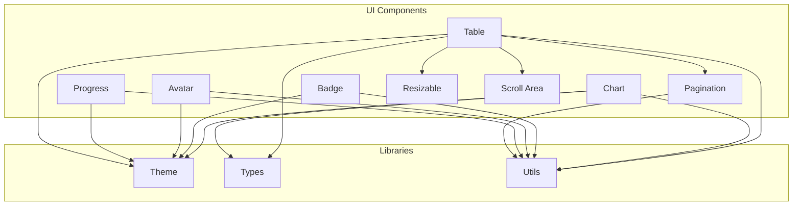
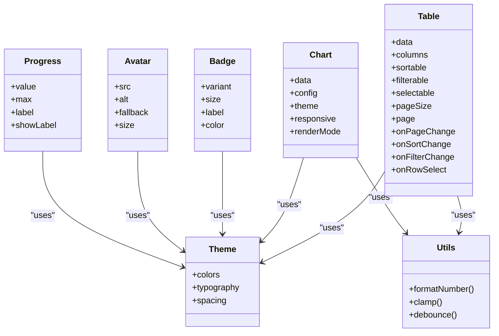
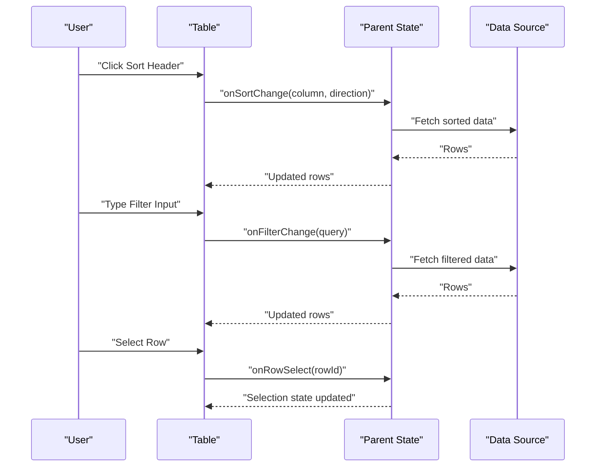
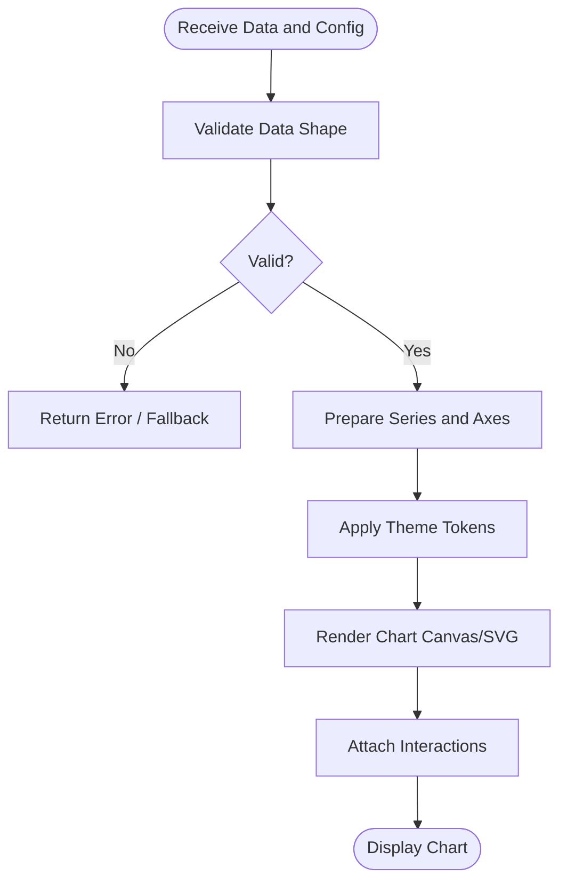
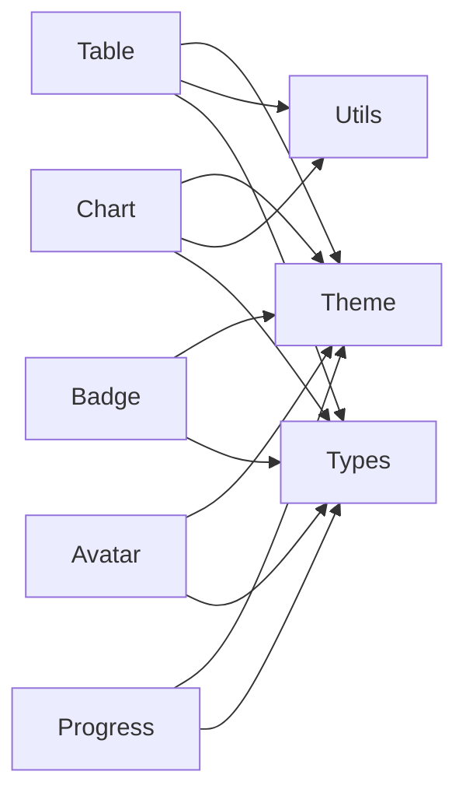

# Data Display Components

<cite>
**Referenced Files in This Document**
- [table.tsx](file://src/components/ui/table.tsx)
- [chart.tsx](file://src/components/ui/chart.tsx)
- [badge.tsx](file://src/components/ui/badge.tsx)
- [avatar.tsx](file://src/components/ui/avatar.tsx)
- [progress.tsx](file://src/components/ui/progress.tsx)
- [pagination.tsx](file://src/components/ui/pagination.tsx)
- [resizable.tsx](file://src/components/ui/resizable.tsx)
- [scroll-area.tsx](file://src/components/ui/scroll-area.tsx)
- [theme.tsx](file://src/lib/theme.tsx)
- [types.ts](file://src/lib/types.ts)
- [utils.ts](file://src/lib/utils.ts)
</cite>

## Table of Contents
1. [Introduction](#introduction)
2. [Project Structure](#project-structure)
3. [Core Components](#core-components)
4. [Architecture Overview](#architecture-overview)
5. [Detailed Component Analysis](#detailed-component-analysis)
6. [Dependency Analysis](#dependency-analysis)
7. [Performance Considerations](#performance-considerations)
8. [Troubleshooting Guide](#troubleshooting-guide)
9. [Conclusion](#conclusion)
10. [Appendices](#appendices)

## Introduction
This document provides comprehensive documentation for data display components: Table, Chart, Badge, Avatar, and Progress. It covers prop interfaces for data binding, sorting, filtering, pagination, chart configuration options, data formats, themes, table features such as column resizing, row selection, virtual scrolling, responsive layouts, and performance optimization techniques for large datasets. The goal is to enable both new and experienced developers to implement robust, accessible, and performant data presentations across the application.

## Project Structure
The data display components are implemented as reusable UI primitives under src/components/ui. Supporting utilities and theming live under src/lib. Pagination and scroll areas complement the core components for advanced data presentation patterns.

**Diagram sources**
- [table.tsx](file://src/components/ui/table.tsx)
- [chart.tsx](file://src/components/ui/chart.tsx)
- [badge.tsx](file://src/components/ui/badge.tsx)
- [avatar.tsx](file://src/components/ui/avatar.tsx)
- [progress.tsx](file://src/components/ui/progress.tsx)
- [pagination.tsx](file://src/components/ui/pagination.tsx)
- [resizable.tsx](file://src/components/ui/resizable.tsx)
- [scroll-area.tsx](file://src/components/ui/scroll-area.tsx)
- [theme.tsx](file://src/lib/theme.tsx)
- [types.ts](file://src/lib/types.ts)
- [utils.ts](file://src/lib/utils.ts)

**Section sources**
- [table.tsx](file://src/components/ui/table.tsx)
- [chart.tsx](file://src/components/ui/chart.tsx)
- [badge.tsx](file://src/components/ui/badge.tsx)
- [avatar.tsx](file://src/components/ui/avatar.tsx)
- [progress.tsx](file://src/components/ui/progress.tsx)
- [pagination.tsx](file://src/components/ui/pagination.tsx)
- [resizable.tsx](file://src/components/ui/resizable.tsx)
- [scroll-area.tsx](file://src/components/ui/scroll-area.tsx)
- [theme.tsx](file://src/lib/theme.tsx)
- [types.ts](file://src/lib/types.ts)
- [utils.ts](file://src/lib/utils.ts)

## Core Components
- Table: A flexible, accessible table with optional column resizing, row selection, and integration with pagination and scroll areas. Supports sorting and filtering via props or composition with hooks.
- Chart: A declarative chart component that accepts typed data and configuration objects, integrates with theme tokens, and supports responsive sizing.
- Badge: A small status indicator supporting variants, sizes, and semantic roles.
- Avatar: An image-based identity component with fallbacks, initials, and size variants.
- Progress: A linear progress indicator with value, max, and label support, themed consistently.

These components are designed to be composed together to build complex data views while maintaining accessibility and performance.

**Section sources**
- [table.tsx](file://src/components/ui/table.tsx)
- [chart.tsx](file://src/components/ui/chart.tsx)
- [badge.tsx](file://src/components/ui/badge.tsx)
- [avatar.tsx](file://src/components/ui/avatar.tsx)
- [progress.tsx](file://src/components/ui/progress.tsx)

## Architecture Overview
The data display layer follows a clear separation of concerns:
- Presentation components (Table, Chart, Badge, Avatar, Progress) handle rendering and user interactions.
- Theming (theme.tsx) centralizes color tokens, typography, and spacing.
- Utilities (utils.ts) provide shared helpers for formatting, validation, and common logic.
- Types (types.ts) define shared interfaces for data models and component props.
- Pagination and Scroll Area assist with large dataset handling and navigation.

**Diagram sources**
- [table.tsx](file://src/components/ui/table.tsx)
- [chart.tsx](file://src/components/ui/chart.tsx)
- [badge.tsx](file://src/components/ui/badge.tsx)
- [avatar.tsx](file://src/components/ui/avatar.tsx)
- [progress.tsx](file://src/components/ui/progress.tsx)
- [theme.tsx](file://src/lib/theme.tsx)
- [utils.ts](file://src/lib/utils.ts)

## Detailed Component Analysis

### Table Component
The Table component provides a foundation for presenting tabular data with advanced capabilities:
- Data binding: Accepts an array of rows and a columns definition. Each column can specify accessor functions, formatters, and alignment.
- Sorting: Enable per-column sorting via a sortable flag; sort state is managed through controlled props and callbacks.
- Filtering: Supports text-based filters on columns; filter state is exposed via props and callbacks.
- Pagination: Integrates with pageSize and page props; use Pagination component for navigation controls.
- Column resizing: Compose with Resizable to allow dynamic column width adjustments.
- Row selection: Controlled selection state with onRowSelect callback; supports single or multi-select patterns.
- Virtual scrolling: Combine with Scroll Area for large datasets; consider windowed rendering strategies at the consumer level.

Key behaviors:
- Accessibility: Uses semantic HTML elements and ARIA attributes for keyboard navigation and screen readers.
- Performance: Avoid unnecessary re-renders by memoizing column definitions and row renderers where appropriate.
- Responsiveness: Use responsive breakpoints to adjust layout and hide non-essential columns on smaller screens.

Common usage patterns:
- Controlled data flow: Pass data, sorting, filtering, and pagination state from parent components; update via callbacks.
- Custom cell renderers: Provide render functions in column definitions for rich content like badges, avatars, or progress indicators.
- Debounced search: Integrate input fields with debounced handlers to reduce frequent updates during typing.

**Section sources**
- [table.tsx](file://src/components/ui/table.tsx)
- [resizable.tsx](file://src/components/ui/resizable.tsx)
- [pagination.tsx](file://src/components/ui/pagination.tsx)
- [scroll-area.tsx](file://src/components/ui/scroll-area.tsx)
- [types.ts](file://src/lib/types.ts)
- [utils.ts](file://src/lib/utils.ts)

#### Table Interaction Flow

**Diagram sources**
- [table.tsx](file://src/components/ui/table.tsx)
- [pagination.tsx](file://src/components/ui/pagination.tsx)

### Chart Component
The Chart component renders visualizations based on declarative configuration:
- Data format: Accepts structured arrays of series with labels and values; supports multiple series and stacked or grouped modes.
- Configuration: Options include chart type, axes, legends, tooltips, colors, and animations.
- Theming: Integrates with theme tokens for consistent colors and typography.
- Responsiveness: Adapts to container size; supports aspect ratio constraints and responsive breakpoints.
- Interactivity: Optional hover states, click handlers, and zoom/pan if enabled by configuration.

Best practices:
- Normalize data before passing to Chart to ensure consistent shapes and types.
- Memoize configuration objects to avoid unnecessary re-renders.
- Use lazy loading for heavy charts when data is large or computed.

**Section sources**
- [chart.tsx](file://src/components/ui/chart.tsx)
- [theme.tsx](file://src/lib/theme.tsx)
- [types.ts](file://src/lib/types.ts)
- [utils.ts](file://src/lib/utils.ts)

#### Chart Rendering Flow

**Diagram sources**
- [chart.tsx](file://src/components/ui/chart.tsx)
- [utils.ts](file://src/lib/utils.ts)

### Badge Component
Badge displays concise status information:
- Props: variant (e.g., default, success, warning), size (sm, md, lg), label text, and optional color overrides.
- Semantics: Uses appropriate ARIA roles and labels for accessibility.
- Composition: Often used within tables or lists to indicate state or category.

Usage tips:
- Keep labels short and meaningful.
- Ensure sufficient contrast against backgrounds.
- Use consistent variants across the application for predictable meaning.

**Section sources**
- [badge.tsx](file://src/components/ui/badge.tsx)
- [theme.tsx](file://src/lib/theme.tsx)
- [utils.ts](file://src/lib/utils.ts)

### Avatar Component
Avatar represents users or entities visually:
- Props: src for image, alt text, fallback content (initials or icon), and size variants.
- Behavior: Gracefully handles missing images by showing fallback content.
- Accessibility: Proper alt text and role attributes for screen readers.

Recommendations:
- Provide meaningful alt text or initials fallbacks.
- Use consistent sizes aligned with design tokens.
- Optimize image assets for performance.

**Section sources**
- [avatar.tsx](file://src/components/ui/avatar.tsx)
- [theme.tsx](file://src/lib/theme.tsx)
- [utils.ts](file://src/lib/utils.ts)

### Progress Component
Progress indicates completion or load status:
- Props: value, max, label, and showLabel toggle.
- Semantics: Accessible progress bar with aria attributes.
- Theming: Colors and typography align with theme tokens.

Guidelines:
- Update value incrementally for smooth UX.
- Provide descriptive labels for context.
- Avoid blocking the main thread during long operations.

**Section sources**
- [progress.tsx](file://src/components/ui/progress.tsx)
- [theme.tsx](file://src/lib/theme.tsx)
- [utils.ts](file://src/lib/utils.ts)

## Dependency Analysis
Components rely on shared libraries for consistency and efficiency:
- Theme: Centralized tokens for colors, typography, and spacing.
- Utils: Common functions for formatting, validation, and performance helpers.
- Types: Shared interfaces ensuring consistent prop contracts.

**Diagram sources**
- [table.tsx](file://src/components/ui/table.tsx)
- [chart.tsx](file://src/components/ui/chart.tsx)
- [badge.tsx](file://src/components/ui/badge.tsx)
- [avatar.tsx](file://src/components/ui/avatar.tsx)
- [progress.tsx](file://src/components/ui/progress.tsx)
- [theme.tsx](file://src/lib/theme.tsx)
- [utils.ts](file://src/lib/utils.ts)
- [types.ts](file://src/lib/types.ts)

**Section sources**
- [theme.tsx](file://src/lib/theme.tsx)
- [utils.ts](file://src/lib/utils.ts)
- [types.ts](file://src/lib/types.ts)

## Performance Considerations
- Large datasets:
  - Use pagination to limit visible rows.
  - Implement virtual scrolling with Scroll Area for very large lists.
  - Debounce search inputs and API calls to reduce churn.
- Rendering efficiency:
  - Memoize expensive computations and column definitions.
  - Avoid creating new objects on every render; reuse configurations.
- Memory management:
  - Clean up event listeners and timers in component lifecycle.
  - Release references to large data structures when unmounted.
- Network optimization:
  - Cache responses where appropriate.
  - Use incremental loading for charts with many data points.

[No sources needed since this section provides general guidance]

## Troubleshooting Guide
Common issues and resolutions:
- Table not updating:
  - Ensure controlled props are correctly passed and callbacks are invoked.
  - Verify data shape matches expected types.
- Chart not rendering:
  - Validate data structure and series configuration.
  - Check theme tokens availability and container dimensions.
- Badge or Avatar misalignment:
  - Confirm size variants and CSS classes applied.
  - Inspect alt text and fallback content.
- Progress stuck:
  - Verify value updates and max bounds.
  - Ensure label visibility settings match expectations.

Debugging steps:
- Log prop changes to confirm updates.
- Use browser dev tools to inspect rendered DOM and ARIA attributes.
- Test with minimal data sets to isolate issues.

**Section sources**
- [table.tsx](file://src/components/ui/table.tsx)
- [chart.tsx](file://src/components/ui/chart.tsx)
- [badge.tsx](file://src/components/ui/badge.tsx)
- [avatar.tsx](file://src/components/ui/avatar.tsx)
- [progress.tsx](file://src/components/ui/progress.tsx)

## Conclusion
The data display components provide a cohesive, accessible, and performant foundation for building rich data interfaces. By leveraging their prop interfaces, composability, and integration with theming and utilities, developers can create responsive layouts, handle large datasets efficiently, and deliver consistent user experiences across the application.

[No sources needed since this section summarizes without analyzing specific files]

## Appendices

### Example Patterns
- Complex data presentation:
  - Combine Table with Badge for status, Avatar for user representation, and Progress for metrics within cells.
  - Use Chart alongside Table to visualize aggregated data derived from table selections.
- Responsive layouts:
  - Hide secondary columns on small screens using responsive conditions.
  - Switch Chart rendering mode based on container width.
- Performance optimization:
  - Implement server-side pagination and filtering for large datasets.
  - Use virtualization for extremely long lists.

[No sources needed since this section provides conceptual examples]