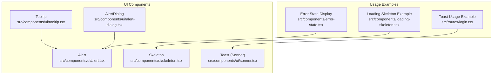
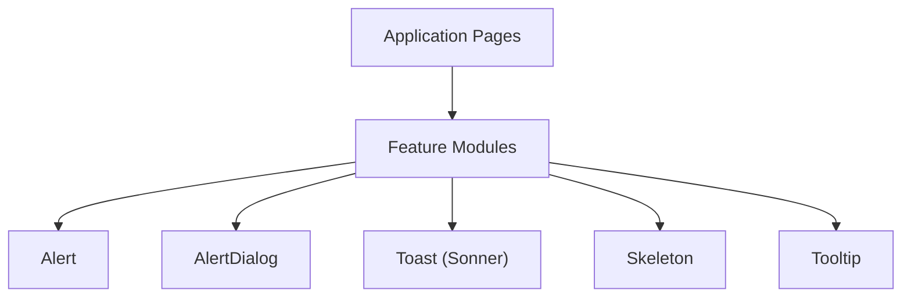
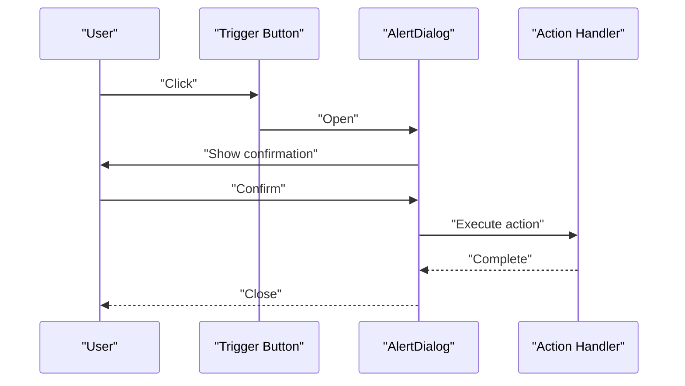
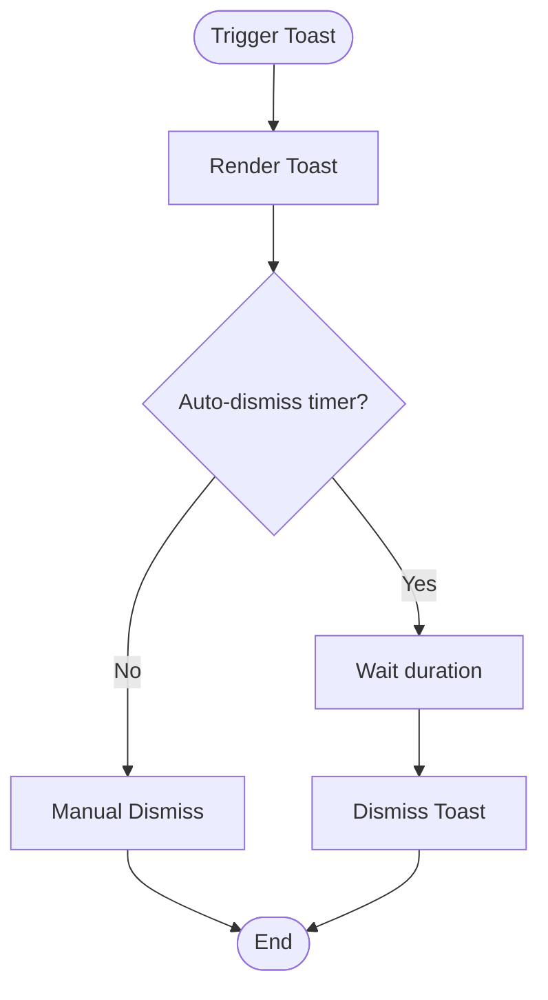
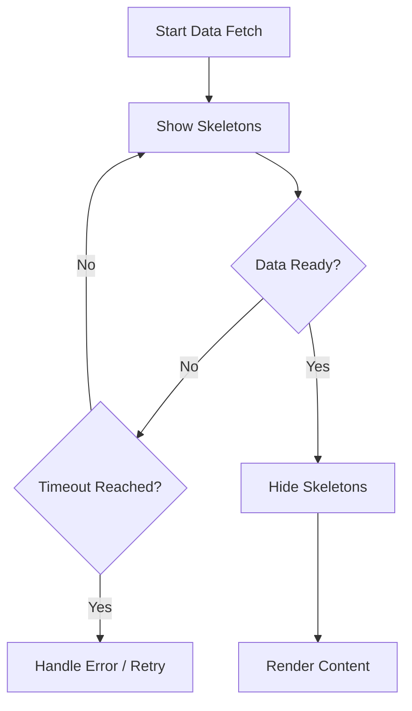
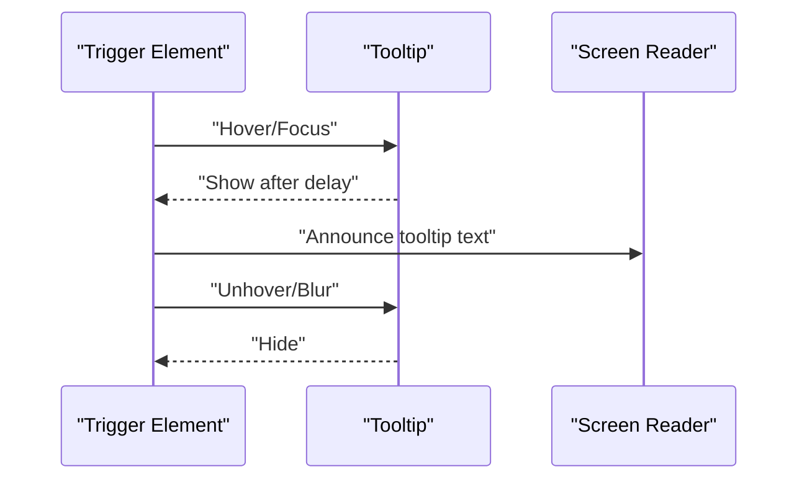
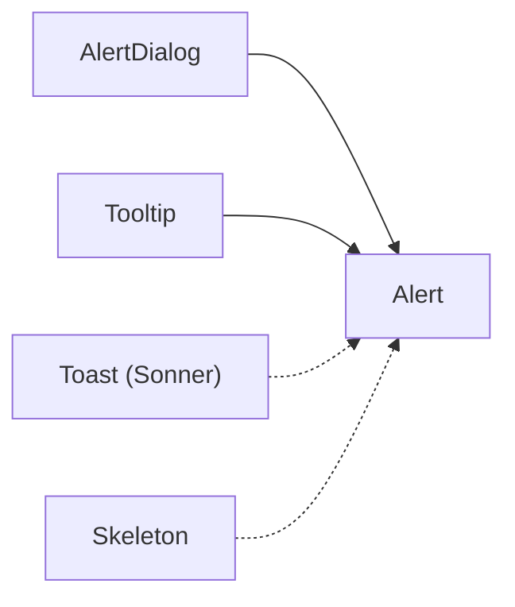

# Feedback Components

<cite>
**Referenced Files in This Document**
- [alert.tsx](file://src/components/ui/alert.tsx)
- [alert-dialog.tsx](file://src/components/ui/alert-dialog.tsx)
- [skeleton.tsx](file://src/components/ui/skeleton.tsx)
- [tooltip.tsx](file://src/components/ui/tooltip.tsx)
- [sonner.tsx](file://src/components/ui/sonner.tsx)
- [loading-skeleton.tsx](file://src/components/loading-skeleton.tsx)
- [error-state.tsx](file://src/components/error-state.tsx)
- [toast-example.tsx](file://src/routes/login.tsx)
</cite>

## Table of Contents
1. [Introduction](#introduction)
2. [Project Structure](#project-structure)
3. [Core Components](#core-components)
4. [Architecture Overview](#architecture-overview)
5. [Detailed Component Analysis](#detailed-component-analysis)
6. [Dependency Analysis](#dependency-analysis)
7. [Performance Considerations](#performance-considerations)
8. [Troubleshooting Guide](#troubleshooting-guide)
9. [Conclusion](#conclusion)
10. [Appendices](#appendices)

## Introduction
This document provides comprehensive documentation for the feedback components used across the application: Alert, AlertDialog, Toast (via Sonner), Skeleton, and Tooltip. It explains notification patterns, timing controls, stacking behaviors, loading states, error handling displays, user confirmation flows, contextual feedback, automated notifications, accessibility considerations, internationalization support, and custom styling options. The goal is to help developers implement consistent, accessible, and user-friendly feedback experiences.

## Project Structure
The feedback-related UI components are implemented under src/components/ui and are composed with higher-level usage examples in routes and shared components. Key files include:
- Alert: src/components/ui/alert.tsx
- AlertDialog: src/components/ui/alert-dialog.tsx
- Skeleton: src/components/ui/skeleton.tsx
- Tooltip: src/components/ui/tooltip.tsx
- Toast (Sonner): src/components/ui/sonner.tsx
- Loading skeleton example: src/components/loading-skeleton.tsx
- Error state display: src/components/error-state.tsx
- Toast usage example: src/routes/login.tsx

**Diagram sources**
- [alert.tsx](file://src/components/ui/alert.tsx)
- [alert-dialog.tsx](file://src/components/ui/alert-dialog.tsx)
- [skeleton.tsx](file://src/components/ui/skeleton.tsx)
- [tooltip.tsx](file://src/components/ui/tooltip.tsx)
- [sonner.tsx](file://src/components/ui/sonner.tsx)
- [loading-skeleton.tsx](file://src/components/loading-skeleton.tsx)
- [error-state.tsx](file://src/components/error-state.tsx)
- [toast-example.tsx](file://src/routes/login.tsx)

**Section sources**
- [alert.tsx](file://src/components/ui/alert.tsx)
- [alert-dialog.tsx](file://src/components/ui/alert-dialog.tsx)
- [skeleton.tsx](file://src/components/ui/skeleton.tsx)
- [tooltip.tsx](file://src/components/ui/tooltip.tsx)
- [sonner.tsx](file://src/components/ui/sonner.tsx)
- [loading-skeleton.tsx](file://src/components/loading-skeleton.tsx)
- [error-state.tsx](file://src/components/error-state.tsx)
- [toast-example.tsx](file://src/routes/login.tsx)

## Core Components
This section summarizes each feedback component’s purpose, typical usage patterns, and key configuration aspects.

- Alert
  - Purpose: Inline contextual messages for success, warning, or error states within content areas.
  - Typical usage: Rendered near form fields, sections, or as banners to inform users about outcomes or issues.
  - Customization: Variants and styles can be adjusted via props or theme tokens.
  - Accessibility: Use appropriate roles and aria attributes to convey meaning to assistive technologies.

- AlertDialog
  - Purpose: Modal dialog for confirmations, destructive actions, or important notices requiring explicit user interaction.
  - Typical usage: Wraps critical operations like delete or logout; ensures focus management and keyboard navigation.
  - Behavior: Blocks background interaction until resolved; supports cancel/confirm flows.
  - Accessibility: Focus trap, proper role and labels, and escape-to-close behavior.

- Toast (Sonner)
  - Purpose: Non-blocking, transient notifications that appear without interrupting workflow.
  - Timing controls: Auto-dismiss after a configurable duration; can be manually dismissed.
  - Stacking: Multiple toasts stack vertically; positioning can be configured.
  - Types: Success, info, warning, error variants to communicate status clearly.

- Skeleton
  - Purpose: Placeholder shapes indicating loading states while data is being fetched.
  - Usage: Replace heavy content during async operations to improve perceived performance.
  - Styling: Can be themed and sized to match layout expectations.

- Tooltip
  - Purpose: Contextual hints shown on hover or focus to provide additional information.
  - Timing: Delayed appearance to avoid flicker; dismisses when pointer leaves or focus moves away.
  - Accessibility: Proper labeling and focus behavior for keyboard users.

**Section sources**
- [alert.tsx](file://src/components/ui/alert.tsx)
- [alert-dialog.tsx](file://src/components/ui/alert-dialog.tsx)
- [skeleton.tsx](file://src/components/ui/skeleton.tsx)
- [tooltip.tsx](file://src/components/ui/tooltip.tsx)
- [sonner.tsx](file://src/components/ui/sonner.tsx)

## Architecture Overview
Feedback components follow a layered architecture:
- Low-level primitives: Alert, AlertDialog, Skeleton, Tooltip define visual and behavioral contracts.
- Notification layer: Toast (Sonner) provides global, non-blocking notifications.
- Composition: Higher-level pages and features compose these primitives to deliver consistent UX.

[No sources needed since this diagram shows conceptual architecture]

## Detailed Component Analysis

### Alert
- Role: Inline contextual feedback for immediate context awareness.
- Patterns:
  - Success: Confirm completed actions.
  - Warning: Cautionary guidance before risky operations.
  - Error: Inform about failures and next steps.
- Timing: Persistent until dismissed by user or replaced by new message.
- Stacking: Typically single instance per region; multiple alerts should be grouped logically.
- Accessibility:
  - Use semantic roles and aria-live regions where appropriate.
  - Ensure sufficient color contrast and clear icons/text.
- Internationalization:
  - Provide localized strings via i18n keys rather than hard-coded text.
- Custom styling:
  - Adjust variant styles through theme tokens or component props.

**Section sources**
- [alert.tsx](file://src/components/ui/alert.tsx)
- [error-state.tsx](file://src/components/error-state.tsx)

### AlertDialog
- Role: Modal confirmation dialogs for critical user decisions.
- Flow:
  - Trigger opens dialog and traps focus.
  - User selects Cancel or Confirm.
  - On Confirm, execute action and close dialog.
- Timing: Remains open until explicitly closed.
- Stacking: Single modal at a time; nested modals discouraged.
- Accessibility:
  - Focus trap, Escape to close, proper role and labels.
  - Announce dialog title and description to screen readers.
- Internationalization:
  - Localize titles, descriptions, and button labels.
- Custom styling:
  - Theme-aware variants for emphasis and brand consistency.

**Diagram sources**
- [alert-dialog.tsx](file://src/components/ui/alert-dialog.tsx)

**Section sources**
- [alert-dialog.tsx](file://src/components/ui/alert-dialog.tsx)

### Toast (Sonner)
- Role: Global, transient notifications that do not block user flow.
- Timing controls:
  - Auto-dismiss after a specified duration.
  - Manual dismissal via close control.
- Stacking behavior:
  - Multiple toasts stack vertically.
  - Positioning can be configured (e.g., top-right).
- Types:
  - Success, info, warning, error to communicate status clearly.
- Automation:
  - Trigger from API responses or side effects.
- Accessibility:
  - Use aria-live to announce updates.
  - Ensure keyboard operability and readable content.
- Internationalization:
  - Localize messages and titles.
- Custom styling:
  - Theme-based variants and spacing.

**Diagram sources**
- [sonner.tsx](file://src/components/ui/sonner.tsx)

**Section sources**
- [sonner.tsx](file://src/components/ui/sonner.tsx)
- [toast-example.tsx](file://src/routes/login.tsx)

### Skeleton
- Role: Visual placeholders during loading to reduce perceived latency.
- Patterns:
  - Text blocks, image placeholders, list items.
  - Animated shimmer optional for emphasis.
- Timing:
  - Hide skeletons once data arrives.
  - Avoid showing skeletons indefinitely; handle timeouts.
- Accessibility:
  - Do not use skeletons for meaningful content; they are purely decorative.
  - Ensure real content replaces them promptly.
- Custom styling:
  - Size and shape customization to match layout.

**Diagram sources**
- [skeleton.tsx](file://src/components/ui/skeleton.tsx)
- [loading-skeleton.tsx](file://src/components/loading-skeleton.tsx)

**Section sources**
- [skeleton.tsx](file://src/components/ui/skeleton.tsx)
- [loading-skeleton.tsx](file://src/components/loading-skeleton.tsx)

### Tooltip
- Role: Contextual hints for additional information.
- Timing:
  - Delayed show/hide to prevent flicker.
- Placement:
  - Top, bottom, left, right relative to trigger.
- Accessibility:
  - Associate label with trigger element.
  - Support keyboard focus and escape to dismiss.
- Internationalization:
  - Localize tooltip text.
- Custom styling:
  - Theme-aware colors and typography.

**Diagram sources**
- [tooltip.tsx](file://src/components/ui/tooltip.tsx)

**Section sources**
- [tooltip.tsx](file://src/components/ui/tooltip.tsx)

## Dependency Analysis
Feedback components are designed to be composable and minimally coupled:
- AlertDialog depends on Alert-like semantics for messaging but adds modal behavior.
- Toast (Sonner) operates globally and does not depend on local state.
- Skeleton and Tooltip are standalone primitives used widely across features.

**Diagram sources**
- [alert.tsx](file://src/components/ui/alert.tsx)
- [alert-dialog.tsx](file://src/components/ui/alert-dialog.tsx)
- [tooltip.tsx](file://src/components/ui/tooltip.tsx)
- [sonner.tsx](file://src/components/ui/sonner.tsx)
- [skeleton.tsx](file://src/components/ui/skeleton.tsx)

**Section sources**
- [alert.tsx](file://src/components/ui/alert.tsx)
- [alert-dialog.tsx](file://src/components/ui/alert-dialog.tsx)
- [tooltip.tsx](file://src/components/ui/tooltip.tsx)
- [sonner.tsx](file://src/components/ui/sonner.tsx)
- [skeleton.tsx](file://src/components/ui/skeleton.tsx)

## Performance Considerations
- Prefer lightweight skeletons over heavy loaders to maintain responsiveness.
- Limit concurrent toasts to avoid overwhelming users; consider grouping related notifications.
- Debounce rapid toast triggers to prevent excessive re-renders.
- Ensure tooltips have minimal DOM overhead and hide promptly on pointer leave.
- Avoid long-running blocking operations behind modals; provide cancellation options.

[No sources needed since this section provides general guidance]

## Troubleshooting Guide
Common issues and resolutions:
- Alerts not announced by screen readers
  - Ensure proper roles and aria-live regions are applied.
- AlertDialog focus not trapped
  - Verify focus trap implementation and keyboard handlers.
- Toasts not auto-dismissing
  - Check timer configuration and ensure unmount cleanup.
- Skeletons persisting after load
  - Add timeout handling and fallback error states.
- Tooltips flickering
  - Increase show/hide delays and ensure pointer/focus events are handled correctly.

**Section sources**
- [alert.tsx](file://src/components/ui/alert.tsx)
- [alert-dialog.tsx](file://src/components/ui/alert-dialog.tsx)
- [sonner.tsx](file://src/components/ui/sonner.tsx)
- [skeleton.tsx](file://src/components/ui/skeleton.tsx)
- [tooltip.tsx](file://src/components/ui/tooltip.tsx)

## Conclusion
By consistently applying Alert, AlertDialog, Toast (Sonner), Skeleton, and Tooltip, the application delivers clear, accessible, and responsive feedback. Adhering to the patterns, timing controls, stacking behaviors, and accessibility guidelines outlined here will enhance user experience and maintainability.

[No sources needed since this section summarizes without analyzing specific files]

## Appendices

### Notification Patterns
- Contextual feedback: Use Alert near relevant content.
- Automated notifications: Use Toast for system-wide updates.
- Confirmation flows: Use AlertDialog for destructive or critical actions.

### Timing Controls
- Alert: Persistent until dismissed.
- Toast: Configurable auto-dismiss and manual close.
- Tooltip: Delayed show/hide to reduce flicker.
- Skeleton: Hide upon data availability or timeout.

### Stacking Behaviors
- Toast: Vertical stacking with controlled position.
- Alert: Grouped within regions; avoid overlapping.
- AlertDialog: Single modal at a time.

### Accessibility Considerations
- Use semantic roles and aria attributes.
- Ensure keyboard navigation and focus management.
- Provide sufficient contrast and descriptive labels.

### Internationalization Support
- Externalize all user-facing strings into i18n keys.
- Localize titles, messages, and button labels across components.

### Custom Styling Options
- Leverage theme tokens for consistent branding.
- Adjust variant styles via component props or theme overrides.

**Section sources**
- [alert.tsx](file://src/components/ui/alert.tsx)
- [alert-dialog.tsx](file://src/components/ui/alert-dialog.tsx)
- [sonner.tsx](file://src/components/ui/sonner.tsx)
- [skeleton.tsx](file://src/components/ui/skeleton.tsx)
- [tooltip.tsx](file://src/components/ui/tooltip.tsx)