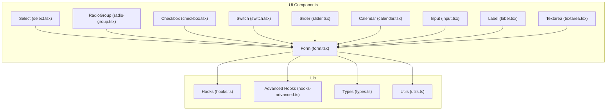
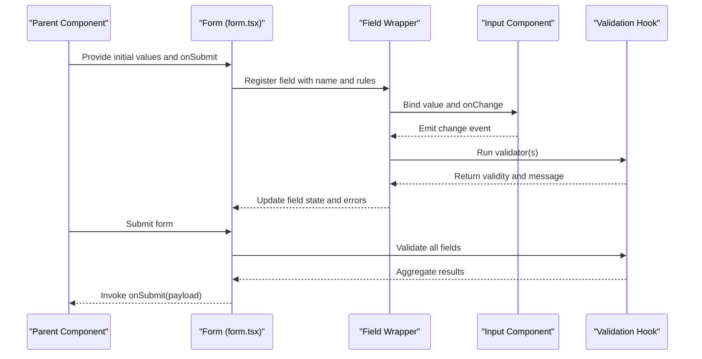
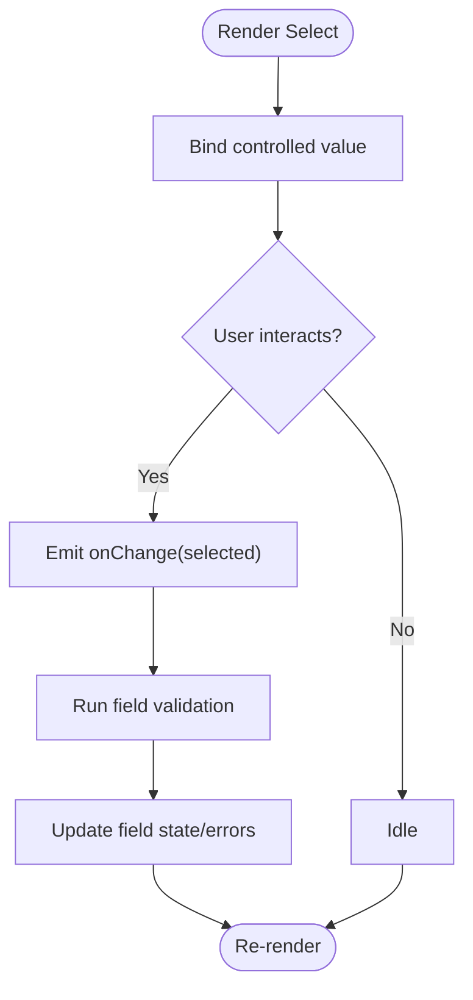
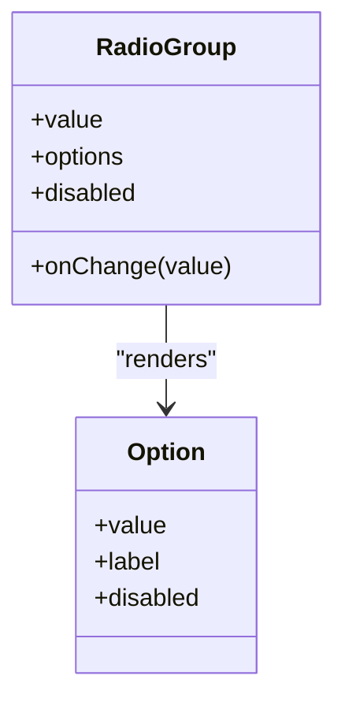
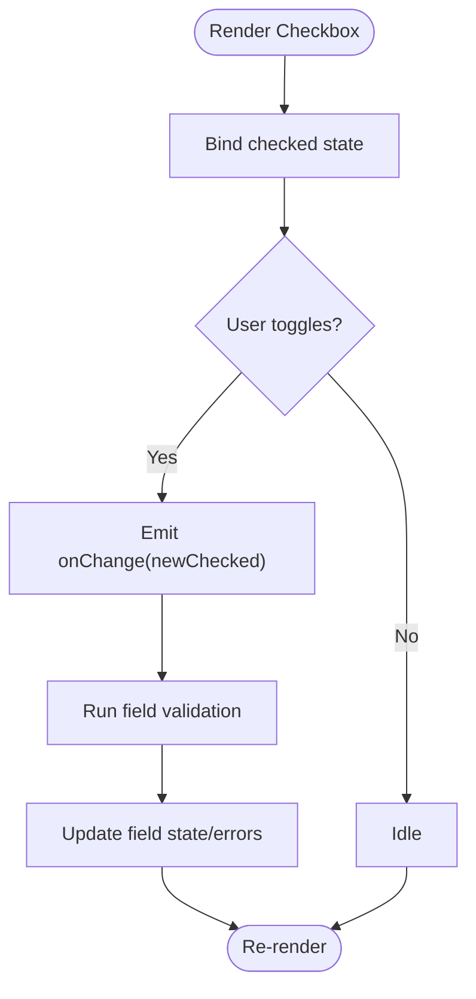
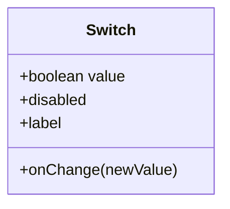
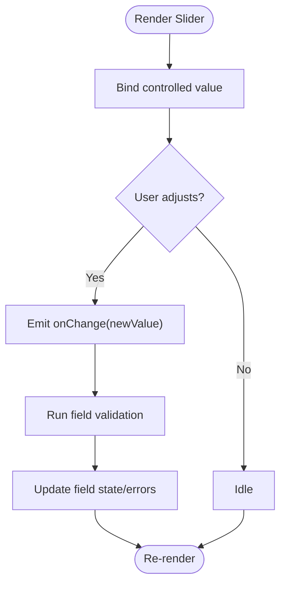
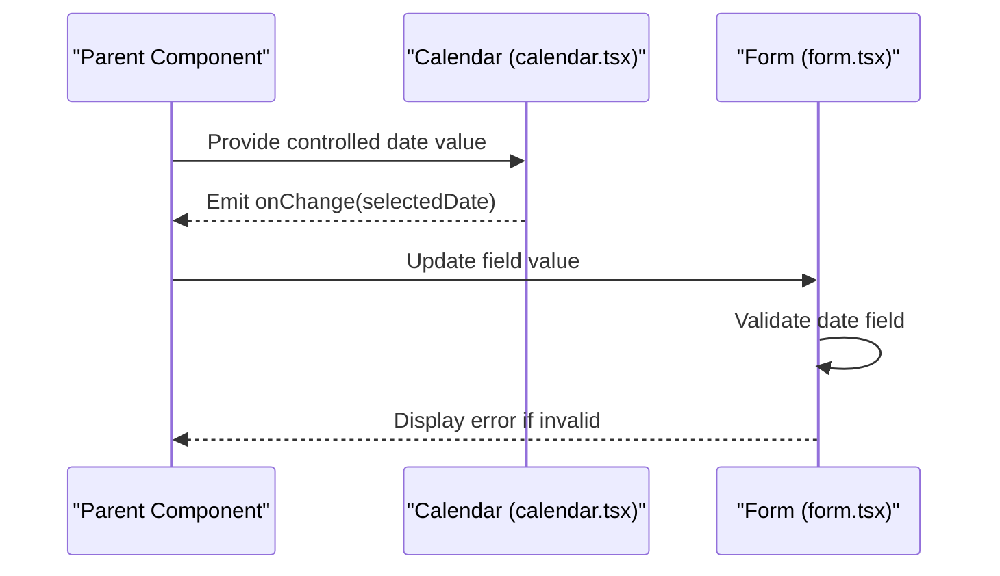
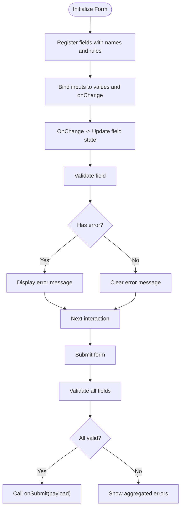
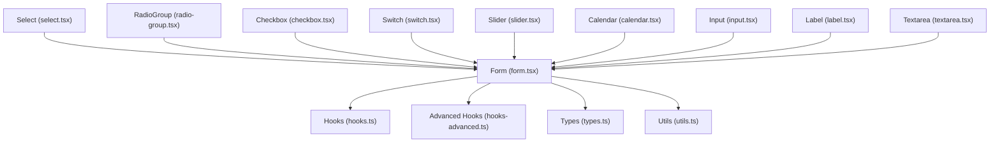

# Form Components

<cite>
**Referenced Files in This Document**
- [select.tsx](file://src/components/ui/select.tsx)
- [radio-group.tsx](file://src/components/ui/radio-group.tsx)
- [checkbox.tsx](file://src/components/ui/checkbox.tsx)
- [switch.tsx](file://src/components/ui/switch.tsx)
- [slider.tsx](file://src/components/ui/slider.tsx)
- [calendar.tsx](file://src/components/ui/calendar.tsx)
- [form.tsx](file://src/components/ui/form.tsx)
- [input.tsx](file://src/components/ui/input.tsx)
- [label.tsx](file://src/components/ui/label.tsx)
- [textarea.tsx](file://src/components/ui/textarea.tsx)
- [hooks.ts](file://src/lib/hooks.ts)
- [hooks-advanced.ts](file://src/lib/hooks-advanced.ts)
- [types.ts](file://src/lib/types.ts)
- [utils.ts](file://src/lib/utils.ts)
</cite>

## Table of Contents
1. [Introduction](#introduction)
2. [Project Structure](#project-structure)
3. [Core Components](#core-components)
4. [Architecture Overview](#architecture-overview)
5. [Detailed Component Analysis](#detailed-component-analysis)
6. [Dependency Analysis](#dependency-analysis)
7. [Performance Considerations](#performance-considerations)
8. [Troubleshooting Guide](#troubleshooting-guide)
9. [Conclusion](#conclusion)
10. [Appendices](#appendices)

## Introduction
This document provides comprehensive documentation for form input components including Select, RadioGroup, Checkbox, Switch, Slider, and Calendar. It explains how these components integrate with the form system, supports both controlled and uncontrolled patterns, and covers accessibility features. It also details data binding, event handling, state management strategies, complex form layouts, custom validators, internationalization support, performance optimization for large forms, and mobile input experiences.

## Project Structure
The form-related UI components are implemented under src/components/ui. The form orchestration utilities and shared hooks live under src/lib. The following diagram shows the high-level structure relevant to form inputs:

**Diagram sources**
- [select.tsx](file://src/components/ui/select.tsx)
- [radio-group.tsx](file://src/components/ui/radio-group.tsx)
- [checkbox.tsx](file://src/components/ui/checkbox.tsx)
- [switch.tsx](file://src/components/ui/switch.tsx)
- [slider.tsx](file://src/components/ui/slider.tsx)
- [calendar.tsx](file://src/components/ui/calendar.tsx)
- [form.tsx](file://src/components/ui/form.tsx)
- [input.tsx](file://src/components/ui/input.tsx)
- [label.tsx](file://src/components/ui/label.tsx)
- [textarea.tsx](file://src/components/ui/textarea.tsx)
- [hooks.ts](file://src/lib/hooks.ts)
- [hooks-advanced.ts](file://src/lib/hooks-advanced.ts)
- [types.ts](file://src/lib/types.ts)
- [utils.ts](file://src/lib/utils.ts)

**Section sources**
- [select.tsx](file://src/components/ui/select.tsx)
- [radio-group.tsx](file://src/components/ui/radio-group.tsx)
- [checkbox.tsx](file://src/components/ui/checkbox.tsx)
- [switch.tsx](file://src/components/ui/switch.tsx)
- [slider.tsx](file://src/components/ui/slider.tsx)
- [calendar.tsx](file://src/components/ui/calendar.tsx)
- [form.tsx](file://src/components/ui/form.tsx)
- [input.tsx](file://src/components/ui/input.tsx)
- [label.tsx](file://src/components/ui/label.tsx)
- [textarea.tsx](file://src/components/ui/textarea.tsx)
- [hooks.ts](file://src/lib/hooks.ts)
- [hooks-advanced.ts](file://src/lib/hooks-advanced.ts)
- [types.ts](file://src/lib/types.ts)
- [utils.ts](file://src/lib/utils.ts)

## Core Components
This section summarizes each form component’s purpose, props, events, and integration points.

- Select
  - Purpose: Dropdown selection from a list of options.
  - Key behaviors: Controlled value via prop; onChange updates parent state; keyboard navigation and focus management; accessible label association.
  - Integration: Works with Form field wrappers to bind values and validation messages.

- RadioGroup
  - Purpose: Single-choice selection among multiple radio options.
  - Key behaviors: Grouped value control; onChange emits selected value; accessible role and aria attributes; label association per option.
  - Integration: Integrates with Form field bindings and validation.

- Checkbox
  - Purpose: Binary or multi-select toggle.
  - Key behaviors: Controlled checked state; onChange toggles value; accessible label and aria-checked; supports indeterminate state if needed.
  - Integration: Binds to form fields and validation rules.

- Switch
  - Purpose: Toggle on/off control.
  - Key behaviors: Controlled boolean value; onChange emits updated boolean; accessible label and aria-pressed; keyboard activation.
  - Integration: Works within Form contexts for validation and submission.

- Slider
  - Purpose: Numeric range selection.
  - Key behaviors: Controlled value and optional min/max/step; onChange emits new value; accessible aria-valuenow/min/max/step; visual feedback.
  - Integration: Binds to numeric form fields and validation.

- Calendar
  - Purpose: Date selection interface.
  - Key behaviors: Controlled date value; onChange emits selected date; accessible labels and navigation; locale-aware formatting when provided by parent.
  - Integration: Binds to date fields and validation.

- Form
  - Purpose: Orchestrates field registration, validation, submission, and error display.
  - Key behaviors: Provides field context for inputs; exposes submit handlers; aggregates errors; supports async validation.
  - Integration: Consumes hooks and types from lib.

- Input, Label, Textarea
  - Purpose: Standard text entry primitives.
  - Key behaviors: Controlled value and onChange; label association; accessible attributes; consistent styling.
  - Integration: Used within Form fields and validation flows.

**Section sources**
- [select.tsx](file://src/components/ui/select.tsx)
- [radio-group.tsx](file://src/components/ui/radio-group.tsx)
- [checkbox.tsx](file://src/components/ui/checkbox.tsx)
- [switch.tsx](file://src/components/ui/switch.tsx)
- [slider.tsx](file://src/components/ui/slider.tsx)
- [calendar.tsx](file://src/components/ui/calendar.tsx)
- [form.tsx](file://src/components/ui/form.tsx)
- [input.tsx](file://src/components/ui/input.tsx)
- [label.tsx](file://src/components/ui/label.tsx)
- [textarea.tsx](file://src/components/ui/textarea.tsx)

## Architecture Overview
The form architecture centers around a Form orchestrator that binds individual input components to a unified state and validation pipeline. Inputs expose controlled interfaces (value + onChange) and optionally support uncontrolled usage through internal state. Validation is integrated at the field level, with errors surfaced to consumers.

**Diagram sources**
- [form.tsx](file://src/components/ui/form.tsx)
- [input.tsx](file://src/components/ui/input.tsx)
- [hooks.ts](file://src/lib/hooks.ts)
- [hooks-advanced.ts](file://src/lib/hooks-advanced.ts)

## Detailed Component Analysis

### Select
- Data binding: Accepts a controlled value and onChange; can be used uncontrolled if internal state is managed by the component.
- Event handling: Emits change events with the selected option; supports keyboard navigation and focus management.
- Accessibility: Uses appropriate roles and aria attributes; associates label via id or wrapper.
- Validation: Integrates with Form field validation; displays error messages when invalid.
- Performance: Renders only visible options; consider virtualization for very large lists.

**Diagram sources**
- [select.tsx](file://src/components/ui/select.tsx)
- [form.tsx](file://src/components/ui/form.tsx)

**Section sources**
- [select.tsx](file://src/components/ui/select.tsx)
- [form.tsx](file://src/components/ui/form.tsx)

### RadioGroup
- Data binding: Controlled group value; onChange emits selected option.
- Event handling: Keyboard navigation between options; accessible role and aria attributes.
- Accessibility: Each option has an associated label; group exposes current value to assistive tech.
- Validation: Integrated with Form field validation; error messages displayed at group level.

**Diagram sources**
- [radio-group.tsx](file://src/components/ui/radio-group.tsx)

**Section sources**
- [radio-group.tsx](file://src/components/ui/radio-group.tsx)
- [form.tsx](file://src/components/ui/form.tsx)

### Checkbox
- Data binding: Controlled checked state; onChange toggles boolean or array membership depending on usage.
- Event handling: Click and keyboard activation; accessible aria-checked.
- Accessibility: Associated label; supports indeterminate state if required.
- Validation: Integrated with Form field validation; error messages displayed.

**Diagram sources**
- [checkbox.tsx](file://src/components/ui/checkbox.tsx)
- [form.tsx](file://src/components/ui/form.tsx)

**Section sources**
- [checkbox.tsx](file://src/components/ui/checkbox.tsx)
- [form.tsx](file://src/components/ui/form.tsx)

### Switch
- Data binding: Controlled boolean value; onChange emits updated boolean.
- Event handling: Click and keyboard activation; accessible aria-pressed.
- Accessibility: Associated label; clear on/off states.
- Validation: Integrated with Form field validation; error messages displayed.

**Diagram sources**
- [switch.tsx](file://src/components/ui/switch.tsx)

**Section sources**
- [switch.tsx](file://src/components/ui/switch.tsx)
- [form.tsx](file://src/components/ui/form.tsx)

### Slider
- Data binding: Controlled numeric value; supports min, max, step; onChange emits new value.
- Event handling: Drag and keyboard adjustments; accessible aria-valuenow/min/max/step.
- Accessibility: Associated label; announces current value to screen readers.
- Validation: Integrated with Form field validation; error messages displayed.

**Diagram sources**
- [slider.tsx](file://src/components/ui/slider.tsx)
- [form.tsx](file://src/components/ui/form.tsx)

**Section sources**
- [slider.tsx](file://src/components/ui/slider.tsx)
- [form.tsx](file://src/components/ui/form.tsx)

### Calendar
- Data binding: Controlled date value; onChange emits selected date.
- Event handling: Navigation and selection; accessible labels and keyboard support.
- Accessibility: Announces current date and navigation actions; supports locale-aware formatting when provided by parent.
- Validation: Integrated with Form field validation; error messages displayed.

**Diagram sources**
- [calendar.tsx](file://src/components/ui/calendar.tsx)
- [form.tsx](file://src/components/ui/form.tsx)

**Section sources**
- [calendar.tsx](file://src/components/ui/calendar.tsx)
- [form.tsx](file://src/components/ui/form.tsx)

### Form Orchestration
- Controlled vs Uncontrolled:
  - Controlled: Parent manages value and onChange; ideal for centralized state and validation.
  - Uncontrolled: Component manages internal state; use refs to read values at submission time.
- Data Binding:
  - Fields register with names; values are bound via props; onChange updates parent state.
- Event Handling:
  - Inputs emit change events; Form aggregates changes and triggers validation.
- State Management Strategies:
  - Local state per field for small forms.
  - Centralized state object for complex forms; consider memoization to avoid re-renders.
- Validation Integration:
  - Synchronous and asynchronous validators run on change and submit.
  - Error messages are surfaced per field; aggregate errors available at form level.

**Diagram sources**
- [form.tsx](file://src/components/ui/form.tsx)
- [hooks.ts](file://src/lib/hooks.ts)
- [hooks-advanced.ts](file://src/lib/hooks-advanced.ts)

**Section sources**
- [form.tsx](file://src/components/ui/form.tsx)
- [hooks.ts](file://src/lib/hooks.ts)
- [hooks-advanced.ts](file://src/lib/hooks-advanced.ts)

### Complex Form Layouts
- Multi-section forms: Use tabs or accordions to segment fields; maintain a single form instance across sections.
- Conditional fields: Render fields based on other field values; ensure validation rules update dynamically.
- Nested groups: Organize related fields into logical groups; validate groups independently and aggregate results.
- Dynamic fields: Add/remove fields programmatically; manage field registration and validation lifecycle.

[No sources needed since this section doesn't analyze specific files]

### Custom Validators
- Synchronous validators: Return true/false or throw errors; run on change and submit.
- Asynchronous validators: Return promises; handle loading states and debounce network calls.
- Cross-field validation: Compare multiple fields; surface errors at the appropriate field.
- Reusable validators: Encapsulate common rules (e.g., email format, password strength) for reuse across forms.

**Section sources**
- [hooks.ts](file://src/lib/hooks.ts)
- [hooks-advanced.ts](file://src/lib/hooks-advanced.ts)
- [types.ts](file://src/lib/types.ts)

### Internationalization Support
- Labels and placeholders: Provide localized strings via props or context.
- Error messages: Use i18n keys mapped to localized messages.
- Date formatting: Calendar accepts locale-aware formatting functions from parent.
- Number formatting: Slider and numeric inputs can accept locale-specific formatting helpers.

**Section sources**
- [calendar.tsx](file://src/components/ui/calendar.tsx)
- [input.tsx](file://src/components/ui/input.tsx)
- [slider.tsx](file://src/components/ui/slider.tsx)
- [utils.ts](file://src/lib/utils.ts)

## Dependency Analysis
The form components depend on shared hooks and utilities for validation, state management, and accessibility. The following diagram illustrates key dependencies:

**Diagram sources**
- [form.tsx](file://src/components/ui/form.tsx)
- [hooks.ts](file://src/lib/hooks.ts)
- [hooks-advanced.ts](file://src/lib/hooks-advanced.ts)
- [types.ts](file://src/lib/types.ts)
- [utils.ts](file://src/lib/utils.ts)
- [select.tsx](file://src/components/ui/select.tsx)
- [radio-group.tsx](file://src/components/ui/radio-group.tsx)
- [checkbox.tsx](file://src/components/ui/checkbox.tsx)
- [switch.tsx](file://src/components/ui/switch.tsx)
- [slider.tsx](file://src/components/ui/slider.tsx)
- [calendar.tsx](file://src/components/ui/calendar.tsx)
- [input.tsx](file://src/components/ui/input.tsx)
- [label.tsx](file://src/components/ui/label.tsx)
- [textarea.tsx](file://src/components/ui/textarea.tsx)

**Section sources**
- [form.tsx](file://src/components/ui/form.tsx)
- [hooks.ts](file://src/lib/hooks.ts)
- [hooks-advanced.ts](file://src/lib/hooks-advanced.ts)
- [types.ts](file://src/lib/types.ts)
- [utils.ts](file://src/lib/utils.ts)
- [select.tsx](file://src/components/ui/select.tsx)
- [radio-group.tsx](file://src/components/ui/radio-group.tsx)
- [checkbox.tsx](file://src/components/ui/checkbox.tsx)
- [switch.tsx](file://src/components/ui/switch.tsx)
- [slider.tsx](file://src/components/ui/slider.tsx)
- [calendar.tsx](file://src/components/ui/calendar.tsx)
- [input.tsx](file://src/components/ui/input.tsx)
- [label.tsx](file://src/components/ui/label.tsx)
- [textarea.tsx](file://src/components/ui/textarea.tsx)

## Performance Considerations
- Memoization: Wrap expensive computations and validators with memoization to prevent unnecessary re-renders.
- Debouncing: Debounce asynchronous validators and search-based selects to reduce network calls.
- Virtualization: For large option lists in Select, implement virtual scrolling to render only visible items.
- Field-level rendering: Avoid re-rendering entire forms; update only affected fields using fine-grained state updates.
- Mobile input: Use appropriate input types and keyboards; minimize layout shifts; provide larger touch targets.

[No sources needed since this section provides general guidance]

## Troubleshooting Guide
- Validation not triggering: Ensure fields are registered with correct names and rules; verify onChange updates parent state.
- Errors not displaying: Check that error messages are bound to the correct field; confirm Form renders error containers.
- Accessibility issues: Verify label associations and aria attributes; test with screen readers and keyboard navigation.
- Performance regressions: Profile re-renders; introduce memoization and debouncing where necessary.

**Section sources**
- [form.tsx](file://src/components/ui/form.tsx)
- [hooks.ts](file://src/lib/hooks.ts)
- [hooks-advanced.ts](file://src/lib/hooks-advanced.ts)

## Conclusion
The form components provide a cohesive, accessible, and flexible foundation for building robust user interfaces. By leveraging controlled/uncontrolled patterns, integrating validation, and applying performance optimizations, developers can create scalable forms suitable for both desktop and mobile experiences.

[No sources needed since this section summarizes without analyzing specific files]

## Appendices
- Best practices:
  - Prefer controlled components for predictable state and validation.
  - Keep validation rules close to field definitions for clarity.
  - Use i18n consistently for labels, placeholders, and error messages.
  - Test accessibility thoroughly across devices and assistive technologies.

[No sources needed since this section provides general guidance]