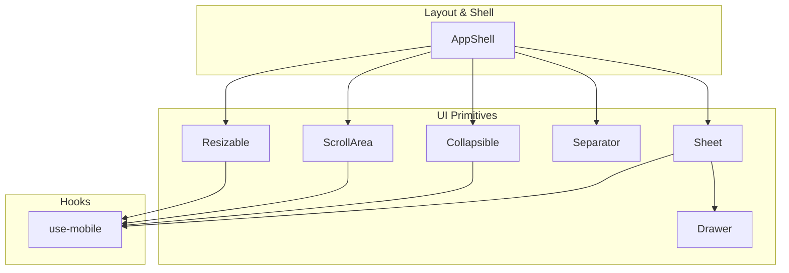
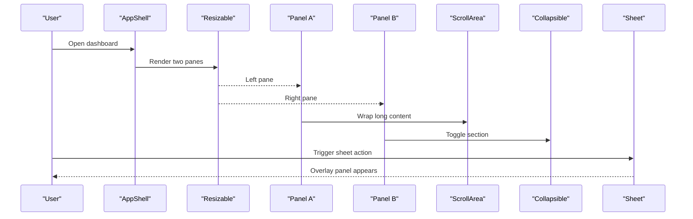
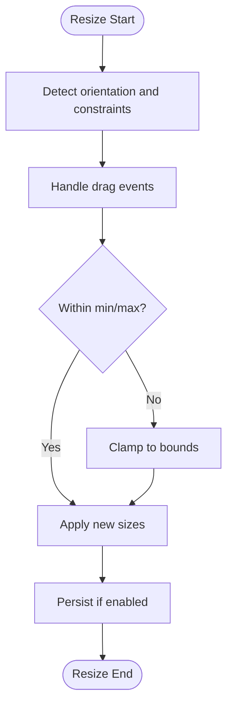
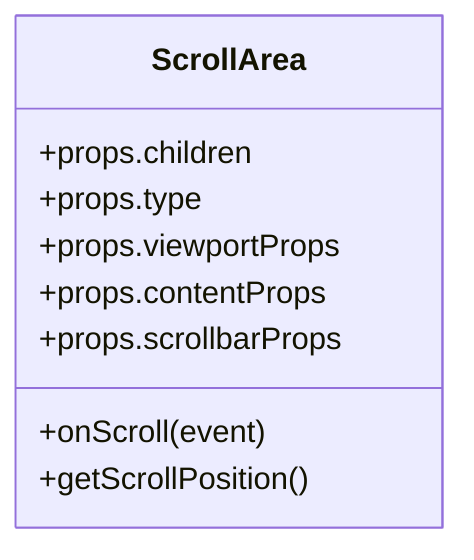
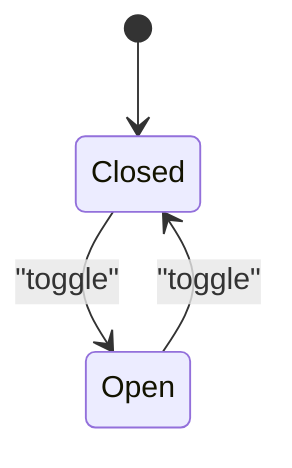
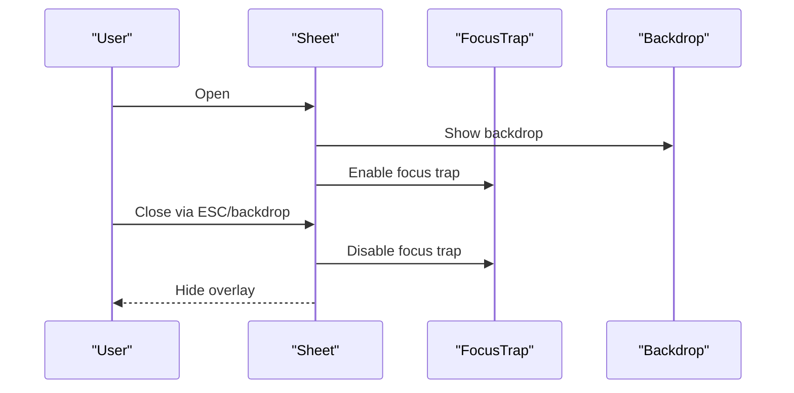
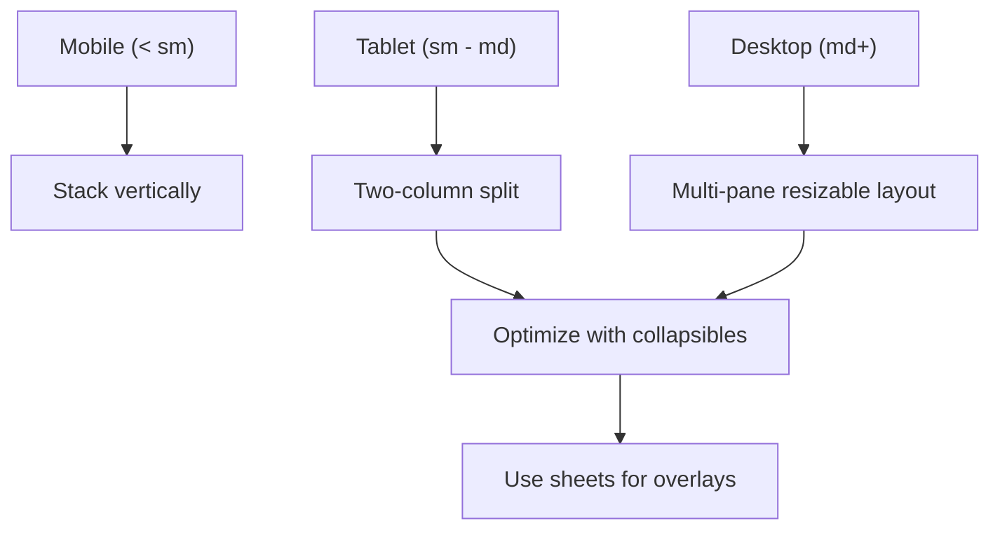
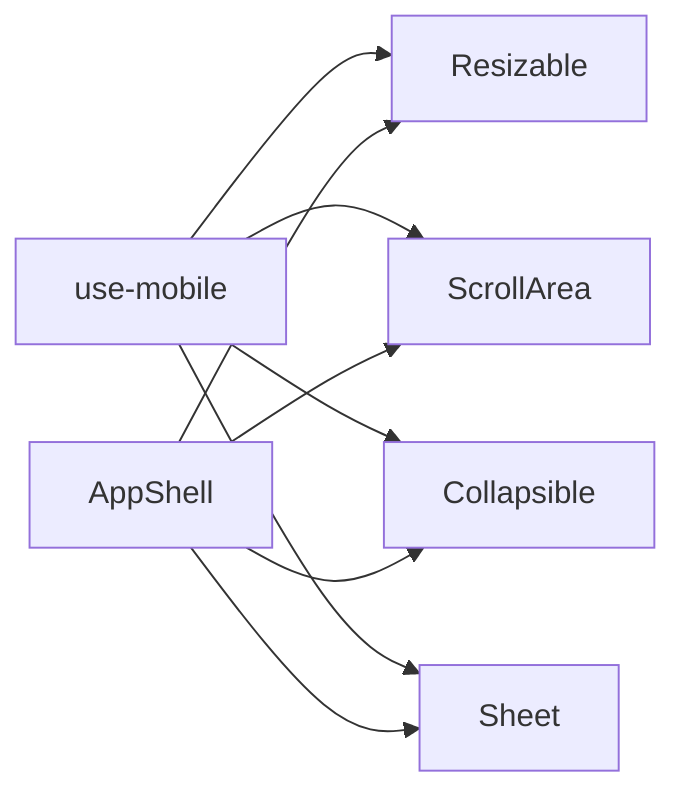

# Layout Components

<cite>
**Referenced Files in This Document**
- [resizable.tsx](file://src/components/ui/resizable.tsx)
- [scroll-area.tsx](file://src/components/ui/scroll-area.tsx)
- [collapsible.tsx](file://src/components/ui/collapsible.tsx)
- [separator.tsx](file://src/components/ui/separator.tsx)
- [sheet.tsx](file://src/components/ui/sheet.tsx)
- [use-mobile.tsx](file://src/hooks/use-mobile.tsx)
- [app-shell.tsx](file://src/components/app-shell.tsx)
- [drawer.tsx](file://src/components/ui/drawer.tsx)
</cite>

## Table of Contents
1. [Introduction](#introduction)
2. [Project Structure](#project-structure)
3. [Core Components](#core-components)
4. [Architecture Overview](#architecture-overview)
5. [Detailed Component Analysis](#detailed-component-analysis)
6. [Dependency Analysis](#dependency-analysis)
7. [Performance Considerations](#performance-considerations)
8. [Troubleshooting Guide](#troubleshooting-guide)
9. [Conclusion](#conclusion)

## Introduction
This document provides comprehensive guidance for layout components: Resizable, ScrollArea, Collapsible, Separator, and Sheet. It explains layout strategies, responsive breakpoints, space optimization techniques, scroll behavior customization, collapsible content management, and overlay positioning. It also includes examples of complex layouts, performance optimization for large content areas, and mobile-first design patterns.

## Project Structure
The layout components are implemented as reusable UI primitives under the UI directory and are consumed by application shells and feature pages. The mobile breakpoint hook centralizes responsive logic used across components and screens.

**Diagram sources**
- [resizable.tsx](file://src/components/ui/resizable.tsx)
- [scroll-area.tsx](file://src/components/ui/scroll-area.tsx)
- [collapsible.tsx](file://src/components/ui/collapsible.tsx)
- [separator.tsx](file://src/components/ui/separator.tsx)
- [sheet.tsx](file://src/components/ui/sheet.tsx)
- [drawer.tsx](file://src/components/ui/drawer.tsx)
- [use-mobile.tsx](file://src/hooks/use-mobile.tsx)
- [app-shell.tsx](file://src/components/app-shell.tsx)

**Section sources**
- [resizable.tsx](file://src/components/ui/resizable.tsx)
- [scroll-area.tsx](file://src/components/ui/scroll-area.tsx)
- [collapsible.tsx](file://src/components/ui/collapsible.tsx)
- [separator.tsx](file://src/components/ui/separator.tsx)
- [sheet.tsx](file://src/components/ui/sheet.tsx)
- [drawer.tsx](file://src/components/ui/drawer.tsx)
- [use-mobile.tsx](file://src/hooks/use-mobile.tsx)
- [app-shell.tsx](file://src/components/app-shell.tsx)

## Core Components
- Resizable: Provides resizable panes with drag handles, ideal for split views and dashboards. Supports orientation, min/max sizes, and keyboard accessibility.
- ScrollArea: Custom scrollable container with native-like scrolling, optional scrollbar styling, and scroll event exposure.
- Collapsible: Toggleable content regions with open/close state, animation, and nested support.
- Separator: Visual divider for grouping content or separating sections.
- Sheet: Overlay panel that slides in from edges, commonly used for side panels, drawers, and forms.

These components compose to build responsive, accessible, and performant layouts.

**Section sources**
- [resizable.tsx](file://src/components/ui/resizable.tsx)
- [scroll-area.tsx](file://src/components/ui/scroll-area.tsx)
- [collapsible.tsx](file://src/components/ui/collapsible.tsx)
- [separator.tsx](file://src/components/ui/separator.tsx)
- [sheet.tsx](file://src/components/ui/sheet.tsx)

## Architecture Overview
The layout system follows a composition pattern:
- AppShell orchestrates global layout (header, sidebar, main area).
- Resizable divides the main area into flexible columns/rows.
- ScrollArea wraps heavy content to avoid reflows and maintain smooth scrolling.
- Collapsible manages expandable sections within panels.
- Separator visually groups related content.
- Sheet overlays temporary content without disrupting the main flow.

**Diagram sources**
- [app-shell.tsx](file://src/components/app-shell.tsx)
- [resizable.tsx](file://src/components/ui/resizable.tsx)
- [scroll-area.tsx](file://src/components/ui/scroll-area.tsx)
- [collapsible.tsx](file://src/components/ui/collapsible.tsx)
- [sheet.tsx](file://src/components/ui/sheet.tsx)

## Detailed Component Analysis

### Resizable
- Purpose: Split layout into resizable regions with constraints and accessibility.
- Key behaviors:
  - Orientation control (horizontal/vertical).
  - Min/max size enforcement.
  - Drag handle interaction and keyboard navigation.
  - Optional persistence of pane sizes.
- Responsive strategy:
  - Collapse to single column on small screens; use hooks to detect breakpoints.
  - Disable resizing on touch devices when not appropriate.
- Performance tips:
  - Debounce resize updates.
  - Avoid deep re-renders by memoizing children.
  - Use virtualization inside large panes.

**Diagram sources**
- [resizable.tsx](file://src/components/ui/resizable.tsx)

**Section sources**
- [resizable.tsx](file://src/components/ui/resizable.tsx)
- [use-mobile.tsx](file://src/hooks/use-mobile.tsx)

### ScrollArea
- Purpose: Provide consistent, customizable scrolling for large content.
- Key behaviors:
  - Native-like scroll experience with styled scrollbars.
  - Scroll position tracking and event callbacks.
  - Optional overflow handling and padding.
- Scroll customization:
  - Smooth vs instant scrolling.
  - Scroll snap for card carousels or lists.
  - Intersection observer for lazy loading.
- Performance tips:
  - Virtualize long lists.
  - Throttle scroll handlers.
  - Avoid layout thrashing by measuring after paint.

**Diagram sources**
- [scroll-area.tsx](file://src/components/ui/scroll-area.tsx)

**Section sources**
- [scroll-area.tsx](file://src/components/ui/scroll-area.tsx)

### Collapsible
- Purpose: Manage expandable content sections with animations and accessibility.
- Key behaviors:
  - Controlled or uncontrolled open state.
  - Animated height transitions.
  - Nested collapsibles supported.
- Content management:
  - Lazy render children when closed to save memory.
  - Preserve focus and aria attributes.
- Mobile considerations:
  - Full-width expansion on small screens.
  - Touch-friendly triggers.

**Diagram sources**
- [collapsible.tsx](file://src/components/ui/collapsible.tsx)

**Section sources**
- [collapsible.tsx](file://src/components/ui/collapsible.tsx)

### Separator
- Purpose: Visually separate content groups or sections.
- Key behaviors:
  - Orientation (horizontal/vertical).
  - Accessible role and labels.
  - Styling via props or CSS classes.
- Usage patterns:
  - Dividers in toolbars, menus, and form fields.
  - Spacing alternative to margins for semantic clarity.

**Section sources**
- [separator.tsx](file://src/components/ui/separator.tsx)

### Sheet
- Purpose: Overlay panel for secondary actions, details, or forms.
- Key behaviors:
  - Slide-in/out animations from specified edge.
  - Backdrop click-to-close and escape key support.
  - Focus trapping and modal semantics.
- Overlay positioning:
  - Edge selection (top/right/bottom/left).
  - Z-index layering above app shell.
  - Safe area insets for mobile devices.
- Mobile-first patterns:
  - Full-screen drawer on small screens.
  - Swipe-to-dismiss gestures where applicable.

**Diagram sources**
- [sheet.tsx](file://src/components/ui/sheet.tsx)
- [drawer.tsx](file://src/components/ui/drawer.tsx)

**Section sources**
- [sheet.tsx](file://src/components/ui/sheet.tsx)
- [drawer.tsx](file://src/components/ui/drawer.tsx)

### Conceptual Overview
Responsive layout strategies:
- Mobile-first: Stack vertically by default; enable horizontal splits at larger breakpoints.
- Breakpoints: Use a centralized hook to determine screen size and adjust component behavior.
- Space optimization: Collapse non-critical sections, hide secondary panels, and use sheets for context-sensitive actions.

[No sources needed since this diagram shows conceptual workflow, not actual code structure]

## Dependency Analysis
Components rely on shared hooks and utilities for responsiveness and accessibility. AppShell composes these primitives to create cohesive layouts.

**Diagram sources**
- [use-mobile.tsx](file://src/hooks/use-mobile.tsx)
- [resizable.tsx](file://src/components/ui/resizable.tsx)
- [scroll-area.tsx](file://src/components/ui/scroll-area.tsx)
- [collapsible.tsx](file://src/components/ui/collapsible.tsx)
- [sheet.tsx](file://src/components/ui/sheet.tsx)
- [app-shell.tsx](file://src/components/app-shell.tsx)

**Section sources**
- [use-mobile.tsx](file://src/hooks/use-mobile.tsx)
- [app-shell.tsx](file://src/components/app-shell.tsx)

## Performance Considerations
- Large content areas:
  - Virtualize lists and grids inside ScrollArea.
  - Defer rendering offscreen Collapsible children until opened.
  - Use requestIdleCallback for non-critical updates during scroll.
- Resize interactions:
  - Debounce resize calculations and DOM writes.
  - Avoid frequent state updates; batch changes.
- Memory usage:
  - Unmount heavy components when hidden behind sheets or collapsed sections.
  - Reuse expensive instances via memoization.
- Accessibility and UX:
  - Ensure focus management in sheets and collapsibles.
  - Provide keyboard shortcuts for common actions.

[No sources needed since this section provides general guidance]

## Troubleshooting Guide
- Resizable issues:
  - Verify min/max constraints and ensure parent containers have defined dimensions.
  - Check for pointer/touch conflicts with child elements.
- ScrollArea problems:
  - Confirm viewport has explicit height or flex constraints.
  - Inspect nested overflow settings that may break scrolling.
- Collapsible glitches:
  - Ensure animated height transitions do not conflict with fixed heights.
  - Validate nested collapsible state to prevent unexpected toggles.
- Separator misalignment:
  - Check flex/grid alignment and spacing around separators.
- Sheet overlay problems:
  - Confirm z-index stacking context and safe area insets.
  - Validate backdrop click and escape key handlers.

**Section sources**
- [resizable.tsx](file://src/components/ui/resizable.tsx)
- [scroll-area.tsx](file://src/components/ui/scroll-area.tsx)
- [collapsible.tsx](file://src/components/ui/collapsible.tsx)
- [separator.tsx](file://src/components/ui/separator.tsx)
- [sheet.tsx](file://src/components/ui/sheet.tsx)

## Conclusion
By composing Resizable, ScrollArea, Collapsible, Separator, and Sheet with responsive hooks and thoughtful performance practices, you can build adaptive, accessible, and high-performance layouts. Use mobile-first strategies, optimize large content areas, and manage overlays effectively to deliver excellent user experiences across devices.