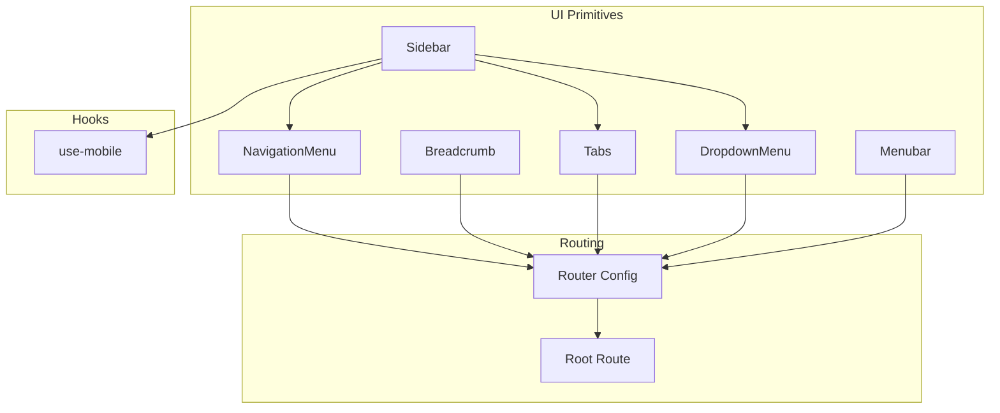
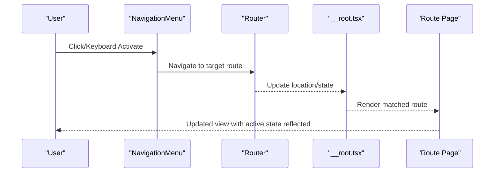
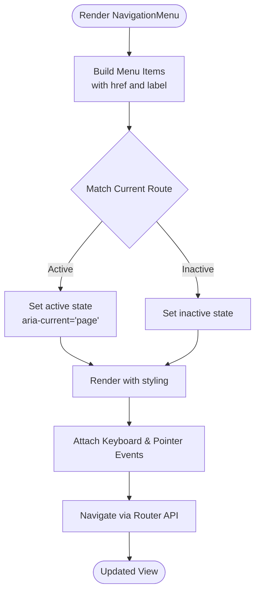
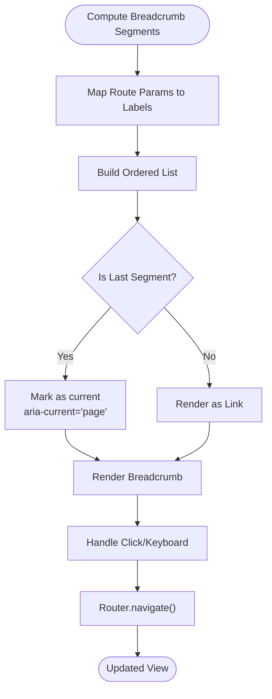
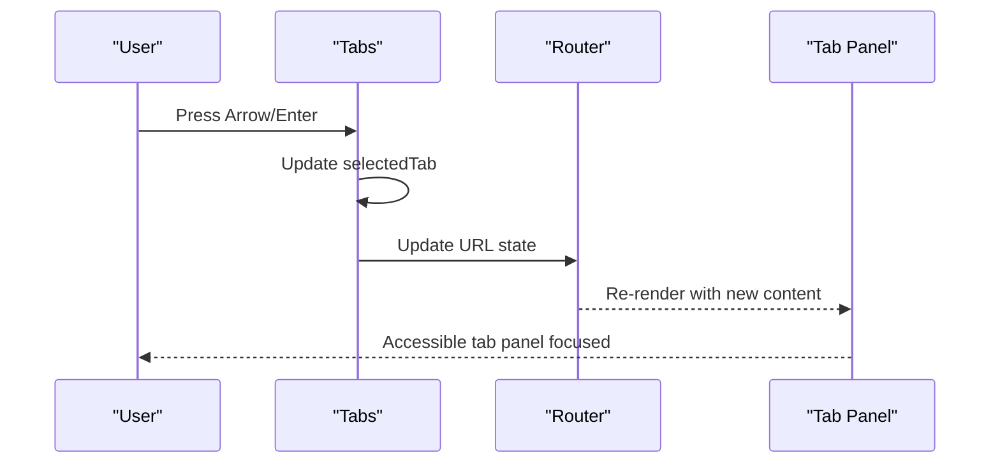
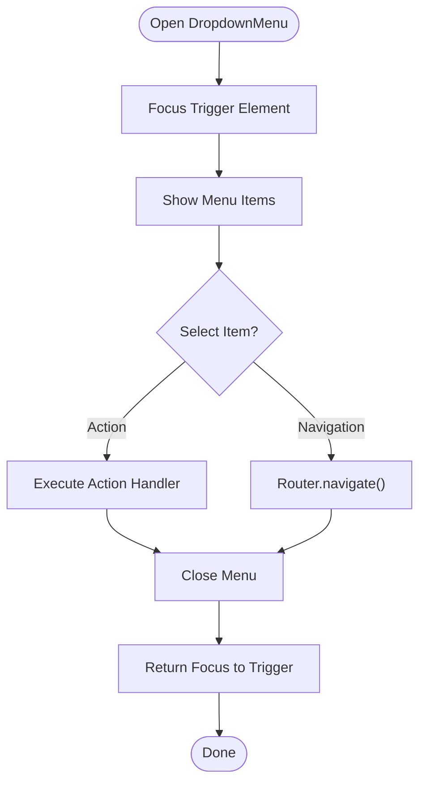
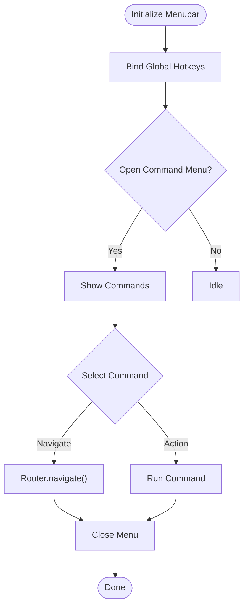
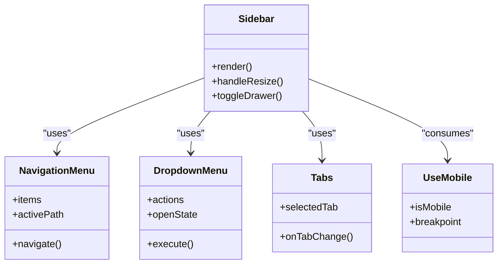
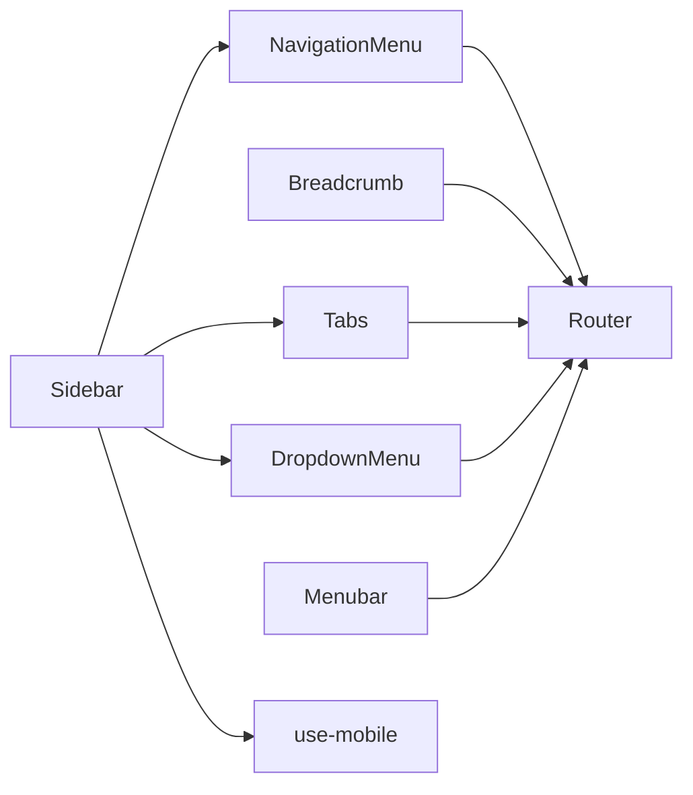

# Navigation Components

<cite>
**Referenced Files in This Document**
- [navigation-menu.tsx](file://src/components/ui/navigation-menu.tsx)
- [breadcrumb.tsx](file://src/components/ui/breadcrumb.tsx)
- [tabs.tsx](file://src/components/ui/tabs.tsx)
- [dropdown-menu.tsx](file://src/components/ui/dropdown-menu.tsx)
- [menubar.tsx](file://src/components/ui/menubar.tsx)
- [router.tsx](file://src/router.tsx)
- [__root.tsx](file://src/routes/__root.tsx)
- [use-mobile.tsx](file://src/hooks/use-mobile.tsx)
- [sidebar.tsx](file://src/components/ui/sidebar.tsx)
</cite>

## Table of Contents
1. [Introduction](#introduction)
2. [Project Structure](#project-structure)
3. [Core Components](#core-components)
4. [Architecture Overview](#architecture-overview)
5. [Detailed Component Analysis](#detailed-component-analysis)
6. [Dependency Analysis](#dependency-analysis)
7. [Performance Considerations](#performance-considerations)
8. [Troubleshooting Guide](#troubleshooting-guide)
9. [Conclusion](#conclusion)

## Introduction
This document provides comprehensive documentation for the navigation components used across the application: NavigationMenu, Breadcrumb, Tabs, DropdownMenu, and Menubar. It explains how these components integrate with routing, manage active states, support keyboard navigation, and adapt to mobile devices. It also covers menu hierarchy patterns, nested navigation, dynamic menu generation, and accessibility best practices for screen readers and keyboard users.

## Project Structure
The navigation components are implemented as reusable UI primitives under src/components/ui and integrated into routes via a router configuration. Mobile responsiveness is handled through a dedicated hook. A sidebar component demonstrates composite navigation patterns combining multiple primitives.

**Diagram sources**
- [navigation-menu.tsx](file://src/components/ui/navigation-menu.tsx)
- [breadcrumb.tsx](file://src/components/ui/breadcrumb.tsx)
- [tabs.tsx](file://src/components/ui/tabs.tsx)
- [dropdown-menu.tsx](file://src/components/ui/dropdown-menu.tsx)
- [menubar.tsx](file://src/components/ui/menubar.tsx)
- [sidebar.tsx](file://src/components/ui/sidebar.tsx)
- [router.tsx](file://src/router.tsx)
- [__root.tsx](file://src/routes/__root.tsx)
- [use-mobile.tsx](file://src/hooks/use-mobile.tsx)

**Section sources**
- [navigation-menu.tsx](file://src/components/ui/navigation-menu.tsx)
- [breadcrumb.tsx](file://src/components/ui/breadcrumb.tsx)
- [tabs.tsx](file://src/components/ui/tabs.tsx)
- [dropdown-menu.tsx](file://src/components/ui/dropdown-menu.tsx)
- [menubar.tsx](file://src/components/ui/menubar.tsx)
- [sidebar.tsx](file://src/components/ui/sidebar.tsx)
- [router.tsx](file://src/router.tsx)
- [__root.tsx](file://src/routes/__root.tsx)
- [use-mobile.tsx](file://src/hooks/use-mobile.tsx)

## Core Components
- NavigationMenu: Primary top-level navigation with nested items, active state driven by route matching, and keyboard-friendly interactions.
- Breadcrumb: Hierarchical path indicator that reflects current route and supports navigation back up the tree.
- Tabs: Content segmentation within a page; can be synchronized with route segments or local state.
- DropdownMenu: Contextual action menus and secondary navigation options; integrates with keyboard and screen reader semantics.
- Menubar: Application-wide command palette style navigation; suitable for global actions and deep links.

Key integration points:
- Routing: All components should navigate using the router’s programmatic APIs to maintain history and SEO.
- Active State: Derive active states from the current route rather than local toggles for consistency.
- Keyboard: Ensure focus management, arrow key navigation, and Escape handling where applicable.
- Accessibility: Use proper ARIA roles, labels, and live regions for dynamic updates.

**Section sources**
- [navigation-menu.tsx](file://src/components/ui/navigation-menu.tsx)
- [breadcrumb.tsx](file://src/components/ui/breadcrumb.tsx)
- [tabs.tsx](file://src/components/ui/tabs.tsx)
- [dropdown-menu.tsx](file://src/components/ui/dropdown-menu.tsx)
- [menubar.tsx](file://src/components/ui/menubar.tsx)

## Architecture Overview
The navigation architecture centers on a router-driven approach. Components read the current route to determine active states and trigger navigation programmatically. The root route sets up shared layout and context, while individual routes render feature-specific content. Mobile behavior is adapted via a responsive hook.

**Diagram sources**
- [navigation-menu.tsx](file://src/components/ui/navigation-menu.tsx)
- [router.tsx](file://src/router.tsx)
- [__root.tsx](file://src/routes/__root.tsx)

## Detailed Component Analysis

### NavigationMenu
Responsibilities:
- Renders primary navigation with nested submenus.
- Highlights active items based on route matching.
- Supports keyboard traversal (arrow keys, Enter, Escape).
- Adapts to mobile via collapsible behavior when needed.

Integration patterns:
- Use router link APIs to avoid full-page reloads.
- Compute isActive by comparing current pathname with item href.
- Provide aria-current="page" on active items.

Mobile-responsive behaviors:
- Collapse into an accordion or drawer on small screens.
- Preserve focus order and announce state changes to screen readers.

Accessibility:
- Role="navigation" at container level.
- Properly labeled triggers and menus.
- Focus trap within open submenu until closed.

**Diagram sources**
- [navigation-menu.tsx](file://src/components/ui/navigation-menu.tsx)
- [router.tsx](file://src/router.tsx)

**Section sources**
- [navigation-menu.tsx](file://src/components/ui/navigation-menu.tsx)
- [router.tsx](file://src/router.tsx)

### Breadcrumb
Responsibilities:
- Displays hierarchical path reflecting current route.
- Provides clickable segments to navigate up the tree.
- Announces context to assistive technologies.

Integration patterns:
- Derive segments from route params and parent paths.
- Use router navigation for each segment click.
- Maintain logical tab order and focus indicators.

Accessibility:
- Role="navigation" and aria-label describing purpose.
- aria-current="page" on the last segment.
- Avoid excessive nesting; keep depth manageable.

**Diagram sources**
- [breadcrumb.tsx](file://src/components/ui/breadcrumb.tsx)
- [router.tsx](file://src/router.tsx)

**Section sources**
- [breadcrumb.tsx](file://src/components/ui/breadcrumb.tsx)
- [router.tsx](file://src/router.tsx)

### Tabs
Responsibilities:
- Segments related content within a single page.
- Can mirror route segments for URL-driven state.
- Manages focus and keyboard navigation between tabs.

Integration patterns:
- Sync selectedTab with route query or path segment.
- Update URL on tab change without full reload.
- Ensure each tab panel has accessible names and descriptions.

Accessibility:
- Role="tablist", role="tab", role="tabpanel".
- aria-selected and aria-controls properly set.
- Arrow key navigation between tabs and Enter to activate.

**Diagram sources**
- [tabs.tsx](file://src/components/ui/tabs.tsx)
- [router.tsx](file://src/router.tsx)

**Section sources**
- [tabs.tsx](file://src/components/ui/tabs.tsx)
- [router.tsx](file://src/router.tsx)

### DropdownMenu
Responsibilities:
- Presents contextual actions and secondary navigation.
- Supports keyboard shortcuts and screen reader announcements.
- Integrates with router for navigation items.

Integration patterns:
- Separate action handlers from navigation items.
- Use router navigation for deep links inside dropdown.
- Manage focus return to trigger after selection.

Accessibility:
- Role="menu" and role="menuitem".
- aria-haspopup and aria-expanded on triggers.
- Announce selection outcomes via live regions if needed.

**Diagram sources**
- [dropdown-menu.tsx](file://src/components/ui/dropdown-menu.tsx)
- [router.tsx](file://src/router.tsx)

**Section sources**
- [dropdown-menu.tsx](file://src/components/ui/dropdown-menu.tsx)
- [router.tsx](file://src/router.tsx)

### Menubar
Responsibilities:
- Provides application-wide commands and global navigation.
- Supports keyboard-first interaction model.
- Suitable for complex command palettes and hotkeys.

Integration patterns:
- Bind hotkeys to commands via keyboard event listeners.
- Use router navigation for deep links.
- Group related commands logically with separators.

Accessibility:
- Role="menubar" and role="menuitem".
- aria-pressed for toggleable commands.
- Clear labeling and concise descriptions.

**Diagram sources**
- [menubar.tsx](file://src/components/ui/menubar.tsx)
- [router.tsx](file://src/router.tsx)

**Section sources**
- [menubar.tsx](file://src/components/ui/menubar.tsx)
- [router.tsx](file://src/router.tsx)

### Sidebar Composite Pattern
The sidebar often combines multiple navigation primitives to create rich layouts:
- Uses NavigationMenu for primary sections.
- DropdownMenu for contextual actions.
- Tabs for switching within a section.
- Responsive behavior via use-mobile hook.

**Diagram sources**
- [sidebar.tsx](file://src/components/ui/sidebar.tsx)
- [navigation-menu.tsx](file://src/components/ui/navigation-menu.tsx)
- [dropdown-menu.tsx](file://src/components/ui/dropdown-menu.tsx)
- [tabs.tsx](file://src/components/ui/tabs.tsx)
- [use-mobile.tsx](file://src/hooks/use-mobile.tsx)

**Section sources**
- [sidebar.tsx](file://src/components/ui/sidebar.tsx)
- [use-mobile.tsx](file://src/hooks/use-mobile.tsx)

## Dependency Analysis
Navigation components depend on the router for stateful navigation and on hooks for responsive behavior. They do not mutate global state directly; instead, they delegate to router APIs. This keeps coupling low and ensures predictable data flow.

**Diagram sources**
- [navigation-menu.tsx](file://src/components/ui/navigation-menu.tsx)
- [breadcrumb.tsx](file://src/components/ui/breadcrumb.tsx)
- [tabs.tsx](file://src/components/ui/tabs.tsx)
- [dropdown-menu.tsx](file://src/components/ui/dropdown-menu.tsx)
- [menubar.tsx](file://src/components/ui/menubar.tsx)
- [sidebar.tsx](file://src/components/ui/sidebar.tsx)
- [router.tsx](file://src/router.tsx)
- [use-mobile.tsx](file://src/hooks/use-mobile.tsx)

**Section sources**
- [router.tsx](file://src/router.tsx)
- [use-mobile.tsx](file://src/hooks/use-mobile.tsx)

## Performance Considerations
- Prefer router-based active state over per-component toggles to reduce re-renders.
- Memoize expensive menu computations and derived lists.
- Debounce resize handlers in responsive components.
- Avoid heavy DOM operations inside keyboard event handlers; batch updates where possible.
- Lazy-load large dropdown or menubar content when appropriate.

[No sources needed since this section provides general guidance]

## Troubleshooting Guide
Common issues and resolutions:
- Active state mismatch: Ensure route matching logic aligns with href values and consider trailing slashes.
- Keyboard navigation broken: Verify focus management and event propagation; confirm roles and attributes are present.
- Screen reader not announcing changes: Add aria-live regions for dynamic updates and ensure focus moves appropriately.
- Mobile layout glitches: Check breakpoint thresholds and ensure collapsible containers have correct ARIA states.

**Section sources**
- [navigation-menu.tsx](file://src/components/ui/navigation-menu.tsx)
- [breadcrumb.tsx](file://src/components/ui/breadcrumb.tsx)
- [tabs.tsx](file://src/components/ui/tabs.tsx)
- [dropdown-menu.tsx](file://src/components/ui/dropdown-menu.tsx)
- [menubar.tsx](file://src/components/ui/menubar.tsx)
- [use-mobile.tsx](file://src/hooks/use-mobile.tsx)

## Conclusion
The navigation components form a cohesive, router-driven system that emphasizes accessibility, keyboard support, and responsive design. By deriving active states from routing, managing focus carefully, and adhering to ARIA standards, the application delivers a robust and inclusive user experience across devices and input methods.

[No sources needed since this section summarizes without analyzing specific files]