# UI Component Library

<cite>
**Referenced Files in This Document**
- [components.json](file://components.json)
- [package.json](file://package.json)
- [vite.config.ts](file://vite.config.ts)
- [src/styles.css](file://src/styles.css)
- [src/lib/theme.tsx](file://src/lib/theme.tsx)
- [src/components/ui/button.tsx](file://src/components/ui/button.tsx)
- [src/components/ui/input.tsx](file://src/components/ui/input.tsx)
- [src/components/ui/dialog.tsx](file://src/components/ui/dialog.tsx)
- [src/components/ui/form.tsx](file://src/components/ui/form.tsx)
- [src/components/ui/select.tsx](file://src/components/ui/select.tsx)
- [src/components/ui/checkbox.tsx](file://src/components/ui/checkbox.tsx)
- [src/components/ui/radio-group.tsx](file://src/components/ui/radio-group.tsx)
- [src/components/ui/switch.tsx](file://src/components/ui/switch.tsx)
- [src/components/ui/tabs.tsx](file://src/components/ui/tabs.tsx)
- [src/components/ui/table.tsx](file://src/components/ui/table.tsx)
- [src/components/ui/card.tsx](file://src/components/ui/card.tsx)
- [src/components/ui/badge.tsx](file://src/components/ui/badge.tsx)
- [src/components/ui/alert.tsx](file://src/components/ui/alert.tsx)
- [src/components/ui/avatar.tsx](file://src/components/ui/avatar.tsx)
- [src/components/ui/popover.tsx](file://src/components/ui/popover.tsx)
- [src/components/ui/dropdown-menu.tsx](file://src/components/ui/dropdown-menu.tsx)
- [src/components/ui/command.tsx](file://src/components/ui/command.tsx)
- [src/components/ui/calendar.tsx](file://src/components/ui/calendar.tsx)
- [src/components/ui/slider.tsx](file://src/components/ui/slider.tsx)
- [src/components/ui/accordion.tsx](file://src/components/ui/accordion.tsx)
- [src/components/ui/collapsible.tsx](file://src/components/ui/collapsible.tsx)
- [src/components/ui/sheet.tsx](file://src/components/ui/sheet.tsx)
- [src/components/ui/tooltip.tsx](file://src/components/ui/tooltip.tsx)
- [src/components/ui/navigation-menu.tsx](file://src/components/ui/navigation-menu.tsx)
- [src/components/ui/pagination.tsx](file://src/components/ui/pagination.tsx)
- [src/components/ui/progress.tsx](file://src/components/ui/progress.tsx)
- [src/components/ui/separator.tsx](file://src/components/ui/separator.tsx)
- [src/components/ui/textarea.tsx](file://src/components/ui/textarea.tsx)
- [src/components/ui/toggle.tsx](file://src/components/ui/toggle.tsx)
- [src/components/ui/toggle-group.tsx](file://src/components/ui/toggle-group.tsx)
- [src/components/ui/hover-card.tsx](file://src/components/ui/hover-card.tsx)
- [src/components/ui/menubar.tsx](file://src/components/ui/menubar.tsx)
- [src/components/ui/context-menu.tsx](file://src/components/ui/context-menu.tsx)
- [src/components/ui/resizable.tsx](file://src/components/ui/resizable.tsx)
- [src/components/ui/scroll-area.tsx](file://src/components/ui/scroll-area.tsx)
- [src/components/ui/aspect-ratio.tsx](file://src/components/ui/aspect-ratio.tsx)
- [src/components/ui/breadcrumb.tsx](file://src/components/ui/breadcrumb.tsx)
- [src/components/ui/carousel.tsx](file://src/components/ui/carousel.tsx)
- [src/components/ui/chart.tsx](file://src/components/ui/chart.tsx)
- [src/components/ui/drawer.tsx](file://src/components/ui/drawer.tsx)
- [src/components/ui/input-otp.tsx](file://src/components/ui/input-otp.tsx)
- [src/components/ui/label.tsx](file://src/components/ui/label.tsx)
- [src/components/ui/sidebar.tsx](file://src/components/ui/sidebar.tsx)
- [src/components/ui/skeleton.tsx](file://src/components/ui/skeleton.tsx)
- [src/components/ui/sonner.tsx](file://src/components/ui/sonner.tsx)
</cite>

## Table of Contents
1. [Introduction](#introduction)
2. [Project Structure](#project-structure)
3. [Core Components](#core-components)
4. [Architecture Overview](#architecture-overview)
5. [Detailed Component Analysis](#detailed-component-analysis)
6. [Dependency Analysis](#dependency-analysis)
7. [Performance Considerations](#performance-considerations)
8. [Troubleshooting Guide](#troubleshooting-guide)
9. [Conclusion](#conclusion)
10. [Appendices](#appendices)

## Introduction
This document provides comprehensive documentation for the Horux UI component library built with Radix UI primitives and Tailwind CSS. It covers design system principles, component APIs (props, events, slots), customization options, accessibility and keyboard navigation, composition patterns, controlled/uncontrolled usage, form integration, theme extension, and best practices for styling and extending components.

## Project Structure
The UI library is organized under src/components/ui with individual files per component. Configuration for the UI kit lives at the repository root (components.json) and build configuration is defined in vite.config.ts. Global styles and theming are managed via src/styles.css and src/lib/theme.tsx.

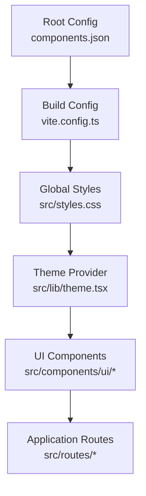

**Diagram sources**
- [components.json:1-200](file://components.json#L1-L200)
- [vite.config.ts:1-200](file://vite.config.ts#L1-L200)
- [src/styles.css:1-200](file://src/styles.css#L1-L200)
- [src/lib/theme.tsx:1-200](file://src/lib/theme.tsx#L1-L200)

**Section sources**
- [components.json:1-200](file://components.json#L1-L200)
- [vite.config.ts:1-200](file://vite.config.ts#L1-L200)
- [src/styles.css:1-200](file://src/styles.css#L1-L200)
- [src/lib/theme.tsx:1-200](file://src/lib/theme.tsx#L1-L200)

## Core Components
The library exposes a rich set of accessible primitives and higher-order UI components. Each component follows consistent patterns for props, events, and slots, enabling predictable composition and customization.

Key categories:
- Layout and structure: card, separator, skeleton, resizable, scroll-area, aspect-ratio, breadcrumb
- Navigation and menus: navigation-menu, dropdown-menu, menubar, context-menu, command, tabs
- Feedback and status: alert, badge, progress, tooltip, popover, hover-card, sonner
- Data display: table, chart, carousel, pagination
- Forms and inputs: button, input, textarea, checkbox, radio-group, switch, select, label, input-otp
- Overlays and panels: dialog, sheet, drawer, collapsible, accordion
- Utilities: avatar, slider, toggle, toggle-group

Design system principles:
- Color schemes: semantic tokens mapped to Tailwind classes; light/dark themes supported via CSS variables and theme provider
- Typography: consistent scale using Tailwind typography utilities; headings, body, captions, and code styles
- Spacing: uniform spacing scale aligned with Tailwind’s spacing system
- Responsive breakpoints: mobile-first approach using Tailwind responsive prefixes
- Accessibility: ARIA attributes, focus management, and keyboard navigation provided by Radix primitives

Controlled vs uncontrolled:
- Many components support both controlled and uncontrolled modes (e.g., value/onChange vs default* props)
- Prefer controlled mode when state is shared across components or persisted

Composition patterns:
- Compound components for complex interactions (e.g., Tabs with TabList, TabTrigger, TabContent)
- Slot-based rendering for flexible content insertion
- Higher-order wrappers for consistent behavior and styling

Form integration:
- Use form.tsx for field validation and error messaging
- Bind inputs to form libraries via ref forwarding and onChange handlers

**Section sources**
- [src/components/ui/button.tsx:1-200](file://src/components/ui/button.tsx#L1-L200)
- [src/components/ui/input.tsx:1-200](file://src/components/ui/input.tsx#L1-L200)
- [src/components/ui/dialog.tsx:1-200](file://src/components/ui/dialog.tsx#L1-L200)
- [src/components/ui/form.tsx:1-200](file://src/components/ui/form.tsx#L1-L200)
- [src/components/ui/select.tsx:1-200](file://src/components/ui/select.tsx#L1-L200)
- [src/components/ui/checkbox.tsx:1-200](file://src/components/ui/checkbox.tsx#L1-L200)
- [src/components/ui/radio-group.tsx:1-200](file://src/components/ui/radio-group.tsx#L1-L200)
- [src/components/ui/switch.tsx:1-200](file://src/components/ui/switch.tsx#L1-L200)
- [src/components/ui/tabs.tsx:1-200](file://src/components/ui/tabs.tsx#L1-L200)
- [src/components/ui/table.tsx:1-200](file://src/components/ui/table.tsx#L1-L200)
- [src/components/ui/card.tsx:1-200](file://src/components/ui/card.tsx#L1-L200)
- [src/components/ui/badge.tsx:1-200](file://src/components/ui/badge.tsx#L1-L200)
- [src/components/ui/alert.tsx:1-200](file://src/components/ui/alert.tsx#L1-L200)
- [src/components/ui/avatar.tsx:1-200](file://src/components/ui/avatar.tsx#L1-L200)
- [src/components/ui/popover.tsx:1-200](file://src/components/ui/popover.tsx#L1-L200)
- [src/components/ui/dropdown-menu.tsx:1-200](file://src/components/ui/dropdown-menu.tsx#L1-L200)
- [src/components/ui/command.tsx:1-200](file://src/components/ui/command.tsx#L1-L200)
- [src/components/ui/calendar.tsx:1-200](file://src/components/ui/calendar.tsx#L1-L200)
- [src/components/ui/slider.tsx:1-200](file://src/components/ui/slider.tsx#L1-L200)
- [src/components/ui/accordion.tsx:1-200](file://src/components/ui/accordion.tsx#L1-L200)
- [src/components/ui/collapsible.tsx:1-200](file://src/components/ui/collapsible.tsx#L1-L200)
- [src/components/ui/sheet.tsx:1-200](file://src/components/ui/sheet.tsx#L1-L200)
- [src/components/ui/tooltip.tsx:1-200](file://src/components/ui/tooltip.tsx#L1-L200)
- [src/components/ui/navigation-menu.tsx:1-200](file://src/components/ui/navigation-menu.tsx#L1-L200)
- [src/components/ui/pagination.tsx:1-200](file://src/components/ui/pagination.tsx#L1-L200)
- [src/components/ui/progress.tsx:1-200](file://src/components/ui/progress.tsx#L1-L200)
- [src/components/ui/separator.tsx:1-200](file://src/components/ui/separator.tsx#L1-L200)
- [src/components/ui/textarea.tsx:1-200](file://src/components/ui/textarea.tsx#L1-L200)
- [src/components/ui/toggle.tsx:1-200](file://src/components/ui/toggle.tsx#L1-L200)
- [src/components/ui/toggle-group.tsx:1-200](file://src/components/ui/toggle-group.tsx#L1-L200)
- [src/components/ui/hover-card.tsx:1-200](file://src/components/ui/hover-card.tsx#L1-L200)
- [src/components/ui/menubar.tsx:1-200](file://src/components/ui/menubar.tsx#L1-L200)
- [src/components/ui/context-menu.tsx:1-200](file://src/components/ui/context-menu.tsx#L1-L200)
- [src/components/ui/resizable.tsx:1-200](file://src/components/ui/resizable.tsx#L1-L200)
- [src/components/ui/scroll-area.tsx:1-200](file://src/components/ui/scroll-area.tsx#L1-L200)
- [src/components/ui/aspect-ratio.tsx:1-200](file://src/components/ui/aspect-ratio.tsx#L1-L200)
- [src/components/ui/breadcrumb.tsx:1-200](file://src/components/ui/breadcrumb.tsx#L1-L200)
- [src/components/ui/carousel.tsx:1-200](file://src/components/ui/carousel.tsx#L1-L200)
- [src/components/ui/chart.tsx:1-200](file://src/components/ui/chart.tsx#L1-L200)
- [src/components/ui/drawer.tsx:1-200](file://src/components/ui/drawer.tsx#L1-L200)
- [src/components/ui/input-otp.tsx:1-200](file://src/components/ui/input-otp.tsx#L1-L200)
- [src/components/ui/label.tsx:1-200](file://src/components/ui/label.tsx#L1-L200)
- [src/components/ui/sidebar.tsx:1-200](file://src/components/ui/sidebar.tsx#L1-L200)
- [src/components/ui/skeleton.tsx:1-200](file://src/components/ui/skeleton.tsx#L1-L200)
- [src/components/ui/sonner.tsx:1-200](file://src/components/ui/sonner.tsx#L1-L200)

## Architecture Overview
The UI layer composes Radix primitives with Tailwind utility classes. Theme and global styles provide consistent visual language. Components expose stable APIs and delegate low-level behaviors to Radix, ensuring accessibility and robust interaction patterns.

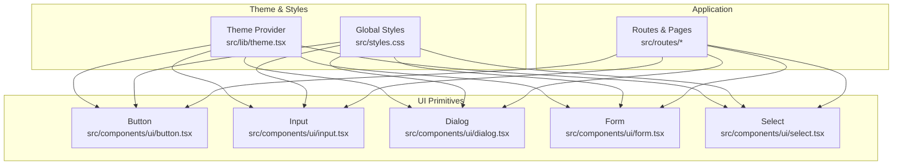

**Diagram sources**
- [src/lib/theme.tsx:1-200](file://src/lib/theme.tsx#L1-L200)
- [src/styles.css:1-200](file://src/styles.css#L1-L200)
- [src/components/ui/button.tsx:1-200](file://src/components/ui/button.tsx#L1-L200)
- [src/components/ui/input.tsx:1-200](file://src/components/ui/input.tsx#L1-L200)
- [src/components/ui/dialog.tsx:1-200](file://src/components/ui/dialog.tsx#L1-L200)
- [src/components/ui/form.tsx:1-200](file://src/components/ui/form.tsx#L1-L200)
- [src/components/ui/select.tsx:1-200](file://src/components/ui/select.tsx#L1-L200)

## Detailed Component Analysis

### Button
- Purpose: Primary interactive element for actions and commands
- Props: variant, size, disabled, loading, asChild, className, style, aria-*
- Events: onClick, onKeyDown, onPointerDown, onFocus, onBlur
- Slots: children (icon + text), prefix/suffix icons
- Variants: primary, secondary, outline, ghost, link, destructive
- Sizes: sm, md, lg
- Controlled: not applicable (stateless)
- Accessibility: keyboard activation, focus ring, aria-disabled
- Composition: can wrap icons, badges, or loaders
- Form integration: use within forms with type="submit" or type="button"

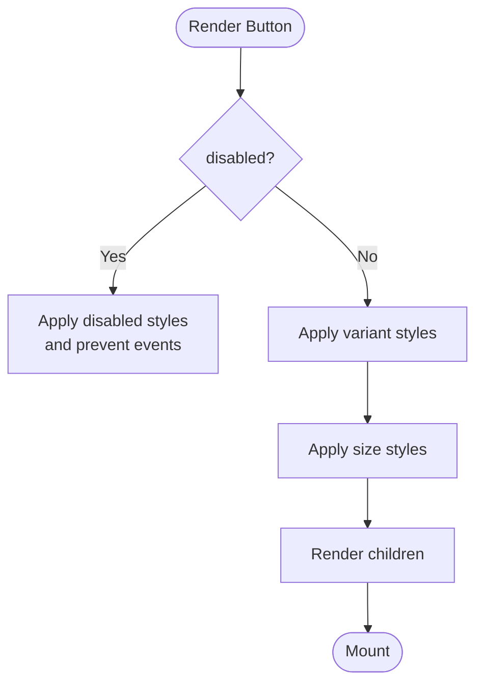

**Diagram sources**
- [src/components/ui/button.tsx:1-200](file://src/components/ui/button.tsx#L1-L200)

**Section sources**
- [src/components/ui/button.tsx:1-200](file://src/components/ui/button.tsx#L1-L200)

### Input
- Purpose: Text input field for user data entry
- Props: type, placeholder, disabled, readOnly, autoFocus, maxLength, minLength, pattern, value, defaultValue, onChange, onInput, className, style, aria-*
- Events: onChange, onInput, onFocus, onBlur, onKeyDown
- Slots: prefix/suffix icons, helper text, error message
- Validation: HTML constraints and custom validation via form integration
- Controlled: value + onChange
- Uncontrolled: defaultValue
- Accessibility: associated label via htmlFor/id, aria-invalid, aria-describedby
- Composition: combine with Label, ErrorMessage, and Icon

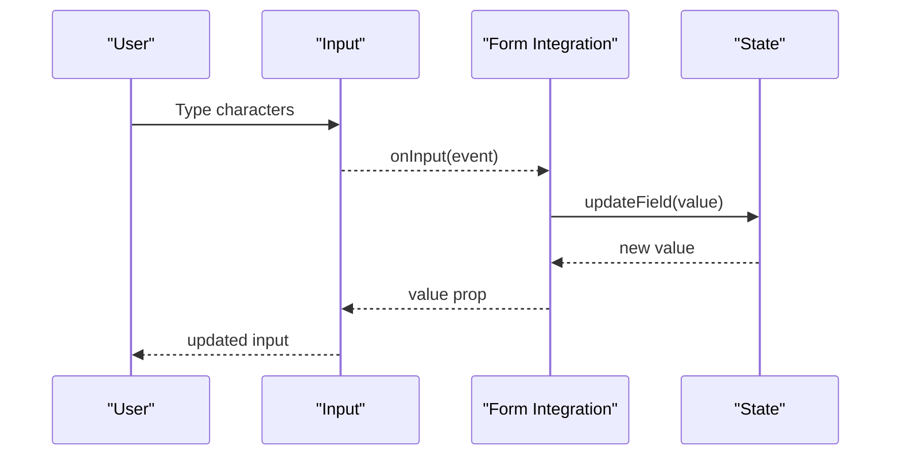

**Diagram sources**
- [src/components/ui/input.tsx:1-200](file://src/components/ui/input.tsx#L1-L200)
- [src/components/ui/form.tsx:1-200](file://src/components/ui/form.tsx#L1-L200)

**Section sources**
- [src/components/ui/input.tsx:1-200](file://src/components/ui/input.tsx#L1-L200)
- [src/components/ui/form.tsx:1-200](file://src/components/ui/form.tsx#L1-L200)

### Dialog
- Purpose: Modal overlay for focused tasks and confirmations
- Props: open, defaultOpen, onOpenChange, modal, trapFocus, closeOnOutsideClick, className, style
- Events: onOpenChange, onClose, onEscapeKeyDown, onPointerDownOutside
- Slots: title, description, header, footer, actions, content
- Accessibility: focus trap, role="dialog", aria-modal, keyboard navigation
- Composition: combine with Header, Footer, Buttons, and Alerts

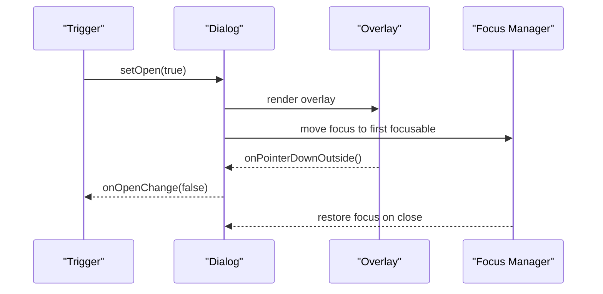

**Diagram sources**
- [src/components/ui/dialog.tsx:1-200](file://src/components/ui/dialog.tsx#L1-L200)

**Section sources**
- [src/components/ui/dialog.tsx:1-200](file://src/components/ui/dialog.tsx#L1-L200)

### Select
- Purpose: Accessible dropdown selection
- Props: value, defaultValue, onValueChange, disabled, multiple, placeholder, className, style
- Events: onValueChange, onOpenChange
- Slots: trigger, list, item, group, separator
- Accessibility: ARIA roles, keyboard navigation, search/filter if implemented
- Composition: combine with Label and HelpText

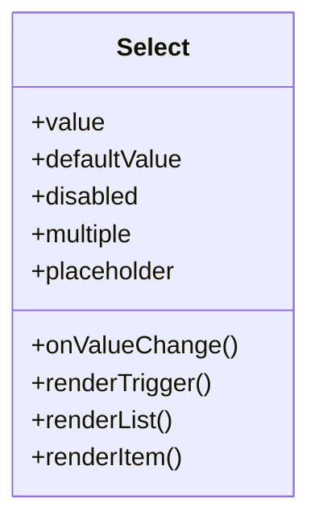

**Diagram sources**
- [src/components/ui/select.tsx:1-200](file://src/components/ui/select.tsx#L1-L200)

**Section sources**
- [src/components/ui/select.tsx:1-200](file://src/components/ui/select.tsx#L1-L200)

### Checkbox
- Purpose: Binary choice control
- Props: checked, defaultChecked, onCheckedChange, disabled, id, name, value, className, style
- Events: onCheckedChange
- Slots: label, helper text
- Accessibility: aria-checked, keyboard toggle, associated label
- Controlled: checked + onCheckedChange
- Uncontrolled: defaultChecked

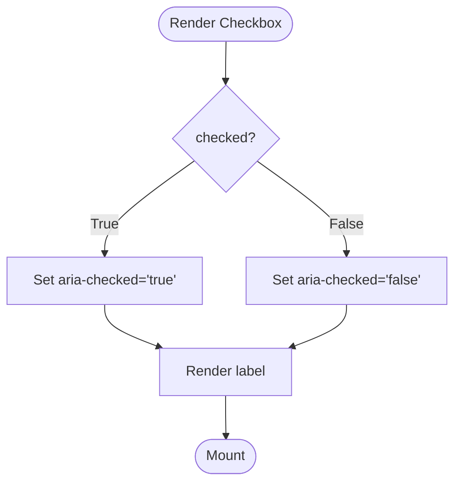

**Diagram sources**
- [src/components/ui/checkbox.tsx:1-200](file://src/components/ui/checkbox.tsx#L1-L200)

**Section sources**
- [src/components/ui/checkbox.tsx:1-200](file://src/components/ui/checkbox.tsx#L1-L200)

### Radio Group
- Purpose: Single selection from a set of options
- Props: value, defaultValue, onValueChange, orientation, disabled, className, style
- Events: onValueChange
- Slots: item, label, description
- Accessibility: role="radiogroup", arrow key navigation, aria-selected
- Controlled: value + onValueChange
- Uncontrolled: defaultValue

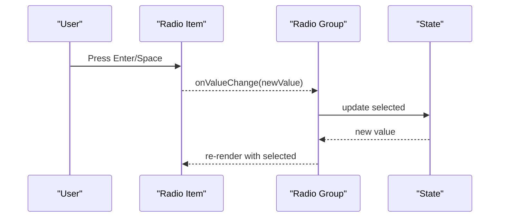

**Diagram sources**
- [src/components/ui/radio-group.tsx:1-200](file://src/components/ui/radio-group.tsx#L1-L200)

**Section sources**
- [src/components/ui/radio-group.tsx:1-200](file://src/components/ui/radio-group.tsx#L1-L200)

### Switch
- Purpose: Toggle control for binary states
- Props: checked, defaultChecked, onCheckedChange, disabled, id, name, value, className, style
- Events: onCheckedChange
- Slots: thumb, track, label
- Accessibility: aria-checked, keyboard toggle, associated label
- Controlled: checked + onCheckedChange
- Uncontrolled: defaultChecked

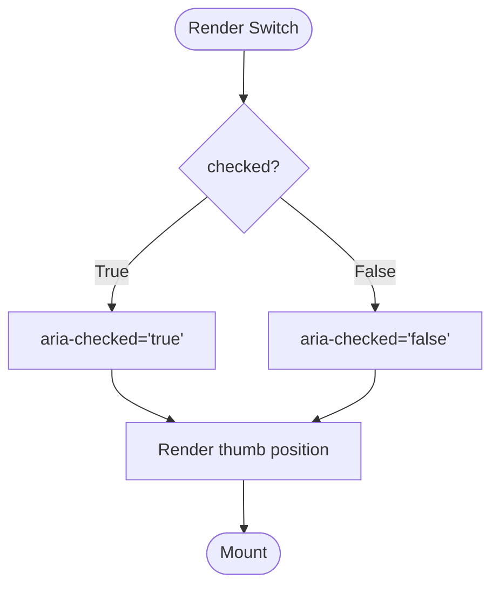

**Diagram sources**
- [src/components/ui/switch.tsx:1-200](file://src/components/ui/switch.tsx#L1-L200)

**Section sources**
- [src/components/ui/switch.tsx:1-200](file://src/components/ui/switch.tsx#L1-L200)

### Tabs
- Purpose: Organize content into tabbed sections
- Props: value, defaultValue, onValueChange, orientation, activationMode, className, style
- Events: onValueChange
- Slots: list, trigger, content, panel
- Accessibility: role="tablist", aria-selected, arrow key navigation
- Controlled: value + onValueChange
- Uncontrolled: defaultValue

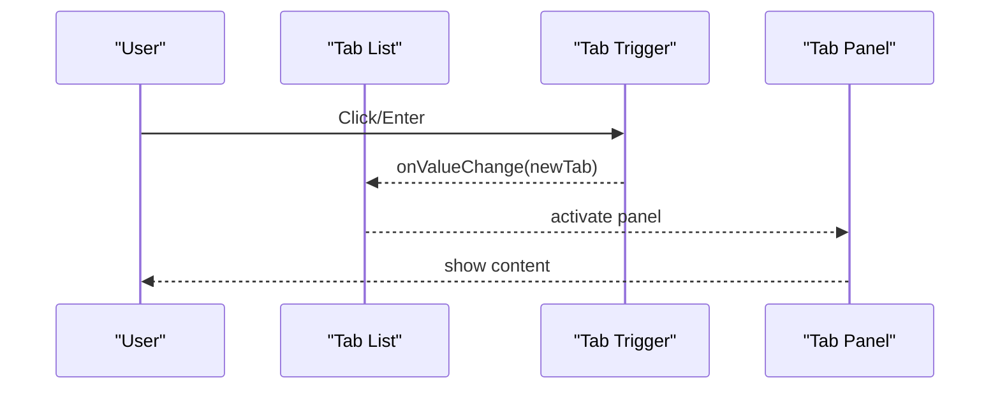

**Diagram sources**
- [src/components/ui/tabs.tsx:1-200](file://src/components/ui/tabs.tsx#L1-L200)

**Section sources**
- [src/components/ui/tabs.tsx:1-200](file://src/components/ui/tabs.tsx#L1-L200)

### Table
- Purpose: Display tabular data with sorting, pagination, and selection
- Props: data, columns, sortable, selectable, pageSize, currentPage, onSortChange, onPageChange, className, style
- Events: onSortChange, onPageChange, onSelectChange
- Slots: header, row, cell, actions
- Accessibility: role="table", headers, aria-sort, keyboard navigation
- Composition: combine with Pagination and Badge

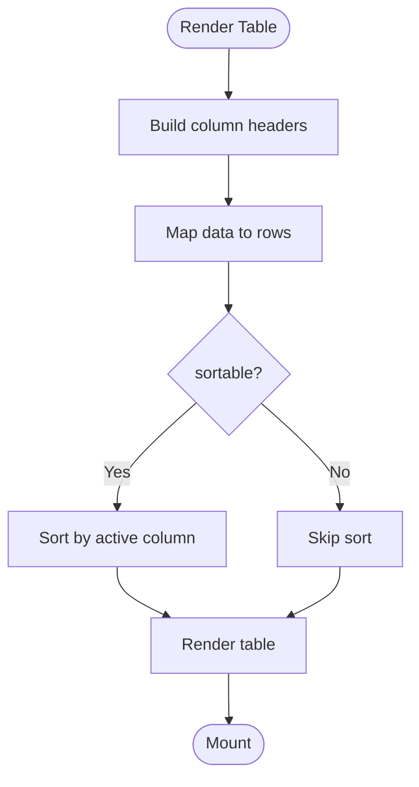

**Diagram sources**
- [src/components/ui/table.tsx:1-200](file://src/components/ui/table.tsx#L1-L200)

**Section sources**
- [src/components/ui/table.tsx:1-200](file://src/components/ui/table.tsx#L1-L200)

### Card
- Purpose: Container for grouped content and actions
- Props: variant, padding, shadow, className, style
- Events: none (presentational)
- Slots: header, body, footer, media
- Accessibility: semantic landmarks where appropriate
- Composition: combine with Badge, Avatar, Buttons

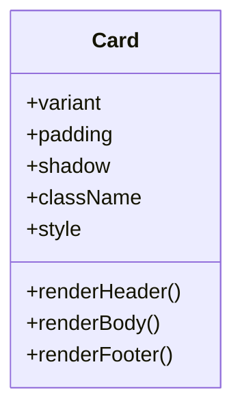

**Diagram sources**
- [src/components/ui/card.tsx:1-200](file://src/components/ui/card.tsx#L1-L200)

**Section sources**
- [src/components/ui/card.tsx:1-200](file://src/components/ui/card.tsx#L1-L200)

### Badge
- Purpose: Status indicator or label
- Props: variant, size, className, style
- Events: none
- Slots: icon, text
- Accessibility: role="status" when used for live updates
- Composition: combine with buttons and avatars

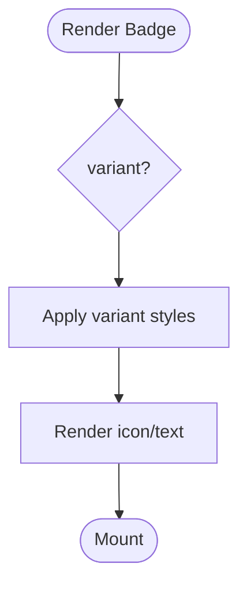

**Diagram sources**
- [src/components/ui/badge.tsx:1-200](file://src/components/ui/badge.tsx#L1-L200)

**Section sources**
- [src/components/ui/badge.tsx:1-200](file://src/components/ui/badge.tsx#L1-L200)

### Alert
- Purpose: System messages and notifications
- Props: variant, dismissible, duration, className, style
- Events: onDismiss, onClose
- Slots: icon, title, description, action
- Accessibility: role="alert" or role="status", aria-live
- Composition: combine with Buttons and Icons

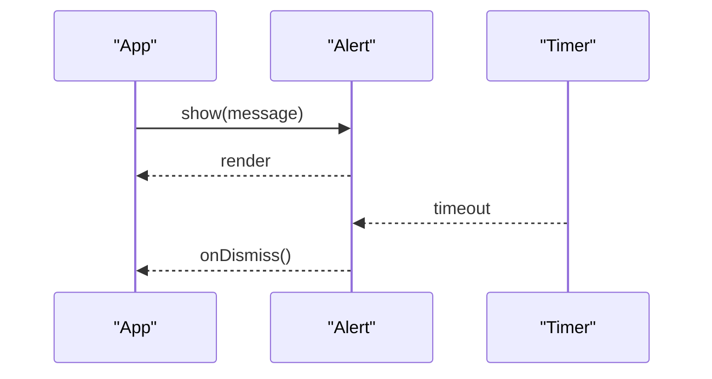

**Diagram sources**
- [src/components/ui/alert.tsx:1-200](file://src/components/ui/alert.tsx#L1-L200)

**Section sources**
- [src/components/ui/alert.tsx:1-200](file://src/components/ui/alert.tsx#L1-L200)

### Popover
- Purpose: Floating content anchored to a trigger
- Props: open, defaultOpen, onOpenChange, side, align, collisionPadding, className, style
- Events: onOpenChange
- Slots: trigger, content
- Accessibility: aria-haspopup, aria-expanded, focus management
- Composition: combine with Tooltip and Command

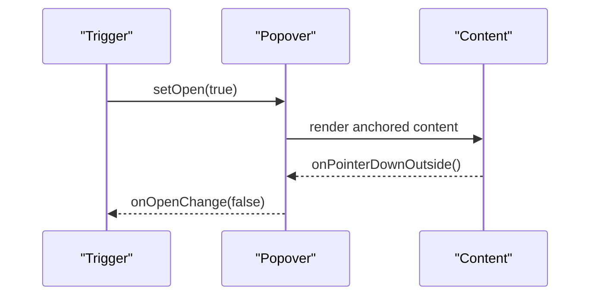

**Diagram sources**
- [src/components/ui/popover.tsx:1-200](file://src/components/ui/popover.tsx#L1-L200)

**Section sources**
- [src/components/ui/popover.tsx:1-200](file://src/components/ui/popover.tsx#L1-L200)

### Dropdown Menu
- Purpose: Contextual menu for actions
- Props: items, onSelect, disabled, className, style
- Events: onSelect, onOpenChange
- Slots: trigger, item, separator, group
- Accessibility: role="menu", arrow key navigation, focus trap
- Composition: combine with Icons and Badges

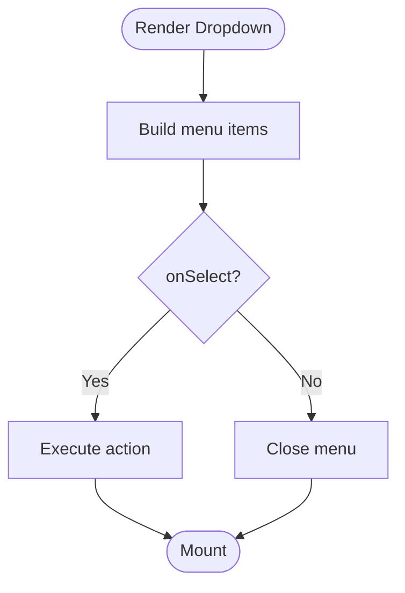

**Diagram sources**
- [src/components/ui/dropdown-menu.tsx:1-200](file://src/components/ui/dropdown-menu.tsx#L1-L200)

**Section sources**
- [src/components/ui/dropdown-menu.tsx:1-200](file://src/components/ui/dropdown-menu.tsx#L1-L200)

### Command
- Purpose: Fast command palette with search and actions
- Props: items, onCommand, filterFn, className, style
- Events: onCommand, onFilterChange
- Slots: input, list, item, group, separator
- Accessibility: role="combobox", aria-autocomplete, keyboard shortcuts
- Composition: combine with Icons and Badges

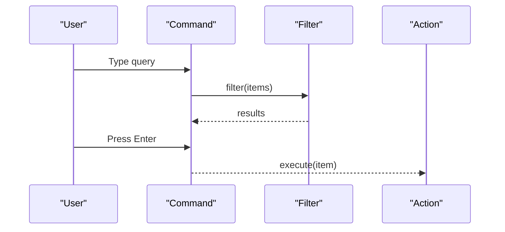

**Diagram sources**
- [src/components/ui/command.tsx:1-200](file://src/components/ui/command.tsx#L1-L200)

**Section sources**
- [src/components/ui/command.tsx:1-200](file://src/components/ui/command.tsx#L1-L200)

### Calendar
- Purpose: Date picker with range selection
- Props: value, defaultValue, onChange, mode, locale, className, style
- Events: onChange, onMonthChange
- Slots: header, grid, cell, footer
- Accessibility: aria-label, keyboard navigation, date formatting
- Composition: combine with Buttons and Inputs

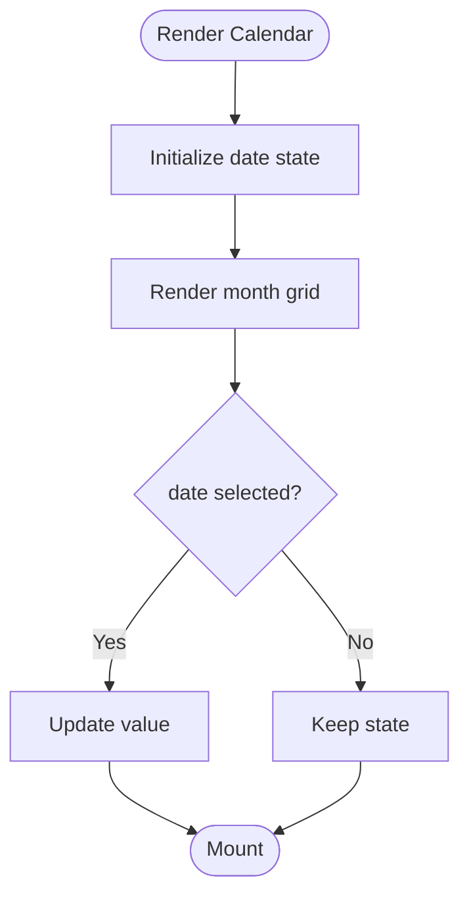

**Diagram sources**
- [src/components/ui/calendar.tsx:1-200](file://src/components/ui/calendar.tsx#L1-L200)

**Section sources**
- [src/components/ui/calendar.tsx:1-200](file://src/components/ui/calendar.tsx#L1-L200)

### Slider
- Purpose: Range selection control
- Props: value, defaultValue, onChange, min, max, step, disabled, className, style
- Events: onChange, onValueCommit
- Slots: track, thumb, label
- Accessibility: aria-valuenow, aria-valuemin, aria-valuemax, keyboard increments
- Controlled: value + onChange
- Uncontrolled: defaultValue

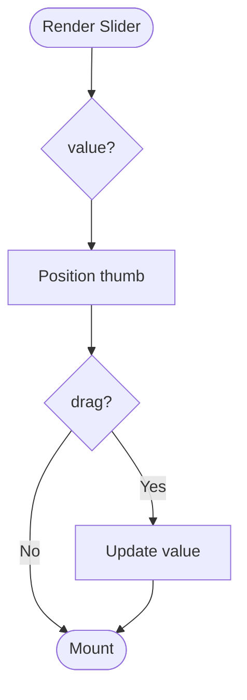

**Diagram sources**
- [src/components/ui/slider.tsx:1-200](file://src/components/ui/slider.tsx#L1-L200)

**Section sources**
- [src/components/ui/slider.tsx:1-200](file://src/components/ui/slider.tsx#L1-L200)

### Accordion
- Purpose: Expandable sections for content
- Props: items, defaultExpanded, onExpandChange, className, style
- Events: onExpandChange
- Slots: header, content, icon
- Accessibility: role="region", aria-expanded, keyboard toggle
- Controlled: expanded state + onExpandChange
- Uncontrolled: defaultExpanded

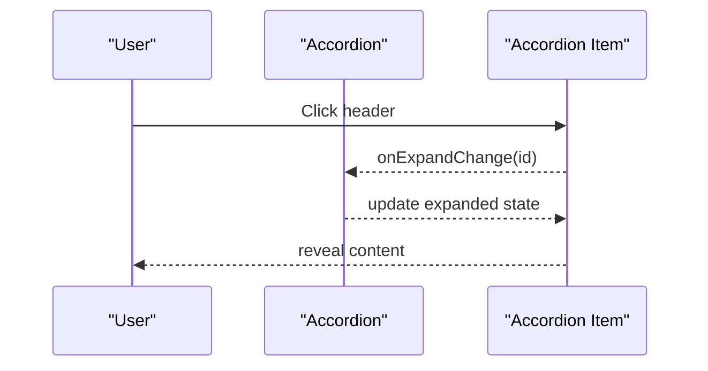

**Diagram sources**
- [src/components/ui/accordion.tsx:1-200](file://src/components/ui/accordion.tsx#L1-L200)

**Section sources**
- [src/components/ui/accordion.tsx:1-200](file://src/components/ui/accordion.tsx#L1-L200)

### Collapsible
- Purpose: Toggle visibility of content blocks
- Props: open, defaultOpen, onOpenChange, className, style
- Events: onOpenChange
- Slots: trigger, content
- Accessibility: aria-expanded, keyboard toggle
- Controlled: open + onOpenChange
- Uncontrolled: defaultOpen

```mermaid
flowchart TD
Start(["Render Collapsible"]) --> ReadOpen{"open?"}
ReadOpen --> |True| ShowContent["Show content"]
ReadOpen --> |False| HideContent["Hide content"]
ShowContent --> End(["Mount"])
HideContent --> End
```

**Diagram sources**
- [src/components/ui/collapsible.tsx:1-200](file://src/components/ui/collapsible.tsx#L1-L200)

**Section sources**
- [src/components/ui/collapsible.tsx:1-200](file://src/components/ui/collapsible.tsx#L1-L200)

### Sheet
- Purpose: Side panel for workflows and settings
- Props: open, defaultOpen, onOpenChange, side, className, style
- Events: onOpenChange
- Slots: header, content, footer, actions
- Accessibility: focus trap, role="dialog", keyboard navigation
- Controlled: open + onOpenChange
- Uncontrolled: defaultOpen

```mermaid
sequenceDiagram
participant Trigger as "Trigger"
participant Sheet as "Sheet"
participant Overlay as "Overlay"
Trigger->>Sheet : setOpen(true)
Sheet->>Overlay : render backdrop
Overlay-->>Sheet : onPointerDownOutside()
Sheet-->>Trigger : onOpenChange(false)
```

**Diagram sources**
- [src/components/ui/sheet.tsx:1-200](file://src/components/ui/sheet.tsx#L1-L200)

**Section sources**
- [src/components/ui/sheet.tsx:1-200](file://src/components/ui/sheet.tsx#L1-L200)

### Tooltip
- Purpose: Inline help text on hover/focus
- Props: content, side, align, delay, className, style
- Events: none
- Slots: trigger, content
- Accessibility: aria-describedby, focus management
- Composition: combine with Buttons and Icons

```mermaid
flowchart TD
Start(["Render Tooltip"]) --> HoverCheck{"hover/focus?"}
HoverCheck --> |Yes| ShowContent["Show tooltip"]
HoverCheck --> |No| HideContent["Hide tooltip"]
ShowContent --> End(["Mount"])
HideContent --> End
```

**Diagram sources**
- [src/components/ui/tooltip.tsx:1-200](file://src/components/ui/tooltip.tsx#L1-L200)

**Section sources**
- [src/components/ui/tooltip.tsx:1-200](file://src/components/ui/tooltip.tsx#L1-L200)

### Navigation Menu
- Purpose: Primary site navigation with nested items
- Props: items, activePath, onNavigate, className, style
- Events: onNavigate
- Slots: logo, links, actions
- Accessibility: role="navigation", aria-current, keyboard navigation
- Composition: combine with Dropdown and Badge

```mermaid
sequenceDiagram
participant User as "User"
participant Nav as "Navigation Menu"
participant Router as "Router"
User->>Nav : Click link
Nav-->>Router : navigate(path)
Router-->>Nav : update active state
```

**Diagram sources**
- [src/components/ui/navigation-menu.tsx:1-200](file://src/components/ui/navigation-menu.tsx#L1-L200)

**Section sources**
- [src/components/ui/navigation-menu.tsx:1-200](file://src/components/ui/navigation-menu.tsx#L1-L200)

### Pagination
- Purpose: Navigate through pages of data
- Props: total, pageSize, currentPage, onPageChange, className, style
- Events: onPageChange
- Slots: prev, next, page numbers
- Accessibility: role="navigation", aria-label, keyboard navigation
- Composition: combine with Table and Badge

```mermaid
flowchart TD
Start(["Render Pagination"]) --> ComputePages["Compute page range"]
ComputePages --> RenderButtons["Render prev/next/pages"]
RenderButtons --> HandleClick{"page clicked?"}
HandleClick --> |Yes| UpdatePage["Update current page"]
HandleClick --> |No| End(["Mount"])
UpdatePage --> End
```

**Diagram sources**
- [src/components/ui/pagination.tsx:1-200](file://src/components/ui/pagination.tsx#L1-L200)

**Section sources**
- [src/components/ui/pagination.tsx:1-200](file://src/components/ui/pagination.tsx#L1-L200)

### Progress
- Purpose: Indicate task completion or loading
- Props: value, max, indeterminate, className, style
- Events: none
- Slots: label, meter
- Accessibility: role="progressbar", aria-valuenow, aria-valuemin, aria-valuemax
- Composition: combine with Text and Skeleton

```mermaid
flowchart TD
Start(["Render Progress"]) --> DetermineType{"indeterminate?"}
DetermineType --> |Yes| AnimateIndeterminate["Animate indeterminate"]
DetermineType --> |No| SetWidth["Set width based on value"]
AnimateIndeterminate --> End(["Mount"])
SetWidth --> End
```

**Diagram sources**
- [src/components/ui/progress.tsx:1-200](file://src/components/ui/progress.tsx#L1-L200)

**Section sources**
- [src/components/ui/progress.tsx:1-200](file://src/components/ui/progress.tsx#L1-L200)

### Separator
- Purpose: Visual divider between content sections
- Props: orientation, className, style
- Events: none
- Slots: none
- Accessibility: role="separator", aria-orientation
- Composition: combine with Cards and Lists

```mermaid
flowchart TD
Start(["Render Separator"]) --> ChooseOrientation{"orientation?"}
ChooseOrientation --> ApplyStyles["Apply styles"]
ApplyStyles --> End(["Mount"])
```

**Diagram sources**
- [src/components/ui/separator.tsx:1-200](file://src/components/ui/separator.tsx#L1-L200)

**Section sources**
- [src/components/ui/separator.tsx:1-200](file://src/components/ui/separator.tsx#L1-L200)

### Textarea
- Purpose: Multi-line text input
- Props: value, defaultValue, onChange, placeholder, disabled, rows, className, style
- Events: onChange
- Slots: helper text, error message
- Accessibility: aria-multiline, associated label
- Controlled: value + onChange
- Uncontrolled: defaultValue

```mermaid
flowchart TD
Start(["Render Textarea"]) --> ReadValue{"value?"}
ReadValue --> RenderTextarea["Render textarea"]
RenderTextarea --> HandleInput{"onInput?"}
HandleInput --> UpdateValue["Update value"]
UpdateValue --> End(["Mount"])
```

**Diagram sources**
- [src/components/ui/textarea.tsx:1-200](file://src/components/ui/textarea.tsx#L1-L200)

**Section sources**
- [src/components/ui/textarea.tsx:1-200](file://src/components/ui/textarea.tsx#L1-L200)

### Toggle
- Purpose: Binary toggle button
- Props: pressed, defaultPressed, onPressedChange, variant, size, className, style
- Events: onPressedChange
- Slots: icon, label
- Accessibility: aria-pressed, keyboard toggle
- Controlled: pressed + onPressedChange
- Uncontrolled: defaultPressed

```mermaid
flowchart TD
Start(["Render Toggle"]) --> ReadPressed{"pressed?"}
ReadPressed --> ApplyState["Apply pressed state"]
ApplyState --> RenderContent["Render icon/label"]
RenderContent --> End(["Mount"])
```

**Diagram sources**
- [src/components/ui/toggle.tsx:1-200](file://src/components/ui/toggle.tsx#L1-L200)

**Section sources**
- [src/components/ui/toggle.tsx:1-200](file://src/components/ui/toggle.tsx#L1-L200)

### Toggle Group
- Purpose: Grouped toggles with single or multiple selection
- Props: value, defaultValue, onValueChange, orientation, className, style
- Events: onValueChange
- Slots: item
- Accessibility: role="group", aria-selected, keyboard navigation
- Controlled: value + onValueChange
- Uncontrolled: defaultValue

```mermaid
sequenceDiagram
participant User as "User"
participant Group as "Toggle Group"
participant Item as "Toggle Item"
User->>Item : Click
Item-->>Group : onValueChange(newValue)
Group-->>Item : update selection
```

**Diagram sources**
- [src/components/ui/toggle-group.tsx:1-200](file://src/components/ui/toggle-group.tsx#L1-L200)

**Section sources**
- [src/components/ui/toggle-group.tsx:1-200](file://src/components/ui/toggle-group.tsx#L1-L200)

### Hover Card
- Purpose: Preview content on hover
- Props: content, side, align, delay, className, style
- Events: none
- Slots: trigger, content
- Accessibility: aria-describedby, focus management
- Composition: combine with Avatars and Badges

```mermaid
flowchart TD
Start(["Render Hover Card"]) --> HoverCheck{"hover?"}
HoverCheck --> |Yes| ShowPreview["Show preview"]
HoverCheck --> |No| HidePreview["Hide preview"]
ShowPreview --> End(["Mount"])
HidePreview --> End
```

**Diagram sources**
- [src/components/ui/hover-card.tsx:1-200](file://src/components/ui/hover-card.tsx#L1-L200)

**Section sources**
- [src/components/ui/hover-card.tsx:1-200](file://src/components/ui/hover-card.tsx#L1-L200)

### Menubar
- Purpose: Application menu bar with nested menus
- Props: items, onActivate, className, style
- Events: onActivate
- Slots: menu, item, separator
- Accessibility: role="menubar", arrow key navigation, focus management
- Composition: combine with Dropdown and Icons

```mermaid
sequenceDiagram
participant User as "User"
participant Menubar as "Menubar"
participant Menu as "Menu"
User->>Menubar : Open menu
Menubar->>Menu : render submenu
User->>Menu : select item
Menu-->>Menubar : onActivate(item)
```

**Diagram sources**
- [src/components/ui/menubar.tsx:1-200](file://src/components/ui/menubar.tsx#L1-L200)

**Section sources**
- [src/components/ui/menubar.tsx:1-200](file://src/components/ui/menubar.tsx#L1-L200)

### Context Menu
- Purpose: Right-click contextual actions
- Props: items, onActivate, className, style
- Events: onActivate
- Slots: trigger, item, separator
- Accessibility: role="contextmenu", keyboard navigation
- Composition: combine with Icons and Badges

```mermaid
flowchart TD
Start(["Render Context Menu"]) --> BuildItems["Build items"]
BuildItems --> HandleActivate{"activate?"}
HandleActivate --> |Yes| ExecuteAction["Execute action"]
HandleActivate --> |No| End(["Mount"])
ExecuteAction --> End
```

**Diagram sources**
- [src/components/ui/context-menu.tsx:1-200](file://src/components/ui/context-menu.tsx#L1-L200)

**Section sources**
- [src/components/ui/context-menu.tsx:1-200](file://src/components/ui/context-menu.tsx#L1-L200)

### Resizable
- Purpose: Draggable split panes
- Props: sizes, minSizes, onResize, className, style
- Events: onResize
- Slots: pane
- Accessibility: aria-resizable, keyboard resizing
- Composition: combine with Panels and Toolbars

```mermaid
sequenceDiagram
participant User as "User"
participant Resizer as "Resizer Handle"
participant Pane as "Pane"
User->>Resizer : Drag handle
Resizer-->>Pane : update size
Pane-->>User : re-render layout
```

**Diagram sources**
- [src/components/ui/resizable.tsx:1-200](file://src/components/ui/resizable.tsx#L1-L200)

**Section sources**
- [src/components/ui/resizable.tsx:1-200](file://src/components/ui/resizable.tsx#L1-L200)

### Scroll Area
- Purpose: Custom scrollbar container
- Props: className, style, viewportRef
- Events: none
- Slots: viewport, corner, scrollbar
- Accessibility: aria-live regions for dynamic content
- Composition: combine with Tables and Lists

```mermaid
flowchart TD
Start(["Render Scroll Area"]) --> SetupViewport["Setup viewport"]
SetupViewport --> AttachScroll["Attach scroll listeners"]
AttachScroll --> End(["Mount"])
```

**Diagram sources**
- [src/components/ui/scroll-area.tsx:1-200](file://src/components/ui/scroll-area.tsx#L1-L200)

**Section sources**
- [src/components/ui/scroll-area.tsx:1-200](file://src/components/ui/scroll-area.tsx#L1-L200)

### Aspect Ratio
- Purpose: Maintain aspect ratio for media
- Props: ratio, className, style
- Events: none
- Slots: content
- Accessibility: alt text for images
- Composition: combine with Images and Videos

```mermaid
flowchart TD
Start(["Render Aspect Ratio"]) --> ComputeRatio["Compute dimensions"]
ComputeRatio --> ApplyStyles["Apply styles"]
ApplyStyles --> RenderContent["Render content"]
RenderContent --> End(["Mount"])
```

**Diagram sources**
- [src/components/ui/aspect-ratio.tsx:1-200](file://src/components/ui/aspect-ratio.tsx#L1-L200)

**Section sources**
- [src/components/ui/aspect-ratio.tsx:1-200](file://src/components/ui/aspect-ratio.tsx#L1-L200)

### Breadcrumb
- Purpose: Navigation trail
- Props: items, separator, className, style
- Events: onNavigate
- Slots: item, separator
- Accessibility: role="navigation", aria-current
- Composition: combine with Links and Icons

```mermaid
sequenceDiagram
participant User as "User"
participant Breadcrumb as "Breadcrumb"
participant Router as "Router"
User->>Breadcrumb : Click item
Breadcrumb-->>Router : navigate(path)
```

**Diagram sources**
- [src/components/ui/breadcrumb.tsx:1-200](file://src/components/ui/breadcrumb.tsx#L1-L200)

**Section sources**
- [src/components/ui/breadcrumb.tsx:1-200](file://src/components/ui/breadcrumb.tsx#L1-L200)

### Carousel
- Purpose: Swipeable image/content carousel
- Props: slides, autoplay, loop, className, style
- Events: onSlideChange
- Slots: slide, controls
- Accessibility: aria-roledescription, keyboard navigation
- Composition: combine with Images and Buttons

```mermaid
flowchart TD
Start(["Render Carousel"]) --> InitSlides["Initialize slides"]
InitSlides --> RenderControls["Render controls"]
RenderControls --> HandleSwipe{"swipe?"}
HandleSwipe --> |Yes| ChangeSlide["Change slide"]
HandleSwipe --> |No| End(["Mount"])
ChangeSlide --> End
```

**Diagram sources**
- [src/components/ui/carousel.tsx:1-200](file://src/components/ui/carousel.tsx#L1-L200)

**Section sources**
- [src/components/ui/carousel.tsx:1-200](file://src/components/ui/carousel.tsx#L1-L200)

### Chart
- Purpose: Data visualization charts
- Props: data, type, config, className, style
- Events: onHover, onClick
- Slots: legend, tooltip
- Accessibility: aria-label, data tables fallback
- Composition: combine with Filters and Legends

```mermaid
flowchart TD
Start(["Render Chart"]) --> ParseData["Parse data"]
ParseData --> BuildScales["Build scales"]
BuildScales --> RenderChart["Render chart elements"]
RenderChart --> End(["Mount"])
```

**Diagram sources**
- [src/components/ui/chart.tsx:1-200](file://src/components/ui/chart.tsx#L1-L200)

**Section sources**
- [src/components/ui/chart.tsx:1-200](file://src/components/ui/chart.tsx#L1-L200)

### Drawer
- Purpose: Bottom sheet for mobile workflows
- Props: open, defaultOpen, onOpenChange, className, style
- Events: onOpenChange
- Slots: header, content, footer
- Accessibility: focus trap, role="dialog", keyboard navigation
- Controlled: open + onOpenChange
- Uncontrolled: defaultOpen

```mermaid
sequenceDiagram
participant Trigger as "Trigger"
participant Drawer as "Drawer"
participant Overlay as "Overlay"
Trigger->>Drawer : setOpen(true)
Drawer->>Overlay : render backdrop
Overlay-->>Drawer : onPointerDownOutside()
Drawer-->>Trigger : onOpenChange(false)
```

**Diagram sources**
- [src/components/ui/drawer.tsx:1-200](file://src/components/ui/drawer.tsx#L1-L200)

**Section sources**
- [src/components/ui/drawer.tsx:1-200](file://src/components/ui/drawer.tsx#L1-L200)

### Input OTP
- Purpose: One-time password input fields
- Props: length, value, defaultValue, onChange, onComplete, className, style
- Events: onChange, onComplete
- Slots: digit
- Accessibility: aria-label, keyboard navigation
- Controlled: value + onChange
- Uncontrolled: defaultValue

```mermaid
flowchart TD
Start(["Render OTP"]) --> CreateDigits["Create digit inputs"]
CreateDigits --> HandleInput{"input change?"}
HandleInput --> |Yes| UpdateDigit["Update digit"]
HandleInput --> |No| End(["Mount"])
UpdateDigit --> CheckComplete{"complete?"}
CheckComplete --> |Yes| EmitComplete["Emit onComplete"]
CheckComplete --> |No| End
EmitComplete --> End
```

**Diagram sources**
- [src/components/ui/input-otp.tsx:1-200](file://src/components/ui/input-otp.tsx#L1-L200)

**Section sources**
- [src/components/ui/input-otp.tsx:1-200](file://src/components/ui/input-otp.tsx#L1-L200)

### Label
- Purpose: Descriptive text for form controls
- Props: htmlFor, className, style
- Events: none
- Slots: text
- Accessibility: for/id association
- Composition: combine with Inputs and Textareas

```mermaid
flowchart TD
Start(["Render Label"]) --> AssociateFor["Associate htmlFor/id"]
AssociateFor --> RenderText["Render text"]
RenderText --> End(["Mount"])
```

**Diagram sources**
- [src/components/ui/label.tsx:1-200](file://src/components/ui/label.tsx#L1-L200)

**Section sources**
- [src/components/ui/label.tsx:1-200](file://src/components/ui/label.tsx#L1-L200)

### Sidebar
- Purpose: Navigational sidebar with sections
- Props: items, activePath, onNavigate, collapsed, onCollapse, className, style
- Events: onNavigate, onCollapse
- Slots: logo, sections, actions
- Accessibility: role="navigation", aria-current, keyboard navigation
- Composition: combine with Icons and Badges

```mermaid
sequenceDiagram
participant User as "User"
participant Sidebar as "Sidebar"
participant Router as "Router"
User->>Sidebar : Click section
Sidebar-->>Router : navigate(path)
Router-->>Sidebar : update active state
```

**Diagram sources**
- [src/components/ui/sidebar.tsx:1-200](file://src/components/ui/sidebar.tsx#L1-L200)

**Section sources**
- [src/components/ui/sidebar.tsx:1-200](file://src/components/ui/sidebar.tsx#L1-L200)

### Skeleton
- Purpose: Placeholder loading indicators
- Props: shape, size, className, style
- Events: none
- Slots: none
- Accessibility: aria-busy, aria-live polite
- Composition: combine with Cards and Lists

```mermaid
flowchart TD
Start(["Render Skeleton"]) --> ChooseShape{"shape?"}
ChooseShape --> ApplyStyles["Apply styles"]
ApplyStyles --> Animate["Animate shimmer"]
Animate --> End(["Mount"])
```

**Diagram sources**
- [src/components/ui/skeleton.tsx:1-200](file://src/components/ui/skeleton.tsx#L1-L200)

**Section sources**
- [src/components/ui/skeleton.tsx:1-200](file://src/components/ui/skeleton.tsx#L1-L200)

### Sonner
- Purpose: Toast notifications
- Props: message, type, duration, className, style
- Events: onClose
- Slots: title, description, action
- Accessibility: aria-live assertive
- Composition: combine with Buttons and Icons

```mermaid
sequenceDiagram
participant App as "App"
participant Sonner as "Sonner"
participant Queue as "Queue"
App->>Sonner : toast(message)
Sonner->>Queue : enqueue
Queue-->>Sonner : render
Sonner-->>App : onClose()
```

**Diagram sources**
- [src/components/ui/sonner.tsx:1-200](file://src/components/ui/sonner.tsx#L1-L200)

**Section sources**
- [src/components/ui/sonner.tsx:1-200](file://src/components/ui/sonner.tsx#L1-L200)

## Dependency Analysis
The UI components depend on Radix primitives for accessibility and behavior, and Tailwind CSS for styling. The theme provider centralizes color and typography tokens.

```mermaid
graph TB
Radix["Radix Primitives"] --> UI["UI Components"]
Tailwind["Tailwind CSS"] --> UI
Theme["Theme Provider"] --> UI
Styles["Global Styles"] --> UI
UI --> App["Application"]
```

**Diagram sources**
- [src/lib/theme.tsx:1-200](file://src/lib/theme.tsx#L1-L200)
- [src/styles.css:1-200](file://src/styles.css#L1-L200)
- [src/components/ui/button.tsx:1-200](file://src/components/ui/button.tsx#L1-L200)

**Section sources**
- [src/lib/theme.tsx:1-200](file://src/lib/theme.tsx#L1-L200)
- [src/styles.css:1-200](file://src/styles.css#L1-L200)
- [src/components/ui/button.tsx:1-200](file://src/components/ui/button.tsx#L1-L200)

## Performance Considerations
- Prefer memoization for expensive computations in compound components
- Avoid unnecessary re-renders by keeping state local and lifting only what is needed
- Use virtualization for large lists and tables
- Defer heavy operations like filtering and sorting to Web Workers when possible
- Optimize images and assets with lazy loading and proper sizing
- Minimize DOM mutations by batching updates and using efficient selectors

## Troubleshooting Guide
Common issues and resolutions:
- Focus not trapped in dialogs: ensure modal and trapFocus props are set correctly
- Keyboard navigation not working: verify ARIA roles and Radix primitive configurations
- Theme colors not applied: check theme provider initialization and CSS variable mapping
- Form validation errors not showing: ensure form integration hooks are used and error messages are bound
- Accessibility violations: run automated audits and fix missing labels or roles

**Section sources**
- [src/components/ui/dialog.tsx:1-200](file://src/components/ui/dialog.tsx#L1-L200)
- [src/components/ui/form.tsx:1-200](file://src/components/ui/form.tsx#L1-L200)
- [src/lib/theme.tsx:1-200](file://src/lib/theme.tsx#L1-L200)

## Conclusion
The Horux UI component library provides a robust, accessible, and customizable set of primitives built on Radix and Tailwind. By following the documented patterns for props, events, slots, and composition, developers can create consistent, maintainable interfaces that adhere to accessibility standards and integrate seamlessly with forms and state management.

## Appendices

### Design System Principles
- Color schemes: semantic tokens mapped to Tailwind classes; light/dark themes via CSS variables
- Typography: consistent scale using Tailwind typography utilities
- Spacing: uniform spacing scale aligned with Tailwind’s spacing system
- Responsive breakpoints: mobile-first approach using Tailwind responsive prefixes
- Accessibility: ARIA attributes, focus management, and keyboard navigation provided by Radix primitives

### Usage Examples
- Button variants and sizes: see [src/components/ui/button.tsx:1-200](file://src/components/ui/button.tsx#L1-L200)
- Input with validation: see [src/components/ui/input.tsx:1-200](file://src/components/ui/input.tsx#L1-L200) and [src/components/ui/form.tsx:1-200](file://src/components/ui/form.tsx#L1-L200)
- Dialog with focus trap: see [src/components/ui/dialog.tsx:1-200](file://src/components/ui/dialog.tsx#L1-L200)
- Select with keyboard navigation: see [src/components/ui/select.tsx:1-200](file://src/components/ui/select.tsx#L1-L200)
- Checkbox and Radio controlled states: see [src/components/ui/checkbox.tsx:1-200](file://src/components/ui/checkbox.tsx#L1-L200) and [src/components/ui/radio-group.tsx:1-200](file://src/components/ui/radio-group.tsx#L1-L200)
- Switch controlled state: see [src/components/ui/switch.tsx:1-200](file://src/components/ui/switch.tsx#L1-L200)
- Tabs compound component: see [src/components/ui/tabs.tsx:1-200](file://src/components/ui/tabs.tsx#L1-L200)
- Table with sorting and pagination: see [src/components/ui/table.tsx:1-200](file://src/components/ui/table.tsx#L1-L200)
- Card composition: see [src/components/ui/card.tsx:1-200](file://src/components/ui/card.tsx#L1-L200)
- Badge variants: see [src/components/ui/badge.tsx:1-200](file://src/components/ui/badge.tsx#L1-L200)
- Alert with auto-dismiss: see [src/components/ui/alert.tsx:1-200](file://src/components/ui/alert.tsx#L1-L200)
- Avatar with fallback: see [src/components/ui/avatar.tsx:1-200](file://src/components/ui/avatar.tsx#L1-L200)
- Popover anchoring: see [src/components/ui/popover.tsx:1-200](file://src/components/ui/popover.tsx#L1-L200)
- Dropdown menu actions: see [src/components/ui/dropdown-menu.tsx:1-200](file://src/components/ui/dropdown-menu.tsx#L1-L200)
- Command palette: see [src/components/ui/command.tsx:1-200](file://src/components/ui/command.tsx#L1-L200)
- Calendar selection: see [src/components/ui/calendar.tsx:1-200](file://src/components/ui/calendar.tsx#L1-L200)
- Slider range: see [src/components/ui/slider.tsx:1-200](file://src/components/ui/slider.tsx#L1-L200)
- Accordion sections: see [src/components/ui/accordion.tsx:1-200](file://src/components/ui/accordion.tsx#L1-L200)
- Collapsible content: see [src/components/ui/collapsible.tsx:1-200](file://src/components/ui/collapsible.tsx#L1-L200)
- Sheet side panel: see [src/components/ui/sheet.tsx:1-200](file://src/components/ui/sheet.tsx#L1-L200)
- Tooltip help: see [src/components/ui/tooltip.tsx:1-200](file://src/components/ui/tooltip.tsx#L1-L200)
- Navigation menu: see [src/components/ui/navigation-menu.tsx:1-200](file://src/components/ui/navigation-menu.tsx#L1-L200)
- Pagination controls: see [src/components/ui/pagination.tsx:1-200](file://src/components/ui/pagination.tsx#L1-L200)
- Progress indicators: see [src/components/ui/progress.tsx:1-200](file://src/components/ui/progress.tsx#L1-L200)
- Separators: see [src/components/ui/separator.tsx:1-200](file://src/components/ui/separator.tsx#L1-L200)
- Textarea multi-line: see [src/components/ui/textarea.tsx:1-200](file://src/components/ui/textarea.tsx#L1-L200)
- Toggle buttons: see [src/components/ui/toggle.tsx:1-200](file://src/components/ui/toggle.tsx#L1-L200)
- Toggle groups: see [src/components/ui/toggle-group.tsx:1-200](file://src/components/ui/toggle-group.tsx#L1-L200)
- Hover cards: see [src/components/ui/hover-card.tsx:1-200](file://src/components/ui/hover-card.tsx#L1-L200)
- Menubar: see [src/components/ui/menubar.tsx:1-200](file://src/components/ui/menubar.tsx#L1-L200)
- Context menu: see [src/components/ui/context-menu.tsx:1-200](file://src/components/ui/context-menu.tsx#L1-L200)
- Resizable panes: see [src/components/ui/resizable.tsx:1-200](file://src/components/ui/resizable.tsx#L1-L200)
- Scroll area: see [src/components/ui/scroll-area.tsx:1-200](file://src/components/ui/scroll-area.tsx#L1-L200)
- Aspect ratio: see [src/components/ui/aspect-ratio.tsx:1-200](file://src/components/ui/aspect-ratio.tsx#L1-L200)
- Breadcrumb navigation: see [src/components/ui/breadcrumb.tsx:1-200](file://src/components/ui/breadcrumb.tsx#L1-L200)
- Carousel: see [src/components/ui/carousel.tsx:1-200](file://src/components/ui/carousel.tsx#L1-L200)
- Chart: see [src/components/ui/chart.tsx:1-200](file://src/components/ui/chart.tsx#L1-L200)
- Drawer: see [src/components/ui/drawer.tsx:1-200](file://src/components/ui/drawer.tsx#L1-L200)
- Input OTP: see [src/components/ui/input-otp.tsx:1-200](file://src/components/ui/input-otp.tsx#L1-L200)
- Label association: see [src/components/ui/label.tsx:1-200](file://src/components/ui/label.tsx#L1-L200)
- Sidebar navigation: see [src/components/ui/sidebar.tsx:1-200](file://src/components/ui/sidebar.tsx#L1-L200)
- Skeleton placeholders: see [src/components/ui/skeleton.tsx:1-200](file://src/components/ui/skeleton.tsx#L1-L200)
- Sonner toasts: see [src/components/ui/sonner.tsx:1-200](file://src/components/ui/sonner.tsx#L1-L200)

### Theme Customization Guide
- Define semantic color tokens in theme provider
- Map tokens to Tailwind classes via CSS variables
- Extend typography scale and spacing consistently
- Provide light/dark theme variants
- Ensure contrast ratios meet accessibility guidelines

### Styling Best Practices
- Use Tailwind utility classes for consistent styling
- Avoid inline styles unless necessary
- Leverage component props for variant and size customization
- Compose components rather than duplicating styles
- Test themes across devices and browsers

### Extending Components
- Wrap existing components to add behavior or styling
- Use slot patterns for flexible content insertion
- Preserve accessibility attributes when composing
- Follow controlled/uncontrolled patterns consistently
- Document new props and events clearly