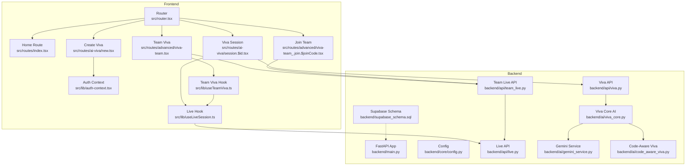
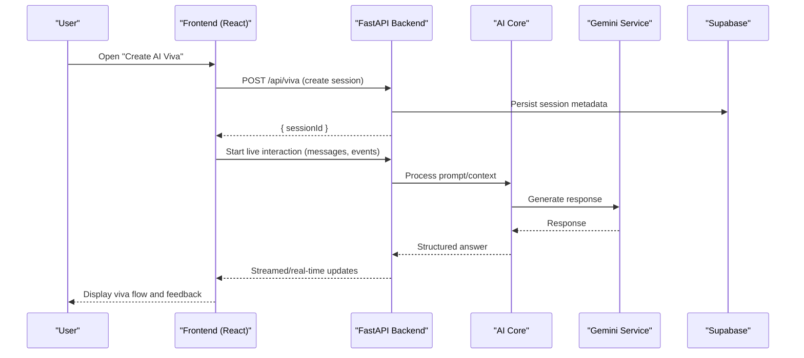
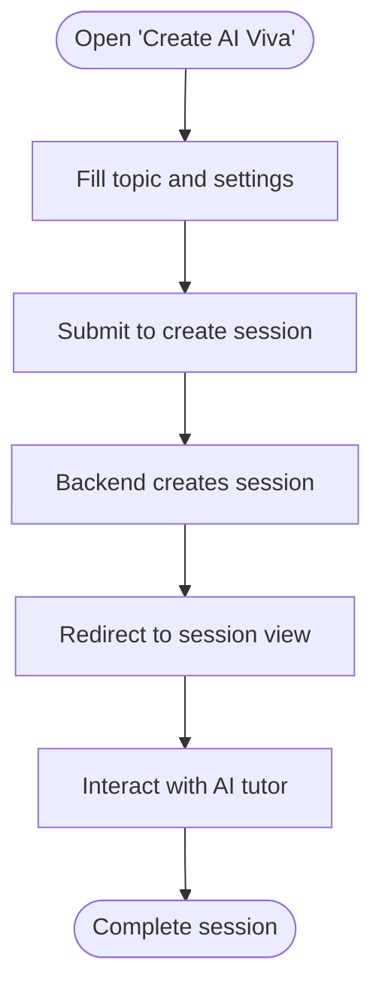
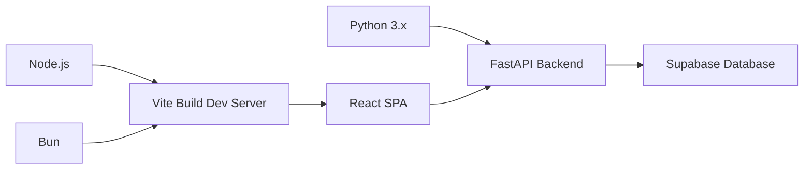

# Getting Started

<cite>
**Referenced Files in This Document**
- [README.md](file://README.md)
- [package.json](file://package.json)
- [vite.config.ts](file://vite.config.ts)
- [src/router.tsx](file://src/router.tsx)
- [src/routes/index.tsx](file://src/routes/index.tsx)
- [src/routes/ai-viva/new.tsx](file://src/routes/ai-viva/new.tsx)
- [src/routes/ai-viva/session.$id.tsx](file://src/routes/ai-viva/session.$id.tsx)
- [src/routes/advanced/viva-team.tsx](file://src/routes/advanced/viva-team.tsx)
- [src/routes/advanced/viva-team_.join.$joinCode.tsx](file://src/routes/advanced/viva-team_.join.$joinCode.tsx)
- [src/lib/auth-context.tsx](file://src/lib/auth-context.tsx)
- [src/lib/useLiveSession.ts](file://src/lib/useLiveSession.ts)
- [src/lib/useTeamViva.ts](file://src/lib/useTeamViva.ts)
- [backend/main.py](file://backend/main.py)
- [backend/core/config.py](file://backend/core/config.py)
- [backend/api/viva.py](file://backend/api/viva.py)
- [backend/api/team_live.py](file://backend/api/team_live.py)
- [backend/api/live.py](file://backend/api/live.py)
- [backend/ai/viva_core.py](file://backend/ai/viva_core.py)
- [backend/ai/gemini_service.py](file://backend/ai/gemini_service.py)
- [backend/ai/code_aware_viva.py](file://backend/ai/code_aware_viva.py)
- [backend/supabase_schema.sql](file://backend/supabase_schema.sql)
</cite>

## Table of Contents
1. Introduction
2. Project Structure
3. Core Components
4. Architecture Overview
5. Detailed Component Analysis
6. Dependency Analysis
7. Performance Considerations
8. Troubleshooting Guide
9. Conclusion

## Introduction
Horux is an AI-powered educational platform that provides intelligent assessment and tutoring experiences. It combines a modern React frontend with a FastAPI backend to deliver:
- AI-powered assessments (including viva-style sessions)
- Real-time collaboration for team-based learning
- Code-aware intelligence for technical skill evaluation
- A dashboard for progress tracking, analytics, and gamification

This guide helps you set up Horux locally for development or production, run the application, and complete your first tasks such as creating an AI viva session, joining a team workspace, and exploring the dashboard.

## Project Structure
The repository follows a clear separation between frontend and backend:
- Frontend (React + Vite): UI, routing, hooks, and client-side logic under src/
- Backend (FastAPI): API endpoints, AI services, database schema, and configuration under backend/
- Shared assets and documentation are at the root level

**Diagram sources**
- [src/router.tsx](file://src/router.tsx)
- [src/routes/index.tsx](file://src/routes/index.tsx)
- [src/routes/ai-viva/new.tsx](file://src/routes/ai-viva/new.tsx)
- [src/routes/ai-viva/session.$id.tsx](file://src/routes/ai-viva/session.$id.tsx)
- [src/routes/advanced/viva-team.tsx](file://src/routes/advanced/viva-team.tsx)
- [src/routes/advanced/viva-team_.join.$joinCode.tsx](file://src/routes/advanced/viva-team_.join.$joinCode.tsx)
- [src/lib/auth-context.tsx](file://src/lib/auth-context.tsx)
- [src/lib/useLiveSession.ts](file://src/lib/useLiveSession.ts)
- [src/lib/useTeamViva.ts](file://src/lib/useTeamViva.ts)
- [backend/main.py](file://backend/main.py)
- [backend/core/config.py](file://backend/core/config.py)
- [backend/api/viva.py](file://backend/api/viva.py)
- [backend/api/live.py](file://backend/api/live.py)
- [backend/api/team_live.py](file://backend/api/team_live.py)
- [backend/ai/viva_core.py](file://backend/ai/viva_core.py)
- [backend/ai/gemini_service.py](file://backend/ai/gemini_service.py)
- [backend/ai/code_aware_viva.py](file://backend/ai/code_aware_viva.py)
- [backend/supabase_schema.sql](file://backend/supabase_schema.sql)

**Section sources**
- [README.md](file://README.md)
- [package.json](file://package.json)
- [vite.config.ts](file://vite.config.ts)
- [src/router.tsx](file://src/router.tsx)
- [backend/main.py](file://backend/main.py)
- [backend/core/config.py](file://backend/core/config.py)
- [backend/supabase_schema.sql](file://backend/supabase_schema.sql)

## Core Components
- Frontend routing and pages:
  - Router entry and route definitions
  - AI viva creation and session views
  - Team viva and join flows
  - Authentication context for user state
  - Hooks for live sessions and team viva interactions
- Backend services:
  - FastAPI application and configuration
  - Viva API endpoints
  - Live and team-live APIs for real-time collaboration
  - AI core orchestrating Gemini and code-aware modules
  - Supabase schema for data persistence

Key responsibilities:
- The router wires UI routes to components and hooks.
- Auth context manages user sessions and permissions.
- Live hooks manage WebSocket-like interactions via REST/WebSocket endpoints.
- Backend AI core composes prompts and integrates external LLMs.
- Supabase schema defines tables and relationships used by the app.

**Section sources**
- [src/router.tsx](file://src/router.tsx)
- [src/routes/ai-viva/new.tsx](file://src/routes/ai-viva/new.tsx)
- [src/routes/ai-viva/session.$id.tsx](file://src/routes/ai-viva/session.$id.tsx)
- [src/routes/advanced/viva-team.tsx](file://src/routes/advanced/viva-team.tsx)
- [src/routes/advanced/viva-team_.join.$joinCode.tsx](file://src/routes/advanced/viva-team_.join.$joinCode.tsx)
- [src/lib/auth-context.tsx](file://src/lib/auth-context.tsx)
- [src/lib/useLiveSession.ts](file://src/lib/useLiveSession.ts)
- [src/lib/useTeamViva.ts](file://src/lib/useTeamViva.ts)
- [backend/main.py](file://backend/main.py)
- [backend/core/config.py](file://backend/core/config.py)
- [backend/api/viva.py](file://backend/api/viva.py)
- [backend/api/live.py](file://backend/api/live.py)
- [backend/api/team_live.py](file://backend/api/team_live.py)
- [backend/ai/viva_core.py](file://backend/ai/viva_core.py)
- [backend/ai/gemini_service.py](file://backend/ai/gemini_service.py)
- [backend/ai/code_aware_viva.py](file://backend/ai/code_aware_viva.py)
- [backend/supabase_schema.sql](file://backend/supabase_schema.sql)

## Architecture Overview
High-level architecture:
- React SPA served by Vite during development; build artifacts can be served statically in production.
- FastAPI backend exposes REST endpoints for viva, live collaboration, and AI processing.
- AI layer uses a core orchestrator to call Gemini and code-aware modules.
- Data persisted via Supabase according to the provided schema.

**Diagram sources**
- [src/routes/ai-viva/new.tsx](file://src/routes/ai-viva/new.tsx)
- [src/routes/ai-viva/session.$id.tsx](file://src/routes/ai-viva/session.$id.tsx)
- [backend/api/viva.py](file://backend/api/viva.py)
- [backend/api/live.py](file://backend/api/live.py)
- [backend/ai/viva_core.py](file://backend/ai/viva_core.py)
- [backend/ai/gemini_service.py](file://backend/ai/gemini_service.py)
- [backend/supabase_schema.sql](file://backend/supabase_schema.sql)

## Detailed Component Analysis

### Create Your First AI Viva Session
Flow overview:
- Navigate to the AI viva creation page.
- Provide required inputs (e.g., topic, difficulty).
- Submit to create a session on the backend.
- Enter the session view to interact with the AI tutor.

**Diagram sources**
- [src/routes/ai-viva/new.tsx](file://src/routes/ai-viva/new.tsx)
- [src/routes/ai-viva/session.$id.tsx](file://src/routes/ai-viva/session.$id.tsx)
- [backend/api/viva.py](file://backend/api/viva.py)

**Section sources**
- [src/routes/ai-viva/new.tsx](file://src/routes/ai-viva/new.tsx)
- [src/routes/ai-viva/session.$id.tsx](file://src/routes/ai-viva/session.$id.tsx)
- [backend/api/viva.py](file://backend/api/viva.py)

### Join a Team Workspace
Flow overview:
- Use the team viva route to start or join a session.
- Share a join code with teammates.
- Others enter the join code to collaborate in real time.

```mermaid
sequenceDiagram
participant Host as "Host"
participant Member as "Teammate"
participant FE as "Frontend"
participant BE as "Backend"
participant Live as "Live API"
Host->>FE : Open "Team Viva"
FE->>BE : Create team room
BE-->>FE : { roomId, joinCode }
Host->>FE : Share joinCode
Member->>FE : Enter joinCode
FE->>BE : Join team room
BE->>Live : Establish real-time channel
Live-->>FE : Sync participants and messages
```

**Diagram sources**
- [src/routes/advanced/viva-team.tsx](file://src/routes/advanced/viva-team.tsx)
- [src/routes/advanced/viva-team_.join.$joinCode.tsx](file://src/routes/advanced/viva-team_.join.$joinCode.tsx)
- [backend/api/team_live.py](file://backend/api/team_live.py)
- [backend/api/live.py](file://backend/api/live.py)

**Section sources**
- [src/routes/advanced/viva-team.tsx](file://src/routes/advanced/viva-team.tsx)
- [src/routes/advanced/viva-team_.join.$joinCode.tsx](file://src/routes/advanced/viva-team_.join.$joinCode.tsx)
- [backend/api/team_live.py](file://backend/api/team_live.py)
- [backend/api/live.py](file://backend/api/live.py)

### Explore the Dashboard
- After login, navigate to the home route to access dashboards, progress, and templates.
- Use the navigation menu to explore features like readiness, projects, and leaderboards.

**Section sources**
- [src/routes/index.tsx](file://src/routes/index.tsx)
- [src/router.tsx](file://src/router.tsx)

## Dependency Analysis
Runtime dependencies and environment:
- Node.js and Bun are supported for the frontend; see package manager scripts and lockfiles.
- Python 3.x with FastAPI for the backend.
- Supabase project for database and authentication.

**Diagram sources**
- [package.json](file://package.json)
- [vite.config.ts](file://vite.config.ts)
- [backend/main.py](file://backend/main.py)
- [backend/core/config.py](file://backend/core/config.py)
- [backend/supabase_schema.sql](file://backend/supabase_schema.sql)

**Section sources**
- [package.json](file://package.json)
- [vite.config.ts](file://vite.config.ts)
- [backend/main.py](file://backend/main.py)
- [backend/core/config.py](file://backend/core/config.py)
- [backend/supabase_schema.sql](file://backend/supabase_schema.sql)

## Performance Considerations
- Prefer streaming responses for long-running AI calls to improve perceived latency.
- Cache frequently accessed static content and use CDN in production.
- Limit payload sizes for live messages and debounce heavy operations on the client.
- Index database columns used in frequent queries per the Supabase schema.

[No sources needed since this section provides general guidance]

## Troubleshooting Guide
Common setup issues and resolutions:
- Missing environment variables: Ensure all required variables for Supabase and AI services are configured in both frontend and backend environments.
- CORS errors: Verify backend CORS settings allow the frontend origin during development and production.
- Port conflicts: Change dev server ports if default ports are already in use.
- Database migration: Apply the Supabase schema before starting the backend.
- Authentication failures: Confirm Supabase URL and keys match the configured values.

Operational checks:
- Validate backend health endpoint availability.
- Confirm frontend can reach backend endpoints without network errors.
- Review logs from both frontend and backend for stack traces and error messages.

**Section sources**
- [backend/core/config.py](file://backend/core/config.py)
- [backend/main.py](file://backend/main.py)
- [src/lib/auth-context.tsx](file://src/lib/auth-context.tsx)
- [backend/supabase_schema.sql](file://backend/supabase_schema.sql)

## Conclusion
You now have the essentials to install, configure, and run Horux. Use the steps above to create your first AI viva, collaborate in a team workspace, and explore the dashboard. For deeper customization, review the component and service files referenced throughout this guide.