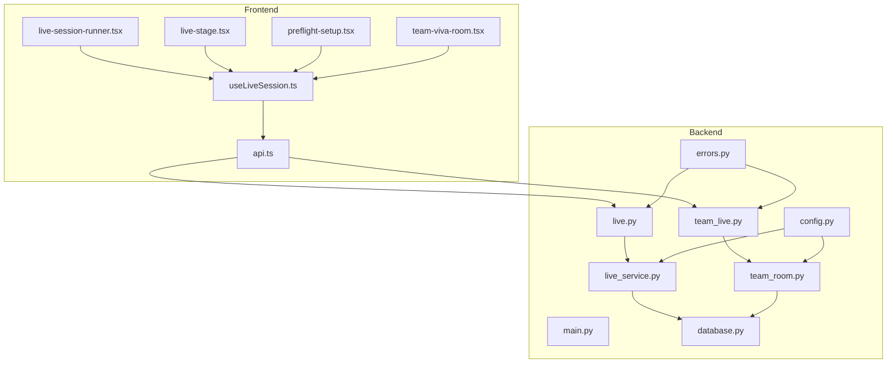
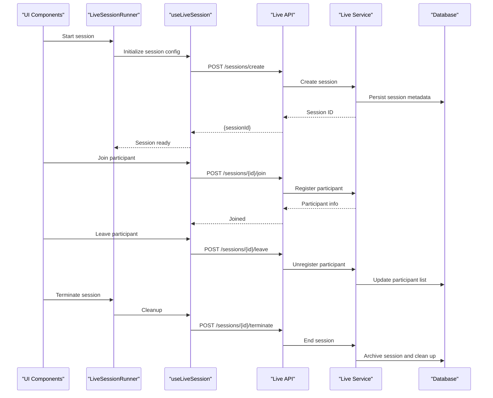
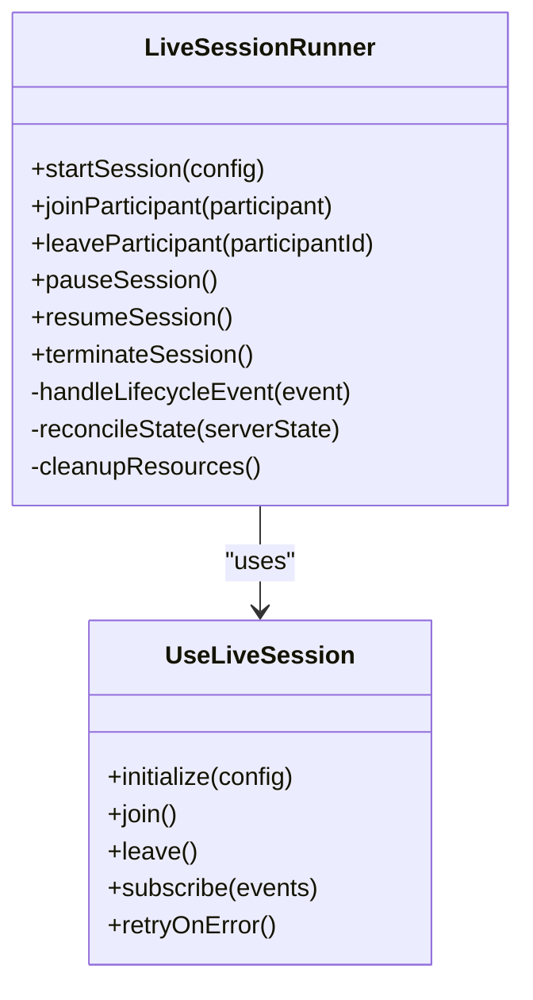
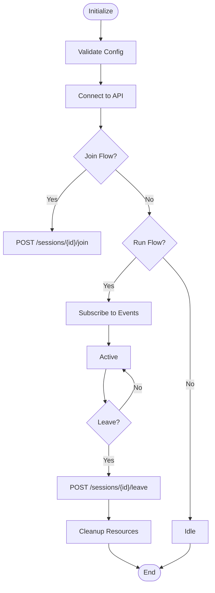
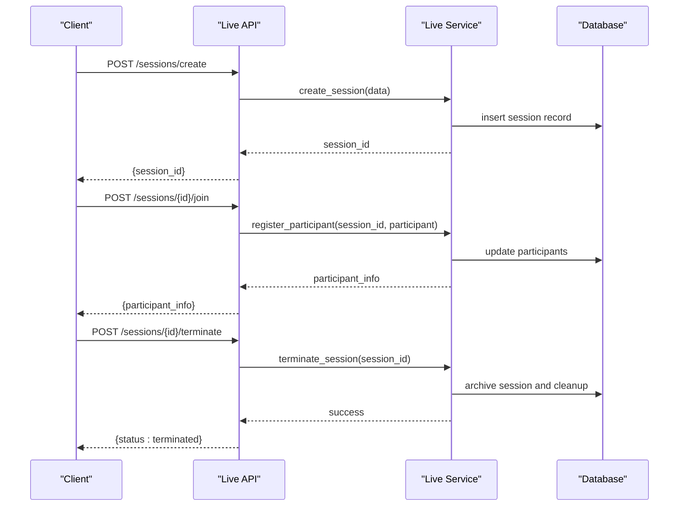
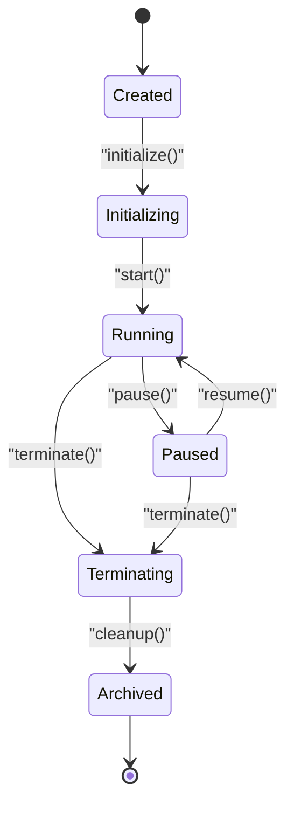
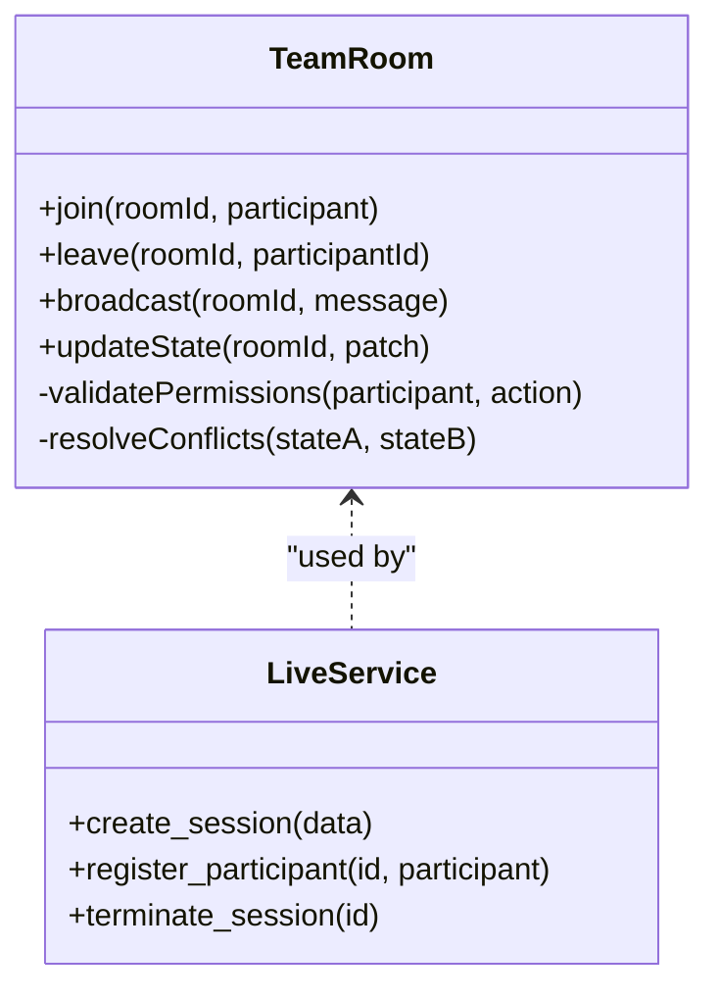
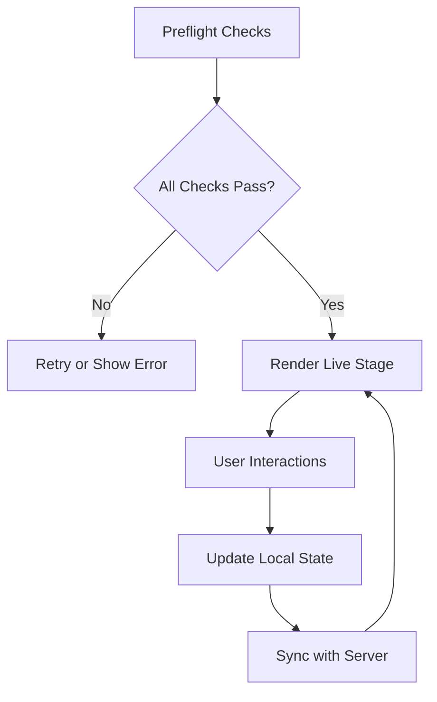
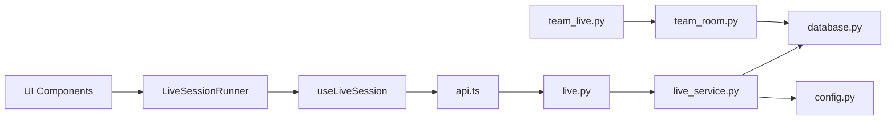

# Live Session Management

<cite>
**Referenced Files in This Document**
- [live-session-runner.tsx](file://src/components/live/live-session-runner.tsx)
- [live-stage.tsx](file://src/components/live/live-stage.tsx)
- [preflight-setup.tsx](file://src/components/live/preflight-setup.tsx)
- [team-viva-room.tsx](file://src/components/live/team-viva-room.tsx)
- [useLiveSession.ts](file://src/lib/useLiveSession.ts)
- [api.ts](file://src/lib/api.ts)
- [live.py](file://backend/api/live.py)
- [live_service.py](file://backend/ai/live_service.py)
- [team_live.py](file://backend/api/team_live.py)
- [team_room.py](file://backend/ai/team_room.py)
- [main.py](file://backend/main.py)
- [config.py](file://backend/core/config.py)
- [database.py](file://backend/core/database.py)
- [errors.py](file://backend/core/errors.py)
- [test_live_gate.py](file://backend/tests/test_live_gate.py)
- [test_live_persistence.py](file://backend/tests/test_live_persistence.py)
</cite>

## Table of Contents
1. [Introduction](#introduction)
2. [Project Structure](#project-structure)
3. [Core Components](#core-components)
4. [Architecture Overview](#architecture-overview)
5. [Detailed Component Analysis](#detailed-component-analysis)
6. [Dependency Analysis](#dependency-analysis)
7. [Performance Considerations](#performance-considerations)
8. [Troubleshooting Guide](#troubleshooting-guide)
9. [Conclusion](#conclusion)
10. [Appendices](#appendices)

## Introduction
This document explains the live session management system in Horux, covering both frontend orchestration and backend services. It details the session lifecycle from creation to termination, participant join/leave flows, state transitions, persistence, and cleanup. It also documents the LiveSessionRunner architecture for managing concurrent sessions, the backend live service for persistence and coordination, configuration options, error handling patterns, performance optimizations, and scalability best practices.

## Project Structure
The live session feature spans React components, hooks, and API utilities on the frontend, and FastAPI endpoints plus AI services on the backend. The key areas are:
- Frontend components: session runner, stage rendering, preflight checks, and team room UI
- Frontend hooks and API: session state management and HTTP/WebSocket interactions
- Backend APIs: REST endpoints for session operations and team live features
- Backend services: in-memory or persistent session state, participant tracking, and cross-participant coordination
- Configuration and database: environment settings and schema for session/participant records

**Diagram sources**
- [live-session-runner.tsx](file://src/components/live/live-session-runner.tsx)
- [live-stage.tsx](file://src/components/live/live-stage.tsx)
- [preflight-setup.tsx](file://src/components/live/preflight-setup.tsx)
- [team-viva-room.tsx](file://src/components/live/team-viva-room.tsx)
- [useLiveSession.ts](file://src/lib/useLiveSession.ts)
- [api.ts](file://src/lib/api.ts)
- [main.py](file://backend/main.py)
- [live.py](file://backend/api/live.py)
- [team_live.py](file://backend/api/team_live.py)
- [live_service.py](file://backend/ai/live_service.py)
- [team_room.py](file://backend/ai/team_room.py)
- [config.py](file://backend/core/config.py)
- [database.py](file://backend/core/database.py)
- [errors.py](file://backend/core/errors.py)

**Section sources**
- [live-session-runner.tsx](file://src/components/live/live-session-runner.tsx)
- [live-stage.tsx](file://src/components/live/live-stage.tsx)
- [preflight-setup.tsx](file://src/components/live/preflight-setup.tsx)
- [team-viva-room.tsx](file://src/components/live/team-viva-room.tsx)
- [useLiveSession.ts](file://src/lib/useLiveSession.ts)
- [api.ts](file://src/lib/api.ts)
- [live.py](file://backend/api/live.py)
- [team_live.py](file://backend/api/team_live.py)
- [live_service.py](file://backend/ai/live_service.py)
- [team_room.py](file://backend/ai/team_room.py)
- [config.py](file://backend/core/config.py)
- [database.py](file://backend/core/database.py)
- [errors.py](file://backend/core/errors.py)

## Core Components
- LiveSessionRunner (frontend): Orchestrates multiple concurrent sessions, manages lifecycle events, and coordinates UI state across participants.
- useLiveSession (frontend hook): Encapsulates session state, network calls, reconnection logic, and event subscriptions.
- Live Stage (frontend): Renders session-specific content and handles user interactions within a session context.
- Preflight Setup (frontend): Validates device permissions, connectivity, and environment before starting a session.
- Team Viva Room (frontend): Manages multi-participant collaboration UI and real-time updates.
- Live API (backend): Exposes endpoints for creating, joining, updating, and terminating sessions; persists session metadata and participant lists.
- Live Service (backend): Implements core session lifecycle, participant tracking, broadcasting, and resource cleanup.
- Team Room (backend): Coordinates multi-user state, presence, and collaborative actions.

Key responsibilities:
- Lifecycle: create -> initialize -> running -> pause/resume -> terminate
- Participant flow: join -> validate -> subscribe -> active -> leave -> cleanup
- State synchronization: server authoritative state with client reconciliation
- Error handling: retry, fallback, and graceful degradation
- Performance: batching, throttling, connection pooling, and efficient serialization

**Section sources**
- [live-session-runner.tsx](file://src/components/live/live-session-runner.tsx)
- [useLiveSession.ts](file://src/lib/useLiveSession.ts)
- [live-stage.tsx](file://src/components/live/live-stage.tsx)
- [preflight-setup.tsx](file://src/components/live/preflight-setup.tsx)
- [team-viva-room.tsx](file://src/components/live/team-viva-room.tsx)
- [live.py](file://backend/api/live.py)
- [live_service.py](file://backend/ai/live_service.py)
- [team_live.py](file://backend/api/team_live.py)
- [team_room.py](file://backend/ai/team_room.py)

## Architecture Overview
The system follows a client-server model with a clear separation of concerns:
- Frontend components manage UI and local state, delegating lifecycle and coordination to the LiveSessionRunner and useLiveSession hook.
- Backend APIs expose REST endpoints that delegate to services for business logic and persistence.
- Services maintain session state, participant registries, and broadcast channels.
- Configuration centralizes runtime parameters such as timeouts, concurrency limits, and storage backends.

**Diagram sources**
- [live-session-runner.tsx](file://src/components/live/live-session-runner.tsx)
- [useLiveSession.ts](file://src/lib/useLiveSession.ts)
- [live.py](file://backend/api/live.py)
- [live_service.py](file://backend/ai/live_service.py)
- [database.py](file://backend/core/database.py)

## Detailed Component Analysis

### LiveSessionRunner (Frontend)
Responsibilities:
- Manage multiple concurrent sessions with isolated contexts
- Coordinate lifecycle transitions (create, start, pause, resume, terminate)
- Handle participant join/leave events and UI synchronization
- Aggregate errors and provide recovery strategies

**Diagram sources**
- [live-session-runner.tsx](file://src/components/live/live-session-runner.tsx)
- [useLiveSession.ts](file://src/lib/useLiveSession.ts)

**Section sources**
- [live-session-runner.tsx](file://src/components/live/live-session-runner.tsx)
- [useLiveSession.ts](file://src/lib/useLiveSession.ts)

### useLiveSession (Frontend Hook)
Responsibilities:
- Encapsulate session state and side effects
- Manage HTTP requests and WebSocket connections
- Implement retry/backoff and reconnection logic
- Normalize server responses into consistent client state

**Diagram sources**
- [useLiveSession.ts](file://src/lib/useLiveSession.ts)
- [api.ts](file://src/lib/api.ts)

**Section sources**
- [useLiveSession.ts](file://src/lib/useLiveSession.ts)
- [api.ts](file://src/lib/api.ts)

### Live API (Backend)
Responsibilities:
- Provide REST endpoints for session CRUD and participant management
- Validate inputs and enforce authorization
- Delegate to services for business logic and persistence
- Return standardized error responses

**Diagram sources**
- [live.py](file://backend/api/live.py)
- [live_service.py](file://backend/ai/live_service.py)
- [database.py](file://backend/core/database.py)

**Section sources**
- [live.py](file://backend/api/live.py)
- [live_service.py](file://backend/ai/live_service.py)
- [database.py](file://backend/core/database.py)

### Live Service (Backend)
Responsibilities:
- Maintain authoritative session state and participant registry
- Broadcast events to connected clients
- Enforce session lifecycle rules and transitions
- Perform resource cleanup and archival

**Diagram sources**
- [live_service.py](file://backend/ai/live_service.py)

**Section sources**
- [live_service.py](file://backend/ai/live_service.py)

### Team Room (Backend)
Responsibilities:
- Coordinate multi-participant collaboration state
- Manage presence, roles, and permissions
- Handle collaborative actions and conflict resolution

**Diagram sources**
- [team_room.py](file://backend/ai/team_room.py)
- [live_service.py](file://backend/ai/live_service.py)

**Section sources**
- [team_room.py](file://backend/ai/team_room.py)
- [live_service.py](file://backend/ai/live_service.py)

### Frontend UI Components
- Live Stage: Renders session content based on current state and user role
- Preflight Setup: Ensures microphone/camera permissions and network readiness
- Team Viva Room: Displays participant list, chat, and collaborative tools

**Diagram sources**
- [live-stage.tsx](file://src/components/live/live-stage.tsx)
- [preflight-setup.tsx](file://src/components/live/preflight-setup.tsx)
- [team-viva-room.tsx](file://src/components/live/team-viva-room.tsx)

**Section sources**
- [live-stage.tsx](file://src/components/live/live-stage.tsx)
- [preflight-setup.tsx](file://src/components/live/preflight-setup.tsx)
- [team-viva-room.tsx](file://src/components/live/team-viva-room.tsx)

## Dependency Analysis
The system exhibits clear layering:
- UI components depend on the LiveSessionRunner and useLiveSession hook
- useLiveSession depends on api.ts for HTTP/WebSocket communication
- Backend APIs depend on services for business logic and persistence
- Services depend on configuration and database modules

**Diagram sources**
- [live-session-runner.tsx](file://src/components/live/live-session-runner.tsx)
- [useLiveSession.ts](file://src/lib/useLiveSession.ts)
- [api.ts](file://src/lib/api.ts)
- [live.py](file://backend/api/live.py)
- [live_service.py](file://backend/ai/live_service.py)
- [team_live.py](file://backend/api/team_live.py)
- [team_room.py](file://backend/ai/team_room.py)
- [database.py](file://backend/core/database.py)
- [config.py](file://backend/core/config.py)

**Section sources**
- [live-session-runner.tsx](file://src/components/live/live-session-runner.tsx)
- [useLiveSession.ts](file://src/lib/useLiveSession.ts)
- [api.ts](file://src/lib/api.ts)
- [live.py](file://backend/api/live.py)
- [live_service.py](file://backend/ai/live_service.py)
- [team_live.py](file://backend/api/team_live.py)
- [team_room.py](file://backend/ai/team_room.py)
- [database.py](file://backend/core/database.py)
- [config.py](file://backend/core/config.py)

## Performance Considerations
- Connection management: Pool HTTP connections, reuse WebSocket instances, and implement exponential backoff for retries
- State synchronization: Minimize payload size, batch updates, and use optimistic updates with rollback on failure
- Concurrency control: Limit concurrent sessions per process, use async I/O, and avoid blocking operations
- Memory usage: Clean up timers, listeners, and large objects promptly; implement session TTLs and background purges
- Serialization: Prefer compact formats (e.g., JSON over verbose payloads), compress where appropriate
- Database access: Use indexes on session and participant keys, paginate queries, and cache frequently accessed data

[No sources needed since this section provides general guidance]

## Troubleshooting Guide
Common issues and resolutions:
- Session creation failures: Check API availability, input validation, and database connectivity
- Participant join errors: Verify authentication, session existence, and capacity limits
- State desynchronization: Inspect event ordering, implement idempotency, and reconcile server state
- Resource leaks: Ensure cleanup on unmount, handle disconnects gracefully, and monitor open connections
- Performance bottlenecks: Profile CPU and memory, reduce unnecessary renders, and optimize network calls

Error handling patterns:
- Centralized error types and codes
- User-friendly messages with actionable hints
- Logging and telemetry for diagnostics

**Section sources**
- [errors.py](file://backend/core/errors.py)
- [test_live_gate.py](file://backend/tests/test_live_gate.py)
- [test_live_persistence.py](file://backend/tests/test_live_persistence.py)

## Conclusion
The live session management system in Horux combines a robust frontend orchestrator with a scalable backend service layer. By following the documented lifecycle, state transitions, and best practices, teams can build reliable, high-performance live experiences that scale to many concurrent users. Emphasizing proper error handling, resource cleanup, and performance optimization ensures stability under load.

[No sources needed since this section summarizes without analyzing specific files]

## Appendices

### Session Configuration Options
- Timeouts: connect timeout, request timeout, heartbeat interval
- Retries: max attempts, backoff strategy, jitter
- Concurrency: max sessions per process, max participants per session
- Storage: database backend, caching layer, archival policy
- Security: authentication method, authorization rules, rate limiting

[No sources needed since this section provides general guidance]

### Scalability Best Practices
- Horizontal scaling: Stateless API nodes, shared session store, distributed pub/sub
- Partitioning: Shard sessions by tenant or region to limit hotspots
- Monitoring: Track latency, error rates, and resource utilization
- Graceful degradation: Fallback modes when dependencies fail

[No sources needed since this section provides general guidance]