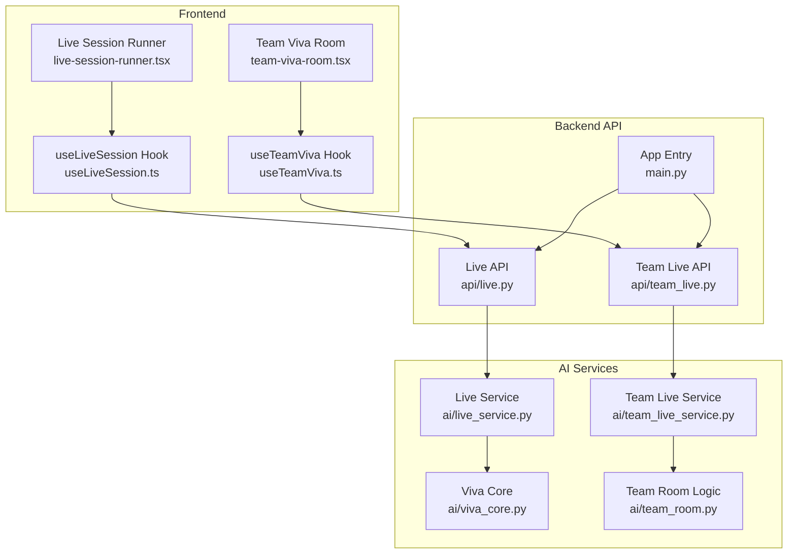
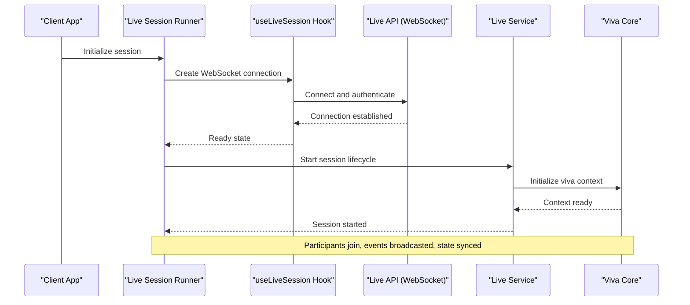
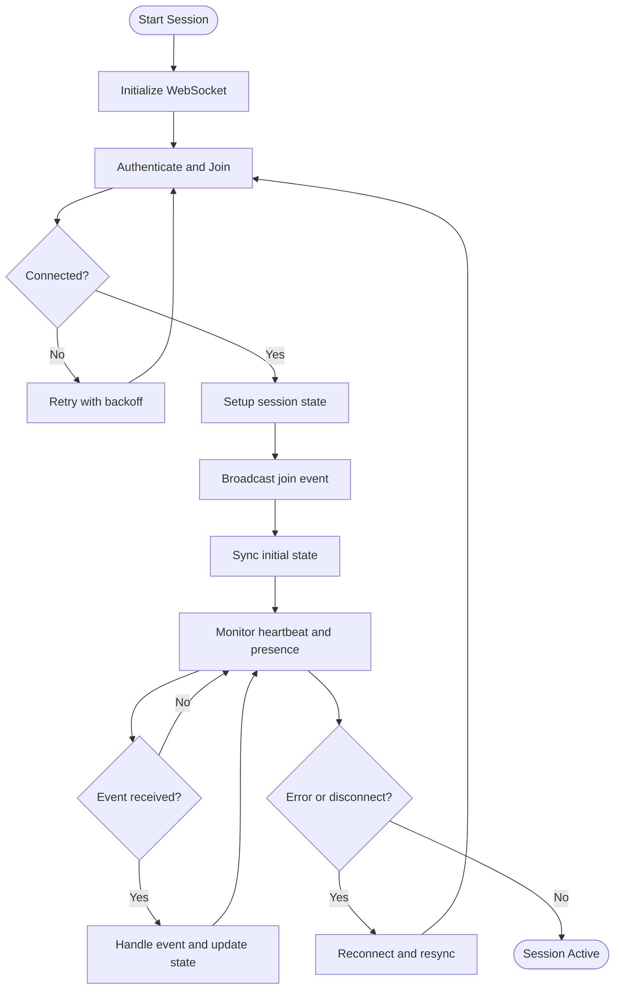
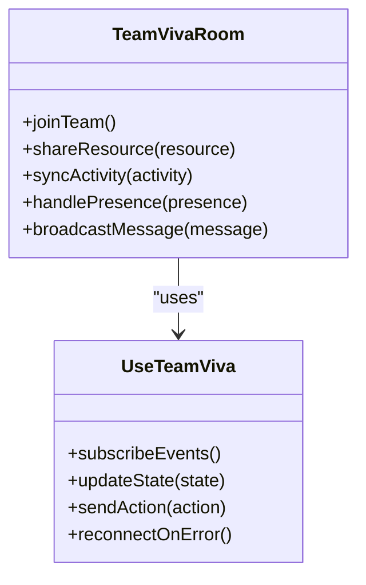
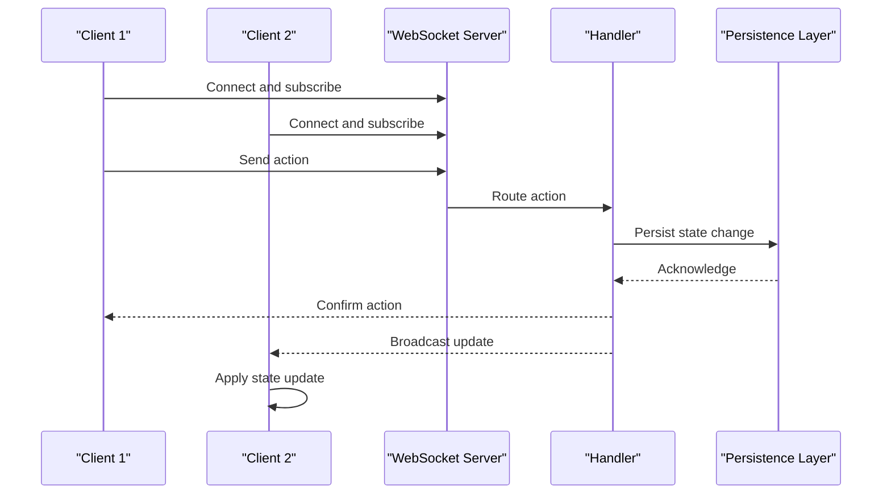
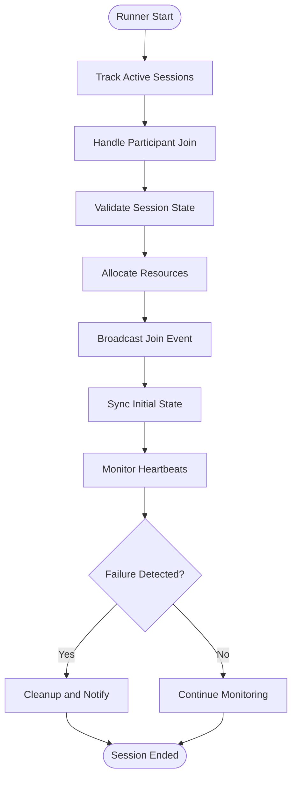
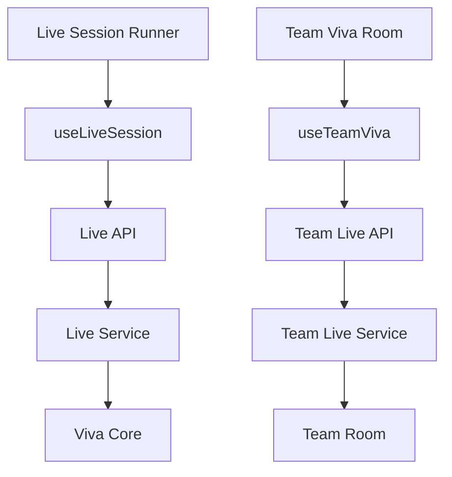

# Real-Time Collaboration

<cite>
**Referenced Files in This Document**
- [live-session-runner.tsx](file://src/components/live/live-session-runner.tsx)
- [team-viva-room.tsx](file://src/components/live/team-viva-room.tsx)
- [useLiveSession.ts](file://src/lib/useLiveSession.ts)
- [useTeamViva.ts](file://src/lib/useTeamViva.ts)
- [live.py](file://backend/api/live.py)
- [team_live.py](file://backend/api/team_live.py)
- [main.py](file://backend/main.py)
- [viva_core.py](file://backend/ai/viva_core.py)
- [team_room.py](file://backend/ai/team_room.py)
- [live_service.py](file://backend/ai/live_service.py)
- [team_live_service.py](file://backend/ai/team_live_service.py)
</cite>

## Table of Contents
1. [Introduction](#introduction)
2. [Project Structure](#project-structure)
3. [Core Components](#core-components)
4. [Architecture Overview](#architecture-overview)
5. [Detailed Component Analysis](#detailed-component-analysis)
6. [Dependency Analysis](#dependency-analysis)
7. [Performance Considerations](#performance-considerations)
8. [Troubleshooting Guide](#troubleshooting-guide)
9. [Conclusion](#conclusion)
10. [Appendices](#appendices)

## Introduction
This document explains the Horux real-time collaboration system built on WebSocket technology. It covers live session management, participant coordination, resource allocation, and the team viva room functionality for collaborative learning. It also details the live session runner implementation for managing concurrent sessions, handling connection failures, and ensuring data consistency. Finally, it provides guidelines for implementing new real-time features, optimizing WebSocket performance, and scaling for large user groups.

## Project Structure
The real-time collaboration features are implemented across both frontend and backend:
- Frontend components manage UI state, WebSocket lifecycle, and event handling for live sessions and team viva rooms.
- Backend APIs expose endpoints for session orchestration, broadcasting, and persistence.
- AI services provide domain logic for viva sessions and team collaboration workflows.

**Diagram sources**
- [live-session-runner.tsx](file://src/components/live/live-session-runner.tsx)
- [team-viva-room.tsx](file://src/components/live/team-viva-room.tsx)
- [useLiveSession.ts](file://src/lib/useLiveSession.ts)
- [useTeamViva.ts](file://src/lib/useTeamViva.ts)
- [live.py](file://backend/api/live.py)
- [team_live.py](file://backend/api/team_live.py)
- [main.py](file://backend/main.py)
- [viva_core.py](file://backend/ai/viva_core.py)
- [team_room.py](file://backend/ai/team_room.py)
- [live_service.py](file://backend/ai/live_service.py)
- [team_live_service.py](file://backend/ai/team_live_service.py)

**Section sources**
- [live-session-runner.tsx](file://src/components/live/live-session-runner.tsx)
- [team-viva-room.tsx](file://src/components/live/team-viva-room.tsx)
- [useLiveSession.ts](file://src/lib/useLiveSession.ts)
- [useTeamViva.ts](file://src/lib/useTeamViva.ts)
- [live.py](file://backend/api/live.py)
- [team_live.py](file://backend/api/team_live.py)
- [main.py](file://backend/main.py)
- [viva_core.py](file://backend/ai/viva_core.py)
- [team_room.py](file://backend/ai/team_room.py)
- [live_service.py](file://backend/ai/live_service.py)
- [team_live_service.py](file://backend/ai/team_live_service.py)

## Core Components
- Live Session Runner: Orchestrates session lifecycle, manages participants, coordinates resources, and handles reconnection and failure recovery.
- Team Viva Room: Provides a collaborative environment with shared resources, synchronized activities, and group interactions.
- useLiveSession Hook: Encapsulates WebSocket lifecycle, message routing, and state synchronization for live sessions.
- useTeamViva Hook: Manages team-specific events, presence, and shared state for viva sessions.
- Backend Live APIs: Expose REST/WebSocket endpoints to create/join sessions, broadcast events, and persist state.
- AI Services: Implement viva logic, team room workflows, and live session orchestration.

**Section sources**
- [live-session-runner.tsx](file://src/components/live/live-session-runner.tsx)
- [team-viva-room.tsx](file://src/components/live/team-viva-room.tsx)
- [useLiveSession.ts](file://src/lib/useLiveSession.ts)
- [useTeamViva.ts](file://src/lib/useTeamViva.ts)
- [live.py](file://backend/api/live.py)
- [team_live.py](file://backend/api/team_live.py)
- [live_service.py](file://backend/ai/live_service.py)
- [team_live_service.py](file://backend/ai/team_live_service.py)

## Architecture Overview
The system follows a client-server architecture with WebSocket-based real-time communication:
- Clients connect via WebSockets to backend endpoints for live sessions and team viva rooms.
- The server maintains session state, participant presence, and broadcasts events to relevant clients.
- AI services coordinate domain-specific logic for viva sessions and team collaboration.

**Diagram sources**
- [live-session-runner.tsx](file://src/components/live/live-session-runner.tsx)
- [useLiveSession.ts](file://src/lib/useLiveSession.ts)
- [live.py](file://backend/api/live.py)
- [live_service.py](file://backend/ai/live_service.py)
- [viva_core.py](file://backend/ai/viva_core.py)

**Section sources**
- [live-session-runner.tsx](file://src/components/live/live-session-runner.tsx)
- [useLiveSession.ts](file://src/lib/useLiveSession.ts)
- [live.py](file://backend/api/live.py)
- [live_service.py](file://backend/ai/live_service.py)
- [viva_core.py](file://backend/ai/viva_core.py)

## Detailed Component Analysis

### Live Session Runner
The Live Session Runner manages the full lifecycle of a live session:
- Creates and joins sessions, tracks participants, and allocates resources.
- Handles reconnection strategies, error propagation, and graceful degradation.
- Coordinates with hooks and backend APIs for event broadcasting and state sync.

**Diagram sources**
- [live-session-runner.tsx](file://src/components/live/live-session-runner.tsx)
- [useLiveSession.ts](file://src/lib/useLiveSession.ts)

**Section sources**
- [live-session-runner.tsx](file://src/components/live/live-session-runner.tsx)
- [useLiveSession.ts](file://src/lib/useLiveSession.ts)

### Team Viva Room
The Team Viva Room enables collaborative learning environments:
- Manages shared resources, synchronized activities, and group interactions.
- Uses dedicated hooks for presence, messaging, and state synchronization.
- Integrates with backend team live APIs for event broadcasting and persistence.

**Diagram sources**
- [team-viva-room.tsx](file://src/components/live/team-viva-room.tsx)
- [useTeamViva.ts](file://src/lib/useTeamViva.ts)

**Section sources**
- [team-viva-room.tsx](file://src/components/live/team-viva-room.tsx)
- [useTeamViva.ts](file://src/lib/useTeamViva.ts)

### WebSocket Communication Patterns
Real-time messaging and event broadcasting follow consistent patterns:
- Clients establish WebSocket connections and subscribe to channels.
- Server routes messages to appropriate handlers and broadcasts to participants.
- State synchronization uses incremental updates and conflict resolution.

**Diagram sources**
- [live.py](file://backend/api/live.py)
- [team_live.py](file://backend/api/team_live.py)

**Section sources**
- [live.py](file://backend/api/live.py)
- [team_live.py](file://backend/api/team_live.py)

### Live Session Runner Implementation
The runner ensures concurrent session management and data consistency:
- Tracks active sessions and participant counts.
- Implements retry logic and exponential backoff for reconnections.
- Validates and transforms events before broadcasting.

**Diagram sources**
- [live-session-runner.tsx](file://src/components/live/live-session-runner.tsx)

**Section sources**
- [live-session-runner.tsx](file://src/components/live/live-session-runner.tsx)

## Dependency Analysis
The real-time collaboration system has clear dependency relationships:
- Frontend components depend on hooks for WebSocket management.
- Hooks depend on backend APIs for session orchestration.
- Backend APIs depend on AI services for domain logic.

**Diagram sources**
- [live-session-runner.tsx](file://src/components/live/live-session-runner.tsx)
- [team-viva-room.tsx](file://src/components/live/team-viva-room.tsx)
- [useLiveSession.ts](file://src/lib/useLiveSession.ts)
- [useTeamViva.ts](file://src/lib/useTeamViva.ts)
- [live.py](file://backend/api/live.py)
- [team_live.py](file://backend/api/team_live.py)
- [live_service.py](file://backend/ai/live_service.py)
- [team_live_service.py](file://backend/ai/team_live_service.py)
- [viva_core.py](file://backend/ai/viva_core.py)
- [team_room.py](file://backend/ai/team_room.py)

**Section sources**
- [live-session-runner.tsx](file://src/components/live/live-session-runner.tsx)
- [team-viva-room.tsx](file://src/components/live/team-viva-room.tsx)
- [useLiveSession.ts](file://src/lib/useLiveSession.ts)
- [useTeamViva.ts](file://src/lib/useTeamViva.ts)
- [live.py](file://backend/api/live.py)
- [team_live.py](file://backend/api/team_live.py)
- [live_service.py](file://backend/ai/live_service.py)
- [team_live_service.py](file://backend/ai/team_live_service.py)
- [viva_core.py](file://backend/ai/viva_core.py)
- [team_room.py](file://backend/ai/team_room.py)

## Performance Considerations
- Optimize WebSocket message sizes by batching updates and using efficient serialization.
- Implement connection pooling and reuse existing connections where possible.
- Use compression for large payloads and minimize handshake overhead.
- Scale horizontally by distributing sessions across multiple server instances.
- Monitor memory usage and implement garbage collection for long-running sessions.

[No sources needed since this section provides general guidance]

## Troubleshooting Guide
Common issues and solutions:
- Connection failures: Check network connectivity and implement retry logic with exponential backoff.
- Message delivery: Verify channel subscriptions and ensure proper authentication.
- State inconsistencies: Implement optimistic updates with rollback mechanisms.
- Memory leaks: Monitor WebSocket connections and clean up unused resources.

**Section sources**
- [live-session-runner.tsx](file://src/components/live/live-session-runner.tsx)
- [useLiveSession.ts](file://src/lib/useLiveSession.ts)

## Conclusion
The Horux real-time collaboration system provides robust WebSocket-based communication for live sessions and team viva rooms. The architecture supports concurrent session management, participant coordination, and scalable performance. By following the guidelines for implementation and optimization, developers can extend the system with new real-time features while maintaining reliability and performance.

[No sources needed since this section summarizes without analyzing specific files]

## Appendices

### Guidelines for Implementing New Real-Time Features
- Follow established WebSocket patterns for connection management and event handling.
- Implement proper error handling and reconnection strategies.
- Use hooks to encapsulate WebSocket logic and maintain separation of concerns.
- Test thoroughly with multiple concurrent users and network conditions.

### Optimizing WebSocket Performance
- Minimize message frequency by batching updates.
- Use efficient data formats like Protocol Buffers or MessagePack.
- Implement connection health checks and automatic reconnection.
- Monitor performance metrics and optimize bottlenecks.

### Scaling for Large User Groups
- Use horizontal scaling with load balancers.
- Implement sharding strategies for large sessions.
- Optimize database queries and use caching layers.
- Monitor resource utilization and scale proactively.

[No sources needed since this section provides general guidance]