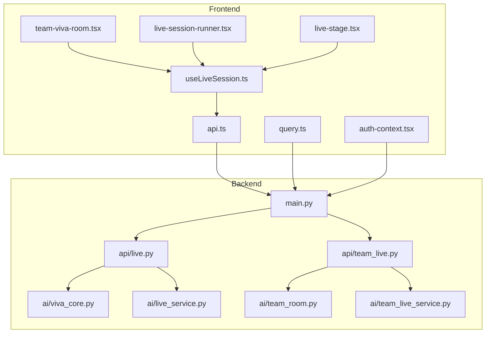
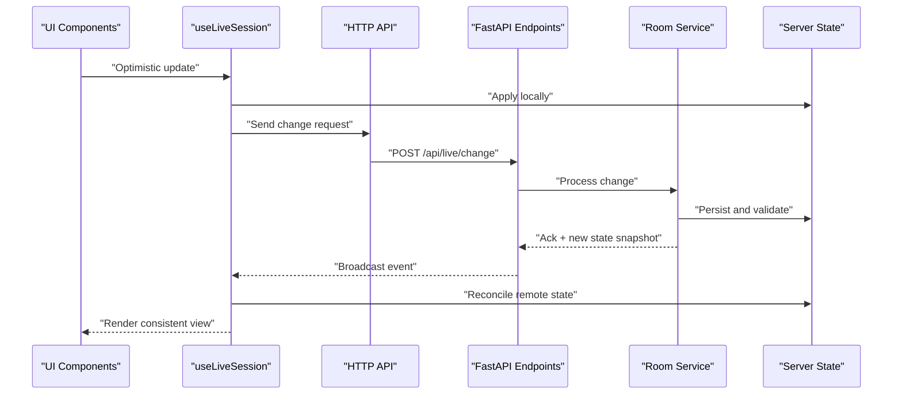
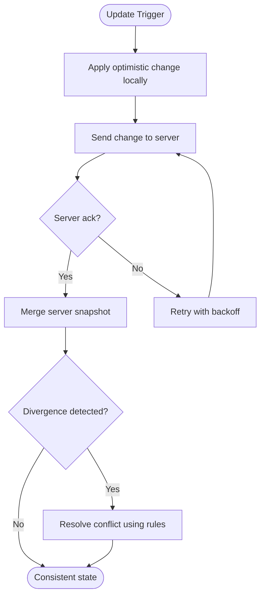
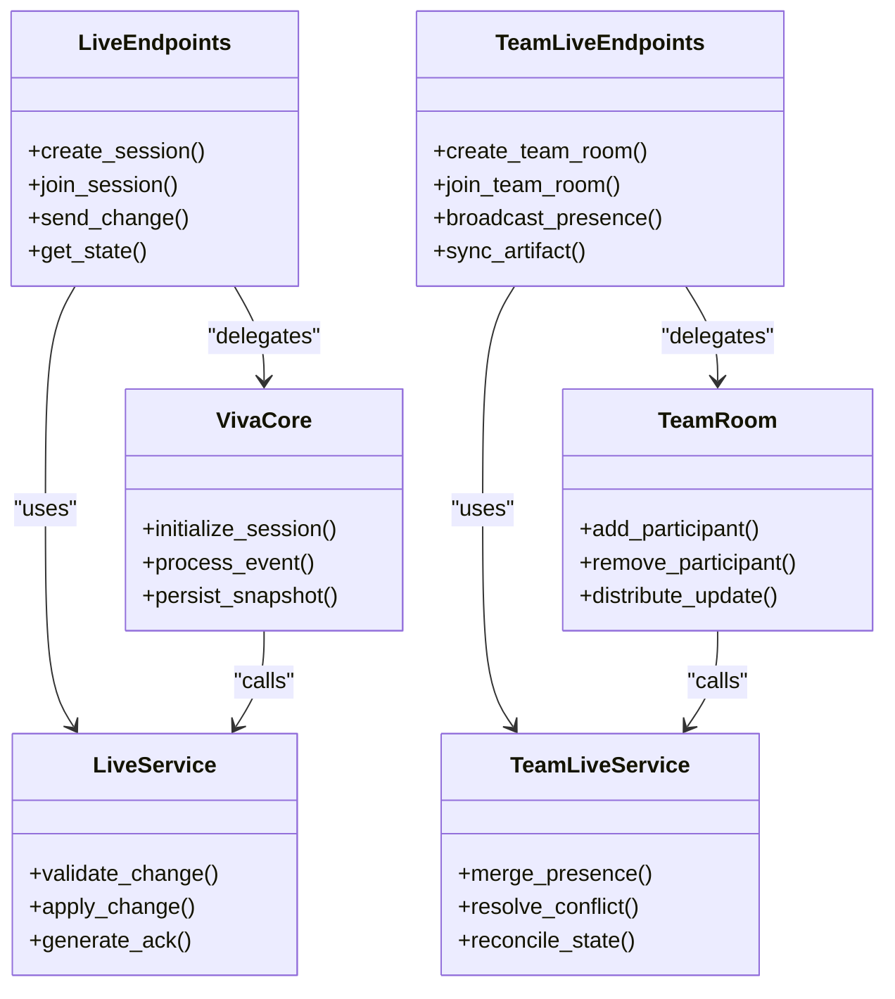
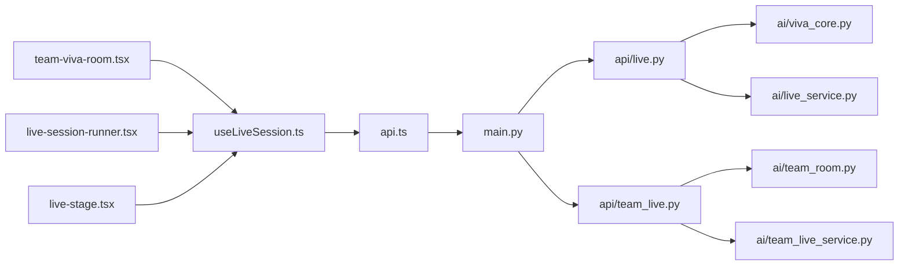

# Real-Time State Synchronization

<cite>
**Referenced Files in This Document**
- [useLiveSession.ts](file://src/lib/useLiveSession.ts)
- [team-viva-room.tsx](file://src/components/live/team-viva-room.tsx)
- [live-session-runner.tsx](file://src/components/live/live-session-runner.tsx)
- [live-stage.tsx](file://src/components/live/live-stage.tsx)
- [api.ts](file://src/lib/api.ts)
- [query.ts](file://src/lib/query.ts)
- [auth-context.tsx](file://src/lib/auth-context.tsx)
- [main.py](file://backend/main.py)
- [live.py](file://backend/api/live.py)
- [team_live.py](file://backend/api/team_live.py)
- [viva_core.py](file://backend/ai/viva_core.py)
- [team_room.py](file://backend/ai/team_room.py)
- [live_service.py](file://backend/ai/live_service.py)
- [team_live_service.py](file://backend/ai/team_live_service.py)
</cite>

## Table of Contents
1. [Introduction](#introduction)
2. [Project Structure](#project-structure)
3. [Core Components](#core-components)
4. [Architecture Overview](#architecture-overview)
5. [Detailed Component Analysis](#detailed-component-analysis)
6. [Dependency Analysis](#dependency-analysis)
7. [Performance Considerations](#performance-considerations)
8. [Troubleshooting Guide](#troubleshooting-guide)
9. [Conclusion](#conclusion)
10. [Appendices](#appendices)

## Introduction
This document explains the real-time state synchronization system used by Horux to keep multiple connected clients consistent during live sessions and team rooms. It covers local state caching, optimistic updates, conflict resolution, broadcasting protocols, offline handling, and reconciliation strategies. It also provides implementation patterns for user presence, activity progress, and shared resources, along with guidance on custom synchronization, bandwidth optimization, data integrity, performance at scale, and latency minimization.

## Project Structure
The real-time system spans both frontend and backend:
- Frontend: React hooks and components manage client-side state, optimistic UI, and event-driven updates.
- Backend: FastAPI endpoints and AI services coordinate room lifecycle, presence, and message routing.

**Diagram sources**
- [useLiveSession.ts](file://src/lib/useLiveSession.ts)
- [team-viva-room.tsx](file://src/components/live/team-viva-room.tsx)
- [live-session-runner.tsx](file://src/components/live/live-session-runner.tsx)
- [live-stage.tsx](file://src/components/live/live-stage.tsx)
- [api.ts](file://src/lib/api.ts)
- [query.ts](file://src/lib/query.ts)
- [auth-context.tsx](file://src/lib/auth-context.tsx)
- [main.py](file://backend/main.py)
- [live.py](file://backend/api/live.py)
- [team_live.py](file://backend/api/team_live.py)
- [viva_core.py](file://backend/ai/viva_core.py)
- [team_room.py](file://backend/ai/team_room.py)
- [live_service.py](file://backend/ai/live_service.py)
- [team_live_service.py](file://backend/ai/team_live_service.py)

**Section sources**
- [useLiveSession.ts](file://src/lib/useLiveSession.ts)
- [team-viva-room.tsx](file://src/components/live/team-viva-room.tsx)
- [live-session-runner.tsx](file://src/components/live/live-session-runner.tsx)
- [live-stage.tsx](file://src/components/live/live-stage.tsx)
- [api.ts](file://src/lib/api.ts)
- [query.ts](file://src/lib/query.ts)
- [auth-context.tsx](file://src/lib/auth-context.tsx)
- [main.py](file://backend/main.py)
- [live.py](file://backend/api/live.py)
- [team_live.py](file://backend/api/team_live.py)
- [viva_core.py](file://backend/ai/viva_core.py)
- [team_room.py](file://backend/ai/team_room.py)
- [live_service.py](file://backend/ai/live_service.py)
- [team_live_service.py](file://backend/ai/team_live_service.py)

## Core Components
- Client session manager (hook): Encapsulates connection lifecycle, presence, events, and local cache. Provides methods to update state optimistically and reconcile server-driven changes.
- Room orchestrator component: Manages per-room subscriptions, renders stage content, and coordinates user interactions.
- Live runner component: Initializes sessions, handles start/stop flows, and surfaces status to UI.
- Stage component: Displays synchronized artifacts and reflects real-time updates.
- API layer: Thin HTTP client for REST calls and optional transport abstraction.
- Query utilities: Data fetching and caching helpers that integrate with optimistic updates.
- Auth context: Supplies identity and token management for authenticated sessions.

Key responsibilities:
- Local state caching with versioning and timestamps.
- Optimistic updates with rollback on failure.
- Event-driven reconciliation from server broadcasts.
- Presence tracking and heartbeat mechanisms.
- Offline buffering and replay upon reconnection.

**Section sources**
- [useLiveSession.ts](file://src/lib/useLiveSession.ts)
- [team-viva-room.tsx](file://src/components/live/team-viva-room.tsx)
- [live-session-runner.tsx](file://src/components/live/live-session-runner.tsx)
- [live-stage.tsx](file://src/components/live/live-stage.tsx)
- [api.ts](file://src/lib/api.ts)
- [query.ts](file://src/lib/query.ts)
- [auth-context.tsx](file://src/lib/auth-context.tsx)

## Architecture Overview
The system uses a hub-and-spoke model where each client connects to a backend service that maintains room state and distributes updates to all participants. The frontend maintains an optimistic local cache and reconciles against authoritative server state.

**Diagram sources**
- [useLiveSession.ts](file://src/lib/useLiveSession.ts)
- [api.ts](file://src/lib/api.ts)
- [live.py](file://backend/api/live.py)
- [team_live.py](file://backend/api/team_live.py)
- [viva_core.py](file://backend/ai/viva_core.py)
- [team_room.py](file://backend/ai/team_room.py)
- [live_service.py](file://backend/ai/live_service.py)
- [team_live_service.py](file://backend/ai/team_live_service.py)

## Detailed Component Analysis

### Client Session Manager (useLiveSession)
Responsibilities:
- Establishes and manages the connection to the backend.
- Maintains a local cache with versioned snapshots and timestamps.
- Applies optimistic updates immediately, then reconciles after server acknowledgment.
- Subscribes to broadcast events and merges them into local state deterministically.
- Handles offline scenarios by buffering operations and replaying on reconnect.
- Exposes presence APIs and heartbeat logic.

Implementation patterns:
- Versioned cache entries with last-writer-wins semantics and conflict markers.
- Idempotent operation IDs to deduplicate retries.
- Debounced batching for high-frequency updates.
- Deterministic merge functions keyed by entity type.

**Diagram sources**
- [useLiveSession.ts](file://src/lib/useLiveSession.ts)

**Section sources**
- [useLiveSession.ts](file://src/lib/useLiveSession.ts)

### Room Orchestrator (team-viva-room)
Responsibilities:
- Creates or joins a room and subscribes to relevant channels.
- Coordinates user presence and permissions.
- Delegates rendering to stage and runner components.
- Handles lifecycle events like join/leave and error boundaries.

Integration points:
- Uses the session hook for presence and events.
- Calls API endpoints for room setup and configuration.
- Integrates with auth context for identity.

**Section sources**
- [team-viva-room.tsx](file://src/components/live/team-viva-room.tsx)
- [useLiveSession.ts](file://src/lib/useLiveSession.ts)
- [api.ts](file://src/lib/api.ts)
- [auth-context.tsx](file://src/lib/auth-context.tsx)

### Live Runner (live-session-runner)
Responsibilities:
- Initializes a live session, sets up timers, and monitors health.
- Starts/stops stages and notifies participants.
- Surfaces status indicators and error states.

Integration points:
- Uses session hook for control commands.
- Calls API endpoints for session lifecycle.

**Section sources**
- [live-session-runner.tsx](file://src/components/live/live-session-runner.tsx)
- [useLiveSession.ts](file://src/lib/useLiveSession.ts)
- [api.ts](file://src/lib/api.ts)

### Stage (live-stage)
Responsibilities:
- Renders synchronized artifacts such as slides, notes, or media.
- Reflects real-time updates without jarring re-renders.
- Implements lightweight diffing to minimize repaints.

Integration points:
- Consumes session state and events.
- Optionally requests incremental diffs via API.

**Section sources**
- [live-stage.tsx](file://src/components/live/live-stage.tsx)
- [useLiveSession.ts](file://src/lib/useLiveSession.ts)

### API Layer (api.ts)
Responsibilities:
- Wraps HTTP calls with retry, timeout, and error mapping.
- Provides typed interfaces for live endpoints.
- Supports optional transport abstraction for future WebSocket integration.

**Section sources**
- [api.ts](file://src/lib/api.ts)

### Query Utilities (query.ts)
Responsibilities:
- Fetches initial state and caches it with TTL.
- Integrates with optimistic updates by invalidating or patching cached entries.
- Provides selectors for derived state.

**Section sources**
- [query.ts](file://src/lib/query.ts)

### Auth Context (auth-context.tsx)
Responsibilities:
- Manages authentication state and tokens.
- Ensures secure access to live endpoints.
- Propagates user identity to session and room layers.

**Section sources**
- [auth-context.tsx](file://src/lib/auth-context.tsx)

### Backend Services
- main.py: Application entry point and router registration.
- api/live.py: Live session endpoints for creating, joining, and controlling sessions.
- api/team_live.py: Team-specific live endpoints for multi-user collaboration.
- ai/viva_core.py: Core orchestration logic for live sessions.
- ai/team_room.py: Room-level coordination and state distribution.
- ai/live_service.py: Live session business logic and persistence.
- ai/team_live_service.py: Team collaboration logic and presence management.

**Diagram sources**
- [main.py](file://backend/main.py)
- [live.py](file://backend/api/live.py)
- [team_live.py](file://backend/api/team_live.py)
- [viva_core.py](file://backend/ai/viva_core.py)
- [team_room.py](file://backend/ai/team_room.py)
- [live_service.py](file://backend/ai/live_service.py)
- [team_live_service.py](file://backend/ai/team_live_service.py)

**Section sources**
- [main.py](file://backend/main.py)
- [live.py](file://backend/api/live.py)
- [team_live.py](file://backend/api/team_live.py)
- [viva_core.py](file://backend/ai/viva_core.py)
- [team_room.py](file://backend/ai/team_room.py)
- [live_service.py](file://backend/ai/live_service.py)
- [team_live_service.py](file://backend/ai/team_live_service.py)

## Dependency Analysis
The frontend depends on API and query utilities for data and mutations, while the backend exposes endpoints that delegate to core services and room managers.

**Diagram sources**
- [useLiveSession.ts](file://src/lib/useLiveSession.ts)
- [team-viva-room.tsx](file://src/components/live/team-viva-room.tsx)
- [live-session-runner.tsx](file://src/components/live/live-session-runner.tsx)
- [live-stage.tsx](file://src/components/live/live-stage.tsx)
- [api.ts](file://src/lib/api.ts)
- [main.py](file://backend/main.py)
- [live.py](file://backend/api/live.py)
- [team_live.py](file://backend/api/team_live.py)
- [viva_core.py](file://backend/ai/viva_core.py)
- [team_room.py](file://backend/ai/team_room.py)
- [live_service.py](file://backend/ai/live_service.py)
- [team_live_service.py](file://backend/ai/team_live_service.py)

**Section sources**
- [useLiveSession.ts](file://src/lib/useLiveSession.ts)
- [team-viva-room.tsx](file://src/components/live/team-viva-room.tsx)
- [live-session-runner.tsx](file://src/components/live/live-session-runner.tsx)
- [live-stage.tsx](file://src/components/live/live-stage.tsx)
- [api.ts](file://src/lib/api.ts)
- [main.py](file://backend/main.py)
- [live.py](file://backend/api/live.py)
- [team_live.py](file://backend/api/team_live.py)
- [viva_core.py](file://backend/ai/viva_core.py)
- [team_room.py](file://backend/ai/team_room.py)
- [live_service.py](file://backend/ai/live_service.py)
- [team_live_service.py](file://backend/ai/team_live_service.py)

## Performance Considerations
- Bandwidth optimization:
  - Batch frequent updates and coalesce deltas.
  - Use incremental diffs for large artifacts.
  - Throttle presence heartbeats and compress payloads.
- Latency minimization:
  - Prefer edge locations for endpoints.
  - Implement short-lived connections with fast failover.
  - Cache hot reads aggressively with stale-while-revalidate.
- Large teams:
  - Partition rooms by topic or subchannel.
  - Shard presence and artifact state across workers.
  - Use priority queues for critical updates.
- Integrity and consistency:
  - Enforce idempotency keys for mutations.
  - Maintain monotonic clocks and sequence numbers.
  - Validate server-side before broadcasting.

[No sources needed since this section provides general guidance]

## Troubleshooting Guide
Common issues and resolutions:
- Stale UI after network blip:
  - Ensure reconciliation runs on reconnect and invalidates local cache.
  - Verify idempotency keys prevent duplicate application.
- Conflicting edits:
  - Check conflict resolution rules and deterministic merge functions.
  - Log divergence details and present user prompts if necessary.
- High CPU usage on large artifacts:
  - Switch to delta-based updates and virtualized rendering.
  - Debounce heavy computations and offload to web workers.
- Presence drift:
  - Normalize heartbeat intervals and implement exponential backoff.
  - Periodically resync presence snapshots from server.

**Section sources**
- [useLiveSession.ts](file://src/lib/useLiveSession.ts)
- [team-viva-room.tsx](file://src/components/live/team-viva-room.tsx)
- [live-service.py](file://backend/ai/live_service.py)
- [team_live_service.py](file://backend/ai/team_live_service.py)

## Conclusion
Horux’s real-time synchronization combines optimistic local updates, robust reconciliation, and scalable backend services to maintain consistency across clients. By applying versioned caching, idempotent mutations, and efficient broadcasting, the system supports collaborative features with low latency and strong integrity. For large teams, partitioning, sharding, and prioritization further enhance performance and reliability.

[No sources needed since this section summarizes without analyzing specific files]

## Appendices

### Implementation Patterns

#### User Presence
- Track join/leave events and heartbeat signals.
- Merge presence snapshots periodically to correct drift.
- Limit broadcast frequency and compress payload.

**Section sources**
- [team-viva-room.tsx](file://src/components/live/team-viva-room.tsx)
- [team_live_service.py](file://backend/ai/team_live_service.py)

#### Activity Progress
- Emit small, frequent progress deltas with sequence numbers.
- Debounce and batch updates to reduce traffic.
- Reconcile on server ack; roll back on failure.

**Section sources**
- [useLiveSession.ts](file://src/lib/useLiveSession.ts)
- [live_service.py](file://backend/ai/live_service.py)

#### Shared Resources
- Use chunked uploads and resumable transfers.
- Apply server-authoritative validation and hashing.
- Broadcast minimal metadata and fetch full resource on demand.

**Section sources**
- [api.ts](file://src/lib/api.ts)
- [live.py](file://backend/api/live.py)

### Custom State Synchronization Example Outline
- Define a schema with version and timestamp fields.
- Implement optimistic apply and server mutation call.
- Subscribe to broadcast events and merge deterministically.
- Handle conflicts with explicit resolution strategy.
- Add telemetry for latency and error rates.

**Section sources**
- [useLiveSession.ts](file://src/lib/useLiveSession.ts)
- [query.ts](file://src/lib/query.ts)