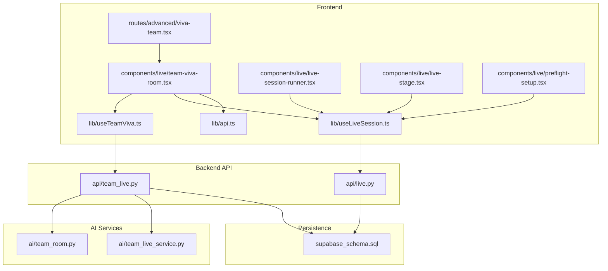
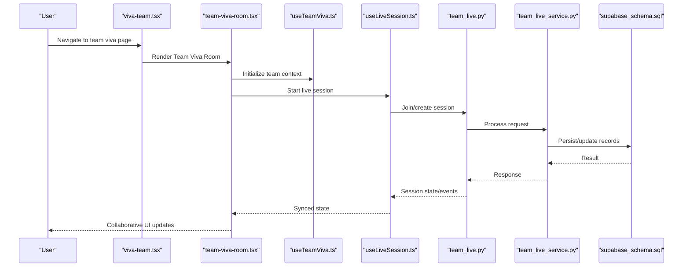
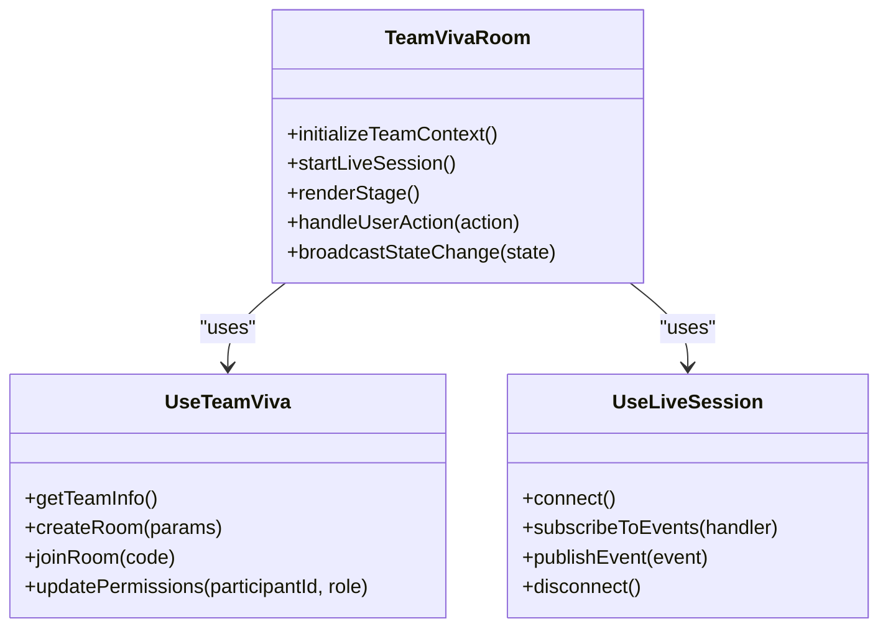
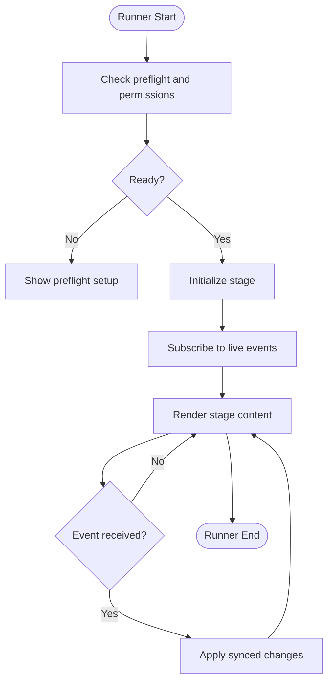
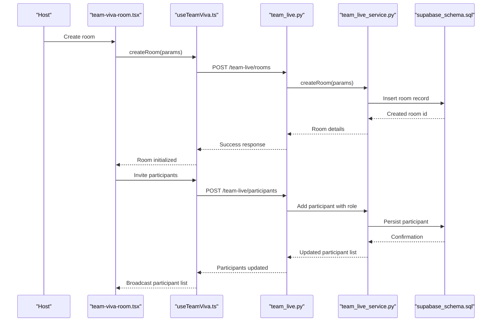
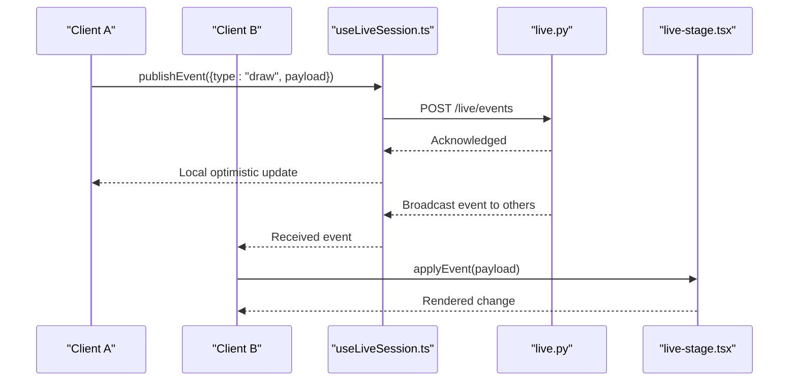
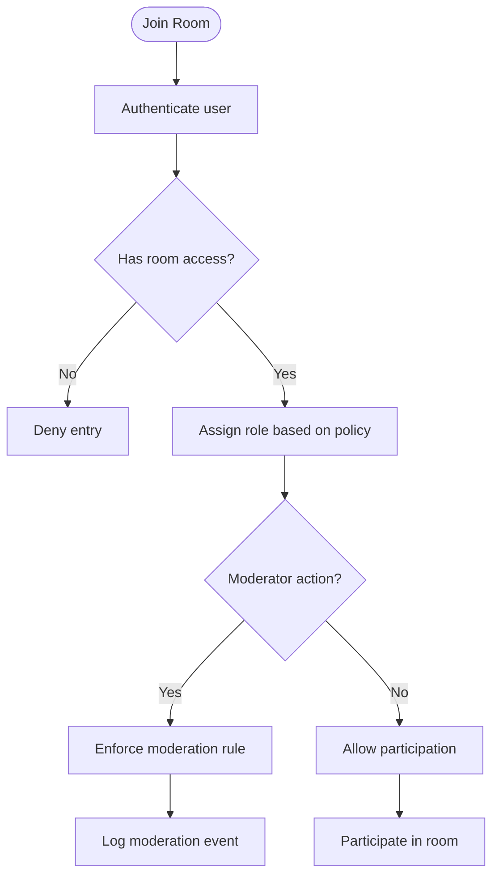
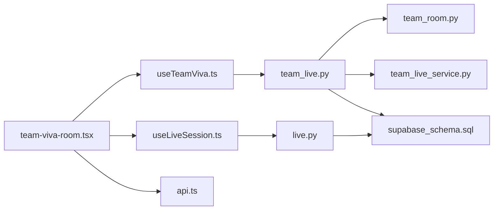

# Team Collaboration Features

<cite>
**Referenced Files in This Document**
- [team-viva-room.tsx](file://src/components/live/team-viva-room.tsx)
- [useTeamViva.ts](file://src/lib/useTeamViva.ts)
- [viva-team.tsx](file://src/routes/advanced/viva-team.tsx)
- [viva-team_.join.$joinCode.tsx](file://src/routes/advanced/viva-team_.join.$joinCode.tsx)
- [live-session-runner.tsx](file://src/components/live/live-session-runner.tsx)
- [live-stage.tsx](file://src/components/live/live-stage.tsx)
- [preflight-setup.tsx](file://src/components/live/preflight-setup.tsx)
- [api.ts](file://src/lib/api.ts)
- [useLiveSession.ts](file://src/lib/useLiveSession.ts)
- [team_live.py](file://backend/api/team_live.py)
- [team_room.py](file://backend/ai/team_room.py)
- [team_live_service.py](file://backend/ai/team_live_service.py)
- [live.py](file://backend/api/live.py)
- [supabase_schema.sql](file://backend/supabase_schema.sql)
</cite>

## Table of Contents
1. [Introduction](#introduction)
2. [Project Structure](#project-structure)
3. [Core Components](#core-components)
4. [Architecture Overview](#architecture-overview)
5. [Detailed Component Analysis](#detailed-component-analysis)
6. [Dependency Analysis](#dependency-analysis)
7. [Performance Considerations](#performance-considerations)
8. [Troubleshooting Guide](#troubleshooting-guide)
9. [Conclusion](#conclusion)
10. [Appendices](#appendices)

## Introduction
This document explains the team collaboration features that enable synchronized learning environments in Horux, focusing on the Team Viva Room component and its supporting backend services. It covers:
- The Team Viva Room architecture for creating collaborative spaces where multiple users participate in shared activities
- Team room management including creation, participant permissions, and resource sharing
- Real-time synchronization mechanisms for consistent state across participants, concurrent edits, and conflict resolution
- Examples of implementing collaborative features such as shared whiteboards, joint assessments, and group discussions
- Security models, access controls, and moderation capabilities specific to teams

## Project Structure
The collaboration feature spans both frontend and backend layers:
- Frontend components orchestrate the Team Viva Room experience and integrate with live session hooks
- Backend APIs expose endpoints for team live sessions and room management
- AI services provide additional intelligence for team rooms (e.g., summarization, metrics)
- Database schema defines persistence for sessions, participants, and related resources

**Diagram sources**
- [viva-team.tsx](file://src/routes/advanced/viva-team.tsx)
- [team-viva-room.tsx](file://src/components/live/team-viva-room.tsx)
- [live-session-runner.tsx](file://src/components/live/live-session-runner.tsx)
- [live-stage.tsx](file://src/components/live/live-stage.tsx)
- [preflight-setup.tsx](file://src/components/live/preflight-setup.tsx)
- [useTeamViva.ts](file://src/lib/useTeamViva.ts)
- [useLiveSession.ts](file://src/lib/useLiveSession.ts)
- [api.ts](file://src/lib/api.ts)
- [team_live.py](file://backend/api/team_live.py)
- [live.py](file://backend/api/live.py)
- [team_room.py](file://backend/ai/team_room.py)
- [team_live_service.py](file://backend/ai/team_live_service.py)
- [supabase_schema.sql](file://backend/supabase_schema.sql)

**Section sources**
- [viva-team.tsx](file://src/routes/advanced/viva-team.tsx)
- [team-viva-room.tsx](file://src/components/live/team-viva-room.tsx)
- [live-session-runner.tsx](file://src/components/live/live-session-runner.tsx)
- [live-stage.tsx](file://src/components/live/live-stage.tsx)
- [preflight-setup.tsx](file://src/components/live/preflight-setup.tsx)
- [useTeamViva.ts](file://src/lib/useTeamViva.ts)
- [useLiveSession.ts](file://src/lib/useLiveSession.ts)
- [api.ts](file://src/lib/api.ts)
- [team_live.py](file://backend/api/team_live.py)
- [live.py](file://backend/api/live.py)
- [team_room.py](file://backend/ai/team_room.py)
- [team_live_service.py](file://backend/ai/team_live_service.py)
- [supabase_schema.sql](file://backend/supabase_schema.sql)

## Core Components
- Team Viva Room (frontend): Orchestrates multi-user participation, manages local UI state, and integrates with real-time hooks and APIs
- Live Session Runner (frontend): Coordinates lifecycle events for a live session and delegates to stage components
- Live Stage (frontend): Renders the active collaborative activity surface (e.g., whiteboard, assessment view)
- Preflight Setup (frontend): Validates device/network readiness before joining a session
- useTeamViva hook (frontend): Encapsulates team-specific logic for room operations and state
- useLiveSession hook (frontend): Manages real-time connection, presence, and event handling
- Team Live API (backend): Provides endpoints for room creation, joining, participant management, and resource sharing
- Team Room AI service (backend): Adds intelligence to team rooms (e.g., insights, summaries)
- Team Live Service (backend): Implements business logic for live session coordination
- Live API (backend): General live session endpoints used by the system
- Persistence layer (database schema): Defines tables for sessions, participants, and related entities

Key responsibilities:
- Room lifecycle: create, join, update, and close
- Participant management: roles, permissions, and moderation actions
- Real-time sync: presence, state updates, and conflict resolution strategies
- Resource sharing: attaching files, links, or collaborative artifacts to a room

**Section sources**
- [team-viva-room.tsx](file://src/components/live/team-viva-room.tsx)
- [live-session-runner.tsx](file://src/components/live/live-session-runner.tsx)
- [live-stage.tsx](file://src/components/live/live-stage.tsx)
- [preflight-setup.tsx](file://src/components/live/preflight-setup.tsx)
- [useTeamViva.ts](file://src/lib/useTeamViva.ts)
- [useLiveSession.ts](file://src/lib/useLiveSession.ts)
- [team_live.py](file://backend/api/team_live.py)
- [team_room.py](file://backend/ai/team_room.py)
- [team_live_service.py](file://backend/ai/team_live_service.py)
- [live.py](file://backend/api/live.py)
- [supabase_schema.sql](file://backend/supabase_schema.sql)

## Architecture Overview
The Team Viva Room is composed of a cohesive set of frontend components and backend services that collaborate to deliver synchronized experiences.

**Diagram sources**
- [viva-team.tsx](file://src/routes/advanced/viva-team.tsx)
- [team-viva-room.tsx](file://src/components/live/team-viva-room.tsx)
- [useTeamViva.ts](file://src/lib/useTeamViva.ts)
- [useLiveSession.ts](file://src/lib/useLiveSession.ts)
- [team_live.py](file://backend/api/team_live.py)
- [team_live_service.py](file://backend/ai/team_live_service.py)
- [supabase_schema.sql](file://backend/supabase_schema.sql)

## Detailed Component Analysis

### Team Viva Room Component
The Team Viva Room orchestrates the collaborative environment:
- Initializes team context via the team hook
- Starts and manages the live session through the live session hook
- Delegates rendering to the live stage based on current activity
- Handles user interactions and broadcasts changes to other participants

**Diagram sources**
- [team-viva-room.tsx](file://src/components/live/team-viva-room.tsx)
- [useTeamViva.ts](file://src/lib/useTeamViva.ts)
- [useLiveSession.ts](file://src/lib/useLiveSession.ts)

**Section sources**
- [team-viva-room.tsx](file://src/components/live/team-viva-room.tsx)
- [useTeamViva.ts](file://src/lib/useTeamViva.ts)
- [useLiveSession.ts](file://src/lib/useLiveSession.ts)

### Live Session Runner and Stage
- Live Session Runner coordinates lifecycle events (start, pause, resume, end) and ensures proper sequencing of stage transitions
- Live Stage renders the active collaborative surface and subscribes to real-time events to reflect changes from all participants

**Diagram sources**
- [live-session-runner.tsx](file://src/components/live/live-session-runner.tsx)
- [live-stage.tsx](file://src/components/live/live-stage.tsx)
- [preflight-setup.tsx](file://src/components/live/preflight-setup.tsx)

**Section sources**
- [live-session-runner.tsx](file://src/components/live/live-session-runner.tsx)
- [live-stage.tsx](file://src/components/live/live-stage.tsx)
- [preflight-setup.tsx](file://src/components/live/preflight-setup.tsx)

### Team Room Management System
Room management includes:
- Creating a new team room with initial configuration
- Joining an existing room using a join code or invitation link
- Managing participant roles and permissions (e.g., host, moderator, member)
- Sharing resources within the room (files, links, collaborative artifacts)

**Diagram sources**
- [team-viva-room.tsx](file://src/components/live/team-viva-room.tsx)
- [useTeamViva.ts](file://src/lib/useTeamViva.ts)
- [team_live.py](file://backend/api/team_live.py)
- [team_live_service.py](file://backend/ai/team_live_service.py)
- [supabase_schema.sql](file://backend/supabase_schema.sql)

**Section sources**
- [team-viva-room.tsx](file://src/components/live/team-viva-room.tsx)
- [useTeamViva.ts](file://src/lib/useTeamViva.ts)
- [team_live.py](file://backend/api/team_live.py)
- [team_live_service.py](file://backend/ai/team_live_service.py)
- [supabase_schema.sql](file://backend/supabase_schema.sql)

### Real-Time Synchronization Mechanisms
Synchronization maintains consistent state across participants:
- Presence tracking shows who is online and their roles
- Event-driven updates propagate changes (e.g., drawing strokes, text edits)
- Conflict resolution strategies ensure deterministic outcomes when concurrent edits occur

**Diagram sources**
- [useLiveSession.ts](file://src/lib/useLiveSession.ts)
- [live.py](file://backend/api/live.py)
- [live-stage.tsx](file://src/components/live/live-stage.tsx)

**Section sources**
- [useLiveSession.ts](file://src/lib/useLiveSession.ts)
- [live.py](file://backend/api/live.py)
- [live-stage.tsx](file://src/components/live/live-stage.tsx)

### Implementing Collaborative Features
Examples of building collaborative features within the Team Viva Room:
- Shared whiteboard: Use the live stage to render a canvas; publish draw events and apply them across clients
- Joint assessments: Share question sets and answers; synchronize selections and submissions
- Group discussions: Enable chat-like messaging with presence indicators and moderation controls

Implementation patterns:
- Define event types for each collaborative action
- Publish events from the client and subscribe to receive updates
- Apply changes deterministically on the stage to maintain consistency

**Section sources**
- [live-stage.tsx](file://src/components/live/live-stage.tsx)
- [useLiveSession.ts](file://src/lib/useLiveSession.ts)
- [team-viva-room.tsx](file://src/components/live/team-viva-room.tsx)

### Security Models, Access Controls, and Moderation
Security and moderation are enforced at multiple layers:
- Authentication and authorization checks before room creation or joining
- Role-based permissions for participants (host, moderator, member)
- Moderation actions such as muting, removing participants, or restricting resource sharing
- Audit logging for sensitive operations

**Diagram sources**
- [team_live.py](file://backend/api/team_live.py)
- [team_live_service.py](file://backend/ai/team_live_service.py)
- [supabase_schema.sql](file://backend/supabase_schema.sql)

**Section sources**
- [team_live.py](file://backend/api/team_live.py)
- [team_live_service.py](file://backend/ai/team_live_service.py)
- [supabase_schema.sql](file://backend/supabase_schema.sql)

## Dependency Analysis
The collaboration feature depends on well-defined interfaces between frontend components, hooks, backend APIs, and AI services.

**Diagram sources**
- [team-viva-room.tsx](file://src/components/live/team-viva-room.tsx)
- [useTeamViva.ts](file://src/lib/useTeamViva.ts)
- [useLiveSession.ts](file://src/lib/useLiveSession.ts)
- [api.ts](file://src/lib/api.ts)
- [live.py](file://backend/api/live.py)
- [team_live.py](file://backend/api/team_live.py)
- [team_room.py](file://backend/ai/team_room.py)
- [team_live_service.py](file://backend/ai/team_live_service.py)
- [supabase_schema.sql](file://backend/supabase_schema.sql)

**Section sources**
- [team-viva-room.tsx](file://src/components/live/team-viva-room.tsx)
- [useTeamViva.ts](file://src/lib/useTeamViva.ts)
- [useLiveSession.ts](file://src/lib/useLiveSession.ts)
- [api.ts](file://src/lib/api.ts)
- [live.py](file://backend/api/live.py)
- [team_live.py](file://backend/api/team_live.py)
- [team_room.py](file://backend/ai/team_room.py)
- [team_live_service.py](file://backend/ai/team_live_service.py)
- [supabase_schema.sql](file://backend/supabase_schema.sql)

## Performance Considerations
- Minimize event payload size to reduce network overhead
- Debounce high-frequency events (e.g., drawing strokes) to prevent flooding
- Use optimistic updates locally while awaiting server acknowledgment
- Batch participant updates to avoid excessive re-renders
- Leverage database indexes defined in the schema for fast queries on sessions and participants

[No sources needed since this section provides general guidance]

## Troubleshooting Guide
Common issues and resolutions:
- Connection failures: Verify network connectivity and retry logic in the live session hook
- Permission errors: Confirm user roles and room access policies before joining
- State desynchronization: Ensure deterministic event application and handle conflicts consistently
- Moderation actions not taking effect: Check audit logs and backend enforcement rules

**Section sources**
- [useLiveSession.ts](file://src/lib/useLiveSession.ts)
- [team_live.py](file://backend/api/team_live.py)
- [team_live_service.py](file://backend/ai/team_live_service.py)

## Conclusion
The Team Viva Room provides a robust foundation for synchronized learning environments in Horux. By combining a modular frontend architecture with secure, scalable backend services and real-time synchronization, it supports collaborative features like shared whiteboards, joint assessments, and group discussions. Role-based access control and moderation capabilities ensure safe and controlled participation, while performance optimizations keep the experience smooth for all team members.

[No sources needed since this section summarizes without analyzing specific files]

## Appendices
- Example routes for team viva pages:
  - [viva-team.tsx](file://src/routes/advanced/viva-team.tsx)
  - [viva-team_.join.$joinCode.tsx](file://src/routes/advanced/viva-team_.join.$joinCode.tsx)

**Section sources**
- [viva-team.tsx](file://src/routes/advanced/viva-team.tsx)
- [viva-team_.join.$joinCode.tsx](file://src/routes/advanced/viva-team_.join.$joinCode.tsx)