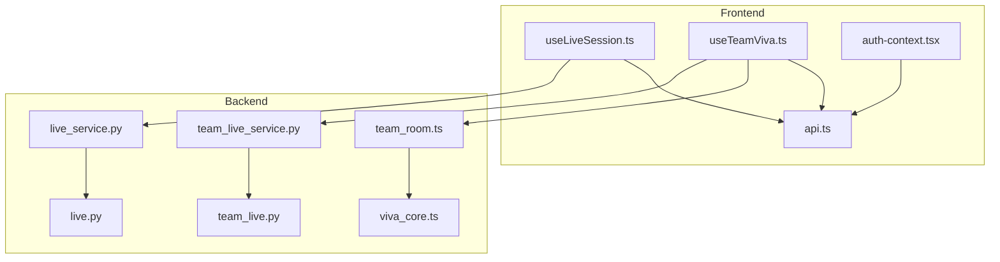
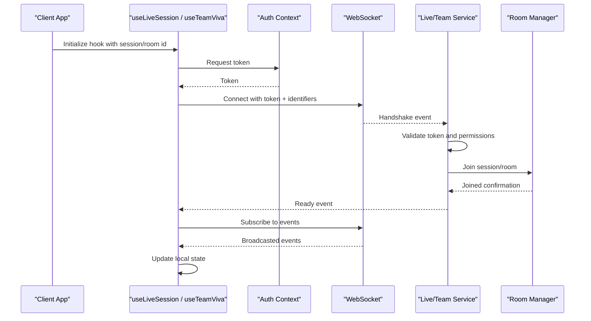
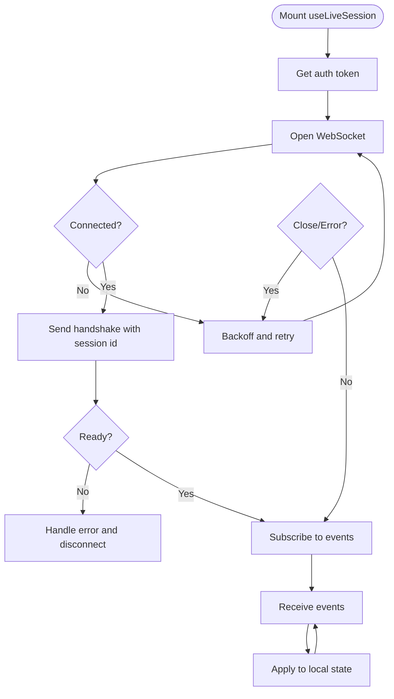
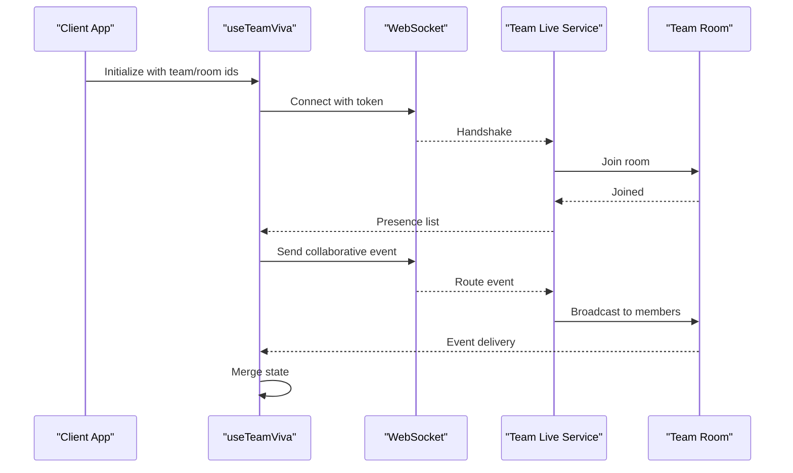
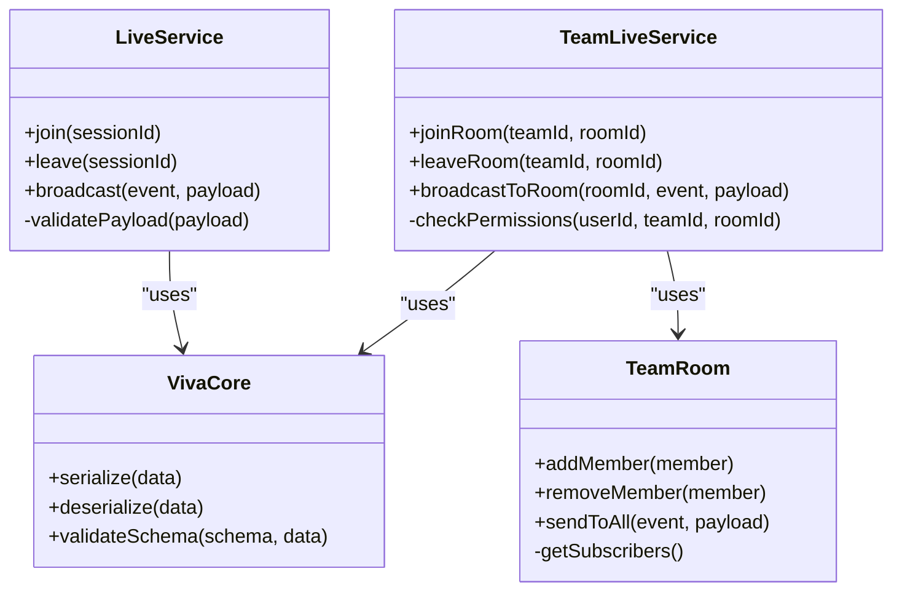
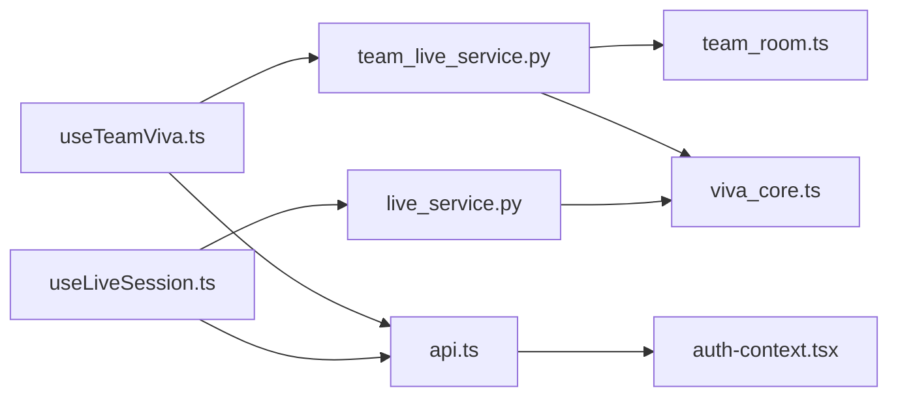

# WebSocket Communication Layer

<cite>
**Referenced Files in This Document**
- [useLiveSession.ts](file://src/lib/useLiveSession.ts)
- [useTeamViva.ts](file://src/lib/useTeamViva.ts)
- [live-service.ts](file://backend/ai/live_service.py)
- [team_live_service.ts](file://backend/ai/team_live_service.py)
- [team_room.ts](file://backend/ai/team_room.ts)
- [viva_core.ts](file://backend/ai/viva_core.ts)
- [api.ts](file://src/lib/api.ts)
- [auth-context.tsx](file://src/lib/auth-context.tsx)
- [live.py](file://backend/api/live.py)
- [team_live.py](file://backend/api/team_live.py)
</cite>

## Table of Contents
1. [Introduction](#introduction)
2. [Project Structure](#project-structure)
3. [Core Components](#core-components)
4. [Architecture Overview](#architecture-overview)
5. [Detailed Component Analysis](#detailed-component-analysis)
6. [Dependency Analysis](#dependency-analysis)
7. [Performance Considerations](#performance-considerations)
8. [Security Considerations](#security-considerations)
9. [Troubleshooting Guide](#troubleshooting-guide)
10. [Conclusion](#conclusion)

## Introduction
This document explains the real-time collaboration layer built on WebSockets in Horux. It covers how clients establish connections, route messages, and broadcast events across live sessions and team rooms. It also documents the client hooks useLiveSession and useTeamViva for connection lifecycle management, reconnection logic, and state synchronization, along with message formats, event types, payload structures, and best practices for extending the system.

## Project Structure
The WebSocket communication spans both frontend and backend:
- Frontend hooks manage connection lifecycle, reconnection, and state sync.
- Backend services implement room abstractions, session orchestration, and broadcasting.
- API endpoints expose HTTP entry points that may initialize or coordinate WebSocket-based features.

**Diagram sources**
- [useLiveSession.ts](file://src/lib/useLiveSession.ts)
- [useTeamViva.ts](file://src/lib/useTeamViva.ts)
- [api.ts](file://src/lib/api.ts)
- [auth-context.tsx](file://src/lib/auth-context.tsx)
- [live_service.py](file://backend/ai/live_service.py)
- [team_live_service.py](file://backend/ai/team_live_service.py)
- [team_room.ts](file://backend/ai/team_room.ts)
- [viva_core.ts](file://backend/ai/viva_core.ts)
- [live.py](file://backend/api/live.py)
- [team_live.py](file://backend/api/team_live.py)

**Section sources**
- [useLiveSession.ts](file://src/lib/useLiveSession.ts)
- [useTeamViva.ts](file://src/lib/useTeamViva.ts)
- [live_service.py](file://backend/ai/live_service.py)
- [team_live_service.py](file://backend/ai/team_live_service.py)
- [team_room.ts](file://backend/ai/team_room.ts)
- [viva_core.ts](file://backend/ai/viva_core.ts)
- [api.ts](file://src/lib/api.ts)
- [auth-context.tsx](file://src/lib/auth-context.tsx)
- [live.py](file://backend/api/live.py)
- [team_live.py](file://backend/api/team_live.py)

## Core Components
- useLiveSession (frontend): Manages a single live session’s WebSocket connection, handles reconnection, and synchronizes session-scoped state.
- useTeamViva (frontend): Manages team-wide collaboration via WebSocket, including room membership, presence, and multi-client broadcasts.
- Live Service (backend): Implements per-session orchestration, message routing, and broadcasting within a session context.
- Team Live Service (backend): Coordinates team-level rooms, participant tracking, and cross-client event distribution.
- Team Room (backend): Encapsulates room semantics, member management, and fan-out to connected clients.
- Viva Core (backend): Provides shared utilities and core behaviors used by live and team flows.
- API Endpoints (backend): Provide HTTP surfaces for initialization and coordination that complement WebSocket operations.

Key responsibilities:
- Connection establishment and authentication handshake.
- Message routing by session or room identifiers.
- Event broadcasting to all participants except the sender where appropriate.
- Reconnection with backoff and state reconciliation.
- Input validation and authorization checks before processing events.

**Section sources**
- [useLiveSession.ts](file://src/lib/useLiveSession.ts)
- [useTeamViva.ts](file://src/lib/useTeamViva.ts)
- [live_service.py](file://backend/ai/live_service.py)
- [team_live_service.py](file://backend/ai/team_live_service.py)
- [team_room.ts](file://backend/ai/team_room.ts)
- [viva_core.ts](file://backend/ai/viva_core.ts)
- [live.py](file://backend/api/live.py)
- [team_live.py](file://backend/api/team_live.py)

## Architecture Overview
The architecture separates concerns between client-side hooks and server-side services:
- Clients connect using tokens from auth context and target specific session or team room identifiers.
- Server validates credentials, resolves the correct room/session, and routes messages to subscribers.
- Broadcasting is scoped to the relevant room/session; presence updates are propagated to maintain consistent UIs.

**Diagram sources**
- [useLiveSession.ts](file://src/lib/useLiveSession.ts)
- [useTeamViva.ts](file://src/lib/useTeamViva.ts)
- [auth-context.tsx](file://src/lib/auth-context.tsx)
- [live_service.py](file://backend/ai/live_service.py)
- [team_live_service.py](file://backend/ai/team_live_service.py)
- [team_room.ts](file://backend/ai/team_room.ts)

## Detailed Component Analysis

### useLiveSession Hook
Responsibilities:
- Establishes a WebSocket connection for a single live session.
- Handles reconnection with exponential backoff and jitter.
- Subscribes to session-scoped events and reconciles local state.
- Emits typed events to components and exposes a stable API surface.

Connection flow:
- On mount, fetches an auth token and attempts to connect.
- On open, performs a handshake with session metadata.
- On close or error, triggers reconnection logic until max retries or user action.

State synchronization:
- Maintains a normalized store keyed by event type.
- Applies incoming events deterministically to keep UI consistent.
- Supports optimistic updates with rollback on failure responses.

Reconnection strategy:
- Exponential backoff with jitter.
- Idempotent join/rejoin on reconnect.
- State reconciliation after successful reconnect.

**Diagram sources**
- [useLiveSession.ts](file://src/lib/useLiveSession.ts)
- [auth-context.tsx](file://src/lib/auth-context.tsx)

**Section sources**
- [useLiveSession.ts](file://src/lib/useLiveSession.ts)
- [auth-context.tsx](file://src/lib/auth-context.tsx)

### useTeamViva Hook
Responsibilities:
- Manages team-wide collaboration via WebSocket.
- Joins a team room, tracks presence, and broadcasts collaborative actions.
- Handles reconnection and ensures consistent multi-client state.

Room lifecycle:
- Initializes with team and room identifiers.
- Joins the room upon successful connection.
- Leaves the room on unmount or explicit logout.

Broadcasting patterns:
- Sends typed events scoped to the team room.
- Receives presence updates and collaborative changes.
- Merges remote state into local store while preserving order.

**Diagram sources**
- [useTeamViva.ts](file://src/lib/useTeamViva.ts)
- [team_live_service.py](file://backend/ai/team_live_service.py)
- [team_room.ts](file://backend/ai/team_room.ts)

**Section sources**
- [useTeamViva.ts](file://src/lib/useTeamViva.ts)
- [team_live_service.py](file://backend/ai/team_live_service.py)
- [team_room.ts](file://backend/ai/team_room.ts)

### Backend Services and Room Abstractions
- Live Service: Orchestrates per-session messaging, validates payloads, and fans out events to session subscribers.
- Team Live Service: Coordinates team room joins/leaves, presence, and cross-client broadcasts.
- Team Room: Encapsulates room membership, message routing, and subscriber management.
- Viva Core: Shared utilities for serialization, validation, and common event handling.

**Diagram sources**
- [live_service.py](file://backend/ai/live_service.py)
- [team_live_service.py](file://backend/ai/team_live_service.py)
- [team_room.ts](file://backend/ai/team_room.ts)
- [viva_core.ts](file://backend/ai/viva_core.ts)

**Section sources**
- [live_service.py](file://backend/ai/live_service.py)
- [team_live_service.py](file://backend/ai/team_live_service.py)
- [team_room.ts](file://backend/ai/team_room.ts)
- [viva_core.ts](file://backend/ai/viva_core.ts)

### API Endpoints Integration
HTTP endpoints provide initialization and coordination for WebSocket-based features:
- Session creation and configuration.
- Team room setup and access control.
- Token issuance and refresh flows.

These endpoints integrate with the WebSocket services to ensure consistent state transitions and permission enforcement.

**Section sources**
- [live.py](file://backend/api/live.py)
- [team_live.py](file://backend/api/team_live.py)
- [api.ts](file://src/lib/api.ts)

## Dependency Analysis
The following diagram shows key dependencies among frontend hooks, backend services, and room abstractions:

**Diagram sources**
- [useLiveSession.ts](file://src/lib/useLiveSession.ts)
- [useTeamViva.ts](file://src/lib/useTeamViva.ts)
- [live_service.py](file://backend/ai/live_service.py)
- [team_live_service.py](file://backend/ai/team_live_service.py)
- [team_room.ts](file://backend/ai/team_room.ts)
- [viva_core.ts](file://backend/ai/viva_core.ts)
- [api.ts](file://src/lib/api.ts)
- [auth-context.tsx](file://src/lib/auth-context.tsx)

**Section sources**
- [useLiveSession.ts](file://src/lib/useLiveSession.ts)
- [useTeamViva.ts](file://src/lib/useTeamViva.ts)
- [live_service.py](file://backend/ai/live_service.py)
- [team_live_service.py](file://backend/ai/team_live_service.py)
- [team_room.ts](file://backend/ai/team_room.ts)
- [viva_core.ts](file://backend/ai/viva_core.ts)
- [api.ts](file://src/lib/api.ts)
- [auth-context.tsx](file://src/lib/auth-context.tsx)

## Performance Considerations
- Batch small updates: Coalesce frequent state changes into larger payloads to reduce network overhead.
- Use delta updates: Transmit only changed fields when possible to minimize bandwidth.
- Debounce high-frequency events: For inputs like typing or cursor movement, debounce client-side and throttle server-side.
- Prefer deterministic merges: Ensure events can be applied idempotently to avoid expensive conflict resolution.
- Limit subscription scope: Only subscribe to relevant channels to reduce fan-out cost.
- Monitor connection health: Implement heartbeat/ping-pong to detect dead connections early and trigger fast failover.

[No sources needed since this section provides general guidance]

## Security Considerations
Authentication:
- Always attach a short-lived token obtained from the auth context during WebSocket handshake.
- Reject connections without valid tokens and enforce token scopes.

Authorization:
- Verify user permissions before joining sessions or rooms.
- Enforce role-based access at the service layer for each event.

Input Validation:
- Validate all incoming payloads against strict schemas.
- Sanitize strings and reject unexpected fields to prevent injection or parsing errors.

Rate Limiting:
- Apply per-user and per-room rate limits to mitigate abuse.
- Return structured errors for throttled requests.

Transport Security:
- Use secure WebSocket endpoints (wss) in production.
- Rotate tokens regularly and support graceful refresh without dropping active sessions.

**Section sources**
- [auth-context.tsx](file://src/lib/auth-context.tsx)
- [live_service.py](file://backend/ai/live_service.py)
- [team_live_service.py](file://backend/ai/team_live_service.py)
- [viva_core.ts](file://backend/ai/viva_core.ts)

## Troubleshooting Guide
Common issues and resolutions:
- Connection failures: Check token validity, endpoint availability, and firewall rules. Inspect handshake errors and retry with backoff.
- Stale state after reconnect: Trigger full state reconciliation and re-join rooms/sessions explicitly.
- Missing events: Verify subscription scopes and ensure no duplicate handlers are unsubscribed prematurely.
- High latency: Profile event batching and payload sizes; consider reducing frequency or compressing large payloads.
- Permission errors: Confirm user roles and resource ownership; log detailed authorization decisions for debugging.

Operational tips:
- Log structured events with correlation IDs to trace request/response flows.
- Instrument metrics for connection duration, event throughput, and error rates.
- Add circuit breakers around external dependencies invoked by event handlers.

**Section sources**
- [useLiveSession.ts](file://src/lib/useLiveSession.ts)
- [useTeamViva.ts](file://src/lib/useTeamViva.ts)
- [live_service.py](file://backend/ai/live_service.py)
- [team_live_service.py](file://backend/ai/team_live_service.py)

## Conclusion
The WebSocket layer in Horux provides robust real-time collaboration through well-defined hooks and backend services. The useLiveSession and useTeamViva hooks encapsulate connection management, reconnection strategies, and state synchronization, while backend services enforce security, validate inputs, and efficiently broadcast events. By following the guidelines for message formats, event types, and performance optimizations, teams can extend the system with custom events and maintain a responsive, secure, and scalable real-time experience.