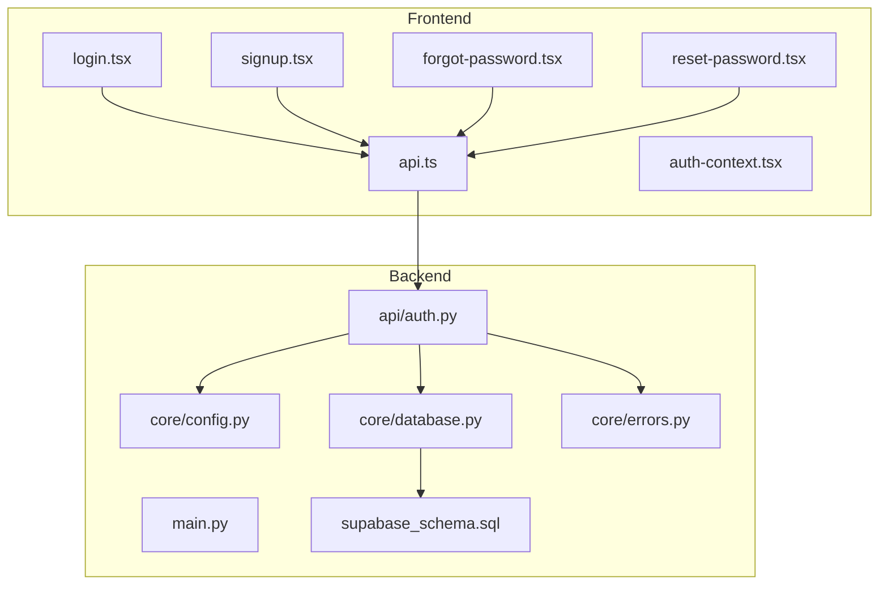
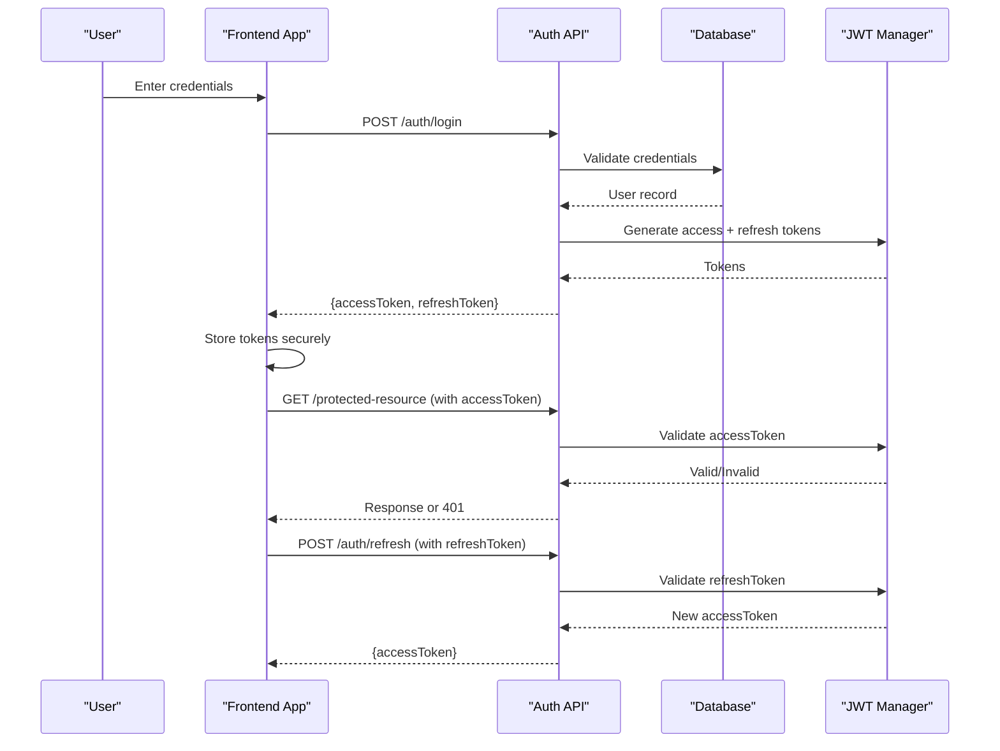
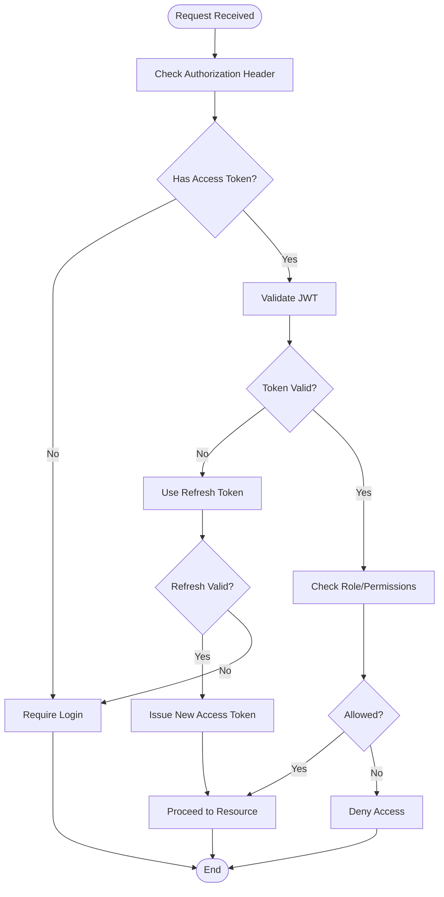
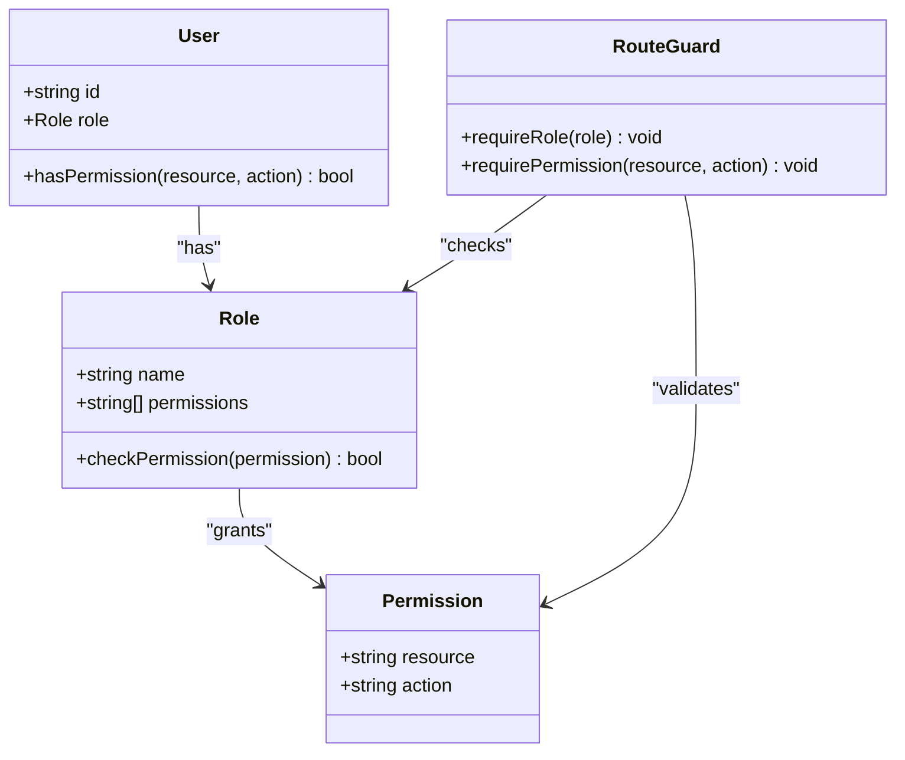
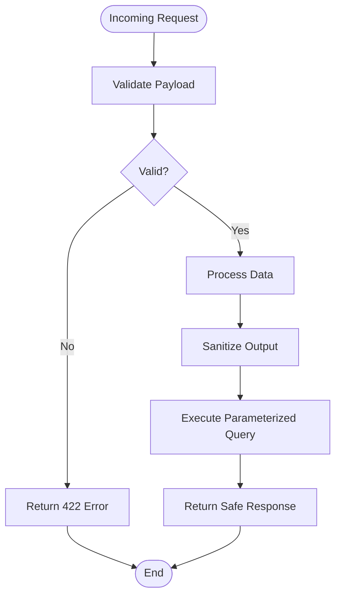
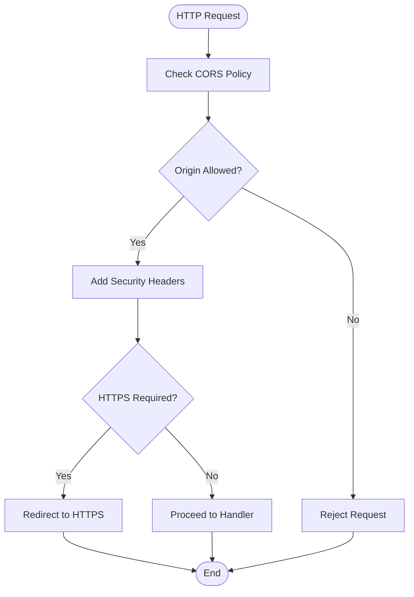
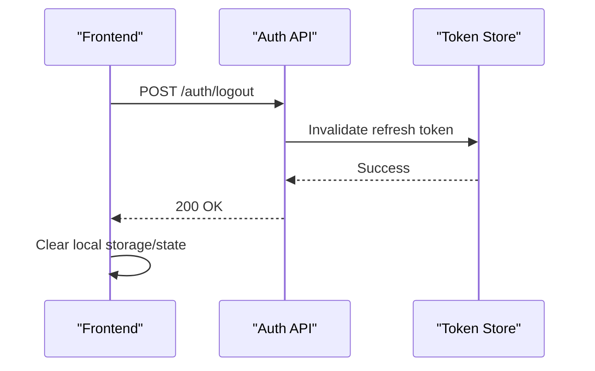
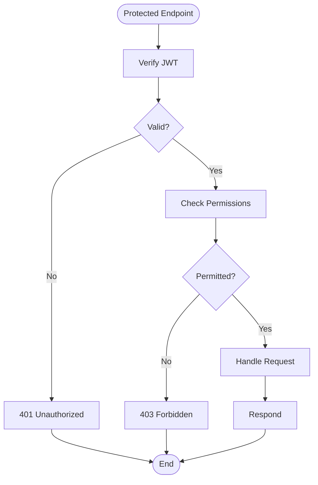
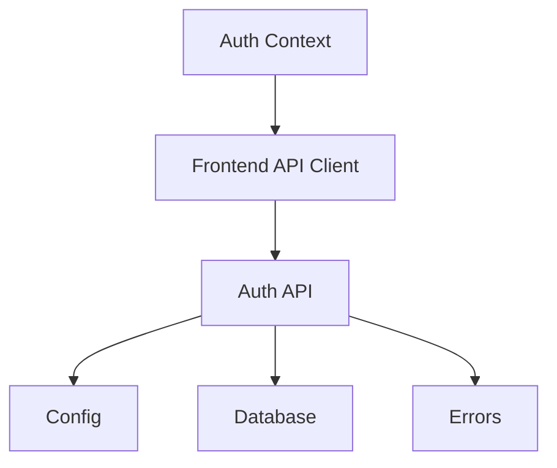

# Security & Authentication

<cite>
**Referenced Files in This Document**
- [backend/api/auth.py](file://backend/api/auth.py)
- [backend/core/config.py](file://backend/core/config.py)
- [backend/core/database.py](file://backend/core/database.py)
- [backend/core/errors.py](file://backend/core/errors.py)
- [backend/main.py](file://backend/main.py)
- [src/lib/auth-context.tsx](file://src/lib/auth-context.tsx)
- [src/routes/login.tsx](file://src/routes/login.tsx)
- [src/routes/signup.tsx](file://src/routes/signup.tsx)
- [src/routes/forgot-password.tsx](file://src/routes/forgot-password.tsx)
- [src/routes/reset-password.tsx](file://src/routes/reset-password.tsx)
- [src/lib/api.ts](file://src/lib/api.ts)
- [backend/supabase_schema.sql](file://backend/supabase_schema.sql)
</cite>

## Table of Contents
1. [Introduction](#introduction)
2. [Project Structure](#project-structure)
3. [Core Components](#core-components)
4. [Architecture Overview](#architecture-overview)
5. [Detailed Component Analysis](#detailed-component-analysis)
6. [Dependency Analysis](#dependency-analysis)
7. [Performance Considerations](#performance-considerations)
8. [Troubleshooting Guide](#troubleshooting-guide)
9. [Conclusion](#conclusion)
10. [Appendices](#appendices)

## Introduction
This document provides comprehensive security documentation for the Horux platform, focusing on authentication, authorization, and data protection mechanisms. It explains the JWT-based authentication flow (token generation, validation, refresh), role-based access control with permission hierarchies and resource-level security, input validation and output sanitization, SQL injection prevention, CORS configuration, security headers, HTTPS enforcement, session management, logout procedures, secure API endpoint implementation, sensitive data handling, authentication error handling, compliance considerations, and security monitoring approaches.

## Project Structure
The Horux platform consists of a FastAPI backend and a React frontend:
- Backend: FastAPI application under backend/, including API routes, core configuration, database integration, and error handling.
- Frontend: React application under src/ with authentication UI flows and API client utilities.

**Diagram sources**
- [backend/main.py](file://backend/main.py)
- [backend/api/auth.py](file://backend/api/auth.py)
- [backend/core/config.py](file://backend/core/config.py)
- [backend/core/database.py](file://backend/core/database.py)
- [backend/core/errors.py](file://backend/core/errors.py)
- [backend/supabase_schema.sql](file://backend/supabase_schema.sql)
- [src/lib/api.ts](file://src/lib/api.ts)
- [src/lib/auth-context.tsx](file://src/lib/auth-context.tsx)
- [src/routes/login.tsx](file://src/routes/login.tsx)
- [src/routes/signup.tsx](file://src/routes/signup.tsx)
- [src/routes/forgot-password.tsx](file://src/routes/forgot-password.tsx)
- [src/routes/reset-password.tsx](file://src/routes/reset-password.tsx)

**Section sources**
- [backend/main.py](file://backend/main.py)
- [backend/api/auth.py](file://backend/api/auth.py)
- [backend/core/config.py](file://backend/core/config.py)
- [backend/core/database.py](file://backend/core/database.py)
- [backend/core/errors.py](file://backend/core/errors.py)
- [backend/supabase_schema.sql](file://backend/supabase_schema.sql)
- [src/lib/api.ts](file://src/lib/api.ts)
- [src/lib/auth-context.tsx](file://src/lib/auth-context.tsx)
- [src/routes/login.tsx](file://src/routes/login.tsx)
- [src/routes/signup.tsx](file://src/routes/signup.tsx)
- [src/routes/forgot-password.tsx](file://src/routes/forgot-password.tsx)
- [src/routes/reset-password.tsx](file://src/routes/reset-password.tsx)

## Core Components
- Authentication API: Provides endpoints for login, signup, password reset, and token operations.
- Configuration: Centralizes security settings such as JWT secrets, token lifetimes, CORS origins, and HTTPS preferences.
- Database Integration: Manages connections and queries to Supabase, ensuring parameterized queries to prevent SQL injection.
- Error Handling: Standardizes error responses for authentication failures and validation errors.
- Frontend Auth Context: Manages user sessions, tokens, and state across the application.
- API Client: Handles HTTP requests, attaching tokens and handling responses securely.

**Section sources**
- [backend/api/auth.py](file://backend/api/auth.py)
- [backend/core/config.py](file://backend/core/config.py)
- [backend/core/database.py](file://backend/core/database.py)
- [backend/core/errors.py](file://backend/core/errors.py)
- [src/lib/auth-context.tsx](file://src/lib/auth-context.tsx)
- [src/lib/api.ts](file://src/lib/api.ts)

## Architecture Overview
The authentication architecture follows a standard JWT pattern:
- The frontend collects credentials and sends them to the backend via secure HTTPS.
- The backend validates credentials, issues JWTs (access and refresh tokens), and returns them to the frontend.
- The frontend stores tokens securely and attaches the access token to subsequent requests.
- The backend validates tokens using middleware or dependency injection, enforcing RBAC and resource-level permissions.
- Refresh tokens are used to obtain new access tokens without re-authentication.

**Diagram sources**
- [backend/api/auth.py](file://backend/api/auth.py)
- [backend/core/config.py](file://backend/core/config.py)
- [backend/core/database.py](file://backend/core/database.py)
- [src/lib/api.ts](file://src/lib/api.ts)
- [src/lib/auth-context.tsx](file://src/lib/auth-context.tsx)

## Detailed Component Analysis

### Authentication Flow
- Login: Validates credentials, issues JWTs, and returns tokens to the frontend.
- Signup: Creates user accounts with validated inputs and hashed passwords.
- Password Reset: Sends reset links/tokens and enforces secure password updates.
- Token Refresh: Issues new access tokens using valid refresh tokens.

**Diagram sources**
- [backend/api/auth.py](file://backend/api/auth.py)
- [backend/core/config.py](file://backend/core/config.py)
- [backend/core/errors.py](file://backend/core/errors.py)

**Section sources**
- [backend/api/auth.py](file://backend/api/auth.py)
- [backend/core/config.py](file://backend/core/config.py)
- [backend/core/errors.py](file://backend/core/errors.py)

### Role-Based Access Control (RBAC)
- Roles: Define hierarchical roles (e.g., admin, manager, user).
- Permissions: Map permissions to roles and resources.
- Resource-Level Security: Enforce access based on ownership or explicit grants.
- Middleware/Dependencies: Apply RBAC checks at route level.

**Diagram sources**
- [backend/api/auth.py](file://backend/api/auth.py)
- [backend/core/config.py](file://backend/core/config.py)

**Section sources**
- [backend/api/auth.py](file://backend/api/auth.py)
- [backend/core/config.py](file://backend/core/config.py)

### Input Validation and Output Sanitization
- Input Validation: Use Pydantic models for request validation, enforce types, formats, and constraints.
- Output Sanitization: Filter sensitive fields from responses, escape HTML where necessary.
- SQL Injection Prevention: Use parameterized queries via SQLAlchemy or Supabase client.

**Diagram sources**
- [backend/api/auth.py](file://backend/api/auth.py)
- [backend/core/database.py](file://backend/core/database.py)
- [backend/core/errors.py](file://backend/core/errors.py)

**Section sources**
- [backend/api/auth.py](file://backend/api/auth.py)
- [backend/core/database.py](file://backend/core/database.py)
- [backend/core/errors.py](file://backend/core/errors.py)

### CORS Configuration and Security Headers
- CORS: Configure allowed origins, methods, and headers.
- Security Headers: Set HSTS, CSP, X-Frame-Options, etc.
- HTTPS Enforcement: Redirect HTTP to HTTPS in production.

**Diagram sources**
- [backend/core/config.py](file://backend/core/config.py)
- [backend/main.py](file://backend/main.py)

**Section sources**
- [backend/core/config.py](file://backend/core/config.py)
- [backend/main.py](file://backend/main.py)

### Session Management and Logout
- Session Storage: Securely store tokens in memory or httpOnly cookies.
- Logout: Invalidate refresh tokens and clear frontend state.
- Token Rotation: Rotate refresh tokens periodically.

**Diagram sources**
- [backend/api/auth.py](file://backend/api/auth.py)
- [src/lib/auth-context.tsx](file://src/lib/auth-context.tsx)

**Section sources**
- [backend/api/auth.py](file://backend/api/auth.py)
- [src/lib/auth-context.tsx](file://src/lib/auth-context.tsx)

### Secure API Endpoint Implementation
- Authentication: Require valid JWT on protected routes.
- Authorization: Enforce RBAC and resource-level permissions.
- Input Validation: Validate all inputs with strict schemas.
- Error Handling: Return standardized error responses.

**Diagram sources**
- [backend/api/auth.py](file://backend/api/auth.py)
- [backend/core/errors.py](file://backend/core/errors.py)

**Section sources**
- [backend/api/auth.py](file://backend/api/auth.py)
- [backend/core/errors.py](file://backend/core/errors.py)

### Sensitive Data Protection
- Encryption: Encrypt sensitive fields at rest and in transit.
- Secrets Management: Use environment variables or secret managers.
- Logging: Avoid logging sensitive data.

**Section sources**
- [backend/core/config.py](file://backend/core/config.py)
- [backend/core/database.py](file://backend/core/database.py)

### Compliance Considerations
- GDPR: Ensure data minimization, consent, and right to erasure.
- PCI DSS: Protect cardholder data if applicable.
- Audit Logs: Maintain logs for security events.

**Section sources**
- [backend/core/logging.py](file://backend/core/logging.py)
- [backend/core/errors.py](file://backend/core/errors.py)

### Security Monitoring Approaches
- Rate Limiting: Prevent brute-force attacks.
- Anomaly Detection: Monitor unusual activity patterns.
- Alerting: Notify on critical security events.

**Section sources**
- [backend/core/config.py](file://backend/core/config.py)
- [backend/core/logging.py](file://backend/core/logging.py)

## Dependency Analysis
The authentication system depends on configuration, database, and error handling modules. The frontend relies on an API client and auth context for state management.

**Diagram sources**
- [backend/api/auth.py](file://backend/api/auth.py)
- [backend/core/config.py](file://backend/core/config.py)
- [backend/core/database.py](file://backend/core/database.py)
- [backend/core/errors.py](file://backend/core/errors.py)
- [src/lib/api.ts](file://src/lib/api.ts)
- [src/lib/auth-context.tsx](file://src/lib/auth-context.tsx)

**Section sources**
- [backend/api/auth.py](file://backend/api/auth.py)
- [backend/core/config.py](file://backend/core/config.py)
- [backend/core/database.py](file://backend/core/database.py)
- [backend/core/errors.py](file://backend/core/errors.py)
- [src/lib/api.ts](file://src/lib/api.ts)
- [src/lib/auth-context.tsx](file://src/lib/auth-context.tsx)

## Performance Considerations
- Token Validation: Cache JWT public keys if using asymmetric signing.
- Database Queries: Optimize queries and use indexes for user lookups.
- Rate Limiting: Implement per-user and global rate limits.

[No sources needed since this section provides general guidance]

## Troubleshooting Guide
- Authentication Failures: Check token validity, expiration, and signature.
- CORS Errors: Verify allowed origins and preflight requests.
- Database Errors: Inspect connection strings and query parameters.

**Section sources**
- [backend/core/errors.py](file://backend/core/errors.py)
- [backend/core/config.py](file://backend/core/config.py)
- [backend/core/database.py](file://backend/core/database.py)

## Conclusion
The Horux platform implements a robust security model with JWT-based authentication, RBAC, input validation, and secure data handling. By following the guidelines in this document, developers can ensure secure API endpoints, protect sensitive data, and maintain compliance with security standards.

[No sources needed since this section summarizes without analyzing specific files]

## Appendices
- Example JWT Claims: Include user ID, roles, and expiration.
- Security Headers Checklist: HSTS, CSP, X-Frame-Options, etc.
- Compliance Checklist: GDPR, PCI DSS, audit logs.

[No sources needed since this section provides general guidance]