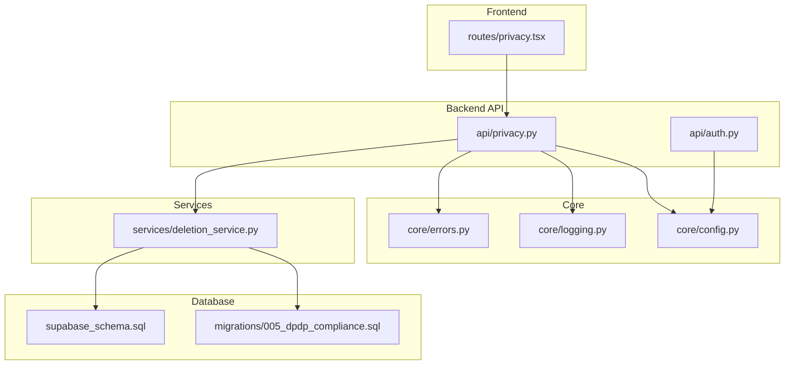
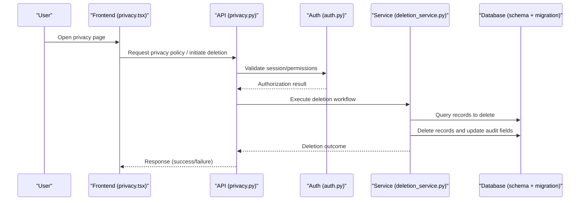
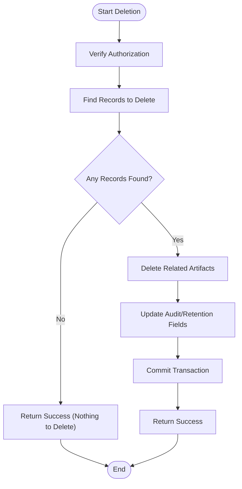
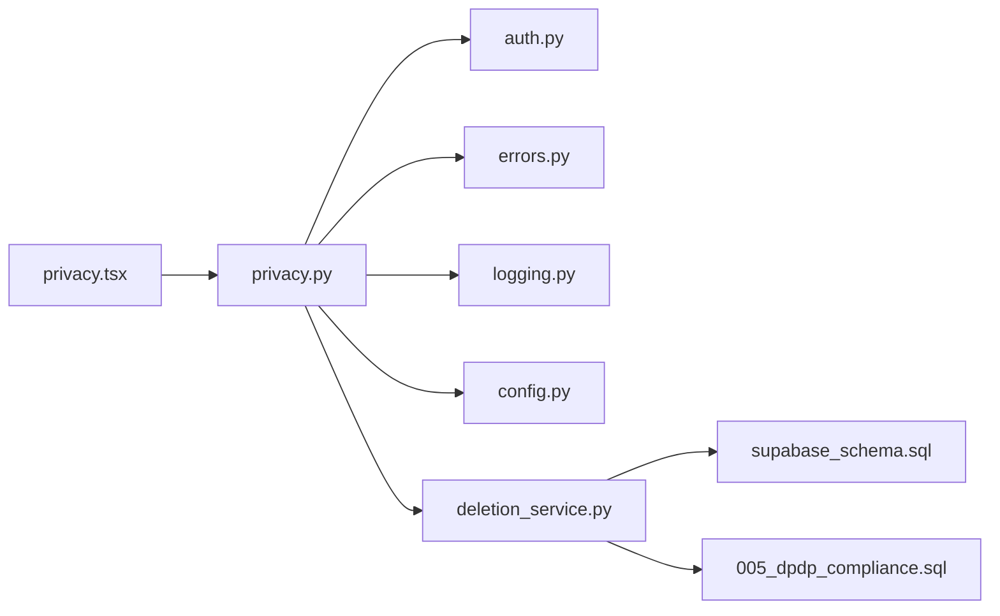

# Privacy & Data Protection Compliance

<cite>
**Referenced Files in This Document**
- [privacy.py](file://backend/api/privacy.py)
- [deletion_service.py](file://backend/services/deletion_service.py)
- [005_dpdp_compliance.sql](file://backend/migrations/005_dpdp_compliance.sql)
- [supabase_schema.sql](file://backend/supabase_schema.sql)
- [auth.py](file://backend/api/auth.py)
- [config.py](file://backend/core/config.py)
- [logging.py](file://backend/core/logging.py)
- [errors.py](file://backend/core/errors.py)
- [main.py](file://backend/main.py)
- [privacy.tsx](file://src/routes/privacy.tsx)
</cite>

## Table of Contents
1. [Introduction](#introduction)
2. [Project Structure](#project-structure)
3. [Core Components](#core-components)
4. [Architecture Overview](#architecture-overview)
5. [Detailed Component Analysis](#detailed-component-analysis)
6. [Dependency Analysis](#dependency-analysis)
7. [Performance Considerations](#performance-considerations)
8. [Troubleshooting Guide](#troubleshooting-guide)
9. [Conclusion](#conclusion)
10. [Appendices](#appendices)

## Introduction
This document describes the privacy and data protection compliance posture of the application, focusing on how personal data is handled, retained, and deleted across the backend API, services, database schema, and frontend routes. It highlights mechanisms for user consent, data minimization, secure logging, deletion workflows, and auditability. The goal is to provide both a high-level overview and detailed technical references for developers and auditors.

## Project Structure
Privacy-related functionality spans several layers:
- Backend API endpoints for privacy policies and user rights
- Services implementing data deletion workflows
- Database migrations introducing privacy controls and retention fields
- Core configuration and logging utilities used by privacy-sensitive flows
- Frontend route presenting privacy information to users

**Diagram sources**
- [privacy.tsx](file://src/routes/privacy.tsx)
- [privacy.py](file://backend/api/privacy.py)
- [deletion_service.py](file://backend/services/deletion_service.py)
- [auth.py](file://backend/api/auth.py)
- [config.py](file://backend/core/config.py)
- [logging.py](file://backend/core/logging.py)
- [errors.py](file://backend/core/errors.py)
- [supabase_schema.sql](file://backend/supabase_schema.sql)
- [005_dpdp_compliance.sql](file://backend/migrations/005_dpdp_compliance.sql)

**Section sources**
- [privacy.py](file://backend/api/privacy.py)
- [deletion_service.py](file://backend/services/deletion_service.py)
- [005_dpdp_compliance.sql](file://backend/migrations/005_dpdp_compliance.sql)
- [supabase_schema.sql](file://backend/supabase_schema.sql)
- [auth.py](file://backend/api/auth.py)
- [config.py](file://backend/core/config.py)
- [logging.py](file://backend/core/logging.py)
- [errors.py](file://backend/core/errors.py)
- [privacy.tsx](file://src/routes/privacy.tsx)

## Core Components
- Privacy API endpoint(s): Provide policy access and initiate user-driven data actions (e.g., export or deletion requests).
- Deletion service: Implements the core logic for locating and removing personal data across tables and related artifacts.
- Database schema and migration: Define retention flags, timestamps, and constraints that support lawful deletion and auditability.
- Authentication integration: Ensures only authorized users can trigger privacy operations.
- Configuration and logging: Enforce minimal logging and environment-based settings relevant to privacy.
- Frontend privacy page: Presents policy content and links to user rights actions.

**Section sources**
- [privacy.py](file://backend/api/privacy.py)
- [deletion_service.py](file://backend/services/deletion_service.py)
- [005_dpdp_compliance.sql](file://backend/migrations/005_dpdp_compliance.sql)
- [supabase_schema.sql](file://backend/supabase_schema.sql)
- [auth.py](file://backend/api/auth.py)
- [config.py](file://backend/core/config.py)
- [logging.py](file://backend/core/logging.py)
- [privacy.tsx](file://src/routes/privacy.tsx)

## Architecture Overview
The privacy architecture follows a layered approach:
- Frontend exposes a privacy page and action triggers.
- Backend API validates authorization and orchestrates privacy operations.
- Service layer performs data discovery and deletion with safeguards.
- Database enforces referential integrity and includes fields for retention and audit.
- Core utilities ensure safe configuration and non-sensitive logging.

**Diagram sources**
- [privacy.tsx](file://src/routes/privacy.tsx)
- [privacy.py](file://backend/api/privacy.py)
- [auth.py](file://backend/api/auth.py)
- [deletion_service.py](file://backend/services/deletion_service.py)
- [supabase_schema.sql](file://backend/supabase_schema.sql)
- [005_dpdp_compliance.sql](file://backend/migrations/005_dpdp_compliance.sql)

## Detailed Component Analysis

### Privacy API Endpoint
Responsibilities:
- Serve privacy policy content.
- Accept and validate deletion requests from authenticated users.
- Delegate to the deletion service and return structured responses.
- Use error handling and logging utilities consistently.

Key considerations:
- Input validation and authorization checks before invoking deletion.
- Minimal logging; avoid recording sensitive payloads.
- Clear error responses aligned with global error handling.

**Section sources**
- [privacy.py](file://backend/api/privacy.py)
- [errors.py](file://backend/core/errors.py)
- [logging.py](file://backend/core/logging.py)

### Deletion Service
Responsibilities:
- Identify all personal data associated with a user or entity.
- Perform deletions in a safe order respecting foreign keys.
- Update retention and audit fields where applicable.
- Return actionable results for the API layer.

Processing flow:

**Diagram sources**
- [deletion_service.py](file://backend/services/deletion_service.py)
- [supabase_schema.sql](file://backend/supabase_schema.sql)
- [005_dpdp_compliance.sql](file://backend/migrations/005_dpdp_compliance.sql)

**Section sources**
- [deletion_service.py](file://backend/services/deletion_service.py)
- [supabase_schema.sql](file://backend/supabase_schema.sql)
- [005_dpdp_compliance.sql](file://backend/migrations/005_dpdp_compliance.sql)

### Database Schema and Migration
Focus areas:
- Retention and audit columns to support lawful deletion and traceability.
- Constraints ensuring referential integrity during cascading deletes.
- Indexes to optimize queries for user-scoped data retrieval.

Implementation notes:
- Migration introduces privacy-specific fields and indexes.
- Schema defines base entities and relationships required for deletion workflows.

**Section sources**
- [005_dpdp_compliance.sql](file://backend/migrations/005_dpdp_compliance.sql)
- [supabase_schema.sql](file://backend/supabase_schema.sql)

### Authentication Integration
Purpose:
- Ensure only authorized users can request deletion or access privacy features.
- Provide session or token validation hooks consumed by the privacy API.

Integration points:
- API layer calls auth utilities to verify identity and permissions.
- Configuration may include provider-specific settings.

**Section sources**
- [auth.py](file://backend/api/auth.py)
- [config.py](file://backend/core/config.py)

### Configuration and Logging
Configuration:
- Environment-based settings for privacy-related toggles and providers.
- Centralized config consumption across API and services.

Logging:
- Structured JSON logs without sensitive data.
- Consistent log levels for privacy events (e.g., deletion start/completion).

**Section sources**
- [config.py](file://backend/core/config.py)
- [logging.py](file://backend/core/logging.py)

### Frontend Privacy Page
Purpose:
- Display privacy policy content.
- Provide UI triggers for user-initiated actions (e.g., request deletion).

Behavior:
- Calls backend privacy endpoints after confirming user intent.
- Displays success or failure feedback using standard UI patterns.

**Section sources**
- [privacy.tsx](file://src/routes/privacy.tsx)

## Dependency Analysis
High-level dependencies among privacy components:
- API depends on authentication, error handling, logging, and deletion service.
- Deletion service depends on database schema and migration-defined structures.
- Frontend depends on API endpoints for policy and actions.

**Diagram sources**
- [privacy.tsx](file://src/routes/privacy.tsx)
- [privacy.py](file://backend/api/privacy.py)
- [auth.py](file://backend/api/auth.py)
- [errors.py](file://backend/core/errors.py)
- [logging.py](file://backend/core/logging.py)
- [config.py](file://backend/core/config.py)
- [deletion_service.py](file://backend/services/deletion_service.py)
- [supabase_schema.sql](file://backend/supabase_schema.sql)
- [005_dpdp_compliance.sql](file://backend/migrations/005_dpdp_compliance.sql)

**Section sources**
- [privacy.py](file://backend/api/privacy.py)
- [deletion_service.py](file://backend/services/deletion_service.py)
- [auth.py](file://backend/api/auth.py)
- [errors.py](file://backend/core/errors.py)
- [logging.py](file://backend/core/logging.py)
- [config.py](file://backend/core/config.py)
- [supabase_schema.sql](file://backend/supabase_schema.sql)
- [005_dpdp_compliance.sql](file://backend/migrations/005_dpdp_compliance.sql)
- [privacy.tsx](file://src/routes/privacy.tsx)

## Performance Considerations
- Batch deletions where possible to reduce round trips.
- Use targeted queries based on indexed fields introduced by the privacy migration.
- Avoid logging large payloads; keep audit entries concise.
- Consider transaction boundaries to maintain consistency and rollback safety.

[No sources needed since this section provides general guidance]

## Troubleshooting Guide
Common issues and resolutions:
- Authorization failures: Confirm session validity and permission scopes before invoking deletion.
- Missing audit fields: Verify migration execution and schema alignment.
- Orphaned records: Ensure deletion order respects foreign key constraints.
- Excessive logging: Review log configuration to prevent sensitive data capture.

Operational tips:
- Inspect structured logs for deletion lifecycle events.
- Validate database constraints post-migration.
- Re-run deletion with idempotent checks if partial failures occur.

**Section sources**
- [errors.py](file://backend/core/errors.py)
- [logging.py](file://backend/core/logging.py)
- [005_dpdp_compliance.sql](file://backend/migrations/005_dpdp_compliance.sql)
- [supabase_schema.sql](file://backend/supabase_schema.sql)

## Conclusion
The system implements privacy and data protection measures through dedicated API endpoints, a robust deletion service, schema-enforced retention and audit fields, and careful configuration and logging practices. These components collectively support user rights, minimize data exposure, and enable reliable, auditable deletion workflows.

[No sources needed since this section summarizes without analyzing specific files]

## Appendices
- Application entry point reference for context:
  - [main.py](file://backend/main.py)

**Section sources**
- [main.py](file://backend/main.py)