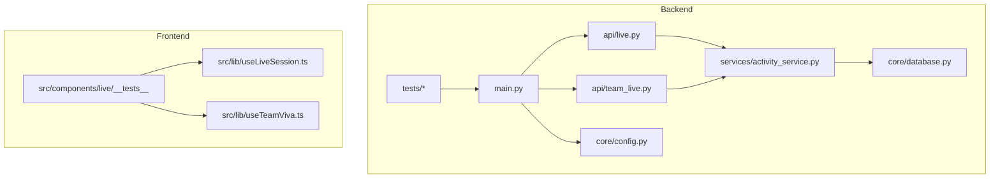
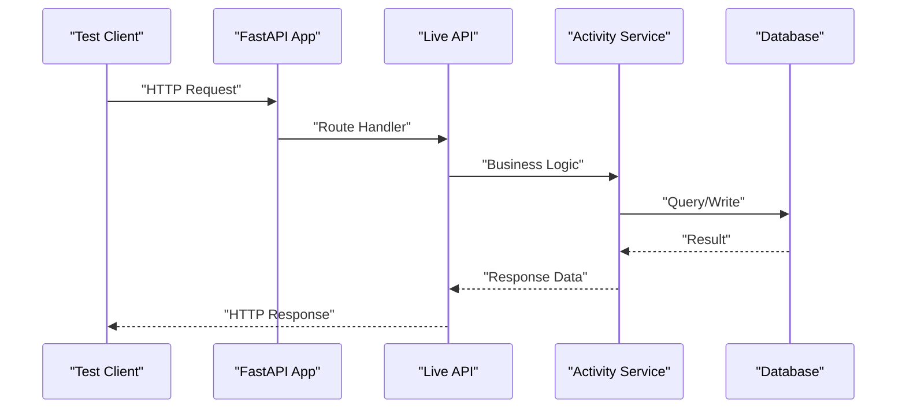
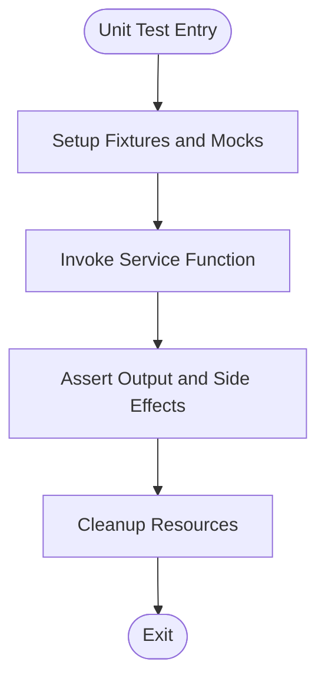
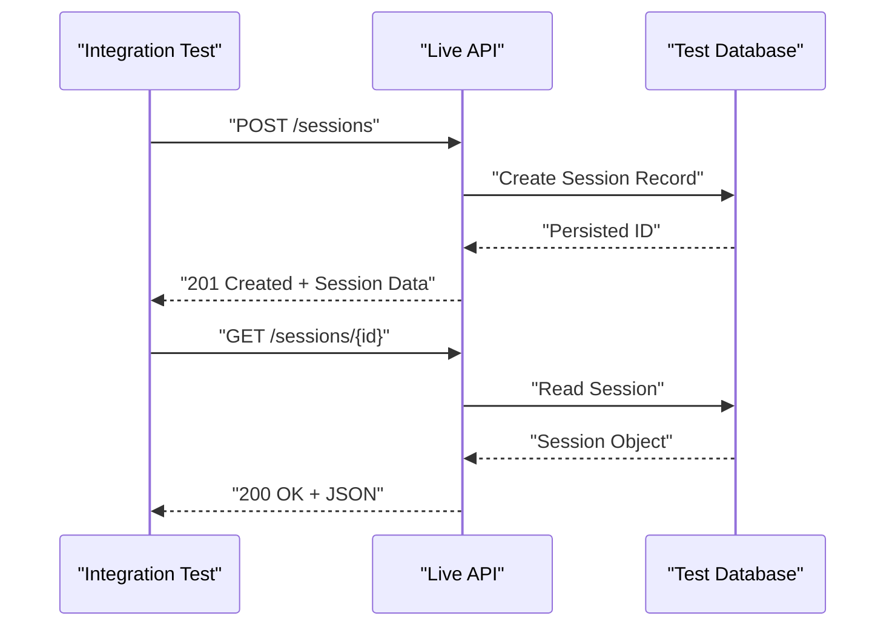
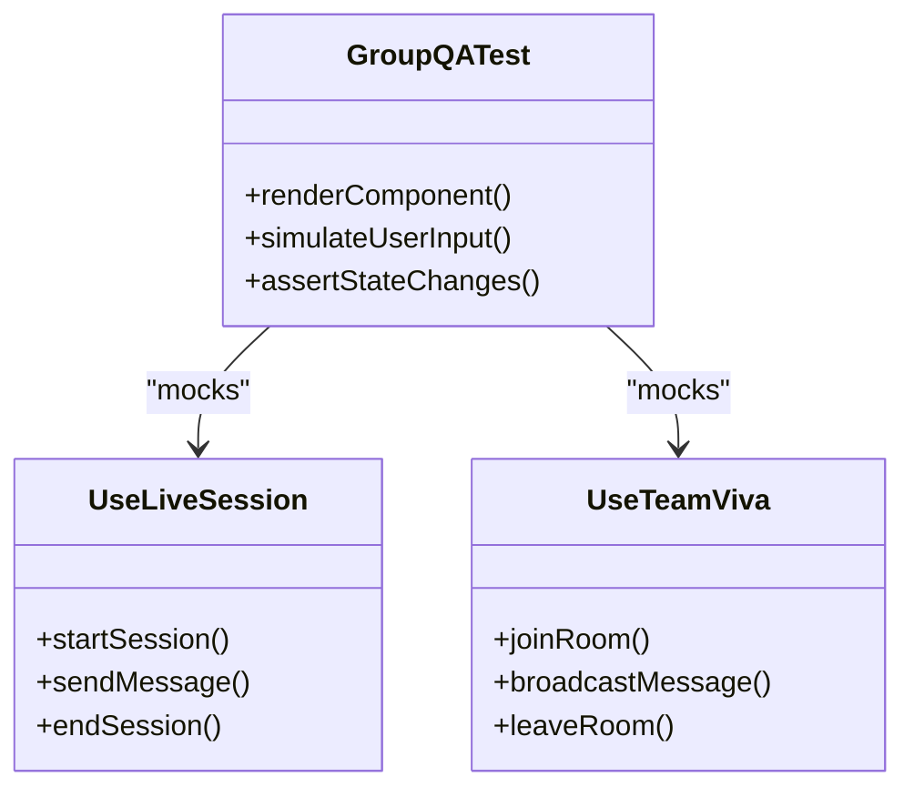
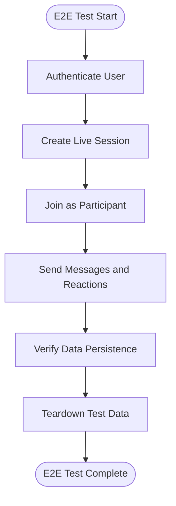
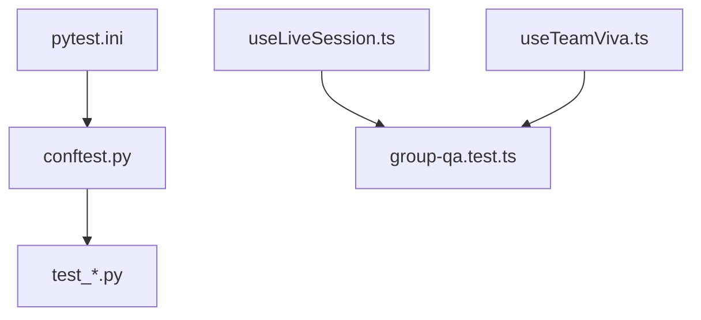

# Testing Strategy

<cite>
**Referenced Files in This Document**
- [backend/pytest.ini](file://backend/pytest.ini)
- [backend/conftest.py](file://backend/tests/conftest.py)
- [backend/test_live_gate.py](file://backend/tests/test_live_gate.py)
- [backend/test_live_persistence.py](file://backend/tests/test_live_persistence.py)
- [backend/test_live_prompts.py](file://backend/tests/test_live_prompts.py)
- [backend/test_report_service.py](file://backend/tests/test_report_service.py)
- [backend/test_viva_sessions.py](file://backend/tests/test_viva_sessions.py)
- [backend/test_delivery_metrics.py](file://backend/tests/test_delivery_metrics.py)
- [backend/test_code_knowledge_pack.py](file://backend/tests/test_code_knowledge_pack.py)
- [backend/test_project_team_linking.py](file://backend/tests/test_project_team_linking.py)
- [backend/test_teams_create.py](file://backend/tests/test_teams_create.py)
- [backend/test_tasks_reorder.py](file://backend/tests/test_tasks_reorder.py)
- [backend/test_errors_and_languages.py](file://backend/tests/test_errors_and_languages.py)
- [backend/test_registry.py](file://backend/tests/test_registry.py)
- [backend/api/live.py](file://backend/api/live.py)
- [backend/api/team_live.py](file://backend/api/team_live.py)
- [backend/services/activity_service.py](file://backend/services/activity_service.py)
- [backend/core/database.py](file://backend/core/database.py)
- [backend/core/config.py](file://backend/core/config.py)
- [backend/main.py](file://backend/main.py)
- [src/components/live/__tests__/group-qa.test.ts](file://src/components/live/__tests__/group-qa.test.ts)
- [src/lib/useLiveSession.ts](file://src/lib/useLiveSession.ts)
- [src/lib/useTeamViva.ts](file://src/lib/useTeamViva.ts)
- [package.json](file://package.json)
- [vite.config.ts](file://vite.config.ts)
</cite>

## Table of Contents
1. [Introduction](#introduction)
2. [Project Structure](#project-structure)
3. [Core Components](#core-components)
4. [Architecture Overview](#architecture-overview)
5. [Detailed Component Analysis](#detailed-component-analysis)
6. [Dependency Analysis](#dependency-analysis)
7. [Performance Considerations](#performance-considerations)
8. [Troubleshooting Guide](#troubleshooting-guide)
9. [Conclusion](#conclusion)
10. [Appendices](#appendices)

## Introduction
This document defines the testing strategy for the Horux platform across unit, integration, and end-to-end testing. It covers test organization, mocking strategies, data management, and best practices for maintainable tests with strong coverage. It also outlines performance and load testing approaches and continuous integration pipelines to ensure reliability at scale.

## Project Structure
The repository includes both backend (Python/FastAPI) and frontend (TypeScript/React) components:
- Backend tests are organized under backend/tests with pytest configuration and fixtures.
- Frontend tests live alongside components and libraries, using a standard React testing setup.

**Diagram sources**
- [backend/main.py](file://backend/main.py)
- [backend/api/live.py](file://backend/api/live.py)
- [backend/api/team_live.py](file://backend/api/team_live.py)
- [backend/services/activity_service.py](file://backend/services/activity_service.py)
- [backend/core/database.py](file://backend/core/database.py)
- [backend/core/config.py](file://backend/core/config.py)
- [backend/tests/test_live_gate.py](file://backend/tests/test_live_gate.py)
- [src/components/live/__tests__/group-qa.test.ts](file://src/components/live/__tests__/group-qa.test.ts)
- [src/lib/useLiveSession.ts](file://src/lib/useLiveSession.ts)
- [src/lib/useTeamViva.ts](file://src/lib/useTeamViva.ts)

**Section sources**
- [backend/pytest.ini](file://backend/pytest.ini)
- [backend/tests/conftest.py](file://backend/tests/conftest.py)
- [package.json](file://package.json)
- [vite.config.ts](file://vite.config.ts)

## Core Components
Key areas that require robust testing:
- Live session APIs and real-time features
- AI-driven services and prompts
- Database operations and migrations
- Frontend hooks and UI components for live sessions

Testing priorities:
- Unit tests for pure functions and service logic
- Integration tests for API endpoints and database interactions
- End-to-end tests for critical user flows (live sessions, team collaboration)

**Section sources**
- [backend/api/live.py](file://backend/api/live.py)
- [backend/api/team_live.py](file://backend/api/team_live.py)
- [backend/services/activity_service.py](file://backend/services/activity_service.py)
- [backend/core/database.py](file://backend/core/database.py)
- [backend/core/config.py](file://backend/core/config.py)
- [backend/tests/test_live_gate.py](file://backend/tests/test_live_gate.py)
- [backend/tests/test_live_persistence.py](file://backend/tests/test_live_persistence.py)
- [backend/tests/test_live_prompts.py](file://backend/tests/test_live_prompts.py)
- [backend/tests/test_report_service.py](file://backend/tests/test_report_service.py)
- [backend/tests/test_viva_sessions.py](file://backend/tests/test_viva_sessions.py)
- [src/components/live/__tests__/group-qa.test.ts](file://src/components/live/__tests__/group-qa.test.ts)
- [src/lib/useLiveSession.ts](file://src/lib/useLiveSession.ts)
- [src/lib/useTeamViva.ts](file://src/lib/useTeamViva.ts)

## Architecture Overview
The testing architecture spans multiple layers:
- Unit tests validate isolated logic in services and utilities
- Integration tests exercise API routes, database access, and external dependencies via mocks or test containers
- End-to-end tests simulate real user interactions through the frontend and backend

**Diagram sources**
- [backend/main.py](file://backend/main.py)
- [backend/api/live.py](file://backend/api/live.py)
- [backend/services/activity_service.py](file://backend/services/activity_service.py)
- [backend/core/database.py](file://backend/core/database.py)

## Detailed Component Analysis

### Backend Unit Testing
Focus areas:
- Service layer logic (e.g., activity tracking, metrics computation)
- Prompt generation and registry validation
- Error handling and language processing

Approach:
- Use pytest fixtures for reusable test data
- Mock external dependencies (AI services, databases) where appropriate
- Validate edge cases and error paths

**Section sources**
- [backend/tests/test_report_service.py](file://backend/tests/test_report_service.py)
- [backend/tests/test_delivery_metrics.py](file://backend/tests/test_delivery_metrics.py)
- [backend/tests/test_code_knowledge_pack.py](file://backend/tests/test_code_knowledge_pack.py)
- [backend/tests/test_errors_and_languages.py](file://backend/tests/test_errors_and_languages.py)
- [backend/tests/test_registry.py](file://backend/tests/test_registry.py)
- [backend/tests/conftest.py](file://backend/tests/conftest.py)

### Backend Integration Testing
Focus areas:
- API endpoint behavior with real or mocked database
- Real-time session lifecycle and persistence
- Team-based live sessions and collaboration flows

Approach:
- Use test databases or in-memory stores
- Seed test data via fixtures or migration scripts
- Verify HTTP status codes, response schemas, and side effects

**Section sources**
- [backend/tests/test_live_gate.py](file://backend/tests/test_live_gate.py)
- [backend/tests/test_live_persistence.py](file://backend/tests/test_live_persistence.py)
- [backend/tests/test_live_prompts.py](file://backend/tests/test_live_prompts.py)
- [backend/tests/test_viva_sessions.py](file://backend/tests/test_viva_sessions.py)
- [backend/tests/test_project_team_linking.py](file://backend/tests/test_project_team_linking.py)
- [backend/tests/test_teams_create.py](file://backend/tests/test_teams_create.py)
- [backend/tests/test_tasks_reorder.py](file://backend/tests/test_tasks_reorder.py)
- [backend/core/database.py](file://backend/core/database.py)

### Frontend Unit Testing
Focus areas:
- Live session hooks and state management
- UI component behavior and interactions
- Utility functions and form validations

Approach:
- Use React Testing Library for component tests
- Mock hooks and external APIs
- Simulate user events and verify rendered output

**Diagram sources**
- [src/components/live/__tests__/group-qa.test.ts](file://src/components/live/__tests__/group-qa.test.ts)
- [src/lib/useLiveSession.ts](file://src/lib/useLiveSession.ts)
- [src/lib/useTeamViva.ts](file://src/lib/useTeamViva.ts)

**Section sources**
- [src/components/live/__tests__/group-qa.test.ts](file://src/components/live/__tests__/group-qa.test.ts)
- [src/lib/useLiveSession.ts](file://src/lib/useLiveSession.ts)
- [src/lib/useTeamViva.ts](file://src/lib/useTeamViva.ts)

### End-to-End Testing Strategy
Focus areas:
- Full user journeys from login to live session participation
- Cross-browser and cross-device compatibility
- Performance and stability under realistic loads

Approach:
- Use Playwright or Cypress for browser automation
- Seed test environments with minimal datasets
- Validate critical paths and error recovery scenarios

[No sources needed since this diagram shows conceptual workflow, not actual code structure]

## Dependency Analysis
Testing dependencies include:
- Pytest for backend testing framework
- React Testing Library for frontend component tests
- External service mocks (AI providers, databases, real-time services)

**Diagram sources**
- [backend/pytest.ini](file://backend/pytest.ini)
- [backend/tests/conftest.py](file://backend/tests/conftest.py)
- [src/components/live/__tests__/group-qa.test.ts](file://src/components/live/__tests__/group-qa.test.ts)
- [src/lib/useLiveSession.ts](file://src/lib/useLiveSession.ts)
- [src/lib/useTeamViva.ts](file://src/lib/useTeamViva.ts)

**Section sources**
- [backend/pytest.ini](file://backend/pytest.ini)
- [backend/tests/conftest.py](file://backend/tests/conftest.py)
- [package.json](file://package.json)
- [vite.config.ts](file://vite.config.ts)

## Performance Considerations
- Profile slow tests and optimize database queries
- Use in-memory databases for faster integration tests
- Implement parallel test execution where possible
- Monitor memory usage and resource cleanup

[No sources needed since this section provides general guidance]

## Troubleshooting Guide
Common issues and resolutions:
- Flaky tests due to timing issues: use proper assertions and waits
- Database connection failures: verify test environment configuration
- Mock inconsistencies: ensure mocks match expected interfaces
- Memory leaks: clean up resources in test teardown

**Section sources**
- [backend/tests/conftest.py](file://backend/tests/conftest.py)
- [backend/core/config.py](file://backend/core/config.py)

## Conclusion
A comprehensive testing strategy ensures reliability, maintainability, and scalability of the Horux platform. By combining unit, integration, and end-to-end tests with proper mocking and data management, teams can deliver high-quality software with confidence.

[No sources needed since this section summarizes without analyzing specific files]

## Appendices

### Test Organization Guidelines
- Place unit tests close to source code
- Use descriptive test names and clear assertions
- Organize integration tests by feature modules
- Maintain separate fixtures for shared test data

### Mocking Strategies
- Mock external APIs and third-party services
- Use dependency injection for testable code
- Implement test doubles for complex dependencies

### Test Data Management
- Use factories for generating test data
- Implement database seeding for integration tests
- Clean up test data after each test run

### Continuous Integration
- Run all tests on every pull request
- Implement code coverage thresholds
- Automate performance regression detection

[No sources needed since this section provides general guidance]